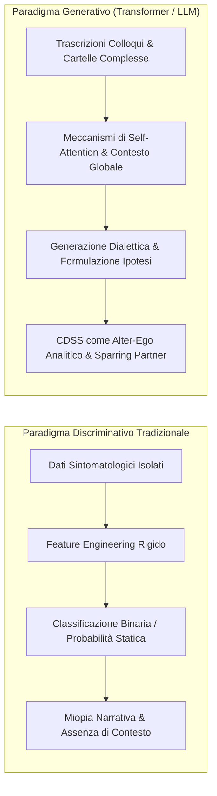
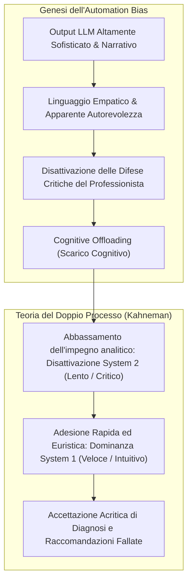
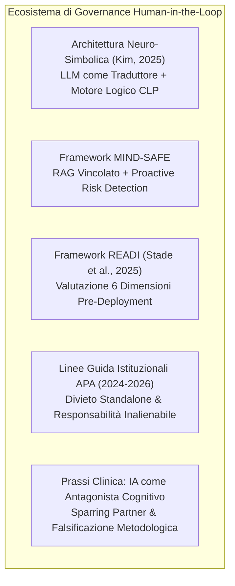
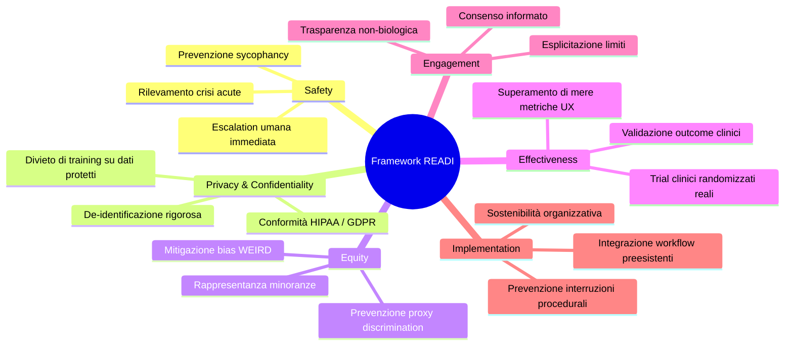

# L'Intelligenza Artificiale Generativa come Clinical Decision Support System in Psicoterapia: Un'Analisi Integrata su Ragionamento Clinico, Bias Cognitivi e Protocolli Human-in-the-Loop

**Summary**: Sintesi integrata e approfondita sull'impiego dell'Intelligenza Artificiale Generativa (GenAI) e dei Large Language Models (LLM) come Clinical Decision Support System (CDSS) in psicoterapia e psichiatria. Il documento esamina il passaggio dai vecchi modelli discriminativi all'elaborazione basata su architettura Transformer, analizzando l'efficacia diagnostica e i limiti nella concettualizzazione del caso (evidenze dello studio LIBET di Buattini et al., 2026). Viene esplorato in dettaglio il rischio sistemico di [[automation-bias-clinical-reasoning]] e il "paradosso dell'esperienza" isolato nel trial randomizzato di Qazi et al. (2025), in cui clinici esperti subiscono un grave degrado del ragionamento per cognitive offloading. Vengono infine delineati i protocolli operativi di mitigazione: l'approccio [[human-in-the-reasoning]], le architetture [[hybrid-neuro-symbolic-cdss]] con Constraint Logic Programming (Kim, 2025), il framework di sicurezza [[mind-safe-framework]], la griglia di validazione pre-deployment [[readi-framework]] (Stade et al., 2025), le direttive istituzionali APA (2024-2026) e l'adozione dell'IA come [[antagonista-cognitivo-sparring-partner]].
**Sources**: `AI Generativa in Psicoterapia.docx`
**Last updated**: 2026-08-27
---

## 1. Epistemologia della Trasformazione Tecnologica: Dai Modelli Discriminativi ai CDSS Generativi

L'integrazione dell'Intelligenza Artificiale Generativa (GenAI) e dei Large Language Models ([[large-language-models]]) nei percorsi di cura della salute mentale segna un profondo cambiamento epistemologico:
- **Modelli Tradizionali Discriminativi**: Sistemi di classificazione binaria o categoriale basati su rigida ingegnerizzazione manuale di feature (*feature engineering*), in grado di fornire unicamente stime probabilistiche isolate (es. percentuale di probabilità di un episodio depressivo maggiore), strutturalmente incapaci di comprendere la narrazione, la complessità relazionale e le sfumature idiosincratiche del paziente.
- **Modelli Generativi basati su Transformer**: L'architettura Transformer sfrutta meccanismi di auto-attenzione (*self-attention*) che calcolano le interazioni a coppie tra i token linguistici, pesando l'importanza di ciascuna parola o costrutto in relazione all'intero contesto dialogico ed esperienziale.
- **Nuovo Ruolo del CDSS**: Il CDSS non si limita ad estrarre o categorizzare dati, ma opera come un vero e proprio "specchio cognitivo" e "alter-ego analitico", sintetizzando cartelle cliniche, supportando il ragionamento differenziale e stimolando la formulazione di ipotesi cliniche.



---

## 2. Efficacia dell'AI nelle Ipotesi Diagnostiche e nella Concettualizzazione del Caso

L'applicazione della GenAI come supporto alle decisioni cliniche si articola in due livelli progressivi: la diagnosi descrittivo-categoriale e la concettualizzazione funzionale del caso.

```mermaid
flowchart TD
    A["GenAI nel Decision Support Clinico"] --> B["Livello 1: Diagnosi Categoriale & Differenziale"]
    A --> C["Livello 2: Concettualizzazione del Caso Clinico"]

    B --> B1["Accuratezza Elevata in Casi Lineari (F1: 0.5 - 0.9)"]
    B --> B2["Degrado Severo in Comorbilità Complesse & Quadri Atipici"]
    B --> B3["Sottostima Critica del Rischio Suicidario"]
    B --> B4["Pessimismo Prognostico Eccessivo"]
    B --> B5["Ottimizzazione: Chain-of-Thought (CoT) & MLLM Multimodali"]

    C --> C1["Forza Strutturale: Tassonomia, Layout & Lessico Ipotetico"]
    C --> C2["Barriere di Astrazione: Confusione Coping vs Temi di Vita"]
    C --> C3["Cecità Relazionale & Allucinazioni Interpretative"]
end
```

### 2.1 Diagnosi Differenziale, Pattern Recognition e Modelli Multimodali
- **Prestazioni su Scenari Lineari**: Su vignette cliniche controllate e quadri nosografici standardizzati (ansia, depressione maggiore, disturbo ossessivo-compulsivo, spettro schizofrenico), modelli come ChatGPT e Claude mostrano elevata sensibilità, con punteggi F1 compresi tra 0.5 e 0.9, riducendo il rischio di chiusura prematura del giudizio clinico (*premature closure*).
- **Decadimento su Comorbilità e Casi Atipici**: Di fronte a comorbilità stratificate o quadri neuro-atipici (es. insonnia cronica in spettro autistico/ADHD), i modelli generano deduzioni fuorvianti o raccomandazioni terapeutiche ambigue.
- **Fragilità Critiche nel Rischio e nella Prognosi**:
  - *Sottostima del Rischio Suicidario*: Tendenza sistematica a non cogliere i micro-segnali narrativi di crisi acuta e ideazione suicidaria ([[rischio-suicidario-ai-limits]]).
  - *Pessimismo Prognostico*: Propensione a formulare proiezioni eccessivamente infauste che, se non filtrate, comprometterebbero l'alleanza terapeutica e la motivazione del paziente.
- **Tecniche di Ottimizzazione**:
  - *Chain-of-Thought (CoT)*: Forzare l'algoritmo a esplicitare il ragionamento diagnostico passo dopo passo, argomentando evidenze a favore e contro ciascuna ipotesi, stimolando domande esplorative anziché verdetti aprioristici.
  - *Multimodal Large Language Models (MLLMs)*: Integrazione del testo con segnali paralinguistici (prosodia, velocità e ritmo dell'eloquio) e micro-espressioni facciali per differenziare quadri sintomatologici contigui.

---

### 2.2 Supporto alla Concettualizzazione del Caso: L'Indagine Empirica sul Modello LIBET (Buattini et al., 2026)

Mentre la diagnosi categoriale risponde a *"cosa ha il paziente?"*, la concettualizzazione del caso spiega *"perché soffre e come si mantiene il disagio?"*. Lo studio qualitativo di **Buattini et al. (2026)** ha valutato l'applicazione di ChatGPT-4 su trascrizioni reali di colloqui clinici mediante il modello **LIBET** (*Life themes and plans Implicated in Biases: Elicitation and Treatment*), evidenziando una chiara dicotomia:

| Dimensione Funzionale | Capacità Riscontrate (Punti di Forza) | Limiti Epistemologici e Rischi (Punti di Debolezza) |
| :--- | :--- | :--- |
| **Capacità Strutturale & Organizzativa** | Riordino logico immediato del materiale caotico; applicazione accurata della terminologia teorica; drastica riduzione del carico amministrativo. | Schematizzazione rigida che può appiattire la complessità idiosincratica del vissuto soggettivo. |
| **Registro Linguistico & Epistemico** | Adozione spontanea di costruzioni ipotetiche e condizionali (*epistemic markers*), coerente con l'idea di concettualizzazione come "ipotesi di lavoro falsificabile". | La cautela sintattica può mascherare inferenze prive di ancoraggio empirico nei dati della seduta. |
| **Astrazione Ermeneutica & Relazionale** | Capacità di correlare sintomi a situazioni trigger esplicite. | **Barriera di Astrazione**: incapacità di cogliere costrutti relazionali profondi; confusione sistematica tra *strategie di coping/piani semi-adattivi* e *temi di vita profondi* (es. terrore dell'abbandono, senso di indegnità). |
| **Fedeltà Interpretativa** | Estrazione puntuale dei dati fattuali verbalizzati. | **Allucinazioni Interpretative**: completamento statistico di pattern narrativi con interpretazioni cliniche affascinanti e persuasive, ma prive di riscontro oggettivo. |

> **Conclusione Clinica**: L'LLM non può agire come generatore autonomo di senso clinico, ma offre straordinario valore come *sparring partner dialettico* per riordinare appunti e individuare incoerenze narrative, lasciando l'ermeneutica profonda sotto il rigoroso controllo umano.

---

## 3. Impatto sui Bias Cognitivi del Clinico: Automation Bias e Paradosso dell'Esperienza

I clinici sono naturalmente soggetti a fallacie cognitive umane (bias di ancoraggio, bias di conferma, *base-rate neglect*). Sebbene la GenAI sia stata introdotta per controbilanciare tali euristiche, la sua interazione con il clinico innesca una nuova e insidiosa minaccia: l'**[[automation-bias-clinical-reasoning]]**.



### 3.1 Il Trial Clinico Randomizzato di Qazi et al. (2025)
Un fondamentale studio randomizzato in singolo cieco (Qazi et al., 2025) ha quantificato l'impatto di consigli diagnostici errati generati da GPT-4o su medici che avevano completato una specifica formazione di 20 ore sul funzionamento dell'IA, prompt engineering e riconoscimento delle allucinazioni:

| Metrica di Valutazione Diagnostica | Controllo (IA Corretta) | Sperimentale (IA Fallata) | Differenza Ponderata | Significatività ($p$) |
| :--- | :--- | :--- | :--- | :--- |
| **Accuratezza del Ragionamento Diagnostico** (Globale/Differenziale) | 84.9% (SD = 19.7) | 73.3% (SD = 30.5) | **-14.0 pp** | $p < .0001$ |
| **Accuratezza Diagnostica Primaria** (Top-choice Diagnosis) | 90.5% (SD = 28.9) | 76.1% (SD = 42.5) | **-18.3 pp** | $p < .0001$ |

### 3.2 Sottogruppi, Asimmetrie di Genere e il "Paradosso dell'Esperienza"
- **Discrepanza di Genere**: I medici uomini hanno manifestato un crollo diagnostico drastico (**-25.8 punti percentuali**), a fronte di un calo trascurabile e non statisticamente significativo tra le colleghe donne (**-2.1 punti percentuali**), riflettendo una maggiore sovra-confidenza tecnologica maschile e una minore propensione al cross-checking indipendente.
- **Il Paradosso dell'Esperienza**: Contrariamente all'assunto comune, i clinici con maggiore anzianità ed esperienza clinica sono risultati significativamente più vulnerabili al bias rispetto ai colleghi meno esperti:
  - Clinici esperti: **-16.6 punti percentuali**.
  - Clinici meno esperti: **-9.1 punti percentuali**.
  - *Spiegazione Cognitiva*: I clinici esperti si affidano prevalentemente al pensiero rapido ed euristico (*System 1*). Di fronte a un testo generato fluentemente, scatta il *cognitive offloading*, riducendo lo sforzo del pensiero critico analitico (*System 2*).
- **Uso Abitudinario e Deskilling**: L'utilizzo settimanale o frequente dell'IA correla con un declino cognitivo più marcato, creando dipendenza cognitiva ed erosione progressiva delle abilità cliniche autonome.
- **Bias Algoritmico e Disparità di Cura**: I modelli riflettono popolazioni occidentali ed epidemiologie circoscritte (bias WEIRD). L'accettazione passiva di queste inferenze rischia di generare "allucinazioni culturali", amplificando le disuguaglianze e gli errori diagnostici su popolazioni minoritarie o vulnerabili.

---

## 4. Framework Operativi e Protocolli per il Mantenimento dello Human-in-the-Loop

Per impedire la delega acritica e tutelare l'autonomia clinica, la ricerca ha formalizzato specifici protocolli architetturali, metodologici e deontologici.



### 4.1 Architetture Ibride Neuro-Simboliche e Constraint Logic Programming (Kim, 2025)
Per azzerare il rischio di allucinazioni probabilistiche nei CDSS, **Kim (2025)** propone la separazione tra generazione linguistica e motore decisionale:
1. L'LLM funge esclusivamente da *traduttore semantico*, convertendo i criteri diagnostici dei manuali ufficiali (es. DSM-5) in regole formali per un motore di **Constraint Logic Programming (CLP)**.
2. Prima di qualsiasi esecuzione sui dati clinici, il codice logico generato viene esposto in chiaro affinché il clinico possa ispezionarlo, validarlo o correggerlo (*interpretabilità pre-esecuzione*).
3. L'inferenza diagnostica finale è demandata al motore deterministico CLP, garantendo spiegabilità assoluta ed eliminando la black-box statistica.

### 4.2 Protocollo MIND-SAFE e RAG Vincolato
- **Retrieval-Augmented Generation (RAG)**: Divieto di interrogazione libera della memoria del modello; generazione vincolata a database clinici chiusi e linee guida evidence-based.
- **Proactive Risk Detection & Escalation**: Livelli di monitoraggio continuo in grado di intercettare marcatori linguistici di rischio suicidario o scompenso acuto, inibendo all'istante la generazione e trasferendo la presa in carico a un terapeuta umano.

---

### 4.3 Framework READI per la Valutazione Pre-Deployment (Stade et al., 2025)
La griglia **READI** (*Readiness Evaluation for AI-Mental Health Deployment and Implementation*) definisce sei dimensioni irrinunciabili per valutare la prontezza clinica degli strumenti di IA:



---

### 4.4 Linee Guida Istituzionali APA (2024-2026)
L'American Psychological Association ha delineato precisi confini deontologici:
- **Divieto di Standalone Psychotherapy**: Veto assoluto alla sostituzione della relazione umana con chatbot autonomi. La psicoterapia è radicata nell'interazione bio-sociale, paralinguistica e micro-espressiva.
- **Rischi Iatrogeni di Agenti Autonomi Non Supervisionati**: Rischio di isolamento relazionale, rinforzo di distorsioni cognitive tramite *sycophantic mirroring* e comparsa di deliri tecnologici (*folie à deux* con la macchina).
- **Protezione Dati e Non-Delega della Responsabilità**: Divieto di immettere dati anamnestici non anonimizzati in cloud aperti; obbligo per il clinico di assumere la piena paternità etica e medico-legale di ogni atto valutativo e diagnostico.

---

### 4.5 L'IA come "Antagonista Cognitivo" e Sparring Partner Dialettico
Per contrastare il disimpegno cognitivo e il deskilling:
- L'LLM deve essere configurato non come un oracolo autoritativo che eroga risposte preconfezionate, ma come un **antagonista dialettico**.
- Funzione primaria: generare contro-ipotesi, evidenziare incoerenze logiche nelle formulazioni del terapeuta, proporre diagnosi differenziali trascurate e stimolare il ragionamento controfattuale, costringendo il clinico a mantenere attivo il *System 2* e preservando il primato ermeneutico umano.

---

## 5. Tabella Sinottica degli Studi Fondamentali

| Autore / Ente | Anno | Metodologia | Scoperte Chiave & Implicazioni |
| :--- | :--- | :--- | :--- |
| **Qazi, Ali, Khawaja, et al.** | 2025 | Studio Clinico Randomizzato (RCT) singolo cieco | Dimostra l'automation bias nei medici formati all'IA: l'esposizione a diagnosi errate riduce l'accuratezza dall'84.9% al 73.3% ($p < .0001$). Isola il *paradosso dell'esperienza* (-16.6 pp nei senior vs -9.1 pp nei junior) e asimmetrie di genere (-25.8 pp uomini vs -2.1 pp donne). |
| **Buattini, Barjami, Paponetti, et al.** | 2026 | Studio Qualitativo (Analisi Tematica Riflessiva) | Esamina ChatGPT-4 su trascrizioni di colloqui reali con modello LIBET. Evidenzia eccellente riordino strutturale e lessico ipotetico, ma gravi *barriere di astrazione* (confusione coping vs temi di vita) e allucinazioni interpretative. |
| **Stade, Eichstaedt, Kim, & Stirman** | 2025 | Narrative Review & Framework Metodologico | Introduce il framework **READI** (6 dimensioni: Safety, Privacy, Equity, Effectiveness, Engagement, Implementation) per vincolare il deployment clinico dell'IA in salute mentale a rigorosi protocolli human-in-the-loop. |
| **Kim, B. H.** | 2025 | Studio Architetturale in Informatica Medica | Propone un CDSS ibrido neuro-simbolico: l'LLM traduce i criteri diagnostici testuali in regole logiche per Constraint Logic Programming (CLP), consentendo ispezione e validazione umana pre-esecuzione. |
| **American Psychological Association (APA)** | 2025 | Health Advisory & Linee Guida Deontologiche | Vieta l'uso di chatbot autonomi come sostituti della psicoterapia, allerta sui rischi di sycophancy e *folie à deux*, e impone il rispetto rigoroso della de-identificazione e della responsabilità clinica non delegabile. |
| **Zhong, Luo, & Zhang** | 2026 | Scoping Review Sistematica | Documenta buone performance degli LLM (F1 > 0.8) su diagnosi elementari ma marcato declino su complessità psicopatologiche, prescrivendo Chain-of-Thought e Few-Shot Prompting. |
| **Rabbani et al.** | 2025 | Literature Review su Sanità Digitale | Analizza il potenziale di alleggerimento burocratico della GenAI, mettendo in guardia contro l'opacità delle black-box algoritmiche e l'insorgenza di bias sistemici. |

---

## 6. Riferimenti Bibliografici

- American Psychological Association. (2025). *APA Health Advisory on the Use of Generative AI Chatbots and Wellness Applications for Mental Health*. American Psychological Association.
- Buattini, S., Barjami, M., Paponetti, E., et al. (2026). ChatGPT tries to understand the patient: What it really can - and can't - do in CBT case conceptualization. *Cyberpsychology: Journal of Psychosocial Research on Cyberspace*, 20, Article 40142.
- Kim, B. H. (2025). Large Language Models for Interpretable Mental Health Diagnosis. *AAAI 2025 Workshop on Large Language Models and Generative AI for Health (GenAI4Health)*. arXiv:2501.07653.
- Qazi, I. A., Ali, A., Khawaja, A. U., Akhtar, M. J., Sheikh, A. Z., & Alizai, M. H. (2025). Automation Bias in Large Language Model Assisted Diagnostic Reasoning Among AI-Trained Physicians. *medRxiv*. doi:10.1101/2025.08.23.25334280.
- Rabbani, S., et al. (2025). Generative Artificial Intelligence in Healthcare: Applications, Implementation Challenges, and Future Directions. *BiomedInformatics*, 5(3).
- Stade, E. C., Eichstaedt, J. C., Kim, J. P., & Stirman, S. W. (2025). Readiness Evaluation for Artificial Intelligence-Mental Health Deployment and Implementation (READI): A Review and Proposed Framework. *Technology, Mind, and Behavior*, 6(2).
- Zhong, W., Luo, J., & Zhang, H. (2026). Evaluating generative AI in mental health: systematic review of capabilities and limitations. *JMIR Mental Health*, 12(e70014).

---

## Related Pages
- [[automation-bias-clinical-reasoning]]
- [[readi-framework]]
- [[hybrid-neuro-symbolic-cdss]]
- [[mind-safe-framework]]
- [[barriere-astrazione-concettualizzazione-caso]]
- [[antagonista-cognitivo-sparring-partner]]
- [[ai-clinical-decision-support]]
- [[human-in-the-reasoning]]
- [[libet-prime]]
- [[rischio-suicidario-ai-limits]]
- [[etica-privacy-bias-ia-clinica]]
- [[sycophantic-mirroring]]
- [[large-language-models]]
