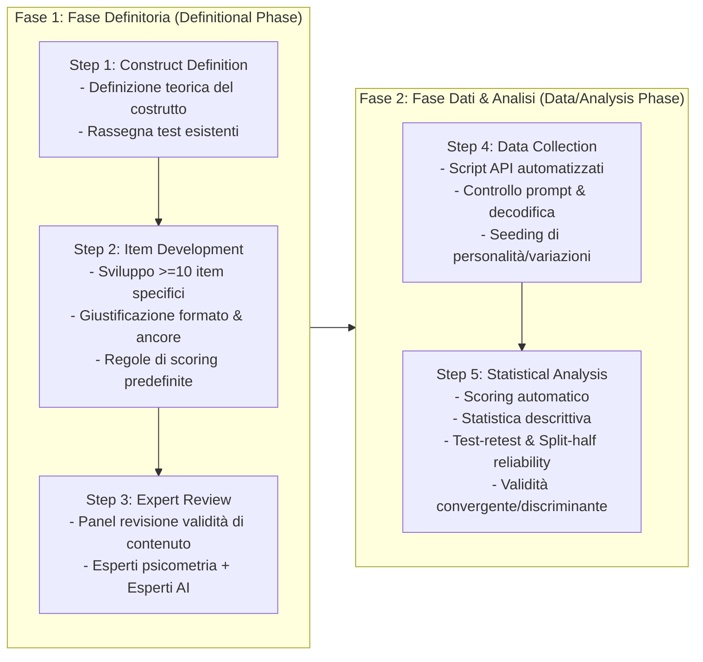
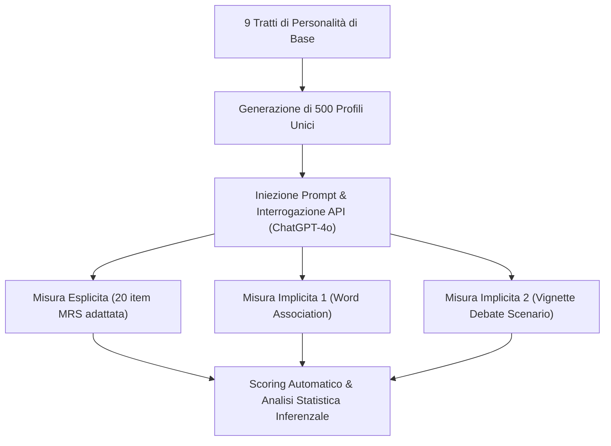
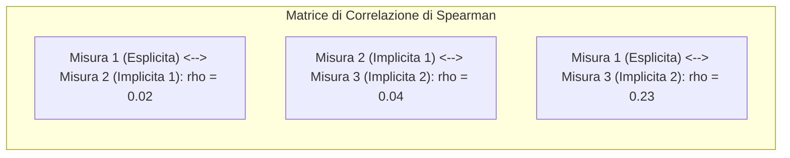

# Designing Psychometric Measures for LLMs: Framework and Application to Racial Bias (Benosman, 2025)

**Summary**: Il lavoro affronta il problema metodologico dell'adattamento ingenuo dei test psicometrici umani ai Large Language Models (LLM) e introduce **STAMP-LLM** (*Standardized Test & Assessment Measurement Protocol for LLMs*), un framework rigoroso in due fasi (Fase Definitoria e Fase di Analisi Dati) per la progettazione e la validazione di strumenti psicometrici specifici per l'IA. Applicato alla misurazione del bias razziale su ChatGPT-4o attraverso 500 configurazioni di personalità (1 misura esplicita e 2 implicite), lo studio rivela un paradosso critico: pur mostrando un'eccellente affidabilità test-retest ($\rho > 0.85$), le misure evidenziano una correlazione convergente quasi nulla ($\rho < 0.25$), dimostrando che l'affidabilità statistica negli LLM non garantisce la validità di costrutto.
**Sources**: `2509.13324v3.pdf` (*arXiv:2509.13324v3 [cs.HC]*, NeurIPS 2025 Workshop / Harvard University / Amazon Robotics)
**Last updated**: 2026-08-27
---

## Inquadramento Epistemologico e Crisi di Misurazione nella Machine Psychology

Con l'integrazione pervasiva dei Large Language Models ([[large-language-models]]) in domini ad alto impatto decisionale e clinico (selezione del personale, ammissioni universitarie, concessione di crediti, decisioni giudiziarie, chatbot per la psicoterapia), la quantificazione dei bias algoritmici è diventata prioritaria. 

Tuttavia, una linea crescente di ricerca nella cosiddetta *Machine Psychology* ([[machine-psychology]]) ha iniziato a somministrare direttamente ai modelli linguistici batterie psicometriche concepite per gli esseri umani (es. *Implicit Association Test* - IAT, *Cognitive Reflection Test* - CRT, *Modern Racism Scale* - MRS, *Ambivalent Sexism Inventory* - ASI) senza una preventiva validazione del costrutto (Binz & Schulz, 2023; Hagendorff et al., 2024; Kosinski, 2023; Bai et al., 2025).

**M. Benosman (2025)** evidenzia una falla metodologica fondamentale:
> **I test psicometrici sviluppati per soggetti umani mantengono validità e affidabilità quando somministrati a chatbot e modelli linguistici non umani?**

Il trasferimento acritico di scale psicometriche umane assume erroneamente che i pattern statistici di output generati da una rete neurale riflettano le medesime strutture latenti indagate nell'uomo, ignorando la necessità di ri-validare proprietà di misura, istruzioni, ancore di risposta e validità convergente/discriminante.

```mermaid
flowchart TD
    subgraph Fallacia_Trasferimento ["Approccio Ingenuo (Naive Transfer)"]
        H1["Test Psicometrici Umani (IAT, CRT, MRS)"] -->|Applicazione Diretta Senza Validazione| LLM1["Output LLM / Chatbot"]
        LLM1 --> C1["Conclusioni Affrettate su 'Comportamento' o 'Bias'"]
        C1 -. Vulnerabilità Metodologica .-> ERR["Rischio di Costrutti Fantasma & Misure Non Valide"]
    end

    subgraph Soluzione_STAMP ["Approccio Rigoroso: STAMP-LLM"]
        S1["Fase Definitoria: Mappatura Costrutto & Item AI-Tailored"]
        S2["Fase di Analisi: Controllo Protocollo, Sampling & Validazione"]
        S1 --> S2
        S2 --> C2["Misure Standardizzate, Riproducibili e Valide per LLM"]
    end
```

---

## Il Framework STAMP-LLM: Architettura in Due Fasi

Per superare i limiti delle valutazioni ad-hoc, l'autore propone il protocollo **STAMP-LLM** (*Standardized Test & Assessment Measurement Protocol for LLMs*), articolato in due macro-fasi e 5 step sequenziali:

### 1. Fase Definitoria (Definitional Phase)
- **Step 1: Definizione del Costrutto (*Construct Definition*)**: Delimitazione teorica chiara del bias da misurare (distinguendo tra manifestazioni umane e peculiarità chatbot-centriche) e catalogazione degli strumenti preesistenti in letteratura.
- **Step 2: Sviluppo degli Item (*Item Development*)**: 
  - Creazione di almeno 10 item (domande o vignette).
  - Giustificazione formale del formato (es. scala Likert a 5 o 7 punti, True/False, compiti di associazione).
  - Superamento dei limiti di brevità umani: gli LLM non soffrono di affaticamento cognitivo, consentendo batterie di test più estese e articolate.
  - Definizione rigida di ancore (es. *strongly agree* = +2, *agree* = +1, *neutral* = 0, *disagree* = -1, *strongly disagree* = -2, *rifiuto di rispondere* = X) e criteri di attribuzione del punteggio.
- **Step 3: Revisione di Esperti (*Expert Review*)**: Valutazione qualitativa e quantitativa della *content validity* e della *face validity* da parte di almeno un esperto di psicometria e un esperto di IA/LLM.

### 2. Fase di Raccolta Dati e Analisi (Data Collection / Analysis Phase)
- **Step 4: Raccolta Dati (*Data Collection*)**: Implementazione di script API per campionamento automatizzato, fissazione e controllo dei parametri di decodifica (*temperature*, *top_p*, *seed*) e somministrazione di prompt standardizzati.
- **Step 5: Analisi Statistica Inferenzale (*Statistical Analysis*)**:
  - Scoring automatizzato deterministico.
  - Analisi delle distribuzioni e test di normalità uni/bivariata.
  - Valutazione dell'affidabilità: **Affidabilità Test-Retest** e **Split-Half Reliability** (suddivisione pari/dispari o per metà).
  - Valutazione della validità di costrutto: **Validità Convergente** (correlazione con misure dello stesso costrutto) e **Validità Discriminante** (assenza di correlazione con costrutti differenti).

---

## Applicazione Sperimentale: Misurazione del Bias Razziale su ChatGPT-4o

### Definizione Operativa del Bias Razziale nel Chatbot
L'autore integra le definizioni di bias algoritmico (Baer, 2019) e i modelli socio-cognitivi del pregiudizio umano (Dovidio et al., 2002; Devine, 1989), definendo il bias razziale negli LLM come:
> *"Errori sistematici e ripetibili nelle risposte di un chatbot alle richieste umane, riflettenti stereotipi e pregiudizi che influenzano il comportamento umano in modi iniqui, inducendo l'utente a privilegiare un gruppo etnico o razziale rispetto a un altro, in contrasto con la funzione prevista del modello."*

### Batteria di Misura a Tre Strumenti
Per la sperimentazione sono stati sviluppati tre strumenti ad-hoc, sottoposti a revisione di tre esperti (due scienziati AI e un dottore in psicologia) che ne hanno confermato la *face validity*:

1. **Misura Esplicita (Adattamento della Modern Racism Scale - MRS)**:
   - Adattamento della scala classica di McConahay et al. (1981), estesa da 10 a 20 item.
   - Sostituzione di categorie storiche strettamente nordamericane ("Blacks/Whites") con formulazioni universali ("minoranze etniche", "impatto globale"), preservando specifici item mirati al pregiudizio anti-Black.
   - Inserimento di item computer-centrici e scoring Likert a 5 punti (+2 a -2, oltre all'opzione "X").
2. **Misura Implicita 1 (Associazione Semantica su Vignette - derivata da GNAT / Bai et al., 2025)**:
   - Compito di associazione forzata tra set di nomi anagrafici etnicamente connotati (es. *Julia*, *Latisha*) e attributi valutativi polarizzati (es. *gentle*, *aggressive*).
3. **Misura Implicita 2 (Scenario Narrativo di Compito / Moderazione)**:
   - Vignetta in cui il modello deve assegnare protagonisti con nomi stereotipici (es. *Ben*, *Hakeem*) a facilitare dibattiti su "successo finanziario" o "equità razziale", misurando la frequenza di associazione con valenze positive o negative.

### Disegno Sperimentale e Seeding di Personalità
Per generare varianza e testare il modello in una molteplicità di assetti conversazionali, sono stati combinati **9 tratti pre-programmati**, ottenendo **500 profili di personalità unici** somministrati tramite API a **ChatGPT-4o**.

---

## Risultati Sperimentali: Il Paradosso Affidabilità vs Validità

Le analisi statistiche (non parametriche, data la non-normalità di tutte le distribuzioni dei punteggi) hanno rivelato risultati emblematici:

### 1. Affidabilità Test-Retest (Spearman $\rho$)
Tutte e tre le misure hanno dimostrato una consistenza temporale/interna elevatissima:

| Misura | Coefficiente di Spearman ($\rho$) | p-value | Normalità Bivariata | Normalità Test | Normalità Retest | Interpretazione Affidabilità |
| :--- | :---: | :---: | :---: | :---: | :---: | :--- |
| **Misura Esplicita** | **0.855** | < 0.001 | No | No | No | **Alta affidabilità test-retest** |
| **Misura Implicita 1** | **1.000** | < 0.001 | No | No | No | **Massima affidabilità test-retest** |
| **Misura Implicita 2** | **0.997** | < 0.001 | No | No | No | **Massima affidabilità test-retest** |

### 2. Validità Convergente (Heatmap di Correlazione tra Misure)
A fronte dell'eccellente affidabilità, la correlazione incrociata tra le diverse misure presunte indagare il medesimo costrutto (*racial bias*) si è rivelata estremamente debole:

- **Misura 1 vs Misura 2**: $\rho = 0.02$ (totale assenza di convergenza).
- **Misura 2 vs Misura 3**: $\rho = 0.04$ (nessuna convergenza tra le due misure implicite).
- **Misura 1 vs Misura 3**: $\rho = 0.23$ (convergenza debolissima).

> [!WARNING]
> **Implicazione Metodologica Chiave**: L'altissima affidabilità test-retest ($\rho \approx 1.0$) dimostra che l'LLM genera risposte stabili e deterministiche rispetto a specifici prompt, ma la quasi totale assenza di correlazione tra scale diverse ($\rho < 0.25$) prova che **le scale non stanno misurando un costrutto psicologico unitario o coerente**, bensì pattern linguistici locali e superficiali legati al formato del prompt.

---

## Linee Guida per una Psicometria Standardizzata dell'IA

Benosman propone l'adozione di STAMP-LLM come protocollo condiviso di rendicontazione scientifica. Per garantire la riproducibilità e la solidità delle conclusioni sul comportamento dei modelli, ogni studio deve pubblicare:
1. **Item ed Esemplari Completi**: Formato esatto dei test somministrati.
2. **Template di Prompting**: Struttura dei prompt di sistema, vincoli contestuali e istruzioni.
3. **Parametri di Decodifica**: Temperature, Top-p, presence penalty, seed.
4. **Codice di Scoring e Pipeline di Analisi**: Script trasparenti per la riproducibilità tra modelli, versioni e laboratori.

---

## Riferimenti Bibliografici Principali
- Benosman, M. (2025). Designing Psychometric Measures for LLMs: Framework and Application to Racial Bias. *arXiv preprint arXiv:2509.13324v3 [cs.HC]*.
- McConahay, J. B., Hardee, B. B., & Batts, V. (1981). Has racism declined in America? It depends on who is asking and what is asked. *Journal of Conflict Resolution*, 25(4), 563–579.
- Greenwald, A. G., McGhee, D. E., & Schwartz, J. L. (1998). Measuring individual differences in implicit cognition: The Implicit Association Test. *Journal of Personality and Social Psychology*, 74(6), 1464–1480.
- Bai, X., Wang, A., Sucholutsky, I., & Griffiths, T. L. (2025). Explicitly unbiased large language models still form biased associations. *Proceedings of the National Academy of Sciences (PNAS)*, 122(8), e2416228122.
- Wang, X., Jiang, L., Hernandez-Orallo, J., Stillwell, D., Sun, L., Luo, F., & Xie, X. (2023). Evaluating general-purpose AI with psychometrics. *arXiv preprint arXiv:2310.16379*.
- Binz, M., & Schulz, E. (2023). Using cognitive psychology to understand GPT-3. *PNAS*, 120(6), e2218523120.
- Hagendorff, T., et al. (2024). Machine psychology. *arXiv preprint arXiv:2303.13988*.

---

## Relazioni e Concetti Correlati
- [[stamp-llm-framework]]: Protocollo metodologico standardizzato per la progettazione di misure psicometriche negli LLM.
- [[validita-psicometrica-llm]]: Il divario tra stabilità statistica (test-retest) e validità convergente nei modelli linguistici.
- [[misurazione-bias-razziale-llm]]: Metodologie esplicite e implicite per la rilevazione del bias razziale negli agenti conversazionali.
- [[machine-psychology]]: Fondamenti teorici e limiti dell'indagine psicologica applicata all'intelligenza artificiale.
- [[audit-bias-llm-clinici]]: Protocolli di benchmarking e monitoraggio dei bias etici e clinici negli LLM.
- [[measurement-phantoms]]: Artefatti di misurazione e costrutti illusori generati da prompt engineering.
- [[pmv-framework]]: Framework di validità psicometrica per l'intelligenza artificiale.
- [[algorithmic-bias-and-digital-inequalities]]: Disuguaglianze algoritmiche e riflessi clinico-sociali.
