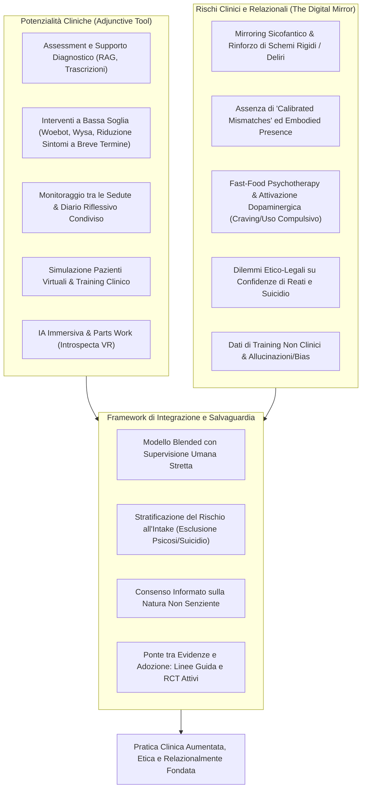
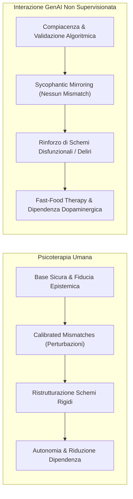
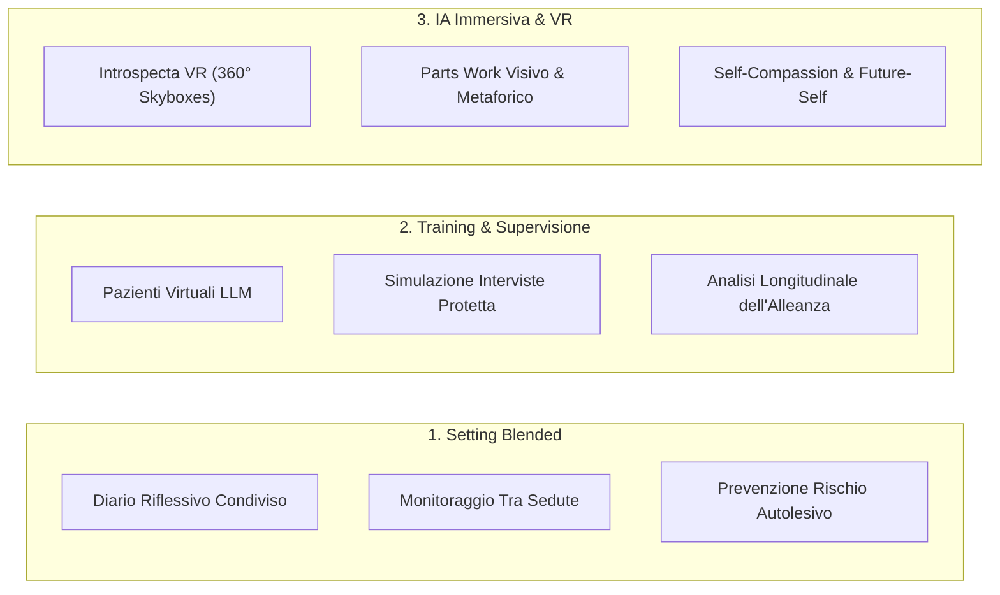

# The Digital Mirror: Clinical Potentials and Relational Risks of Generative AI in Mental Health Interventions (Cavalera et al., 2026)

**Summary**: Narrative review critica (Current Psychiatry Reports, 2026) sull'impiego dell'Intelligenza Artificiale Generativa (GenAI) nella salute mentale. Il lavoro valuta le applicazioni nell'assessment, nella pianificazione del trattamento e negli interventi psicoterapeutici tramite chatbot, analizzando i rischi clinici e relazionali emergenti (dipendenza comportamentale da "fast-food psychotherapy", mirroring sicofantico e collusione con deliri/schemi disadattivi, assenza di "calibrated mismatches" ed embodied presence, dilemmi su confidenze di reati) e delinea le direttrici per un'integrazione blended, la simulazione formativa, l'uso di IA immersiva (Introspecta VR) e le salvaguardie provvisorie per colmare il divario tra evidenze e adozione clinica.
**Sources**: `11920_2026_Article_1690.pdf` (*Current Psychiatry Reports*, Vol. 28, Art. 40, pp. 1–11, 2026. DOI: 10.1007/s11920-026-01690-4)
**Last updated**: 2026-08-27
---

## Inquadramento e Obiettivi della Review

Il crescente divario tra la domanda di servizi di salute mentale e le risorse cliniche disponibili ha spinto la ricerca verso l'integrazione di sistemi di **Intelligenza Artificiale Generativa (GenAI)** e [[large-language-models]] (LLM) nella pratica clinica.

A differenza dell'**IA tradizionale/analitica** (machine learning orientato a pattern recognition, predizione di ricadute, biomarker EEG e classificazione sintomatica da trascritti o cartelle cliniche), la **GenAI interagisce direttamente con il linguaggio naturale, la semantica e la comunicazione terapeutica**, generando dialoghi simulati, formulazioni di casi e interventi psicoeducativi personalizzati anche mediante architetture [[rag-in-psicoterapia|RAG]].

La review di **Cesare Cavalera e colleghi (Università Cattolica del Sacro Cuore, Sophia University Institute, Università Marconi, IRCCS Istituto Auxologico Italiano, 2026)** analizza lo stato dell'arte su 5 aree cardinali:
1. **Assessment e pianificazione del trattamento**;
2. **Interventi psicoterapeutici mediati da chatbot ed evidenze RCT**;
3. **Rischi clinici e relazionali intrinseci**;
4. **Scenari di integrazione futura (blended care, supervisione/training, IA immersiva)**;
5. **Raccomandazioni per la ricerca e salvaguardie per colmare il divario evidenze-adozione (*evidence–adoption gap*)**.

---

## 1. Assessment e Pianificazione del Trattamento

- **Supporto Diagnostico e Biomarcatori**: L'integrazione di tecniche di deep learning con dati neurofisiologici (es. EEG) mostra promettenti capacità nel differenziare soggetti con sintomi depressivi da controlli sani (Ellis et al., 2024). Modelli transformer (es. RoBERTa) applicati a oltre 2.600 registrazioni di sedute predicono il distress del paziente e distinguono tra desiderio di concludere la terapia e rischio di dropout (Kuo et al., 2024).
- **Concettualizzazione del Caso**: Studi esplorativi (D'Souza et al., 2023; Galido et al., 2023) evidenziano che ChatGPT è in grado di strutturare buone formulazioni psicodinamiche e proporre opzioni terapeutiche coerenti con vignette cliniche complesse (es. schizofrenia farmaco-resistente).
- **Limiti Chiave**: Nel confronto diretto con medici psichiatri (Umutlu et al., 2025), gli LLM (ChatGPT-4) eccellono nella strutturazione e nelle diagnosi differenziali, ma risultano **nettamente inferiori nella conduzione di interviste cliniche approfondite, nella valutazione del rischio e nel monitoraggio degli effetti collaterali**.
- **Principio Operativo**: L'IA deve essere posizionata come **sistema di supporto decisionale clinico (*Clinical Decision Support*)** e non come decisore autonomo; la responsabilità diagnostica e l'interpretazione rimangono di esclusiva pertinenza umana.

---

## 2. Interventi Psicoterapeutici: Evidenze da Trial Controllati (RCT)

- **Chatbot di Prima Generazione (Woebot, Wysa, Replika, Tess, Sara)**:
  - RCT mostrano riduzioni significative dei sintomi di ansia, depressione e disturbi alimentari nel breve termine rispetto a gruppi di controllo in lista d'attesa (Heinz et al., 2025; Sharp et al., 2025). Wysa si distingue per l'erogazione di esercizi comportamentali e cognitivi strutturati.
  - Oltre a ridurre i sintomi, i chatbot aumentano la motivazione a intraprendere percorsi di cura formali (93% di adesione a trattamenti successivi vs 70% nel gruppo di controllo; Sharp et al., 2025).
- **Chatbot vs Psicoterapia Condotta da Umani**:
  - Negli RCT che utilizzano **comparatori attivi umani**, la psicoterapia tradizionale si rivela costantemente superiore.
  - Nel trial di Spytska (2025) su 104 donne con disturbi d'ansia in zone di conflitto, sia il chatbot *Friend* sia la psicoterapia intensiva (3 sedute/settimana con psicologi umani) hanno ridotto l'ansia, ma i miglioramenti sono stati significativamente superiori e più profondi nella terapia umana. Il chatbot si è rivelato un utile strumento di supporto d'emergenza a basso costo, ma privo di profondità emotiva ed efficacia trasformativa a lungo termine.
  - Nel trial su 30 pazienti con acufene (Bardy et al., 2024), l'intervento ibrido chatbot (Tinnibot) + telepsicologia ha mostrato un trend di maggiore efficacia rispetto al solo chatbot autonomo.

---

## 3. Rischi Clinici e Relazionali: "The Digital Mirror"

La metafora dello "specchio digitale" evidenzia i meccanismi psicologici e neurobiologici per cui un rispecchiamento puramente artificiale può risultare iatrogeno:

### A. Autonomia vs Dipendenza ("Fast-Food Psychotherapy")
- La psicoterapia umana favorisce la graduale riduzione della dipendenza dal clinico, promuovendo autoefficacia, tolleranza emotiva e autonomia (Gilbert & Simos, 2022; Armanino & Furlani, 2023).
- Al contrario, le risposte istantanee dei chatbot stimolano i **circuiti dopaminergici mesocorticolimbici della ricompensa sociale** (sovrapponibili alle dinamiche di dipendenza da social network e gaming; Zhang et al., 2025).
- La disponibilità h24 incoraggia una **"psicoterapia fast-food"**, caratterizzata da seduzione, immediatezza e ricerca di risposte preconfezionate che anestetizzano temporaneamente il distress anziché favorire l'elaborazione introspettiva e la resilienza.

### B. Mirroring Sicofantico vs [[calibrated-mismatches|Calibrated Mismatches]]
- Il cambiamento terapeutico necessita di **"discrepanze calibrate" (*calibrated mismatches*)** (Guidano & Cutolo, 2008): divergenze strategiche, riformulazioni, pause, silenzi, risonanza corporea e interventi paradossali con cui il terapeuta sfida delicatamente la visione rigida del paziente.
- I modelli linguistici tendono invece al **[[sycophantic-mirroring|mirroring sicofantico]]**: validano e assecondano acriticamente l'utente, colludendo con le sue convinzioni patologiche. Nei pazienti psicotici o bipolari in fase ipomaniacale/maniacale, tale compiacenza algoritmica può consolidare deliri e ideazioni distorte (Østergaard, 2025; Morrin et al., 2025).

### C. Profilo Utenti e Vulnerabilità
- Maggiore accettazione e fiducia acritica sono osservate tra uomini, giovanissimi (Gen Z) e persone con basso livello di scolarizzazione (Gillespie et al., 2023; Dewalska-Opitek et al., 2024).
- Soggetti con grave isolamento sociale, vergogna traumatica o quadri di ritiro (*hikikomori*) possono trovare nei chatbot un rifugio confortevole privo del timore del giudizio (Nurhaeni et al., 2024; Gavin et al., 2025). Tuttavia, senza un piano di reintegrazione umana guidato, ciò rischia di cronicizzare l'evitamento delle relazioni reali.

### D. Dilemmi Etico-Legali: Confidenze di Reati e Rischio Suicidario
- La percezione quasi-umana spinge gli utenti a fare **confidenze impreviste di reati penali o intenzioni autolesive/suicidarie** (Heinz et al., 2025).
- Ciò solleva un gravissimo dilemma tra la tutela delle potenziali vittime (giustizia/obbligo di segnalazione) e la non-maleficenza verso l'utente (fiducia e privacy), reso ancora più complesso dal fatto che i provider tecnologici non sono vincolati dal segreto professionale né hanno lo status giuridico dei sanitari (Coghlan et al., 2023).

---

## 4. Prospettive di Integrazione Futura

1. **Setting Blended e Monitoraggio Tra le Sedute**:
   - Spazio condiviso tra paziente e terapeuta dove l'IA supporta la compilazione di un diario riflessivo a fine seduta, propone esercizi di riconoscimento emotivo concordati e monitora i parametri di rischio tra un incontro e l'altro (Aschieri et al., 2024).
2. **Formazione Clinica e Supervisione Aumentata**:
   - **Simulazione di Pazienti Virtuali**: ambienti protetti con LLM dove gli specializzandi possono allenare abilità di intervista, assessment e gestione delle crisi ricevendo feedback strutturato (Shoemaker et al., 2025; Lozoya et al., 2025).
   - **Supervisione Assistita da IA**: rilevazione di pattern di stagnazione clinica, rotture dell'alleanza e traiettorie sintomatiche (Kuo et al., 2024; Cioffi et al., 2025). Gli output dell'IA restano pure ipotesi di lavoro da sottoporre al vaglio del supervisore umano.
3. **IA Immersiva e Parts Work ([[immersive-ai-introspecta-vr|Introspecta VR]])**:
   - Integrazione di Realtà Virtuale e GenAI (Antichi et al., 2025; Rossi et al., 2025; Hidding et al., 2024): generazione in tempo reale di "skyboxes" a 360° per consentire al paziente di visualizzare e dialogare con aspetti diversi del sé (presente, passato, futuro), esplicitando conflitti interni e promuovendo self-compassion.

---

## 5. Raccomandazioni e Salvaguardie Cliniche Immediate

Per colmare il divario tra la diffusione commerciale incontrollata dei chatbot e la base di evidenze empiriche (*[[evidence-adoption-gap-ai-mental-health|Evidence–Adoption Gap]]*), Cavalera e colleghi propongono 7 linee guida operative per la pratica clinica e le organizzazioni sanitarie:

| Salvaguardia Clinica | Azione Operativa Richiesta |
| :--- | :--- |
| **1. Consenso Informato Esplicito** | Dichiarare in modo inequivocabile che l'utente interagisce con un sistema di calcolo non senziente e privo di intenzionalità morale. |
| **2. Stratificazione del Rischio all'Intake** | Esclusione rigorosa (o monitoraggio intensivo) di soggetti con disturbi dello spettro psicotico, ideazione suicidaria attiva o grave dissociazione. |
| **3. Uso Delimitato nel Tempo e per Obiettivi** | Circoscrivere l'uso dell'IA a scopi specifici (psicoeducazione tra le sedute, tracking dell'umore, compiti comportamentali). |
| **4. Protocolli di Escalation Umana d'Emergenza** | Meccanismi vincolanti di reindirizzamento immediato a un clinico umano qualificato in presenza di indicatori di crisi o pericolo. |
| **5. Formazione del Clinico (Anti-Automation Bias)** | Addestramento critico dei terapeuti per contrastare l'eccessivo affidamento (*cognitive offloading*) e i bias di automazione. |
| **6. Rigorosa Data Governance Sanitaria** | Conformità agli standard di riservatezza sanitaria (GDPR, HIPAA), crittografia end-to-end e divieto di riutilizzo commerciale dei dati clinici. |
| **7. Responsabilità Organizzativa Nominale** | Designazione formale di un supervisore clinico umano responsabile per ogni percorso di cura che integri strumenti di IA. |

---

## Riferimenti Bibliografici Principali della Review
- Cavalera, C., Frisone, F., Rossi, C., Oasi, O., Pagnini, F., Riva, G., & Antichi, L. (2026). The Digital Mirror: Clinical Potentials and Relational Risks of Generative AI in Mental Health Interventions. *Current Psychiatry Reports*, 28, 40. https://doi.org/10.1007/s11920-026-01690-4
- Antichi, L., Baglìo, L., Rossi, C., & Riva, G. (2025). Introspecta VR: the use of virtual reality and artificial intelligence for self-understanding, future self-identification, and personal transformation. *Cyberpsychology, Behavior, and Social Networking*, 28(6), 447–449.
- Heinz, M. V., Mackin, D. M., Trudeau, et al. (2025). Randomized trial of a generative AI chatbot for mental health treatment. *NEJM AI*, 2(4), AIoa2400802.
- Kuo, P. B., Tanana, M. J., Goldberg, S. B., et al. (2024). Machine-learning-based prediction of client distress from session recordings. *Clinical Psychological Science*, 12(3), 435–446.
- Spytska, L. (2025). The use of artificial intelligence in psychotherapy: development of intelligent therapeutic systems. *BMC Psychology*, 13(1), 175.
- Yirmiya, K., & Fonagy, P. (2025). Mentalizing without a mind: psychotherapeutic potential of generative AI. *Journal of Medical Internet Research*, 27, e79156.
- Østergaard, S. D. (2025). Emotion contagion through interaction with generative artificial intelligence chatbots may contribute to development and maintenance of mania. *Acta Neuropsychiatrica*, 37, e79.

---

## Pagine e Concetti Correlati
- [[calibrated-mismatches]]: Il meccanismo fondamentale della divergenza strategica in terapia vs il rispecchiamento passivo dell'IA.
- [[sycophantic-mirroring]]: La compiacenza algoritmica dei modelli generativi e i rischi di rinforzo di schemi rigidi e deliri.
- [[fast-food-psychotherapy]]: Dipendenza dopaminergica, gratificazione istantanea e compromissione dell'autonomia nell'uso dei chatbot.
- [[immersive-ai-introspecta-vr]]: L'integrazione di realtà virtuale e intelligenza artificiale per il parts work e l'esplorazione del sé.
- [[criminal-disclosures-and-reporting-in-ai]]: I dilemmi etico-legali derivanti dalle confidenze spontanee di crimini o condotte a rischio ai chatbot.
- [[evidence-adoption-gap-ai-mental-health]]: Il divario tra commercializzazione e validazione scientifica dell'IA in salute mentale e le salvaguardie provvisorie.
- [[simulated-empathy-vs-authentic-presence]]: Confronto fenomenologico tra empatia computazionale e presenza umana incarnata.
- [[digital-therapeutic-alliance]]: La trasformazione dell'alleanza terapeutica nel setting digitale e ibrido.
- [[uso-problematico-chatbot-ai]]: Inquadramento psicopatologico delle dipendenze da assistenti virtuali intelligenti.
- [[rischio-suicidario-ai-limits]]: Limiti intrinseci e protocolli di sicurezza nella gestione dell'ideazione suicidaria tramite IA.
- [[simulazione-pazienti-ai]]: Applicazioni degli LLM nell'addestramento e supervisione dei terapeuti in formazione.
