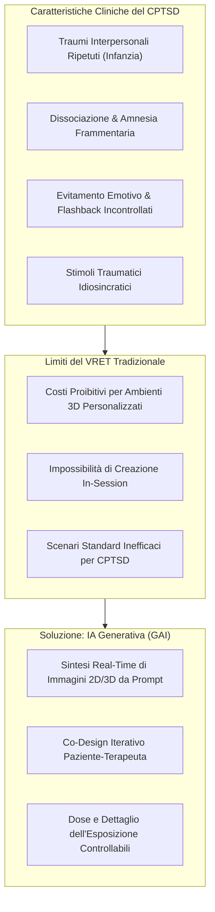
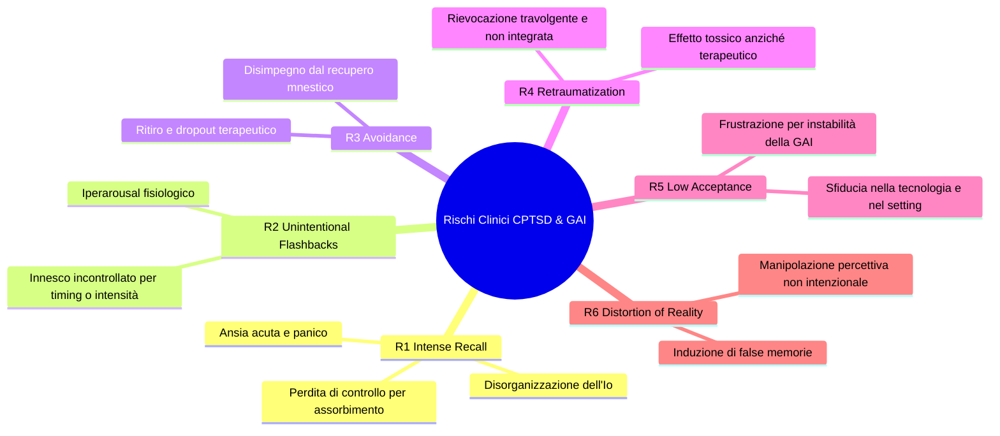
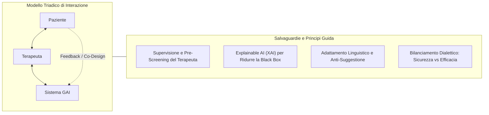

# Describe Me Something You Do Not Remember: Challenges and Risks of Exposure Design Using Generative AI for Therapy of Complex PTSD (Degenhard et al., 2025)

**Summary**: Analisi critica delle opportunità e dei rischi associati all'impiego dell'Intelligenza Artificiale Generativa (GAI) per la visualizzazione personalizzata in tempo reale nella psicoterapia di esposizione per il Disturbo da Stress Post-Traumatico Complesso (CPTSD). Gli autori esaminano la natura esplorativa del recupero mnestico dissociativo, propongono una tassonomia di 6 rischi clinici paziente-dipendenti, evidenziano le criticità etiche e tecniche della GAI (instabilità di editing, bias algoritmici, distorsione della memoria, gestione dei filtri per abusi) e delineano principi di *Trauma-Informed HCI Design* basati su un'interazione triadica guidata dal terapeuta.
**Sources**: `2505.20796v1.pdf` (*arXiv:2505.20796v1 [cs.HC]*, Ulm University, 27 May 2025)
**Last updated**: 2026-08-27
---

## Inquadramento Clinico: PTSD, CPTSD e Limiti dell'Esposizione Tradizionale

Il **Disturbo da Stress Post-Traumatico Complesso (CPTSD)** origina tipicamente da traumi interpersonali multipli, prolungati o ripetuti nel tempo (es. abusi fisici ed emotivi durante l'infanzia). A differenza del PTSD a evento singolo (es. traumi da combattimento o incidenti), il CPTSD è caratterizzato da:
- **Eterogeneità estrema e idiosincrasia degli stimoli traumatici**: non esistono scenari visivi generici o standardizzati applicabili a una coorte di pazienti.
- **Elevati livelli di dissociazione e frammentazione mnestica**: la dissociazione agisce come meccanismo di difesa limitando l'accessibilità cosciente dei ricordi traumatici, i quali emergono spesso sotto forma di intuizioni frammentarie, sensazioni viscerali o improvvisi flashback.
- **Evitamento massivo**: il tentativo del paziente di evitare la rievocazione impedisce l'integrazione autobiografica del trauma.

La **terapia di esposizione** rappresenta il trattamento psicoterapeutico d'elezione per favorire l'integrazione autobiografica ed estinguere la risposta condizionata di iperarousal. Tuttavia:
1. L'esposizione immaginativa pura (*in sensu*) fallisce frequentemente a causa dell'incapacità del clinico di verificare se il paziente stia effettivamente affrontando lo stimolo o attuando un evitamento cognitivo silente.
2. La *Virtual Reality Exposure Therapy* (VRET) tradizionale è altamente efficace per il trauma da combattimento (dove gli scenari bellici presentano elementi condivisi), ma risulta economicamente e temporalmente insostenibile per il CPTSD, dove ogni scenario richiede modellazioni grafiche 3D ad hoc prima della sessione clinica.

---

## Il Ruolo Trasformativo dell'IA Generativa (GAI)

L'adozione di modelli generativi avanzati (Diffusion Models, GAN, VAE come DALL-E, Stable Diffusion, DeepAI) introduce un cambio di paradigma:
- **Sintesi In-Session in Tempo Reale**: generazione rapida di elementi 2D e 3D durante la seduta a partire da prompt testuali, vocali o riferimenti visivi abbozzati.
- **Supporto all'Esplorazione Mnestica Amnesica**: quando il paziente non ricorda dettagliatamente l'evento ("*Describe me something you do not remember*"), la generazione visiva interattiva funge da stimolo per far affiorare progressivamente elementi mnestici periferici e identificare i trigger salienti.
- **Co-Design e Partecipazione Attiva**: il paziente partecipa direttamente alla creazione e alla modulazione dello stimolo, scegliendo il livello di realismo e dettaglio, riducendo l'ansia anticipatoria e il senso di impotenza.

---

## Tassonomia dei Rischi Clinici nel CPTSD Mediato da IA

L'introduzione della GAI nella terapia di esposizione per il CPTSD espone a rischi specifici che devono essere rigorosamente presidiati:

| Rischio | Meccanismo Clinico e Tecnologico | Conseguenza / Impatto |
| :--- | :--- | :--- |
| **R1. Intense Recall** | Il recupero di memorie rimosse/evitate suscita reazioni emotive travolgenti, angoscia e disorganizzazione dell'Io. | Perdita di controllo per assorbimento nella scena virtuale, crisi di panico o impulsi autodistruttivi. |
| **R2. Unintentional Trauma Flashbacks** | La GAI genera dettagli imprevisti o troppo precisi senza dosaggio preventivo. | Flashback traumatici improvvisi fuori dalla finestra di tolleranza, con grave iperarousal. |
| **R3. Avoidance (Evitamento)** | Di fronte a richieste descrittive complesse o stimoli visivi sgradevoli, il paziente attiva meccanismi difensivi. | Disimpegno dalla seduta, reticenza nell'autosvelamento (*self-disclosure*) e abbandono della terapia. |
| **R4. Retraumatization** | L'esperienza visiva riattiva l'impatto originario del trauma senza che vi siano risorse di coping sufficienti. | Cronicizzazione del distress e danno iatrogeno anziché elaborazione terapeutica. |
| **R5. Low Acceptance** | Errori visivi della GAI, perdita delle modifiche precedenti o incomprensione del funzionamento del sistema. | Frustrazione del paziente, sfiducia nello strumento e dropout. |
| **R6. Distortion of Reality (False Memories)** | Suggerimenti impliciti nel prompt o allucinazioni visive del modello generativo influenzano il ricordo labile. | Falsa convinzione di aver vissuto eventi mai accaduti (*confabulazione/falsi ricordi*). |

---

## Sfide Tecniche ed Etiche dell'IA Generativa

### 1. Mancanza di Fine-Grained Editing e Instabilità di Output
I modelli attuali faticano a compiere modifiche locali e progressive. Spesso una minima variazione del prompt sovrascrive completamente l'immagine precedente, cancellando dettagli approvati dal paziente. Questo genera frustrazione e rischio di inneschi accidentali (R2).

### 2. Bias Algoritmico e Mancata Inclusività
- I modelli generativi riflettono i bias dei dataset di addestramento, centrati su popolazioni ricche, occidentali e cis-eteronormative (W.E.I.R.D.).
- **Impatto clinico per popolazioni vulnerabili**: le persone transgender e non-binarie registrano una prevalenza di PTSD da 3 a 10 volte superiore rispetto alla popolazione generale; l'incapacità dell'IA di rappresentare accuratamente specificità di genere e contesti socioculturali minoritari rischia di alienare il paziente e inficiare l'efficacia della terapia.

### 3. Dilemma dell'Aggiramento dei Filtri per Contenuti Dannosi (*Safety Guardrails*)
Le policy di sicurezza delle piattaforme commerciali (OpenAI, Stability, ecc.) bloccano prompt contenenti violenza, abusi o nudo. Tuttavia, nella terapia di traumi infantili gravi, la visualizzazione di alcuni elementi traumatici specifici può risultare clinicamente necessaria.
- *Trade-off*: la ricerca deve chiarire se scenari metaforici/innocui siano sufficienti o se sia necessario un ambiente dedicato e sicuro per visualizzare stimoli critici senza violare la sicurezza del paziente.

### 4. Distorsione della Realtà vs Imagery Rescripting
Nel setting clinico, la manipolazione della memoria può essere terapeutica se guidata intenzionalmente dal clinico (*Imagery Rescripting* per reframing positivo). Se invece è causata in modo opaco dalle allucinazioni della GAI o da dark patterns di manipolazione visiva, si trasforma in un grave rischio di induzione di false memorie.

---

## Architettura Triadica e Principi di Trauma-Informed Design

Gli autori propongono di strutturare la terapia attorno a un'**interazione triadica: Paziente – Terapeuta – Sistema GAI**, dove il clinico funge da guardiano e mediatore essenziale.

### Principi Guida Operativi:
1. **Controllo Totale del Terapeuta (*Therapist-in-the-Loop*)**: Nessuna visualizzazione generata dall'IA deve essere mostrata al paziente prima dell'esame preventivo del terapeuta. Il clinico calibra la dose espositiva e arresta il processo in caso di segnali di scompenso.
2. **Explainable AI (XAI)**: Demistificare i meccanismi di generazione per il paziente, spiegando i limiti dell'IA e riducendo l'ansia da prestazione o la paura di output imprevedibili.
3. **Stile Comunicativo Non Suggestivo**: Il sistema deve adattarsi allo stile comunicativo del paziente senza mai suggerire la direzione narrativa del ricordo, per prevenire la formazione di falsi ricordi (R6).
4. **Dialettica tra Sicurezza ed Efficacia**: Una priorità incondizionata e rigida alla totale sicurezza (es. eliminazione di qualsiasi stimolo disturbante) rischia di neutralizzare l'efficacia dell'esposizione. L'attivazione emotiva controllata è indispensabile per l'estinzione della paura; il design deve bilanciare accettabilità, sicurezza ed efficacia clinica.

---

## Riferimenti Bibliografici
- Degenhard, A., Tschöke, S., Rietzler, M., & Rukzio, E. (2025). Describe Me Something You Do Not Remember - Challenges and Risks of Exposure Design Using Generative Artificial Intelligence for Therapy of Complex Post-traumatic Disorder. *arXiv preprint arXiv:2505.20796v1 [cs.HC]*.

---

## Pagine e Concetti Correlati
- [[generative-ai-exposure-therapy]]: Opportunità e modalità d'uso della GAI per la visualizzazione dell'esposizione traumatica.
- [[rischi-esposizione-cptsd-ia]]: Tassonomia e analisi dei 6 rischi clinici (R1-R6) nell'esposizione mediata da IA.
- [[interazione-triadica-terapeuta-paziente-ia]]: Architettura di interazione triadica e principi di Trauma-Informed HCI.
- [[distorsione-memoria-imagery-rescripting-ia]]: Differenziazione clinica tra allucinazioni/falsi ricordi dell'IA e Imagery Rescripting terapeutico.
- [[algorithmic-bias-and-digital-inequalities]]: Bias dei dati, esclusione culturale e popolazioni minoritarie nell'IA per la salute mentale.
- [[human-in-the-reasoning]]: Centralità e autorità clinica del professionista nei sistemi ibridi di IA.
- [[ai-assisted-psychotherapy]]: Panoramica generale sull'integrazione tecnologica nei processi psicoterapeutici.
