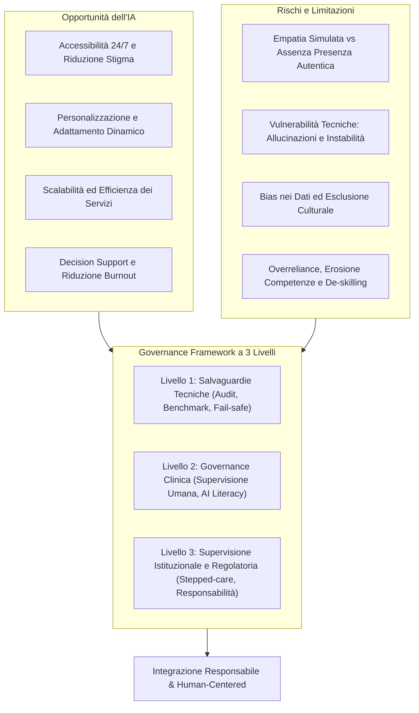
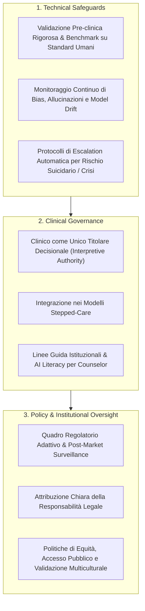

# Integrating Artificial Intelligence into Psychological Counseling: A Narrative Review and Governance Framework (Erdemir & Sumbas, 2026)

**Summary**: Narrative review completa (letteratura 2018–2025) sull'integrazione dell'Intelligenza Artificiale nel counseling psicologico. Il lavoro esamina le opportunità cliniche (accessibilità 24/7, personalizzazione, efficienza), i rischi e limiti intrinseci (empatia simulata, vulnerabilità tecniche degli LLM, bias algoritmici, de-skilling) e propone un innovativo Governance Framework a 3 Livelli (Salvaguardie Tecniche, Governance Clinica, Supervisione Istituzionale e Regolatoria) basato sul principio "integrazione anziché sostituzione".
**Sources**: `10.1177_00469580261438322.pdf` (*INQUIRY: The Journal of Health Care Organization, Provision, and Financing*, Vol. 63, pp. 1–16, 2026. DOI: 10.1177/00469580261438322)
**Last updated**: 2026-08-27
---

## Inquadramento Generale e Obiettivi

La crescente domanda globale di servizi di salute mentale ha oltrepassato la capacità delle risorse e del personale specializzato disponibili, generando significativi divari di accessibilità, tempestività ed economicità delle cure. In questo scenario, l'**Intelligenza Artificiale (IA)** — dai sistemi basati su agenti conversazionali e [[large-language-models]] (LLM) agli algoritmi di analisi predittiva e supporto alle decisioni cliniche — emerge come tecnologia trasformativa con un elevato potenziale di supporto.

Tuttavia, il dibattito accademico e professionale oscilla frequentemente tra un ingenuo ottimismo tecnocratico e un allarmismo etico paralizzante. La review di **Nuri Erdemir ed Ezgi Sumbas (2026)** si propone di superare questa polarizzazione attraverso una sintesi critica della letteratura peer-reviewed pubblicata tra il 2018 e il marzo 2025 (database PubMed, Scopus, Web of Science, PsycINFO), delineando una visione integrata in cui l'IA è concettualizzata come **strumento complementare di potenziamento (*augmentation*) che supporta, senza mai sostituire, la relazione terapeutica, il giudizio clinico umano e l'etica professionale**.

---

## Opportunità dell'IA nel Counseling Psicologico

L'integrazione di sistemi di IA offre leve strategiche per espandere l'impatto e la qualità dei servizi di salute mentale:

1. **Democratizzazione e Accessibilità H24**:
   - Superamento delle barriere geografiche, temporali ed economiche grazie ad assistenti virtuali capaci di fornire psicoeducazione immediata, moduli di auto-aiuto e supporto preliminare continuo.
   - Riduzione del senso di stigma percepito: l'anonimato dell'interfaccia digitale incoraggia la richiesta precoce di aiuto, intercettando il disagio prima della cronicizzazione o dell'acuzie.

2. **Personalizzazione Dinamica degli Interventi**:
   - Analisi multimodale di pattern linguistici, interazioni testuali e parametri comportamentali/fisiologici per calibrare strategie di intervento su misura per il profilo psicologico del singolo utente.
   - Adattamento in tempo reale dei contenuti terapeutici, aumentando l'aderenza al trattamento e l'efficacia terapeutica (es. nella gestione di ansia e depressione).

3. **Scalabilità ed Efficienza Gestionale**:
   - Erogazione standardizzata di interventi evidence-based a un'ampia coorte di utenti senza saturare le risorse professionali.
   - Automazione dei compiti burocratici e di routine (triage iniziale, pianificazione appuntamenti, note di seduta, cartelle cliniche elettroniche), permettendo ai clinici di concentrare tempo ed energie sull'interazione diretta e sui casi ad alta complessità.

4. **Supporto Decisionale Avanzato e Prevenzione del Burnout**:
   - Identificazione predittiva di segnali precoci di ricaduta e suggerimento di percorsi d'intervento mirati basati sull'analisi di ampi dataset di trascrizioni e cartelle cliniche.
   - Riduzione del carico cognitivo dei professionisti, miglioramento della preparazione clinica e mitigazione del rischio di burnout sistemico.

---

## Rischi Clinici, Relazionali e Limitazioni Tecniche

L'adozione clinica dell'IA si scontra con ostacoli strutturali che impongono cautela e limiti operativi rigorosi:

### 1. Limiti nell'Empatia e nella Connessione Umana
- Gli LLM sono capaci di generare risposte linguisticamente corrette ed empatiche in superficie, ma sono intrinsecamente privi di *comprensione fenomenologica, sintonizzazione affettiva corporea (*embodied cognition*) e risonanza emotiva autentica*.
- Il rischio principale è la creazione di una **falsa percezione di connessione ("simulated empathy")**, che può indurre nel paziente aspettative fuorvianti, distorsioni transferali o risposte inadeguate/pericolose durante crisi emotive acute.
- Senza un'intenzionalità reciproca e una presenza umana autentica viene a mancare la base per la costruzione della fiducia epistemica (*epistemic trust*), elemento curativo essenziale dell'alleanza terapeutica.

### 2. Vulnerabilità Tecniche degli LLM
- **Probabilistic Generation vs Epistemic Validity**: I modelli generativi ottimizzano la plausibilità statistica e la coerenza lessicale, non la verità clinica. Ciò genera il fenomeno delle **allucinazioni** (informazioni inventate o clinicamente scorrette presentate con tono autorevole).
- **Instabilità di Modello**: Sensibilità estrema a variazioni minime di prompt, parametri di decoding o contesti, che produce risposte eterogenee e imprevedibili, incompatibili con la ripetibilità dei protocolli evidence-based.
- **Distribution Shift**: Il degrado prestazionale che si verifica quando il modello opera fuori dalla distribuzione dei dati di training (es. slang specialistici, espressioni culturali non standard).

### 3. Bias Algoritmico e Disuguaglianze Digitali
- Modelli addestrati prevalentemente su dataset occidentali, anglofoni ed eteronormativi (contesti W.E.I.R.D.) riflettono pregiudizi sistemici, fornendo raccomandazioni inappropriate o discriminatorie per minoranze culturali ed etniche.
- Il divario digitale (mancanza di dispositivi idonei, connettività instabile, bassa alfabetizzazione digitale e costi di sottoscrizione) rischia di allargare anziché colmare le disuguaglianze di accesso alla salute mentale.

### 4. Overreliance e Dequalificazione Professionale (*Skill Atrophy*)
- L'eccessivo affidamento dei clinici alle raccomandazioni computazionali può atrofizzare il giudizio diagnostico autonomo, l'ascolto attivo e l'intuito clinico.
- Rischio di diluizione della responsabilità etico-deontologica, con la tendenza inconscia a delegare la titolarità della cura all'algoritmo.

---

## Considerazioni Etiche e Deontologiche

L'articolo analizza tre dimensioni etiche cruciali:

1. **Privacy e Riservatezza dei Dati Sensibili**:
   - L'elaborazione di comunicazioni cliniche tramite NLP richiede rigorose misure di crittografia, anonimizzazione e conformità a standard normativi (GDPR, HIPAA).
   - Rischio persistente di de-anonimizzazione nei dataset aggregati e pericolo di sfruttamento commerciale dei dati di salute mentale (es. targeted marketing).

2. **Consenso Informato Dinamico e Trasparente**:
   - Necessità di spiegare al paziente, in un linguaggio chiaro e privo di gergo tecnico, il funzionamento dell'IA, i suoi limiti strutturali, la possibilità di allucinazioni e l'esatta destinazione dei dati personali.
   - Riconoscimento della natura mutevole dei modelli di machine learning, che richiede un processo di consenso continuo e ricalibrabile nel tempo.

3. **Salvaguardia dell'Alleanza Terapeutica e Divieto di Antropomorfizzazione**:
   - Progettazione di interfacce trasparenti che esplicitino chiaramente la natura non umana dello strumento, evitando proiezioni relazionali disfunzionali o l'illusione di una reciprocità affettiva.

---

## Il Framework di Governance a Tre Livelli

Per tradurre i principi etici in una pratica operativa sicura, Erdemir e Sumbas propongono una struttura di governance multilivello:

| Livello di Governance | Obiettivi Chiave | Misure e Salvaguardie Operative |
| :--- | :--- | :--- |
| **1. Technical Safeguards** *(Salvaguardie Tecniche)* | Garantire affidabilità, trasparenza e sicurezza algoritmica prima e durante il deployment. | - Monitoraggio costante dei tassi di allucinazione e stabilità. - Benchmarking prestazionale rispetto a criteri clinici standardizzati. - Meccanismi di spiegabilità (*explainability*) del ragionamento del modello. - Protocolli vincolanti di reindirizzamento immediato (*fail-safe escalation*) al clinico umano in presenza di ideazione suicidaria o distress acuto. |
| **2. Clinical Governance** *(Governance Clinica)* | Preservare la centralità e la responsabilità del professionista della salute mentale. | - Posizionamento dell'IA esclusivamente come ausilio decisionale (*augmentation tool*). - Riserva esclusiva dell'autorità interpretativa, diagnostica e di pianificazione al clinico abilitato. - Definizione di protocolli d'uso, controindicazioni e standard documentali. - Inserimento dell'[[ai-literacy-in-academia|AI Literacy]] nei programmi formativi accademici e di specializzazione. |
| **3. Policy & Institutional Oversight** *(Supervisione Istituzionale e Regolatoria)* | Regolare il sistema a livello macro-istituzionale, garantendo equità e responsabilità. | - Certificazione e accreditamento dinamico dei dispositivi digitali per la salute mentale (ispirati alla *post-market surveillance* medica). - Definizione univoca della catena di responsabilità legale (sviluppatori, enti sanitari, professionisti). - Politiche di acquisto orientate a sistemi validati culturalmente, multilingue e accessibili, contrastando il divario digitale. |

---

## Il Paradigma Fondamentale: "Integration Rather Than Replacement"

Il contributo concettuale più rilevante dell'opera risiede nel ripensamento del quesito di fondo:
> Non bisogna chiedersi *"L'IA sostituirà i terapeuti?"*, bensì:
> **"A quali condizioni strutturate di governance l'IA può estendere e potenziare in sicurezza una cura centrata sull'essere umano?"**

L'IA deve essere integrata all'interno di **modelli stepped-care (cure a gradini)**:
- **Livelli a Bassa Intensità**: Psicoeducazione, monitoraggio sintomatologico, promemoria di esercizi tra le sedute e supporto alle abitudini di benessere gestiti con supporto algoritmico.
- **Livelli ad Alta Intensità**: Diagnosi differenziale, concettualizzazione del caso, gestione del rischio clinico e lavoro relazionale profondo rigorosamente riservati alla conduzione e supervisione diretta del terapeuta umano.

---

## Gap della Letteratura e Linee di Ricerca Futura

Gli autori evidenziano diverse priorità di indagine per la comunità scientifica:
1. **Trial Clinici Randomizzati (RCT) Longitudinali**: Superare la fase degli studi pilota o aneddotici per valutare l'efficacia a lungo termine degli interventi potenziati da IA, in particolare per disturbi cronici e quadri post-traumatici complessi.
2. **Outcome Olistici del Benessere**: Estendere la valutazione oltre la semplice riduzione sintomatica a breve termine, misurando resilienza, funzionamento sociale e qualità della vita globale.
3. **Studio Trasformativo dell'Alleanza**: Indagare l'effetto a lungo termine della presenza dell'IA sulla fiducia del paziente verso il terapeuta umano e sulle dinamiche interpersonali.
4. **Adattamento dei Curricula Formativi**: Riprogettare i percorsi di formazione per i futuri counselor, promuovendo una mentalità critica in grado di gestire ambienti clinici ibridi e dilemmi etici emergenti.

---

## Riferimenti Bibliografici
- Erdemir, N., & Sumbas, E. (2026). Integrating Artificial Intelligence into Psychological Counseling: A Narrative Review and Governance Framework. *INQUIRY: The Journal of Health Care Organization, Provision, and Financing*, 63, 1–16. https://doi.org/10.1177/00469580261438322

---

## Relazioni e Concetti Correlati
- [[three-layer-governance-framework]]: Dettaglio del modello di governance multilivello per l'IA in salute mentale.
- [[simulated-empathy-vs-authentic-presence]]: Analisi differenziale tra empatia algoritmica e risonanza emotiva umana.
- [[stepped-care-ai-integration]]: Inquadramento dell'IA all'interno dei percorsi di cura a gradini.
- [[technical-vulnerabilities-llm-counseling]]: Studio delle fragilità strutturali degli LLM nel setting clinico.
- [[algorithmic-bias-and-digital-inequalities]]: Disamina dei bias nei dataset e delle disuguaglianze di accesso digitale.
- [[digital-therapeutic-alliance]]: La ridefinizione dell'alleanza di lavoro in setting triadici (paziente-terapeuta-tecnologia).
- [[human-in-the-reasoning]]: Il superamento della mera supervisione formale a favore del co-ragionamento clinico trasparente.
- [[clinical-fidelity-assessment]]: Metodologie di valutazione della fedeltà e sicurezza dei sistemi di IA.
- [[ai-assisted-psychotherapy]]: Panoramica generale sull'impiego dell'IA in psicoterapia.
