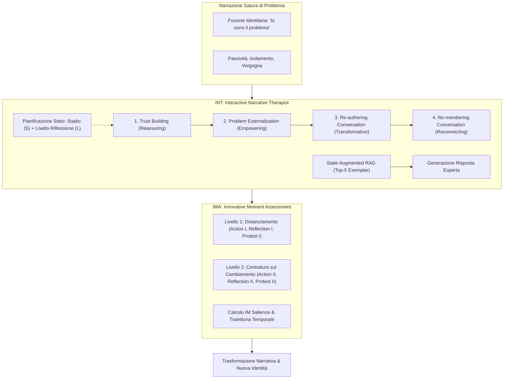

# Reframe Your Life Story: Interactive Narrative Therapist and Innovative Moment Assessment with Large Language Models (Feng et al., 2025)

**Summary**: Studio pionieristico che formalizza per la prima volta i principi della terapia narrativa in un'architettura computazionale basata su Large Language Models (LLMs). Il lavoro introduce due contributi fondamentali: **INT (Interactive Narrative Therapist)**, un framework gerarchico di pianificazione a due livelli (stadi terapeutici e livelli di riflessione) combinato con Retrieval-Augmented Generation (RAG) da risposte di esperti; e **IMA (Innovative Moment Assessment)**, una metodologia di valutazione processuale basata sulla teoria clinica degli *Innovative Moments* (IMCS) per quantificare la trasformazione narrativa del paziente. Testato su 260 clienti simulati e 230 partecipanti umani, INT supera nettamente i modelli basati su role-playing standard nell'indurre cambiamenti narrativi trasformativi.
**Sources**: `2507.20241v2.pdf` (arXiv:2507.20241v2 [cs.CL], 12 Sep 2025. Code/Data: https://github.com/MIMIFY/narrative-therapy-llm)
**Last updated**: 2026-08-27
---

## Inquadramento Generale e Problema

L'esperienza umana è organizzata fondamentalmente attraverso storie di vita. La cognizione narrativa modella la memoria, l'emozione, l'identità e il funzionamento sociale. Tuttavia, la sofferenza psicologica distorce spesso tali narrazioni in **"problem-saturated narratives"** (narrazioni sature di problema), che intrappolano l'individuo in schemi di passività, vergogna e svalutazione personale. La **terapia narrativa** (fondata da Michael White e David Epston) mira a decostruire queste narrazioni patologizzanti attraverso un processo strutturato di esternalizzazione del problema e co-costruzione di narrazioni alternative ed emancipatorie (*re-authoring* e *re-membering*).

Sebbene i Large Language Models ([[large-language-models]]) offrano grandi potenzialità nel supporto emotivo digitale, gli approcci attuali presentano limiti critici:
1. **Mancanza di Fedeltà e Struttura Terapeutica**: Si basano su role-playing generico o imitazione superficiale (*surface-level imitation*), producendo risposte stereotipate e interazioni poco realistiche con pazienti simulati eccessivamente compiacenti.
2. **Priorità al Conforto Emotivo a scapito della Trasformazione**: Modelli come GPT-4o e Claude-3.7 eccellono nella rassicurazione iniziale (*Reassuring*), ma falliscono nel guidare il cliente attraverso la progressione clinica verso il cambiamento profondo.
3. **Metriche di Valutazione Inadeguate**: Metriche tradizionali di NLP (BLEU, ROUGE, BERTScore) o indicatori statici (livello di empatia percepita) non misurano la traiettoria longitudinale del cambiamento intra-seduta.

---

## Architettura INT (Interactive Narrative Therapist)

INT formalizza la terapia narrativa in uno spazio di pianificazione gerarchico $\Phi = (\mathcal{S}, \mathcal{L})$, bilanciando la prontezza emotiva del paziente (*client readiness*) con la progressione terapeutica:

### 1. I Quattro Stadi Terapeutici ($\mathcal{S}$)
- **Stage I: Trust Building (Costruzione della Fiducia - *Reassuring*)**: Accoglienza empatica, ascolto non giudicante, esplorazione dell'evento problematico e validazione emotiva.
- **Stage II: Problem Externalization (Esternalizzazione del Problema - *Empowering*)**: Separazione del problema dall'identità della persona (*"il problema è il problema, la persona non è il problema"*). Nominazione metaforica del problema, mappatura, valutazione e giustificazione dei suoi effetti.
- **Stage III: Re-authoring Conversation (Riscrivere la Storia - *Transformative*)**: Identificazione delle eccezioni (*unique outcomes*), esplorazione del panorama dell'identità (*identity landscape*) e del panorama dell'azione (*action landscape*).
- **Stage IV: Re-membering Conversation (Ri-membrare le Relazioni - *Reconnecting*)**: Esplorazione bidirezionale dei legami con figure significative (reali o simboliche), valorizzando il contributo reciproco e rafforzando il senso di appartenenza relazionale.

### 2. Livelli di Riflessione Strutturati ($\mathcal{L}_i$)
Ogni stadio $s_i$ include specifici sottolivelli di profondità di ingaggio:
- *Trust Building*: $L_1$ (Esplorazione dell'evento), $L_2$ (Supporto empatico e conforto).
- *Problem Externalization*: $L_1$ (Negoziazione del problema dominante), $L_2$ (Mappatura degli effetti), $L_3$ (Valutazione degli effetti), $L_4$ (Giustificazione delle valutazioni).
- *Re-authoring*: $L_1$ (Elaborazione di unique outcomes), $L_2$ (Esplorazione del panorama identitario), $L_3$ (Esplorazione del panorama dell'azione).
- *Re-membering*: $L_1$ (Contributo delle figure significative), $L_2$ (Vedere se stessi attraverso gli altri), $L_3$ (Proprio contributo alla vita altrui), $L_4$ (Implicazioni del contributo per l'identità altrui).

### 3. Workflow Operativo a Due Fasi e RAG Aumentato dallo Stato
Ad ogni turno di dialogo $t$:
1. **Stage Planning ($\Psi_S$)**: L'LLM analizza lo storico $H_t$ e l'enunciato del cliente $C_t$ tramite prompt $\pi_{stage}$ per selezionare lo stadio appropriato $s_t \in \mathcal{S}$.
2. **Reflection Level Planning ($\Psi_L$)**: L'LLM seleziona il livello di riflessione specifico $l_t^t \in \mathcal{L}_t$ tramite prompt $\pi_{reflection}$.
3. **Retrieval-Augmented Generation ($\Psi_T$)**: Viene recuperato un set di $k=5$ risposte esemplari di esperti $\mathcal{E}_t$ da un repository curato $\mathcal{E}$, calcolando la cosine similarity sui vettori densi della query aumentata dallo stato $(C_t, s_t, l_t^t)$. La risposta terapeutica finale $T_t$ viene generata applicando le linee guida stilistiche narrative (ascolto curioso, "decentered yet influential", massimo una domanda aperta per turno, concisione colloquiale).

---

## Metodologia di Valutazione IMA (Innovative Moment Assessment)

Ispirato all'*Innovative Moments Coding System* (IMCS; Gonçalves et al., 2011, 2012; Montesano et al., 2017), IMA quantifica l'efficacia terapeutica rilevando i **Momenti Innovativi (IM)** nel discorso del cliente, categorizzati in due livelli:

| Livello | Tipo IM | Definizione Clinica | Esempio nel Discorso del Paziente |
| :--- | :--- | :--- | :--- |
| **Livello 1: Distanziamento dal Problema** | **Action I** | Azioni intraprese o pianificate per contrastare attivamente il problema. | *"Ieri sono uscito al cinema per la prima volta questo mese dopo settimane di isolamento."* |
| | **Reflection I** | Nuove comprensioni o riformulazioni del problema; intenzione di combatterne le richieste. | *"La depressione vuole controllare tutta la mia vita, ma non glielo permetterò più."* |
| | **Protest I** | Rifiuto o contestazione del problema, delle sue premesse o di chi lo rinforza. | *"I genitori dovrebbero amare i figli, non giudicarli continuamente. Ne ho abbastanza."* |
| **Livello 2: Centratura sul Cambiamento** | **Action II** | Generalizzazione dei cambiamenti positivi al futuro e ad altre sfere di vita. | *"Porterò questa consapevolezza dei confini anche a lavoro, smettendo di fare straordinari in silenzio."* |
| | **Reflection II** | Contrasto esplicito tra sé passato e sé presente; consapevolezza della propria trasformazione. | *"Prima mi sarei sentito in colpa per giorni; ora mi rendo conto che non sono più così fragile."* |
| | **Protest II** | Autoaffermazione ed empowerment incentrati sui propri diritti e bisogni fondamentali. | *"Anche i miei sentimenti contano: ho il diritto di dire 'no' e di riposarmi senza dover compiacere tutti."* |

### Metrica di Salienza (IM Salience)
La salienza quantifica la proporzione di parole associate a ciascun tipo di IM rispetto alla lunghezza complessiva del dialogo:
$$\text{Salience}(I_i) = \frac{\sum_{t=1}^N \text{WordCount}(C_t \cap I_i)}{\sum_{t=1}^N \text{WordCount}(C_t \cup T_t)}$$

---

## Risultati Sperimentali

### 1. Valutazione Umana (230 partecipanti) e Confronto con Baselines
Nel test interattivo su 200 partecipanti umani (sessioni di almeno 30 minuti con annotazione condotta da esperti clinici ciechi, inter-rater reliability $\kappa > 0.75$):
- **Dimensioni Terapeutiche (scala Likert 1–5)**:
  - INT supera significativamente tutti gli LLM role-playing diretti nelle fasi avanzate: **Empowering (3.11 vs 2.77 max)**, **Transformative (3.42 vs 2.56 max)**, **Reconnecting (3.37 vs 2.61 max)**.
  - Modelli generalisti (es. GPT-4o e Claude-3.7) ottengono punteggi elevati solo nella rassicurazione iniziale (*Reassuring* ~3.10) ma crollano nel guidare la trasformazione (~2.40–2.56).
- **Elicitazione di Momenti Innovativi (IMA Salience)**:
  - INT raggiunge la salienza totale di IM più elevata (**29.70%** vs 21.86% di GPT-4o).
  - INT quasi raddoppia i marcatori di Livello 2 (trasformazione avanzata): **Action II (8.73% vs 4.21%)** e **Reflection II (9.68% vs 5.83%)**.

### 2. Studio di Ablazione
Il confronto tra INT completo, INT w/o RAG (senza recupero di esempi) e INT w/o RAGRL (solo stadi, senza livelli di riflessione) dimostra che:
- La pianificazione dei livelli di riflessione è determinante per far progredire il paziente verso gli stadi di Re-authoring (20.1%) e Re-membering (14.9%).
- Il modulo RAG migliora la qualità stilistica e la concisione delle risposte (66.1 parole vs 113.0 di GPT-4o role-playing), stimolando un contributo verbale più ricco da parte del paziente (38.8 vs 31.5 parole per turno).

### 3. Traiettoria di Cambiamento Longitudinale
L'analisi temporale delle sessioni con INT riflette le tre fasi cliniche tipiche della terapia di successo:
- **Fase Iniziale (Turni 3–20)**: Dominata da IM di Livello 1 (*Reflection I*), dove il paziente riconsidera il problema.
- **Fase Intermedia (Turni 21–35)**: Emersione combinata di *Action II* e *Reflection II*, che segnala la co-costruzione di storie alternative.
- **Fase Finale (Turni 36–50)**: Consolidamento degli IM di Livello 2 con comparse di *Protest II*, attestando un accresciuto senso di agency e assertività.

### 4. Applicazione Sociale: Fine-Tuning su NTConv
Addestrando **Qwen3-8B** sul dataset sintetizzato da INT (**NTConv**) rispetto al dataset standard ESConv:
- Il modello fine-tunato su NTConv supera nettamente il baseline su tutte le metriche automatiche (BLEU-1: 34.48 vs 23.35 su NTConv-test, 17.08 vs 16.38 su ESConv-test; METEOR: 29.04 vs 18.54) e nella preferenza umana espressa da esperti (vittorie NTConv vs ESConv: 32 a 8 su valutazione complessiva).

---

## Limiti e Considerazioni Etiche

1. **Applicabilità Cross-Culturale**: Sviluppato e validato in contesti anglofoni; le strutture narrative e i codici relazionali variano ampiamente tra culture diverse.
2. **Complessità Clinica e Timing**: L'esternalizzazione o la ricostruzione narrativa applicate prematuramente possono compromettere l'alleanza o risultare invalidanti.
3. **Non Sostituibilità dell'Umano**: L'agente INT è concepito come strumento complementare per il supporto emotivo e non deve sostituire il giudizio clinico professionale in contesti diagnostici o di emergenza suicidaria.

---

## Riferimenti Bibliografici
- Feng, Y., Wang, J., Zhang, W., Chen, Z., Shen, Y., Xiao, X., Huang, M., Jing, L., & Yu, J. (2025). Reframe Your Life Story: Interactive Narrative Therapist and Innovative Moment Assessment with Large Language Models. *arXiv preprint arXiv:2507.20241v2*.
- Gonçalves, M. M., Ribeiro, A. P., Mendes, I., Matos, M., & Santos, A. (2011). Tracking novelties in psychotherapy process research: The innovative moments coding system. *Psychotherapy Research*, 21(5), 497–509.
- Gonçalves, M. M., Mendes, I., Cruz, G., Ribeiro, A. P., Sousa, I., Angus, L., & Greenberg, L. S. (2012). Innovative moments and change in client-centered therapy. *Psychotherapy Research*, 22(4), 389–401.
- Montesano, A., Oliveira, J. T., & Gonçalves, M. M. (2017). How do self-narratives change during psychotherapy? A review of innovative moments research. *Journal of Systemic Therapies*, 36(3), 81–96.
- White, M., & Epston, D. (1990). *Narrative means to therapeutic ends*. WW Norton & Company.
- White, M. (2007). *Maps of narrative practice*. WW Norton & Company.

---

## Relazioni e Concetti Correlati
- [[interactive-narrative-therapist]]: Dettaglio architetturale del framework INT (state planning a due livelli e RAG aumentato).
- [[innovative-moment-assessment]]: Metodologia di codifica IMCS e metrica di IM Salience per la valutazione processuale.
- [[terapia-narrativa-ia]]: Principi teorici della terapia narrativa integrati nei modelli computazionali di dialogo.
- [[process-of-change]]: Meccanismi dinamici intra-paziente e traiettorie longitudinali di trasformazione clinica.
- [[clinical-fidelity-assessment]]: Valutazione della fedeltà terapeutica oltre i semplici punteggi lessicali o di empatia statica.
- [[rag-in-psicoterapia]]: Applicazione del Retrieval-Augmented Generation guidato dallo stato clinico.
- [[simulazione-pazienti-ai]]: Modellizzazione di pazienti virtuali per il testing rigoroso di agenti terapeutici.
