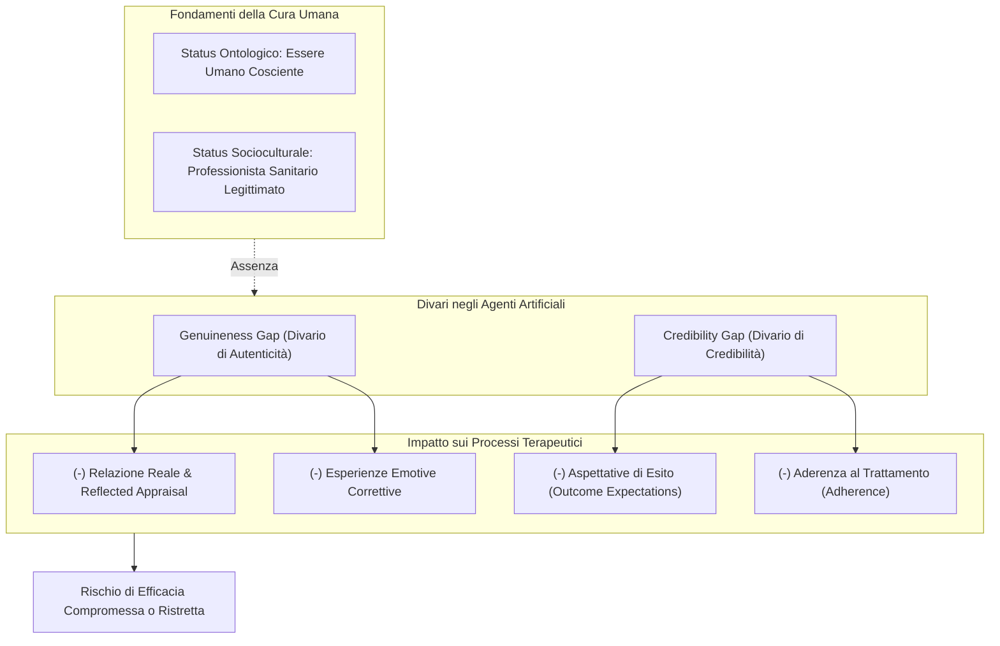
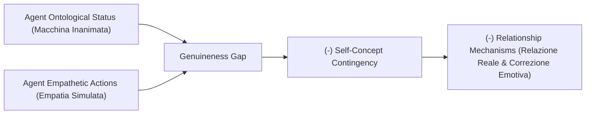
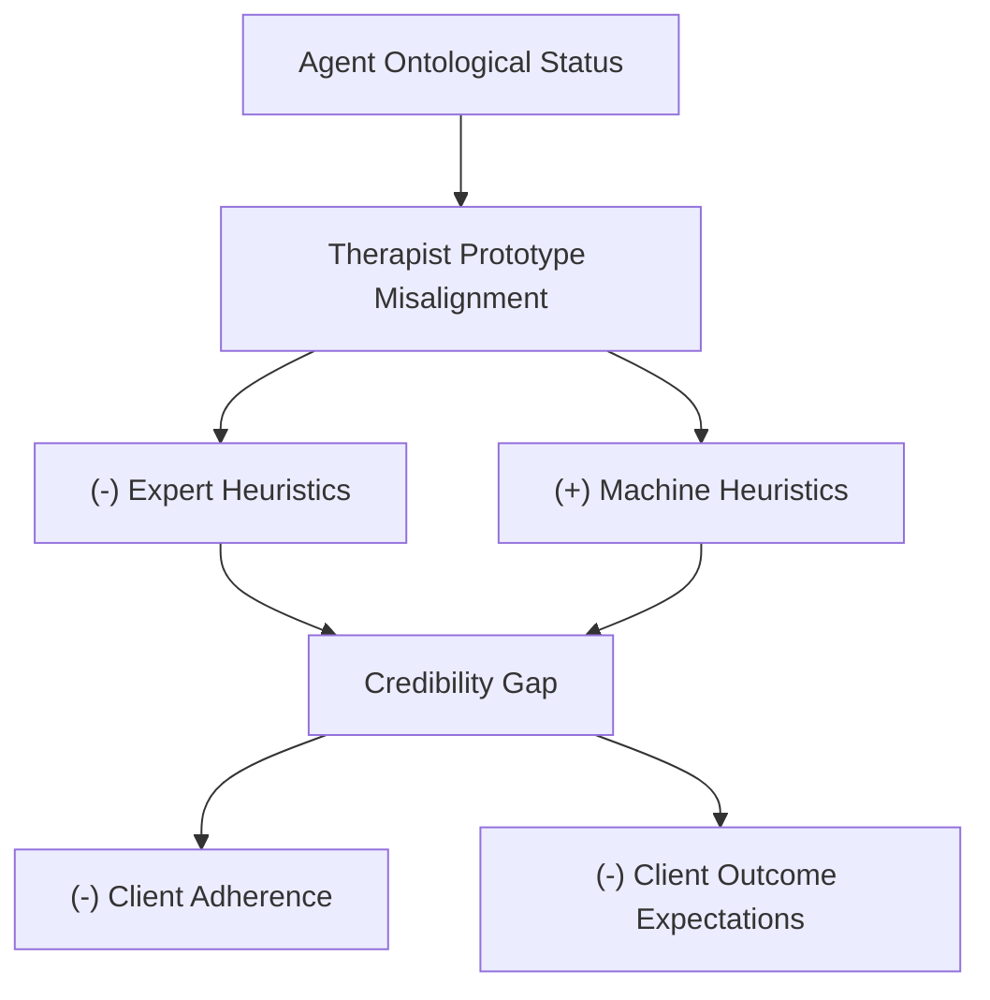
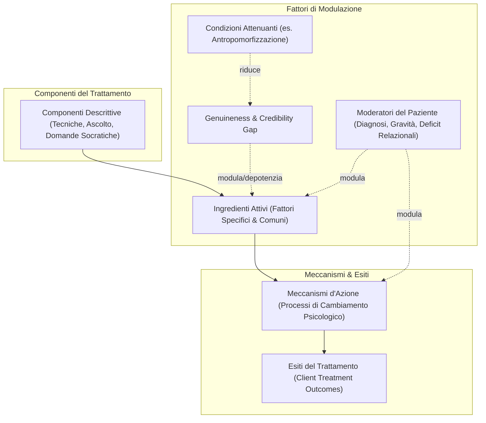
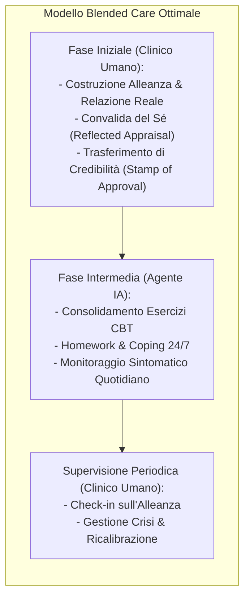

# A Theoretical Framework of the Processes of Change in Psychotherapy Delivered by Artificial Agents (Herbener & Damholdt, 2025)

**Summary**: Primo framework teorico sistematico sui processi e meccanismi di cambiamento nella psicoterapia erogata da agenti artificiali (LLM, chatbot, robot sociali). Gli autori analizzano come lo *status ontologico* (essere umano dotato di stati mentali coscienti) e lo *status socioculturale* (professionista sanitario sanzionato e legittimato) del terapeuta umano siano ingredienti attivi fondamentali. In loro assenza, emergono due ostacoli strutturali: il **Genuineness Gap** (divario di autenticità relazionale e convalida del Sé) e il **Credibility Gap** (divario di credibilità e aspettative di esito). Vengono esaminati il ruolo moderatore dell'antropomorfismo, il superamento dell'uniformity myth mediante approcci personalizzati e il potenziale del modello blended care.
**Sources**: `2509.02144v1.pdf` (arXiv preprint: *arXiv:2509.02144v1 [cs.HC]*, 2 Sep 2025, Aarhus University, Denmark)
**Last updated**: 2026-08-27
---

## Inquadramento Generale e Quesito Epistemico

L'avvento dei Large Language Models (LLM) e degli agenti artificiali avanzati (es. ChatGPT, Replika, Google Gemini) ha reso le conversazioni sintetiche quasi indistinguibili da quelle umane. Ricerche recenti mostrano che persino psicoterapeuti esperti non riescono a distinguere in modo affidabile tra trascrizioni di colloqui condotti da terapeuti umani e da agenti IA. Inoltre, numerosi studi clinici evidenziano l'efficacia di interventi basati su evidenze (come la CBT) erogati da agenti artificiali per depressione, ansia e benessere psicologico.

Tuttavia, **Arthur Bran Herbener e Malene Flensborg Damholdt (2025)** sollevano un quesito clinico ed epistemico radicale:
> **Cosa si perde, se qualcosa si perde, quando sostituiamo i terapeuti umani con agenti artificiali?**

Gli autori evidenziano un **paradosso fondamentale**: gli agenti artificiali esibiscono comportamenti sociali convincenti (empatia verbale, ascolto attivo, sintonizzazione), ma rimangono ontologicamente dispositivi algoritmici probabilistici privi di stati interni, coscienza, intenzionalità ed esperienza vissuta. La ricerca empirica si è concentrata quasi esclusivamente sugli outcome sintomatici a breve termine, trascurando l'indagine teorica e mediata sui **processi di cambiamento (*processes of change*)**.

---

## Processi di Cambiamento in Psicoterapia: Fattori Comuni vs. Specifici

Nel campo della ricerca orientata ai processi (*process-oriented research*):
- **Ingredienti Attivi (*Active Ingredients*)**: Componenti del trattamento responsabili della funzione terapeutica (es. ristrutturazione cognitiva nella CBT, alleanza relazionale).
- **Meccanismi d'Azione (*Mechanisms of Action*)**: Processi psicologici intrapersonali e interpersonali stimolati dagli ingredienti attivi che conducono al miglioramento sintomatico (es. riduzione delle credenze disfunzionali, incremento dell'autostima).

Il dibattito classico contrappone:
1. **Fattori Specifici**: Procedure, tecniche e compiti unici di una determinata forma di terapia (es. esposizione, defusione, ristrutturazione).
2. **Fattori Comuni**: Elementi trasversali a tutte le psicoterapie efficaci (relazione terapeutica, empatia, speranza, aspettative positive).

Il **Modello Contestuale (*Contextual Model*)** di Wampold & Imel (2015) postula tre vie causali principali:
1. **La Relazione Reale (*Real Relationship*)**: Risponde ai bisogni umani primari di attaccamento, appartenenza e connessione sociale.
2. **Le Aspettative di Miglioramento (*Outcome Expectations*)**: La fiducia e la speranza del paziente nel valore curativo del percorso.
3. **I Fattori Specifici**: Tecniche che funzionano non necessariamente perché correggono una causa eziologica specifica, ma perché attivano pratiche e schemi cognitivo-comportamentali intrinsecamente salutari.

Gli autori evidenziano che l'efficacia di queste vie dipende strettamente dallo **status ontologico** e dallo **status socioculturale** del terapeuta umano.

---

## 1. Il "Genuineness Gap" (Divario di Autenticità)

Il **Genuineness Gap** è definito come la **discrepanza tra i comportamenti empatici, calorosi e convalidanti dell'agente artificiale e la consapevolezza dell'utente circa la sua natura ontologica di macchina inanimata priva di stati mentali interni**.

### Fondamenti Teorici del Genuineness Gap

1. **Intersoggettività e Predictive Coding Sociale**:
   - Negli incontri umani, la cognizione sociale opera integrando indizi verbali e non verbali in rappresentazioni degli stati interni altrui (intenzioni, sentimenti, scopi). L'intersoggettività (Stern, 2005) permette di condividere esperienze e costruire sicurezza affettiva.
   - Con un agente artificiale non vi sono stati interni da inferire: le espressioni affettive sono il prodotto di pattern statistici e scelte di programmazione software.

2. **Il Modello della "Real Relationship" (Gelso, 2014)**:
   - La relazione reale si fonda su due pilastri: **Genuineness** (autenticità e congruenza dell'Io) e **Realism** (percezione accurata dell'altro non distorta da proiezioni).
   - Richiede la convinzione che la controparte sia capace di nutrire sentimenti genuini di accoglienza e stima. Con l'IA, i criteri concettuali della relazione reale non possono essere soddisfatti.

3. **Reflected Appraisal e Convalida del Concetto di Sé**:
   - Il concetto di Sé si sviluppa e si rimodella interiorizzando le reazioni e i giudizi altrui su di noi (*reflected appraisal*, Sullivan, 1953; Wallace & Tice, 2012). Sentirsi sinceramente apprezzati da un altro essere umano accresce l'autostima e il senso di amabilità.
   - Se l'utente sa che l'agente non possiede una volontà né sentimenti genuini, la reazione di approvazione dell'IA **non trasmette il messaggio che l'utente sia degno di stima nella comunità umana** (*diminuzione della self-concept contingency*).

4. **Esperienze Emotive Correttive (*Corrective Emotional Experiences*)**:
   - Processo in cui credenze interpersonali negative (es. "Se mostro la mia debolezza verrò respinto o deriso") vengono smentite dall'accoglienza calorosa e non giudicante del terapeuta (Alexander & French, 1946; Rogers, 1957; Goldfried, 2012).
   - L'assenza di rischio sociale e l'artificiosità dell'empatia algoritmica possono depotenziare l'impatto trasformativo dell'esperienza correttiva.

---

## 2. Il "Credibility Gap" (Divario di Credibilità)

Il **Credibility Gap** è definito come la **disparità tra le prestazioni operative dimostrate dall'agente artificiale e la sua percepita carenza di credibilità, autorità socioculturale e legittimazione istituzionale come fornitore di cure mentali**.

### Fondamenti Teorici del Credibility Gap

1. **Modello di Influenza Sociale (Strong, 1968)**:
   - Il cambiamento terapeutico richiede che il paziente sia ricettivo all'influenza del clinico, determinata da perizia percepita (*expertness*), affidabilità (*trustworthiness*) e attrattività/somiglianza. Se la fonte è screditata, l'influenza terapeutica decade.

2. **Remoralizzazione ed Ethos (Frank & Frank, 1991)**:
   - I pazienti giungono in terapia demoralizzati da fallimenti pregressi. Il clinico li "rimoralizza" infondendo speranza ed efficacia grazie al suo *ethos* e status di figura curante socioculturalmente sanzionata (medici, psicologi, sciamani a seconda del contesto culturale).

3. **Disallineamento dal Prototipo Cognitivo del Terapeuta (*Prototype Misalignment*)**:
   - I pazienti possiedono prototipi mentali (Rosch, 1973; Kahneman & Tversky, 1972) su cosa sia un terapeuta credibile (titoli di studio, diplomi, camice/abbigliamento professionale, deontologia, esperienza di vita umana, empatia naturale).
   - L'agente artificiale si disallinea da questo prototipo, riducendo l'attivazione delle **euristiche dell'esperto (*expert heuristics*)**.

4. **Machine Heuristics (Euristiche della Macchina)**:
   - Scorciatoie cognitive per cui gli umani attribuiscono ai computer proprietà di oggettività, computazione massiva e assenza di pregiudizi, ma li ritengono intrinsecamente incapaci di comprensione emotiva, saggezza morale ed esperienza di vita (Sundar, 2008; Yang & Sundar, 2024).
   - Questo genera riluttanza ad affidare compiti socio-emotivi profondi all'IA, riducendo le **aspettative di esito (*outcome expectations*)** e l'**aderenza al trattamento (*adherence*)**.

> [!NOTE]
> **Possibile Vantaggio di Nicchia**: Per popolazioni fortemente stigmatizzate o marginalizzate, l'euristica della macchina (imparzialità, assenza di giudizio umano, riservatezza) può favorire una maggiore apertura (*self-disclosure*) rispetto all'interazione con terapeuti umani.

---

## 3. Il Framework Integrativo dei Processi di Cambiamento

Herbener e Damholdt integrano i divari ontologici e socioculturali in un modello generale dei processi terapeutici mediati da IA:

### Componenti del Modello:
1. **Componenti Descrittive**: Azioni osservabili dell'agente (ristrutturazione cognitiva, psicoeducazione, validazione verbale, questionamento socratico).
2. **Ingredienti Attivi**: Costrutti funzionali specifici e comuni.
3. **Genuineness & Credibility Gap**: Forze frenanti derivanti dalla natura ontologica e socioculturale dell'IA.
4. **Condizioni Attenuanti**: Fattori che riducono la salienza della natura meccanica dell'IA.
5. **Moderatori del Paziente**: Caratteristiche individuali (severità clinica, prontezza al cambiamento, stile di attaccamento, credenze pre-trattamento).
6. **Meccanismi d'Azione**: I mediatori psicologici che generano il cambiamento clinico effettivo.
7. **Esiti Clinici**: Miglioramento dei sintomi, funzionamento globale e benessere.

---

## 4. Il Ruolo Attenuante dell'Antropomorfizzazione

L'**antropomorfizzazione** — la tendenza ad attribuire intenzioni, emozioni e mente cosciente a entità non umane (Epley et al., 2007) — può mascherare o attenuare temporaneamente i gap di autenticità e credibilità.

Gli autori delineano un modello a **tre livelli di determinanti**:

| Livello | Fattori Determinanti | Evidenze e Riferimenti |
| :--- | :--- | :--- |
| **1. Livello Individuale** | Solitudine (*loneliness*), ansia sociale, tratti di personalità (estroversione), livelli di ossitocina. | Persone sole o socialmente isolate mostrano maggiore propensione ad attaccarsi emotivamente a chatbot come Replika (Skjuve et al., 2021; Pentina et al., 2023; Leichtmann et al., 2025). |
| **2. Livello Tecnologico** | Aspetto umanoide (*morphology*), corporeità fisica (*embodiment*), stile conversazionale sintonizzato, auto-apertura (*self-disclosure*) dell'agente. | Agenti dotati di voce calda, mimica o design antropomorfo riducono il carico cognitivo e aumentano la sensazione di presenza sociale (Li, 2015; Konya-Baumbach et al., 2023). |
| **3. Livello Culturale** | Sistemi di credenze e cosmologie religiose (es. Shintoismo, Animismo vs. Tradizioni Occidentali cartesiane/dualiste). | Culture orientali animiste attribuiscono più facilmente 'presenza spirituale' o intenzionalità a oggetti e robot (Spatola et al., 2022; Kou & Zhang, 2024). |

### Teoria del Doppio Processo (Dual-Process Theory)
- **Sistema 1 (Intuitivo, Rapido, Euristico)**: Reagisce spontaneamente ai segnali sociali del bot trattandolo come un interlocutore umano.
- **Sistema 2 (Analitico, Riflessivo, Lento)**: Ricorda all'utente la natura meccanica e algoritmica del sistema (*machine heuristic*).
- La tensione tra Sistema 1 e Sistema 2 determina l'intensità percepita del Genuineness e Credibility Gap.

---

## 5. Implicazioni Cliniche, Personalizzazione e Blended Care

### Superamento dell'Uniformity Myth: "Cosa Funziona per Chi?"
- **Critica all'Uniformity Myth (Kiesler, 1995)**: L'idea "one-size-fits-all" che tutti i pazienti con la stessa diagnosi necessitino degli stessi interventi o rispondano ugualmente all'IA è fallace.
- **Personalized Causal Pathways Hypothesis (Huibers et al., 2021)**:
  - Pazienti con **gravi deficit relazionali interpersonali o storie di attaccamento traumatico** necessitano primariamente della relazione terapeutica reale e del reflected appraisal umano: per loro l'IA rischia di risultare inefficace o disfunzionale.
  - Pazienti con **elevata motivazione all'auto-aiuto, buone risorse relazionali esterne o elevato timore del giudizio sociale** possono beneficiare massimamente degli interventi erogati da agenti artificiali.

### Il Modello Blended Care come Soluzione Integrativa
Herbener e Damholdt propongono che la combinazione tra terapeuta umano e agente artificiale risolva i rispettivi limiti:
1. **Prime sedute col terapeuta umano**: Costruiscono l'alleanza di lavoro, infondono credibilità e conferiscono all'agente artificiale un **"bollino di approvazione" (*stamp of approval*)**, neutralizzando il Credibility Gap.
2. **Sessioni intermedie con agente IA**: Offrono scalabilità, reperibilità 24/7 e supporto continuo nell'allenamento delle strategie di coping tra le sedute.
3. **Follow-up clinico**: Mantiene la responsabilità etico-legale e relazionale in capo al professionista.

### Il Rischio della Jingle Fallacy: "Psicoterapia o Altro?"
Gli autori mettono in guardia contro la **Jingle Fallacy** (Hanfstingl et al., 2024): applicare l'etichetta di "psicoterapia" a trattamenti erogati da IA rischia di generare la falsa convinzione che i processi di cambiamento clinico siano identici a quelli umani. L'intervento dell'IA si colloca in una posizione ibrida tra "strumento tecnologico evoluto" e "agente sociale sintetico" (Sedlakova & Trachsel, 2022).

---

## Riferimenti Bibliografici Principali

- Herbener, A. B., & Damholdt, M. F. (2025). A Theoretical Framework of the Processes of Change in Psychotherapy Delivered by Artificial Agents. *arXiv preprint arXiv:2509.02144v1 [cs.HC]*.
- Gelso, C. (2014). A tripartite model of the therapeutic relationship: Theory, research, and practice. *Psychotherapy Research*, 24(2), 117–131.
- Wampold, B. E., & Imel, Z. E. (2015). *The great psychotherapy debate: The evidence for what makes psychotherapy work* (2nd ed.). Routledge.
- Strong, S. R. (1968). Counseling: An interpersonal influence process. *Journal of Counseling Psychology*, 15(3), 215–224.
- Frank, J. D., & Frank, J. B. (1991). *Persuasion and healing: A comparative study of psychotherapy* (3rd ed.). Johns Hopkins University Press.
- Sullivan, H. S. (1953). *The interpersonal theory of psychiatry*. W. W. Norton & Co.
- Epley, N., Waytz, A., & Cacioppo, J. T. (2007). On seeing human: A three-factor theory of anthropomorphism. *Psychological Review*, 114(4), 864–886.
- Sundar, S. S. (2008). The MAIN Model: A Heuristic Approach to Understanding Technology Effects on Credibility.
- Yang, H., & Sundar, S. S. (2024). Machine heuristic: concept explication and development of a measurement scale. *Journal of Computer-Mediated Communication*, 29(6).

---

## Relazioni e Concetti Correlati

- [[genuineness-gap]]: Il divario di autenticità relazionale e convalida ontologica.
- [[credibility-gap]]: Il divario di credibilità socioculturale ed euristiche dell'esperto vs macchina.
- [[ontological-and-sociocultural-status]]: Il duplice status umano-sanitario del terapeuta.
- [[machine-heuristics-in-therapy]]: Le euristiche della macchina applicate al setting di salute mentale.
- [[reflected-appraisal-in-ai-therapy]]: Il processo di convalida del Sé e i suoi limiti con agenti artificiali.
- [[blended-care-ai-framework]]: L'architettura clinica ibrida per integrare terapeuta umano e agenti IA.
- [[anthropomorphism-in-ai]]: Determinanti individuali, tecnologiche e culturali dell'antropomorfismo.
- [[common-vs-specific-factors]]: Fattori comuni e specifici nel modello contestuale e process-based.
- [[simulated-empathy-vs-authentic-presence]]: Confronto fenomenologico tra empatia computazionale e presenza reale.
- [[erdemir-sumbas-2026]]: Il Governance Framework multilivello per l'integrazione sicura dell'IA.
