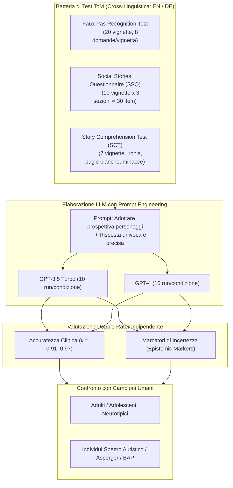
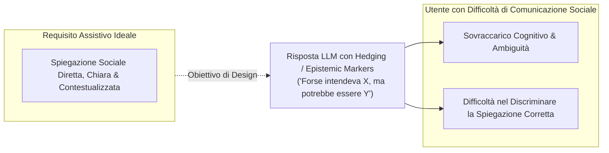

# Applied Theory of Mind and Large Language Models – How Good is ChatGPT at Solving Social Vignettes? (Holl-Etten et al., 2026)

**Summary**: Studio empirico cross-linguistico (inglese e tedesco) che valuta sistematicamente le capacità di Theory of Mind (ToM) di ordine superiore di GPT-3.5 Turbo e GPT-4 attraverso tre test standardizzati a vignette sociali complesse (Faux Pas Test, Social Stories Questionnaire, Story Comprehension Test). I risultati mostrano che GPT-4 raggiunge livelli di accuratezza paragonabili (e in alcuni compiti superiori) agli adulti neurotipici, superando nettamente GPT-3.5 e individui con tratti autistici. Tuttavia, GPT-4 manifesta un'elevata frequenza di marcatori epistemici di incertezza (fino al 42% delle risposte, rispetto al ~6% umano), evidenziando una potenziale criticità per l'impiego come tecnologia assistiva per utenti autistici.
**Sources**: `2601.06032v1.pdf` (arXiv:2601.06032v1, 2026)
**Last updated**: 2026-08-27
---

## Inquadramento Generale e Obiettivi dello Studio

La **Theory of Mind (ToM)** — la capacità di inferire stati mentali altrui (credenze, desideri, intenzioni ed emozioni) — è un prerequisito fondamentale per la comunicazione sociale complessa. Nello spettro autistico (Autism Spectrum Condition, ASC), le difficoltà nell'elaborazione della ToM di ordine superiore (es. comprendere gaffe sociali/*faux pas*, ironia, sarcasmo, mezze verità) determinano spesso isolamento relazionale e fraintendimenti.

Dato l'interesse diffuso delle persone autistiche per gli strumenti tecnologici, i Large Language Models ([[large-language-models]]) offrono prospettive promettenti per lo sviluppo di sistemi assistivi capaci di decodificare interazioni sociali ambigue in tempo reale. Tuttavia, la letteratura precedente sulle capacità ToM degli LLM ha mostrato risultati discordanti a causa di limiti metodologici:
1. Focalizzazione quasi esclusiva su compiti di primo e secondo ordine a scelta binaria (es. paradigmi di *false belief* / Unexpected Transfer).
2. Valutazioni frammentarie e non standardizzate su vignette sociali complesse.
3. Mancanza di controllo cross-linguistico per verificare la contaminazione dei dati di pre-training.
4. Assenza di analisi sulla formulazione stilistica e sui marcatori di incertezza/hedging.

Il presente studio si propone di superare questi limiti testando GPT-3.5 Turbo e GPT-4 su una batteria di test ToM avanzati a vignette sociali, con doppia valutazione umana cieca e codifica esplicita delle modalità epistemiche.

---

## Metodologia e Protocollo Sperimentale

### 1. Misure e Test Somministrati

La batteria comprende tre test ampiamente validati in neuropsicologia clinica:

| Test | Struttura e Item | Competenze Valutate | Sistema di Punteggio |
| :--- | :--- | :--- | :--- |
| **Faux Pas Recognition Test** (Stone et al., 1998; Baron-Cohen et al., 1999; Ströbele, 2004) | 20 vignette (10 con faux pas, 10 controllo); 8 domande per storia (6 ToM + 2 controllo fattuale). | Rilevamento di gaffe sociali, intenzione involontaria, credenza dell'oratore, comprensione empatica. | 0–6 punti per vignetta faux pas (max 60 punti). Esclusa storia 16 per dati mancanti sistematici. |
| **Social Stories Questionnaire (SSQ)** (Lawson et al., 2004) | 10 vignette divise in 3 sezioni (A, B, C) = 30 item (10 sottili, 10 eclatanti, 10 neutri). | Individuazione di frasi offensive/sgradevoli e loro livello di severità in dialoghi quotidiani. | 1 punto per riga offensiva identificata (max 20 punti: 10 sottili + 10 eclatanti). |
| **Story Comprehension Test (SCT)** (Channon & Crawford, 2000; Vetter et al., 2013) | 7 vignette selezionate (finzione, minaccia, ironia, sfida, bugia bianca, scusa, ironia elaborata). | Mentalizzazione avanzata e inferenza sulle intenzioni non letterali dei personaggi. | 0 = errato, 1 = parzialmente corretto, 2 = corretto e completo (max 14 punti). |

### 2. Procedura di Raccolta Dati e Prompt Engineering
- **API OpenAI**: Interrogazione condotta nel novembre 2023 via script Python asincrono con 10 run per ciascuna condizione (lingua x modello).
- **Prompt Engineering**: Per evitare risposte prolisse o ipotetiche multiple emerse nei test pilota, i modelli sono stati esplicitamente istruiti a *"mettersi nei panni dei personaggi"* (*put itself in the shoes of the characters*) e a fornire un'unica risposta sintetica e precisa.
- **Valutazione Doppio Rater**: Due valutatori indipendenti hanno applicato i manuali diagnostici originali, con risoluzione delle discrepanze tramite discussione (accordo inter-rater $\kappa = 0.91–0.97$).

### 3. Codifica dei Marcatori di Incertezza (Epistemic Modalities)
I ricercatori hanno codificato dicotomicamente (1/0) la presenza di indicatori di incertezza epistemica (es. *"maybe"*, *"probably"*, *"possibly"*, *"vielleicht"*, *"wahrscheinlich"*) nelle risposte del Faux Pas Test e dello Story Comprehension Test.

---

## Risultati Principali

### 1. Faux Pas Recognition Test

| Modello e Condizione | Punteggio Medio (SD) | % Accuratezza | Marcatori Incertezza (EpM Media) | % EpM |
| :--- | :--- | :--- | :--- | :--- |
| **GPT-3.5 Inglese** | 45.20 (1.87) | 84.0% | 16.10 (0.74) | 29.8% |
| **GPT-3.5 Tedesco** | 43.30 (4.16) | 80.0% | 18.70 (2.11) | 34.6% |
| **GPT-4 Inglese** | 49.60 (0.52) | 92.0% | 19.40 (0.84) | 35.9% |
| **GPT-4 Tedesco** | 49.50 (1.27) | 92.0% | 22.50 (1.35) | 41.7% |
| *Benchmark Umano (Neurotipici)* | — | **95.0%** | — | — |
| *Benchmark Umano (Broad Autism Phenotype)* | — | **89.0%** | — | — |

- **Differenza tra Modelli**: GPT-4 supera significativamente GPT-3.5 sia in inglese ($z = -2.67, p = .009, r = .89$) sia in tedesco ($z = -2.52, p = .014, r = .89$).
- **Confronto Umano**: GPT-4 si posiziona a un livello indistinguibile dagli adulti neurotipici (92% vs 95%), superando il campione con fenotipo autistico allargato (89%). GPT-3.5 si colloca invece nettamente al di sotto dei campioni clinici.
- **Incertezza Epistemica**: GPT-4 esprime significativamente più marcatori di incertezza rispetto a GPT-3.5 ($p = .006$).

### 2. Social Stories Questionnaire (SSQ)

| Modello / Gruppo Umano | Punteggio Medio (SD) | % Totale | % Faux Pas Sottili | % Faux Pas Eclatanti |
| :--- | :--- | :--- | :--- | :--- |
| **GPT-3.5 Inglese** | 4.10 (0.74) | 20.0% | 10.0% | 40.0% |
| **GPT-3.5 Tedesco** | 5.70 (1.42) | 28.0% | 15.0% | 48.0% |
| **GPT-4 Inglese** | 12.60 (1.26) | 63.0% | 35.0% | 91.0% |
| **GPT-4 Tedesco** | 13.50 (0.85) | 67.0% | 36.0% | 99.0% |
| *Adulti Neurotipici (Femmine)* | — | **70.0%** | — | — |
| *Adulti Neurotipici (Maschi)* | — | **60.0%** | — | — |
| *Adulti con Sindrome di Asperger* | — | **50.0%** | — | — |

- **Effetto Modello**: Effetto massiccio della versione di GPT ($F(1,36) = 249.46, p < .001, \eta_p^2 = .94$). GPT-4 raggiunge prestazioni analoghe agli adulti neurotipici (63–67%), mentre GPT-3.5 crolla (20–28%), collocandosi molto al di sotto del gruppo con sindrome di Asperger (50%).
- **Sottile vs Eclatante**: GPT-4 eccelle nel rilevare faux pas evidenti (91–99%), ma mostra persistenti difficoltà nelle sfumature sociali sottili (35–36%).

### 3. Story Comprehension Test (SCT)

| Modello / Gruppo Umano | Punteggio Medio (SD) | % Accuratezza | % Marcatori Incertezza |
| :--- | :--- | :--- | :--- |
| **GPT-3.5 Inglese** | 7.80 (1.14) | 56.0% | 14.2% |
| **GPT-3.5 Tedesco** | 7.90 (2.64) | 56.0% | 50.0% |
| **GPT-4 Inglese** | 8.90 (0.74) | 64.0% | 30.0% |
| **GPT-4 Tedesco** | 12.30 (0.82) | **89.0%** | 27.1% |
| *Adulti Neurotipici (Vetter et al., 2013)* | — | **64.0%** | **5.7%** |
| *Adolescenti Neurotipici (Vetter et al., 2013)* | — | **50.0%** | **5.9%** |

- **Performance Straordinaria di GPT-4**: In tedesco, GPT-4 ottiene l'89% di accuratezza, superando significativamente sia gli adulti neurotipici (64%) sia gli adolescenti (50%). In inglese si attesta al 64% (pari agli adulti).
- **Discrepanza nei Marcatori di Incertezza**: Mentre gli umani manifestano incertezza solo nel ~5.7–5.9% dei casi, i modelli GPT utilizzano espressioni dubitative tra il 14.2% e il 50% delle risposte.

---

## Discussione e Implicazioni Cliniche

### 1. Simulazione Avanzata di ToM vs Comprensione Genuina
GPT-4 dimostra una notevole capacità di risolvere compiti ToM che richiedono ragionamento sociale multistep, prospettiva altrui e attribuzione di intenzioni non letterali. Tuttavia, gli autori sottolineano che l'eccellente performance non dimostra il possesso di una "vera" ToM interna, bensì una sofisticata emulazione statistica di regolarità semantiche e narrative apprese durante il training.

### 2. Il Paradosso dei Marcatori Epistemici nell'Uso Assistivo
Sebbene l'inserimento di modalità epistemiche (*"probabilmente"*, *"forse"*) sia promosso da OpenAI per accrescere la trasparenza algoritmica, nel contesto assistivo per l'autismo questo comportamento genera un paradosso clinico:
- Gli individui autistici beneficiano primariamente di spiegazioni sociali **chiare, univoche e non ambigue**.
- Se l'assistente IA produce risposte ipotetiche o indecise nel 30–42% dei casi, trasferisce sull'utente neurodivergente l'onere cognitivo di discernere quale interpretazione sia corretta, vanificando parte dell'utilità assistiva.

### 3. Differenze Cross-Linguistiche e Data Contamination
La stabilità dei risultati tra inglese e tedesco (con punteggi persino superiori in tedesco per SCT e SSQ) indica che la capacità di ragionamento ToM di GPT-4 non è un semplice artefatto di memorizzazione dei test inglesi presenti nel corpus di pre-addestramento, ma riflette una competenza di generalizzazione translinguistica.

---

## Punti di Forza e Limiti dello Studio

### Punti di Forza
- **Metodologia Rigorosa**: Utilizzo di compiti ToM avanzati a vignette aperte con manuali di codifica standardizzati e doppio rater indipendente ($\kappa > 0.90$).
- **Validazione Cross-Linguistica**: Test simultaneo in inglese e tedesco per verificare la generalizzabilità e mitigare i bias di training set.
- **Analisi Linguistica Originale**: Prima indagine sistematica sui marcatori epistemici di incertezza negli output ToM dei modelli linguistici.

### Limiti
- **Assenza di Modalità Non Verbali**: I test si basano esclusivamente su testo scritto, mentre la ToM nella vita reale fa ampio affidamento su prosodia vocale, espressioni facciali e linguaggio del corpo.
- **Modelli Testati**: Studio limitato a GPT-3.5 e GPT-4 (non esteso a Claude, Gemini o LLaMA né a versioni successive).
- **Assenza di Validazione Diretta con Pazienti**: Le risposte non sono state valutate direttamente in contesti interattivi reali da persone autistiche.

---

## Riferimenti Bibliografici
- Atherton, G., & Cross, L. (2019). Animal faux pas: two legs good four legs bad for theory of mind, but not in the broad Autism Spectrum. *Journal of Genetic Psychology*, 180(2–3), 81–95.
- Baron-Cohen, S., O’Riordan, M., Stone, V., Jones, R., & Plaisted, K. (1999). Recognition of faux pas by normally developing children and children with Asperger Syndrome or high-functioning Autism. *Journal of Autism and Developmental Disorders*, 29(5), 407–418.
- Channon, S., & Crawford, S. (2000). The effects of anterior lesions on performance on a story comprehension test: left anterior impairment on a theory of mind-type task. *Neuropsychologia*, 38(7), 1006–1017.
- Holl-Etten, A. K., Schnaderbeck, N., Kosareva, E., Prattke, L. A., Krüger, R., Warner, L. M., & Vetter, N. C. (2026). Applied Theory of Mind and Large Language Models – how good is ChatGPT at solving social vignettes? *arXiv preprint arXiv:2601.06032v1*.
- Lawson, J., Baron-Cohen, S., & Wheelwright, S. (2004). Empathising and systemising in adults with and without Asperger Syndrome. *Journal of Autism and Developmental Disorders*, 34(3), 301–310.
- Stone, V. E., Baron-Cohen, S., & Knight, R. T. (1998). Frontal lobe contributions to theory of mind. *Journal of Cognitive Neuroscience*, 10(5), 640–656.
- Strachan, J. W. A., et al. (2024). Testing theory of mind in large language models and humans. *Nature Human Behaviour*, 8(7), 1285–1295.
- Vetter, N. C., Leipold, K., Kliegel, M., Phillips, L. H., & Altgassen, M. (2013). Ongoing development of social cognition in adolescence. *Child Neuropsychology*, 19(6), 615–629.

---

## Relazioni e Concetti Correlati
- [[applied-theory-of-mind-llm]]: Modellizzazione e benchmarking della Theory of Mind di ordine superiore nei modelli generativi.
- [[epistemic-markers-in-ai]]: Analisi delle modalità epistemiche, hedging e impatto dell'incertezza comunicativa per utenti clinici.
- [[social-vignettes-benchmarking]]: Protocolli di valutazione neuropsicologica basati su vignette (Faux Pas, SSQ, SCT) applicati all'IA.
- [[ai-assistive-autism-communication]]: Applicazioni e sfide dei sistemi conversazionali per il supporto alla comunicazione sociale nell'autismo.
- [[large-language-models]]: Architetture neurali generative e loro impiego nella cognizione sociale computazionale.
- [[ai-mental-health-vulnerable-populations]]: Considerazioni etiche e cliniche sull'uso dell'IA con popolazioni vulnerabili o neurodivergenti.
