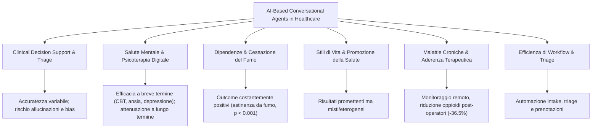

# Applications of Artificial Intelligence-Based Conversational Agents in Healthcare: A Systematic Umbrella Review

## Inquadramento e Obiettivi
- **Obiettivo**: Fornire una sintesi globale e critica (umbrella review) sulle caratteristiche tecnologiche, le modalità di implementazione, gli ambiti applicativi clinico-assistenziali e gli outcome di salute associati all'uso di agenti conversazionali (*Conversational Agents*, CA) basati su Intelligenza Artificiale (*AI-based CAs*) in sanità.
- **Metodologia**: Umbrella review condotta secondo le linee guida Joanna Briggs Institute (JBI) e gli standard PRISMA, con registrazione prospettica su PROSPERO (CRD42024547462).
- **Corpus analizzato**: 44 revisioni sistematiche e meta-analisi pubblicate tra il 2000 e l'agosto 2025 (32 di qualità metodologica elevata, 12 di qualità media secondo la JBI Critical Appraisal Checklist).

---

## Tassonomia e Caratteristiche Tecnologiche degli Agenti Conversazionali

### 1. Modalità di Interazione
- **Text-based Chatbot** (n = 18 review): Tipologia predominante, con input e output testuale.
- **Voice-based CAs / Assistenti Vocali** (n = 15 review): Interazione tramite linguaggio naturale parlato (es. smart speaker, IVR, Amazon Alexa, Google Assistant).
- **Embodied Conversational Agents (ECA)** (n = 10 review): Agenti dotati di rappresentazione visiva o avatar antropomorfo (es. espressioni facciali, gestualità virtuale o robotica).
- **Sistemi Multimodali e Ibridi** (n = 6 review): Integrazione sincronizzata di testo, voce, elementi visivi e realtà virtuale.

### 2. Piattaforme di Distribuzione e Dispositivi
- Applicazioni standalone o integrate in app sanitarie (n = 13).
- Applicazioni web-based (n = 8).
- Canali di messaggistica istantanea e social media (n = 7, es. WhatsApp, Facebook Messenger, KakaoTalk, WeChat, Telegram).
- SMS e messaggistica mobile (n = 7).
- Smart speaker, interfacce vocali e Virtual Reality (VR) (n = 7).

### 3. Architetture e Modelli di IA
- **Deep Learning e Reti Neurali** (n = 14 review): Bi-LSTM, CNN, architetture Transformer.
- **Natural Language Processing (NLP), NLU e NLG** (n = 12 review): Parsing sintattico, analisi del sentiment, comprensione semantica e generazione del linguaggio.
- **Large Language Models (LLM)**: ChatGPT (GPT-3.5, GPT-4), Claude, Gemini, BioBERT, Llama, BioMedLM per consultazione e supporto decisionale.
- **Machine Learning Tradizionale e Sistemi Esperti**: Support Vector Machines (SVM), Random Forest, alberi di decisione, reti bayesiane e motori a regole (*rule-based*).

---

## Ambiti Applicativi e Outcome Clinici

### 1. Supporto alle Decisioni Cliniche e Diagnosi (n = 29 review)
- **Ambiti**: Triage sintomatologico, valutazione di vignette cliniche, screening genetico (es. rischio oncologico BRCA1/BRCA2).
- **Accuratezza**: Altamente variabile a seconda del dominio clinico (dal 14% per le vertigini al 100% per i disturbi respiratori).
- **Confronto con il clinico**: Gli LLM generici (es. GPT-3) mostrano accuratezza diagnostica differenziale significativamente inferiore rispetto ai medici umani (83.3% vs 98.3%, p = 0.03; diagnosi principale 53.3% vs 93.3%, p < 0.001). Nelle vignette complesse, il 41.7% degli studi oncologici segnala bias o allucinazioni.

### 2. Salute Mentale e Supporto Psicologico (n = 23 review)
- **Agenti principali**: Woebot, Wysa, Tess, Vivibot, XiaoE, Deprexis, Velibra, MYLO, Help4Mood.
- **Interventi**: Protocolli digitali di Terapia Cognitivo-Comportamentale (CBT), Problem-Solving Therapy (PST), tracciamento dell'umore, psicoeducazione e gestione dello stress.
- **Efficacia**: 13 review evidenziano miglioramenti statisticamente significativi dei sintomi di depressione, ansia e distress psicologico (*Hedge's g* tra 0.24 e 0.64 a breve termine).
- **Limiti temporali**: Le meta-analisi (es. He et al., 2023; Zhong et al., 2024) documentano una marcata attenuazione o perdita di significatività degli effetti al follow-up a 3 mesi (long-term *g* = 0.08–0.16), indicando che i chatbot agiscono primariamente come stabilizzatori sintomatici a breve termine.
- **Fattori moderatori**: Effect size più elevati per agenti con incarnazione visiva/avatar (*embodiment*, g = 0.88), formati di input/output combinati e moduli PST strutturati.

### 3. Cessazione del Fumo e Trattamento delle Dipendenze (n = 10 review)
- **Outcome**: È l'unico ambito clinico in cui tutte le review con dati direzionali (n = 5) riportano esiti **univocamente positivi**.
- **Evidenze**: Aumento statisticamente significativo dei tassi di astinenza tabagica a 6 mesi rispetto ai gruppi di controllo (meta-analisi di Bendotti et al., p < 0.001; He et al., p < 0.001), riduzione del craving, diminuzione del consumo di alcol/cannabis (app Minder, Woebot) e supporto nel gioco d'azzardo patologico (GAMEBOT2).

### 4. Promozione di Stili di Vita Salutari (n = 13 review)
- **Target**: Attività fisica, abitudini alimentari, gestione del peso/obesità.
- **Evidenze**: Risultati eterogenei e misti. Sebbene gli utenti ad alta aderenza mostrino perdite ponderali significative (fino a 4 kg) e miglioramento dell'indice di forza delle abitudini (Self-Report Habit Index, MD 6.70), i confronti controllati (RCT) spesso non rilevano differenze statisticamente significative rispetto a gruppi di controllo attivi su parametri biometrici (BMI, pressione arteriosa).

### 5. Monitoraggio di Malattie Croniche e Aderenza Terapeutica (n = 18 review)
- **Patologie**: Diabete, asma, scompenso cardiaco, BPCO, oncologia, dolore post-operatorio.
- **Risultati**: Alta accuratezza nel monitoraggio da remoto (es. rilevamento del ritmo cardiaco), riduzione del consumo di oppioidi post-operatori (-36.5% compresse, p = 0.006) e incremento dell'aderenza alle terapie farmacologiche (>20% con l'agente Vik, p = 0.04) tramite promemoria personalizzati e contestuali.

---

## Punti di Forza e Gap della Letteratura

### Squilibri Tematici
- **Iper-rappresentazione**: Depressione, ansia lieve-moderata, triage generale, cessazione del fumo.
- **Sotto-rappresentazione**: Riabilitazione fisica, disturbi psichiatrici complessi (ADHD, disturbo bipolare, psicosi), pediatria, geriatria avanzata e aderenza farmacologica complessa.

### Necessità del Presidio Umano (*Human-in-the-Loop*)
- L'opacità algoritmica, l'instabilità delle risposte generative e il rischio di allucinazioni rendono inaccettabile l'autonomia diagnostico-decisionale dei chatbot senza supervisione clinica.
- L'integrazione ottimale risiede nella **collaborazione sinergica umano-IA** (Human-AI Collaboration), in cui il chatbot funge da estensione operativa per il monitoraggio continuativo e l'automazione delle routine a basso rischio.

---

## Riferimento Bibliografico
- Huynh, A. L., Roy, T. J., Jackson, K. N., Lee, A. G., Liaw, W., & Hossain, M. M. (2026). Applications of artificial intelligence-based conversational agents in healthcare: A systematic umbrella review. *International Journal of Medical Informatics*, 207, 106204. https://doi.org/10.1016/j.ijmedinf.2025.106204

---

## Pagine Correlate
- [[healthcare-conversational-agents]]
- [[conversational-agents-mental-health]]
- [[ai-clinical-decision-support]]
- [[addiction-lifestyle-behavior-change]]
- [[chronic-disease-monitoring-adherence]]
- [[ai-assisted-psychotherapy]]
- [[augmented-psychotherapy]]
- [[digital-therapeutic-alliance]]
- [[human-in-the-reasoning]]
