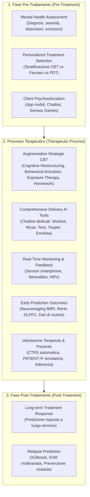

# A Generic Review of Integrating Artificial Intelligence in Cognitive Behavioral Therapy

## Inquadramento e Obiettivi
- **Contesto:** La Terapia Cognitivo-Comportamentale (CBT) rappresenta il gold standard empirico per il trattamento di depressione, disturbi d'ansia e numerose altre condizioni psicologiche. Tuttavia, la sua diffusione è limitata da barriere strutturali (carenza di terapeuti qualificati, costi, stigma sociale), con solo il 27% dei pazienti che accede a cure standardizzate.
- **Obiettivo della Review:** Offrire una panoramica sistematica ed esaustiva sull'integrazione delle tecnologie di Intelligenza Artificiale (Machine Learning, Deep Learning, Pre-trained Models - PTMs, Large Language Models - LLMs, Wearable Computing e Virtual Reality) lungo l'intero ciclo di vita dell'intervento CBT: **fase pre-trattamento**, **processo terapeutico** e **fase post-trattamento**.
- **Mappatura dei Dati:** Censimento e analisi critica dei dataset pubblici dedicati a compiti CBT specifici (identificazione delle distorsioni cognitive, ristrutturazione cognitiva, dialoghi clinici CBT).

---

## Architettura Funzionale Multi-Stadio dell'IA nella CBT

---

## 1. Integrazione dell'IA nella Fase Pre-Trattamento

### 1.1 Valutazione della Salute Mentale (Mental Health Assessment)
- **Diagnosi e Stima della Severità dei Sintomi:**
  - Analisi acustico-vocale combinata con Machine Learning per lo screening rapido in contesti di emergenza psichiatrica (MDD, disturbo bipolare, schizofrenia, GAD).
  - Modelli ibridi avanzati come **Trans-CNN** (integrazione di Transformer e Convolutional Neural Networks) per identificare disturbi depressivi da narrazioni testuali, cartelle cliniche e report diagnostici, superando i singoli modelli standalone.
- **Riconoscimento delle Distorsioni Cognitive (Cognitive Distortions - CD):**
  - Rilevazione automatica basata sulla tassonomia dei 10 pattern disfunzionali di Burns (pensiero dicotomico, iper-generalizzazione, filtro mentale, lettura del pensiero, doverizzazioni, ecc.).
  - Uso di modelli NLP e modelli pre-addestrati specifici di dominio (es. **MentalBERT**, **AraBERT** con BERTopic, **ERNIE 3.0**).
  - Approcci multimodali (es. framework multitask **Decode** che unisce testo, audio e video).
  - Paradigmi basati su LLM:
    - *Diagnosis of Thought (DoT)*: Prompting strategico che genera razionali diagnostici per la classificazione delle distorsioni; presenta tuttavia il limite della sovradiagnosi (*over-diagnosis*).
    - *Extraction-Reasoning-Debate (ERD)*: Architettura multi-agente LLM basata su estrazione, ragionamento e dibattito collaborativo che mitiga drasticamente il bias di sovradiagnosi.
- **Analisi delle Emozioni (Emotion Analysis):**
  - Superamento delle etichette discrete verso modelli dimensionali continui (es. ALBERT fine-tuned per predizione di coordinate emotive dimensionali).
  - Valutazione della capacità dei LLM (ChatGPT) nell'analisi del sentiment multilingue e nel riconoscimento di sfumature emotive complesse (rabbia, tristezza, gioia, paura), con prestazioni comparabili o superiori alla percezione umana media (*emotional cognition*).

### 1.2 Selezione Personalizzata del Trattamento (Personalized Treatment Selection)
- Identificazione a priori dei pazienti che trarranno reale beneficio dalla CBT rispetto ad altre psicoterapie (es. Psicoterapia Psicodinamica - PDT) o all'intervento combinato (CBT + farmacoterapia).
- Meta-analisi (Vieira et al., 2022): accuratezza media del machine learning nel predire il beneficio clinico individuale della CBT pari a circa il **74.0%**.
- Utilizzo della connettività funzionale resting-state (fMRI) per individuare candidati ideali a CBT intensiva nel disturbo ossessivo-compulsivo (OCD).
- Algoritmi prescrittivi basati su caratteristiche cliniche baseline e socio-demografiche di routine per ottimizzare il rapporto costo-efficacia.

### 1.3 Psicoeducazione del Paziente (Client Psychoeducation)
- Erogazione di moduli educativi sui principi CBT, sul modello ABC/ABCDE e sulla relazione pensieri-emozioni-comportamenti.
- Implementazioni tecnologiche:
  - Applicazioni mobili con agenti conversazionali incarnati (*Embodied Conversational Agents* - ECA) per la prevenzione del rischio suicidario.
  - Serious games immersivi (es. **ReWIND** per il disturbo d'ansia generalizzata basato su modello ABCDE).
  - Sistemi LLM personalizzati: **MindWatch** (Llama 2 su AWS SageMaker), **Todaki** (chatbot per ADHD) e **XIAO AN** (robot psicoterapeutico multimodale).

---

## 2. Integrazione dell'IA nel Processo Terapeutico

### 2.1 Potenziamento delle Strategie Terapeutiche Specifiche (AI Augmentation)
1. **Ristrutturazione Cognitiva (Cognitive Restructuring - CR):**
   - Evoluzione dai modelli di riscrittura frasale pura (T5 vs BERT) a framework collaborativi e abilitanti (*client empowerment*).
   - **HealMe:** Modello LLM strutturato in 3 fasi (distinzione situazione/pensiero, brainstorming di prospettive alternative, formulazione di suggerimenti orientati all'azione positiva).
   - **Linguistic Attributes Framework & ReframeGPT:** Generazione controllata e iterativa di ristrutturazioni basate su 7 attributi linguistici chiave (empatia, azionabilità, specificità, ecc.).
   - Estrazione automatica gerarchica di pensieri ed emozioni da testi clinici basata sul modello ABCD (con ERNIE 3.0).
2. **Attivazione Comportamentale (Behavioral Activation - BA):**
   - App mobili di auto-aiuto (**¡Aptívate!**) e sistemi basati su algoritmi di raccomandazione probabilistica (**MUBS**) per stimolare attività positive gratificanti.
   - Riconoscimento multimodale delle attività (**Madhu et al.**) che integra testo, voce e sentiment con accuratezza > 80%.
   - Chatbot specialistici per BA personalizzata e monitoraggio remoto (**Bunji**).
3. **Terapia Espositiva (Exposure Therapy - ET) & VRET:**
   - Integrazione di Virtual Reality Exposure Therapy (VRET) con Explainable AI (XAI) e modelli di predizione in tempo reale dello stato di arousal fisiologico.
   - Ambienti immersivi e serious games per fobie specifiche, ansia sociale e prevenzione delle ricadute nel disturbo da gioco d'azzardo (**Alter Game**).
   - Costruzione dinamica e personalizzata delle gerarchie di esposizione (*fear ladders*) via app (es. *CBT Assistant*).
4. **Assegnazione e Monitoraggio dei Compiti a Casa (Homework Compliance):**
   - Il mancato svolgimento degli homework è tra le principali cause di fallimento della CBT clinica.
   - Riconoscimento automatico dell'assegnazione dei compiti a casa dalle trascrizioni delle sedute mediante NLP.
   - Applicazioni come **MindScape**: integrazione di sensori passivi dello smartphone con LLM per generare prompt contestuali di journaling e auto-riflessione.
   - Predizione dell'efficacia del trattamento e dei punteggi di disabilità (es. Tinnitus Handicap Inventory - THI) tramite analisi linguistica LLM (GPT-2, T5, Flan-T5) dei diari dei pazienti.

### 2.2 Strumenti di IA per l'Erogazione Completa della CBT (Chatbot Clinici)
Oltre il 60% dei chatbot per la salute mentale si basa su principi CBT.

| Agente / Piattaforma | Architettura e Caratteristiche Tecniche | Focus Clinico / Meccanismi CBT |
| :--- | :--- | :--- |
| **Woebot** | Alberi di decisione, NLP, tracking dell'umore, micro-video interattivi | Gestione di depressione e ansia, riformulazione pensieri disfunzionali |
| **Wysa** | Script clinici validati + AI adattiva per NLU empatica | Depressione, ansia, stress, tecniche di CBT e mindfulness |
| **Youper** | Assessment in 3 step, analisi emotiva real-time, alberi decisionali | Interventi CBT modulati sullo stato emotivo istantaneo |
| **Tess** | Conversazioni brevi guidate da regole cliniche e feedback dell'utente | Psicoeducazione, promemoria, strategie CBT personalizzabili |
| **Rumi** | Chatbot specializzato in RFCBT (*Rumination-focused CBT*) | Interruzione della ruminazione, analisi nessi pensieri-emozioni |
| **Cloud Bot** | NLP orientato alla ristrutturazione cognitiva | Identificazione e sfida dei pensieri distorti |
| **Saarthi** | NLP e IA per monitoraggio remoto e CBT evidence-based | Ansia e depressione, telemonitoraggio continuativo |
| **SchizoBot** | Reti neurali artificiali per protocolli CBT strutturati | Supporto alla gestione della schizofrenia e aderenza |
| **XIAO AN** | Robot psicoterapeutico multimodale cinese (voce, video, testo) | Disturbo d'ansia in trial clinici, supporto al terapeuta |
| **Emohaa** | Architettura duale: *CBT-Bot* (template strutturati) + *ES-Bot* (supporto emotivo aperto) | Riduzione del distress psicologico, bilanciamento struttura/empatia |

### 2.3 Monitoraggio in Tempo Reale e Feedback (Wearables & Sensors)
- Rilevazione continua dei livelli di stress e attivazione tramite accelerometri, sensori fisiologici (HRV, conduttanza cutanea) e analisi del parlato (accuratezza media > 71%).
- Biosensori da polso per predire comportamenti aggressivi in adolescenti con autismo con 1 minuto di anticipo (Goodwin et al., regressione logistica ridge), abilitando interventi preventivi tempestivi.

### 2.4 Predizione Precoce degli Esiti del Trattamento (Treatment Outcome Prediction)
- Modelli di Deep Learning e Machine Learning su serie temporali di sintomi auto-riportati e log di interazione in piattaforme Internet-delivered CBT (ICBT).
- Biomarcatori di neuroimaging: individuazione della *Regional Homogeneity* (ReHo) nella corteccia prefrontale dorsolaterale sinistra (left DLPFC) come predittore neurobiologico della risposta alla CBT nella depressione (Wei et al., 2023).
- Predizione basata esclusivamente su dati clinici e socio-demografici di routine (Hilbert et al., 2020, 2021).

### 2.5 Valutazione della Qualità del Terapeuta e Simulazione Clinica
- **Valutazione Automatizzata della Fidelity (CTRS):**
  - Automatizzazione del *Cognitive Therapy Rating Scale* (11 dimensioni di competenza clinica CBT).
  - Modelli BERT adattati e architetture gerarchiche di deep learning su decine di migliaia di trascrizioni di sedute: la proporzione di interventi conformi al protocollo CBT correla positivamente con il miglioramento sintomatico del paziente (Ewbank et al., 2020; Flemotomos et al., 2021; Chen et al., 2022).
- **Simulazione di Pazienti per il Training Clinico:**
  - **PATIENT-Ψ:** Framework basato su LLM per simulare pazienti virtuali con profili cognitivi ed emotivi CBT differenziati, permettendo ai tirocinanti di esercitarsi nel dialogo socratico e nella ristrutturazione cognitiva prima dell'incontro con pazienti reali.
- **Predizione dell'Aderenza e Rischio Dropout:**
  - Reti neurali con meccanismo di self-attention che analizzano i pattern di interazione d'uso (login/logout) nelle prime 1-6 settimane di ICBT (Côté-Allard et al., 2022).

---

## 3. Integrazione dell'IA nella Fase Post-Trattamento

### 3.1 Risposta a Lungo Termine e Predizione delle Ricadute (Relapse Prediction)
- **SVM su fMRI:** Predizione della risposta clinica a lungo termine nella CBT per l'ansia sociale con accuratezza del **92%** (Månsson et al., 2015).
- **XGBoost per LiCBT:** Strumenti di predizione dinamica del rischio di ricaduta a 4 differenti checkpoint temporali post-intervento (Lorimer et al., 2021), consentendo l'attivazione tempestiva di sessioni di richiamo (*booster sessions*) per i soggetti ad alto rischio.

---

## 4. Mappatura dei Dataset Specialistici per CBT e IA

### 4.1 Dataset per la Rilevazione delle Distorsioni Cognitive (CD)
- **CrowdDist & MH Datasets** (Shickel et al., 2020): 7.666 testi crowdsourced su 15 distorsioni cognitive + dati clinici reali annotati da TAO Connect.
- **C2D2** (Wang et al., 2023a): 7.500 istanze di distorsioni cognitive annotate in lingua cinese su 7 categorie cliniche.
- **Elsharawi & El Bolock (2024):** 34.370 campioni su 14 tipologie di distorsione (Facebook, Twitter, Crowdsourcing).
- **Na (2024):** 22.327 campioni estratti da forum di supporto psicologico con annotazione su 10 distorsioni.
- **Lim et al. (2024) & Shreevastava & Foltz (2021):** Dataset Therapist Q&A derivati da Kaggle (2.530 - 3.000 campioni su 10-11 classi).

### 4.2 Dataset per la Ristrutturazione Cognitiva (CR)
- **Sharma et al. (2023c):** 300 coppie situazione-pensiero-ristrutturazione con annotazione di 7 attributi linguistici (Open Source).
- **Lin et al. (2024):** 1.900 frasi estratte da PsyQA con testo originale e ristrutturazione positiva (Open Source).
- **PATTERNREFRAME** (Maddela et al., 2023): ~10.000 campioni integranti personas e pattern di pensiero disfunzionali.

### 4.3 Dataset di Sessioni e Dialoghi Clinici CBT
- **Lee et al. (2023):** Post di supporto psicologico annotati su 3 livelli di strategie empatiche (Reazione emotiva = 1.047, Esplorazione = 481, Interpretazione = 1.436).
- **Na (2024):** 22.327 record domanda-risposta basati su prompting specialistico CBT.

---

## 5. Discussione: Opportunità, Limiti e Sfide Aperte

### Punti di Forza e Benefici
1. **Efficienza e Riduzione del Carico di Lavoro:** Automazione dell'intake, del monitoraggio degli homework e del triage preliminare.
2. **Personalizzazione Avanzata:** Identificazione di pattern idionomici e adattamento in tempo reale delle strategie terapeutiche.
3. **Scalabilità e Accessibilità 24/7:** Superamento dei vincoli geografici ed economici tramite sistemi digitali e chatbot evidence-based.

### Limiti Attuali della Letteratura
- **Sbilanciamento Modale:** Netta prevalenza del testo scritto; scarsa integrazione di segnali multimodali ecologici (audio vocale, espressioni facciali video, biosensori).
- **Qualità e Squilibrio dei Dataset:** Mancanza di standard universali di etichettatura per le distorsioni cognitive e forte sbilanciamento distributivo tra le classi.
- **Assenza di Metriche Standardizzate:** Eterogeneità nella misurazione dell'usabilità, del coinvolgimento e dell'efficacia clinica a lungo termine dei chatbot.
- **Rischio di Sovradiagnosi:** Tendenza dei modelli generativi a categorizzare frasi neutre o fisiologiche come distorsioni cognitive patologiche.

### Sfide Etiche e Direzioni Future
- **Privacy e Sicurezza dei Dati:** Anonimizzazione rigorosa, crittografia end-to-end e compliance normativa sanitaria.
- **Spiegabilità e Trasparenza (XAI):** Necessità di modelli interpretabili nelle decisioni diagnostiche e prognostiche.
- **Alleanza Terapeutica e Modello Centauro:** L'IA non deve sostituire il clinico, ma agire come strumento complementare (*Human-in-the-Loop* / *Augmented Psychotherapy*), preservando la centralità della relazione umana e della presenza empatica autentica.

---

## Relazioni e Concetti Connessi
- [[ai-enhanced-cbt]]: Framework architetturale e metodologico generale.
- [[cognitive-distortion-detection]]: Identificazione computazionale dei pattern disfunzionali di pensiero.
- [[automated-cognitive-restructuring]]: Generazione e reframing cognitivo basati su LLM e Transformer.
- [[cbt-dialogue-systems-and-tools]]: Tassonomia e analisi clinica dei chatbot CBT.
- [[treatment-outcome-and-relapse-prediction]]: Modelli predittivi clinici e neurobiologici per esito e ricadute.
- [[ctrs-automated-evaluation]]: Valutazione automatizzata della qualità terapeutica e della fidelity.
- [[clinical-fidelity-assessment]]: Monitoraggio standardizzato delle competenze cliniche.
- [[simulazione-pazienti-ai]]: Ambienti di role-playing per il training clinico (PATIENT-Ψ).
