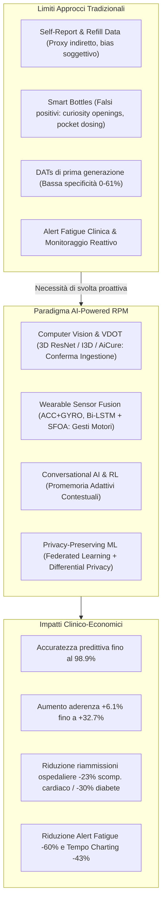
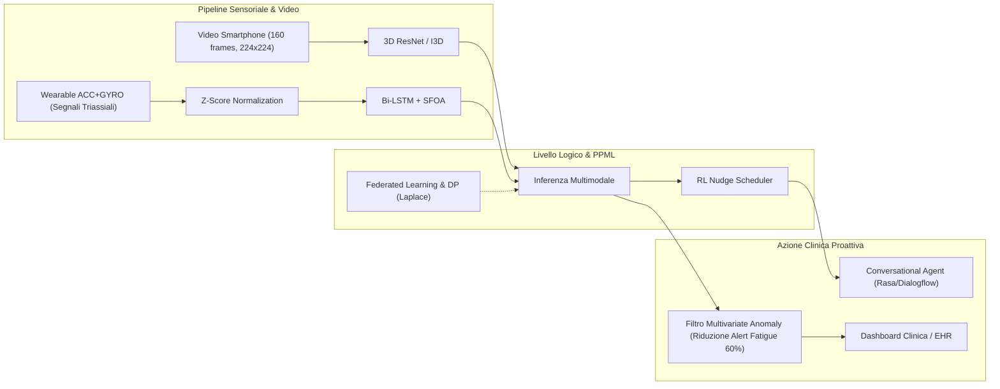

# AI-Powered Real-Time Adherence Monitoring for Remote Patient Care in Telemedicine

**Summary**: Questo articolo esamina l'integrazione di architetture di Intelligenza Artificiale nel monitoraggio in tempo reale dell'aderenza farmacologica all'interno della telemedicina e del Remote Patient Monitoring (RPM). Superando i limiti delle metriche indirette tradizionali (conteggio pillole, self-report, smart pill bottles soggetti a "curiosity openings"), il framework integra Computer Vision (3D ResNet, 3D ResNeXt, I3D) per la Video-Observed Therapy (VDOT), sensori indossabili triassiali con reti attentive Bi-LSTM ottimizzate tramite Sheep Flock Optimization Algorithm (SFOA), e agenti conversazionali guidati da Reinforcement Learning per il nudging comportamentale contestuale. Il paradigma si fonda su architetture per la tutela della privacy (Federated Learning, Differential Privacy laplaciana, Homomorphic Encryption). I risultati mostrano accuratezze predittive fino al 97.7%-98.9%, un incremento dell'aderenza clinica tra il 6.1% e il 32.7%, la riduzione delle riammissioni ospedaliere per scompenso cardiaco del 23% (oltre 10 miliardi di dollari risparmiati annualmente negli USA), un calo del 60% nell'alert fatigue clinica e una riduzione del 43% nel tempo di documentazione medica.
**Sources**: `AI-PoweredReal-TimeAdherenceMonitoringforRemotePatientCareinTelemedicine.pdf` (Joshua & Peterson, 12 Giugno 2025)
**Last updated**: 2026-08-27
---

## Inquadramento e Rilevanza Clinico-Tecnologica

La non-aderenza farmacologica rappresenta una delle criticità più gravi nei sistemi sanitari globali:
1. **Epidemiologia e Mortalità**: Fino al 50% dei pazienti con patologie croniche non assume i farmaci secondo le prescrizioni mediche, determinando un incremento del 17% del rischio di ospedalizzazione per tutte le cause nelle malattie croniche non trasmissibili (NCDs come diabete e ipertensione) e un aumento significativo della mortalità a lungo termine.
2. **Costi Economici**: Negli Stati Uniti, dove la spesa sanitaria costituisce il 18% del PIL, centinaia di miliardi di dollari sono dissipati ogni anno in eventi acuti prevenibili legati alla non-compliance.
3. **Limiti del Monitoraggio Tradizionale e dei DAT di Prima Generazione**: 
   - *Proxy Indiretti*: Registri di ricarica farmaceutica (*pharmacy refills*) e scale self-report (es. *Morisky 8-Item Medication Adherence Scale*) misurano il possesso del farmaco o percezioni soggettive, non l'effettiva ingestione.
   - *Smart Bottles (GlowCap, AdhereTech)*: Vulnerabili a "curiosity openings" o "pocket dosing" (apertura del tappo senza assunzione), generando falsi positivi.
   - *Digital Adherence Technologies (DATs)* non intelligenti: Mostrano sensibilità variabile (70%–94%) ma specificità estremamente bassa (0%–61%), risultando inadeguati per decisioni cliniche ad alto rischio (es. tubercolosi).

---

## Architetture Tecnologiche e Metodologie di Intelligenza Artificiale

Lo studio sintetizza le metodologie AI suddivise in tre modalità operative principali e un'infrastruttura di sicurezza decentralizzata:

### 1. Computer Vision e Video-Observed Therapy (VDOT)
- **Dataset e Preprocessing**: Nei trial su pazienti affetti da tubercolosi (TB), sono stati analizzati dataset di 861 video di ingestione. La pipeline prevede un protocollo di annotazione manuale per scartare frame a bassa luminosità o con volto non visibile, estrazione dei frame tramite `FFmpeg`, standardizzazione a circa 160 key-frame per video e down-sampling a risoluzione $224 \times 224$ pixel.
- **Modelli di Deep Learning per Classificazione Binaria (Aderente vs Non-Aderente)**:
  1. **3D ResNet**: Estrazione congiunta di feature spaziali e temporali lungo la sequenza video; rappresenta il modello con il miglior compromesso tra accuratezza (90.1% precision, 95.8% sensitivity) e velocità di inferenza clinica su larga scala.
  2. **3D ResNeXt**: Sfrutta *grouped convolutions* per migliorare l'efficienza computazionale.
  3. **Inflated 3D (I3D)**: Architettura specifica per l'*human action recognition* complessa su sequenze video.
  4. **Inception-v4**: Utilizzato come baseline comparativa per l'analisi statica dei frame.
- **Piattaforme di Riferimento**: *AiCure*, che impiega reti neurali su smartphone per identificare paziente, pillola e deglutizione effettiva (*swallowing verification*), portando l'aderenza al 100% nei trial su pazienti post-ictus rispetto al 50% dei controlli.

### 2. Wearable Sensor Fusion e Gesture Recognition Passiva
- **Acquisizione Segnali**: Sensori inerziali integrati in smartwatch o cerotti medicali: Accelerometri Triassiali (ACC) e Giroscopi (GYRO).
- **Normalizzazione**: Standardizzazione dei segnali grezzi altamente rumorosi tramite *Z-score normalization* ($\mu = 0, \sigma = 1$), rendendo il modello invariante rispetto all'intensità generale del movimento dell'utente.
- **Architettura di Rete**: Rete *Attention-based Bidirectional Long Short-Term Memory* (Bi-LSTM), in grado di catturare dipendenze temporali passate e future per distinguere la firma motoria della sequenza mano-bocca (*hand-to-mouth*) da gesti confondenti (mangiare, bere).
- **Ottimizzazione Iperparametri**: Applicazione del **Sheep Flock Optimization Algorithm (SFOA)**, un algoritmo metaeuristico bio-ispirato al comportamento sociale del gregge, per esplorare lo spazio degli iperparametri ed evitare minimi locali, raggiungendo il **98.90% di accuratezza** e il **97.8% di sensibilità**.

### 3. Conversational AI e Reinforcement Learning per Nudging Adattivo
- **Livello di Interazione**: Agenti conversazionali (chatbot vocali e testuali basati su Rasa o Dialogflow) gestiscono *intent recognition* ed *entity extraction*.
- **Reinforcement Learning (RL) per Promemoria Dinamici**: Invece di inviare alert a orari fissi, gli algoritmi RL analizzano la cronologia di risposta del paziente per individuare il momento ottimale (*context-aware behavioral nudge*), incrementando l'aderenza oltre il 92%.
- **Sicurezza Farmacologica**: Modelli ibridi CNN per il rilevamento di interazioni farmaco-farmaco (*Drug-Drug Interaction* - DDI) con accuratezze del 79%–95% nel prevenire eventi avversi prima della somministrazione.

### 4. Privacy-Preserving Machine Learning Frameworks (PPML)
Data la natura critica dei dati sanitari protetti da GDPR e HIPAA:
- **Federated Learning (FL)**: Addestramento decentralizzato su nodi periferici (smartphone/wearable), condividendo solo i gradienti del modello globale.
- **Differential Privacy (DP)**: Iniezione di rumore calibrato tramite Meccanismo di Laplace per prevenire attacchi di *membership inference*:
  $$L(x) = f(x) + \text{Lap}\left(\frac{\Delta f}{\epsilon}\right)$$
  dove $\Delta f$ è la sensibilità globale della funzione ed $\epsilon$ è il privacy budget.
- **Homomorphic Encryption (HE)**: Cifratura selettiva che consente il calcolo direttamente su dati criptati per le operazioni ad alto rischio senza necessità di decifrazione intermedia.

---

## Risultati e Prestazioni Analitiche

### Sintesi delle Prestazioni dei Modelli AI

| Modello / Architettura | Applicazione Primaria | Accuratezza / Precisione | Sensibilità / Specificità |
| :--- | :--- | :--- | :--- |
| **SFOA-Bi-LSTM** | Riconoscimento Gesti Wearable | **98.90%** Accuratezza | **97.8%** Sensibilità |
| **3D ResNet** | Video Monitoring Ingestione (TB) | **90.1%** Precisione | **95.8%** Sensibilità (Spec: 43.5%–55.4%) |
| **Movelet Algorithm** | Smartwatch (Pazienti Oncologici) | **85.0%** Accuratezza | N/A |
| **Hybrid CNN-DDI** | Sicurezza Interazioni Farmacologiche | **95.0%** Accuratezza | N/A |
| **Artificial Neural Networks**| Predizione Aderenza Ipertensione | **79.0%** Accuratezza | N/A |
| **Framework RPM Globale** | Gestione Malattie Croniche | Fino a **97.7%** Accuratezza Predittiva | Miglioramento aderenza **+6.1% / +32.7%** |

---

## Impatto Clinico, Economico e Operativo

1. **Efficacia Clinica**:
   - I trial controllati randomizzati (RCT) evidenziano un incremento assoluto dei tassi di aderenza tra **+6.7% e +32.7%** rispetto alle cure standard.
   - Nei pazienti con **schizofrenia e deficit cognitivo**, l'adozione di computer vision su smartphone ha garantito un tasso di aderenza superiore del **+17.9%** rispetto alla directly observed therapy modificata.
   - Sistemi contestuali di reminder hanno consentito livelli di compliance stabili $\ge 92\%$.
2. **Ottimizzazione Economica del Sistema Sanitario**:
   - **Scompenso Cardiaco (Heart Failure)**: Riduzione del **23% delle riammissioni ospedaliere**, con un risparmio stimato superiore a **10 miliardi di dollari all'anno** negli Stati Uniti.
   - **Diabete e Malattie Cardiovascolari**: Riduzione del **30% delle spese complessive di ricovero**.
   - **Accessi al Pronto Soccorso (ER)**: Calo del **25%** negli accessi d'urgenza.
3. **Efficienza Operativa e Sostenibilità Clinica**:
   - **Riduzione dell'Alert Fatigue**: L'analisi di pattern multivariati filtra il 60% delle fluttuazioni benigne, abbattendo i falsi positivi per i medici curanti.
   - **Documentazione Virtuale Assistita da IA**: Riduzione del tempo di charting clinico da **11.2 minuti a 6.4 minuti per visita (-43%)**, mantenendo inalterata la qualità delle note sanitarie.

---

## Discussione: Dalla Sorveglianza Reattiva al Monitoraggio Proattivo

### 1. Transizione Reattiva vs Proattiva
I modelli tradizionali di telemonitoraggio inviano notifiche solo a posteriori (es. "dose mancata"), quando il deterioramento fisiologico o la complicanza sono già innescati. L'IA multivariata integra parametri biometrici, pattern comportamentali e contesti ambientali: se un paziente con scompenso cardiaco salta una dose di diuretico e contemporaneamente mostra un decremento nei livelli di attività motoria, il sistema segnala il rischio di scompenso *prima* della crisi acuta.

### 2. Privacy, Trasparenza e Spiegabilità (Explainable AI - XAI)
Sebbene Federated Learning e Homomorphic Encryption tutelino la riservatezza formale, la natura "black-box" delle reti deep learning costituisce un ostacolo all'adozione. I medici sono riluttanti ad agire su raccomandazioni non verificabili; l'Explainable AI (XAI) risulta indispensabile per stabilire fiducia clinica.

### 3. Implicazioni Socio-Tecniche ed Equità Sanitaria (Health Equity)
L'efficacia degli strumenti digitali risente dei Determinanti Sociali della Salute (SDOH):
- I pazienti over-75 presentano tassi di richiesta refill via SMS/app inferiori rispetto ai giovani (*digital divide*).
- Barriere linguistiche ed educative incidono sulla compliance; è necessaria la personalizzazione culturale e linguistica dei modelli NLP (es. studi con NLP arabo/iracheno in oncologia senologica).

---

## Limitazioni Identificate

1. **Dataset Sintetici o Secondari**: Molti risultati ad alta accuratezza (specialmente in PPML e modelli video TB) derivano da coorti secondarie o ambienti simulati che non riflettono appieno il rumore ecologico dei dati reali.
2. **Dimensioni Campionarie Ridotte e Breve Durata**: Diversi RCT analizzati (es. trial AiCure) hanno arruolato campioni piccoli ($n < 60$) su periodi brevi (12–24 settimane); mancano evidenze longitudinali pluriennali sulla persistenza dell'aderenza.
3. **Latenza Computazionale nei Modelli Cifrati**: L'applicazione di Homomorphic Encryption e Federated Learning introduce un sovraccarico computazionale e latenze temporali che possono ostacolare il monitoraggio ad altissima frequenza.
4. **Rischio di Bias Metodologico**: Presenza di rischio di bias moderato-alto in parte della letteratura di revisione sistematica, richiedendo futuri trial multicentrici standardizzati.

---

## Conclusioni

Il monitoraggio dell'aderenza in tempo reale basato su IA trasforma la gestione farmacologica da ostacolo passivo a processo guidato dalla medicina di precisione. L'integrazione connettiva di computer vision (3D ResNet), sensori inerziali indossabili (SFOA-Bi-LSTM), agenti conversazionali guidati da RL e architetture PPML abilita un modello predittivo proattivo, garantendo benefici clinici tangibili e risparmi miliardari per i sistemi sanitari moderni.

---

## Relazioni e Concetti Chiave Collegati

- [[video-observed-therapy-ai]] — Modelli di Computer Vision e Video-Observed Therapy per la conferma dell'ingestione
- [[wearable-sensor-fusion-adherence]] — Sensori indossabili inerziali, architetture Bi-LSTM e ottimizzazione SFOA
- [[privacy-preserving-rpm-frameworks]] — Federated Learning, Differential Privacy e Homomorphic Encryption in telemedicina
- [[proactive-surveillance-alert-fatigue]] — Sorveglianza proattiva multivariata e riduzione dell'alert fatigue clinica
- [[context-aware-adaptive-nudging]] — Reinforcement Learning e agenti conversazionali per il nudging comportamentale
- [[chronic-disease-monitoring-adherence]] — Automonitoraggio delle patologie croniche e aderenza terapeutica
- [[ai-clinical-decision-support]] — Supporto decisionale clinico e accuratezza diagnostica
- [[etica-privacy-bias-ia-clinica]] — Aspetti etici, sicurezza dei dati sanitari e bias algoritmici
