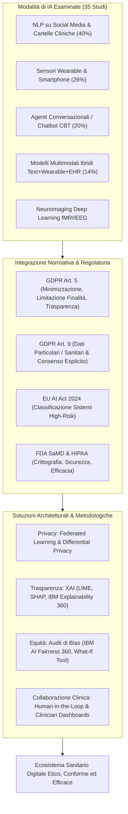
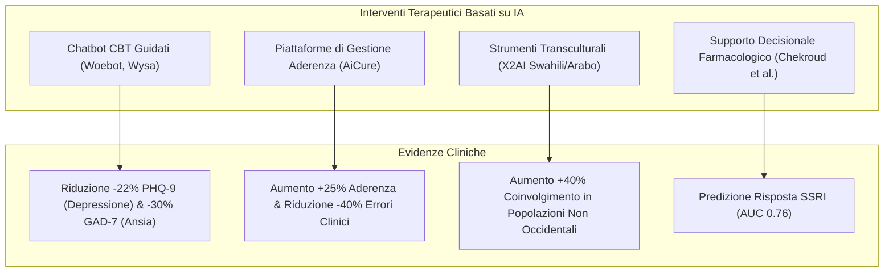
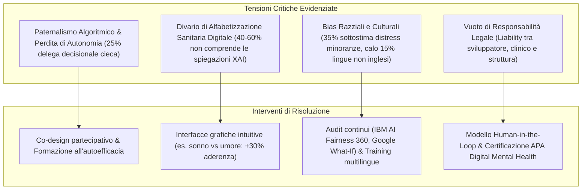
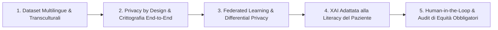

# AI Applications Integrating Legal and Regulatory Perspectives in Mental Health: Systematic Review (Kandeel et al., 2026)

**Summary**: Revisione sistematica condotta secondo le linee guida PRISMA 2020 (*JMIR AI*, 2026) su 35 studi empirici (2013–2024) che esamina l'efficacia diagnostica e terapeutica dell'Intelligenza Artificiale (NLP, sensori indossabili, neuroimaging fMRI/EEG, sistemi multimodali, chatbot CBT) integrandola criticamente con i quadri normativi e legali internazionali (GDPR europeo, HIPAA statunitense, EU AI Act 2024, linee guida FDA SaMD e WHO). Il paper analizza le performance cliniche, i rischi di privacy (re-identificazione dei dati, "purpose creep", scandalo BetterHelp), i bias algoritmici cross-culturali e delinea soluzioni architetturali di tutela (Federated Learning, Differential Privacy, Explainable AI, audit di equità e modelli human-in-the-loop).
**Sources**: `ai-v5-e84305.pdf` (*JMIR AI*, 2026; Vol. 5, e84305, pp. 1–19. DOI: 10.2196/84305)
**Last updated**: 2026-08-27
---

## Inquadramento e Obiettivi della Review

La salute mentale rappresenta una delle principali emergenze globali del XXI secolo: l'Organizzazione Mondiale della Sanità (OMS) stima che **970 milioni di persone** nel mondo soffrano di disturbi psichiatrici o da uso di sostanze, con ansia e depressione che costano oltre **1 trilione di dollari all'anno** in perdita di produttività. Il sistema di cura tradizionale affronta gravi barriere di accesso:
- Circa il **50% della popolazione globale non ha accesso a specialisti** (con carenze estreme come 1 psichiatra ogni 2 milioni di abitanti nell'Africa subsahariana);
- Lo **stigma sociale** impedisce a circa il **60% dei soggetti bisognosi** di rivolgersi a un terapeuta di persona;
- La pratica convenzionale rimane ancorata a procedure di *trial-and-error* farmacologico e risorse umane sature.

In questo scenario, le tecnologie di **Intelligenza Artificiale (IA)** — attraverso [[natural-language-processing|NLP]], machine learning, deep learning e sensori biometrici — offrono strumenti scalabili a basso costo e disponibili h24. Tuttavia, l'assenza di standard regolatori stringenti espone i pazienti a rischi critici di violazione della privacy, discriminazione algoritmica (*bias*) ed erosione dell'autonomia decisionale.

La review sistematica di **Moustafa Elmetwaly Kandeel e colleghi (Al Ain University, University of Sharjah, Tanta University, UAE University, Institute of Public Administration Riyadh, 2026)** analizza lo stato dell'arte su 35 studi empirici pubblicati tra il 2013 e il 2024, integrando i risultati clinici con i vincoli del **GDPR europeo (Artt. 5 e 9)**, dell'**HIPAA statunitense**, dell'**EU AI Act (2024)** e degli standard **FDA SaMD**.

---

## Metodologia e Caratteristiche degli Studi Inclusi

La selezione sistematica ha seguito il protocollo **PRISMA 2020**:
- **Banche Dati Interrogate**: PubMed, IEEE Xplore, PsycINFO, Scopus e Cochrane Library (intervallo temporale: 1 gennaio 2013 – 31 dicembre 2024).
- **Flusso di Selezione**: 2.534 record iniziali $\rightarrow$ 1.872 dopo deduplica $\rightarrow$ 295 dopo screening per titolo/abstract $\rightarrow$ 123 valutati full-text $\rightarrow$ **35 studi empirici inclusi** (accordo inter-rater con indice di Cohen $\kappa = 0.84$).
- **Valutazione del Rischio di Bias**: condotta tramite *Risk of Bias-2 (RoB-2)* per i trial, *QUADAS-2* per l'accuratezza diagnostica e *Newcastle-Ottawa Scale* per le coorti:
  - **Basso rischio di bias**: 9 studi (26%);
  - **Rischio moderato**: 21 studi (60%);
  - **Alto rischio**: 5 studi (15%).
- **Distribuzione Geografica**: Stati Uniti (34%, 12/35), Cina (20%, 7/35), Regno Unito (14%, 5/35), Australia (11%, 4/35), Canada (9%, 3/35), altri paesi (11%, 4/35).
- **Target Clinici**: Depressione Maggiore (51%, 18/35), Ideazione/Rischio Suicidario (34%, 12/35), Disturbo Bipolare, Schizofrenia e Disturbi d'Ansia (14%, 5/35).

---

## 1. Applicazioni Diagnostiche e Predittive

```mermaid
graph LR
    subgraph Inputs ["Flussi di Dati"]
        I1["Linguaggio Social Media / Testo Clinico"]
        I2["Biometria Wearable (HRV, Eda, Sonno)"]
        I3["Neuroimaging Funzionale (fMRI)"]
        I4["Cartelle Cliniche Elettroniche (EHR)"]
    end

    subgraph Models ["Modelli & Accuratezza"]
        M1["LSTM / Transformers: 81-89% Accuratezza Depressione"]
        M2["SVM + NLP: AUC 0.92 Rischio Suicidio"]
        M3["Wearables (Empatica E4): F1=0.81 Crisi d'Ansia"]
        M4["CNN su fMRI: 88% Schizofrenia (Disconnettività PFC)"]
        M5["Multimodale (Tseng et al.): AUC 0.91 Ricaduta Depressiva (+12%)"]
    end

    Inputs --> Models
```

### A. NLP e Analisi dei Pattern Linguistici (40% degli studi)
- **Rilevamento della Depressione**: Gkotsis et al. (2017) hanno applicato reti neurali *Long Short-Term Memory* (LSTM) sui post di Reddit, raggiungendo un'accuratezza dell'**89%** nell'identificare il linguaggio depressivo tramite complessità sintattica e polarità del sentiment. De Choudhury et al. (2013) hanno impiegato *Latent Dirichlet Allocation* (LDA) e classificatori SVM su Twitter, predicendo l'esordio della depressione **3 mesi prima della diagnosi clinica formale** ($\text{AUC} = 0.85$). Marcatori linguistici chiave: uso frequente di pronomi di prima persona singolare ("io", "me"), parole a valenza emotiva negativa e ridotta diversità lessicale.
- **Prevenzione del Suicidio**: Coppersmith et al. (2018) hanno sviluppato una pipeline NLP su Twitter in grado di rilevare individui ad alto rischio suicidario ($\text{AUC} = 0.92$) sia da riferimenti espliciti ("farla finita") sia da metafore implicite di esaurimento emotivo ("non vedo vie d'uscita").
- **Disturbi d'Ansia**: Guntuku et al. (2017) hanno integrato dizionari LIWC con foreste casuali (Random Forest) per catturare pattern di preoccupazione (*worry*) e rimuginio (*rumination*) su Facebook e Reddit ($F_1 = 0.78$).

### B. Sensori Biometrici e Wearables (26% degli studi)
- Dispositivi come **Empatica E4** e smartwatch analizzano marker fisiologici in tempo reale (variabilità della frequenza cardiaca - HRV, conduttanza cutanea/attività elettrodermica) e comportamentali (qualità del sonno, mobilità/contapassi).
- Jacobson et al. (2020) hanno dimostrato una predizione degli episodi d'ansia acuta tramite HRV con un punteggio di $F_1 = 0.81$.
- **Criticità**: Il segnale si degrada per non-aderenza del paziente, artefatti di movimento, assunzione di caffeina o stress fisico-ambientale, con campioni finora sbilanciati su giovani tecnologicamente alfabetizzati.

### C. Neuroimaging e Deep Learning
- Reti neurali convoluzionali (CNN) e Graph Neural Networks applicate a fMRI ed EEG per diagnosi obiettive. Zeng et al. (2018) hanno classificato la schizofrenia con accuratezza dell'**88%** individuando pattern di disconnettività nella corteccia prefrontale.
- **Limite**: Mancanza di interpretabilità intrinseca (*black-box*), che ne ostacola l'adozione clinica di routine.

### D. Sistemi Diagnostici Ibridi e Multimodali (14% degli studi)
- Tseng et al. (2023) hanno combinato testo da social media (Reddit), dati attigrafici da Fitbit e cartelle cliniche elettroniche (EHR) per la predizione delle recidive depressive: il modello multimodale ha raggiunto un'**AUC di 0.91**, superando del **+12%** qualsiasi modello a singola modalità.

---

## 2. Interventi Terapeutici e Potenziamento del Paziente

- **Chatbot Terapeutici per CBT (Woebot, Wysa)**: RCT documentano una riduzione del **22% nei punteggi PHQ-9 di depressione** mediante tracciamento giornaliero e compiti di ristrutturazione cognitiva (Darcy et al., 2021). Wysa ha conseguito riduzioni di circa il **30% dell'ansia (GAD-7)** in popolazioni indiane adattando gli algoritmi alle metafore culturali locali per lo stress.
- **Aderenza Terapeutica Farmacologica (AiCure)**: L'uso di algoritmi di riconoscimento facciale e monitoraggio su smartphone ha aumentato del **25% l'aderenza ai farmaci antipsicotici** in trial sulla schizofrenia, consentendo ai clinici che verificano gli alert di ridurre gli errori del **40%**.
- **Personalizzazione Farmacologica**: Il modello neurale di Chekroud et al. (2016) predice l'efficacia dei farmaci antidepressivi SSRI con $\text{AUC} = 0.76$, riducendo i tempi e i fallimenti dei tentativi empirici.
- **Integrazione Culturale e Linguistica**: Il chatbot multilingue X2AI, traducendo interventi terapeutici in arabo e swahili, ha registrato un coinvolgimento superiore del **40%** rispetto a strumenti standard in lingua inglese.

---

## 3. Quadro Normativo: Vincoli e Sfide del GDPR, HIPAA e AI Act

L'analisi evidenzia un netto contrasto tra la mole di dati richiesta dall'IA e i requisiti di tutela dei diritti fondamentali:

| Principio Regolatorio | Articolo di Riferimento / Legge | Sfida Applicativa nell'IA di Salute Mentale | Esiti e Rischi Evidenziati nella Review |
| :--- | :--- | :--- | :--- |
| **Dati Particolari / Sensibili** | **GDPR Art. 9.2** | Divieto generale di trattamento salvo consenso esplicito, interesse vitale o ricerca scientifica con salvaguardie idonee. | Tracciamento passivo su social media o dati wearable raccolti senza consenso esplicito e consapevole. |
| **Minimizzazione dei Dati** | **GDPR Art. 5.1.c** | Obbligo di raccogliere solo i dati strettamente necessari per le finalità dichiarate. | I modelli di deep learning tendono alla raccolta massiva indifferenziata di metadati e biometrie. |
| **Limitazione delle Finalità** | **GDPR Art. 5.1.b** | Divieto di riutilizzare i dati per scopi incompatibili (*purpose creep*). | **Scandalo BetterHelp**: cessione illecita di dati clinici e risposte a test a broker pubblicitari (Facebook, Pinterest). |
| **Crittografia & Sicurezza** | **HIPAA / GDPR Art. 32** | Standard di protezione tecnica dei dati sanitari in transito e a riposo. | Il **45% delle app di salute mentale** prive di crittografia a norma HIPAA; il **60% condivide dati con terze parti**. |
| **Re-identificazione** | Privacy Safeguards | Anonimizzazione apparente di dati aggregati o transcritti. | Rocher et al. (2019): il **99.98% degli individui** può essere re-identificato in dataset "anonimizzati" tramite metadati ausiliari (CAP, timestamp, stile lessicale). |
| **Sistemi ad Alto Rischio** | **EU AI Act (2024)** | Obblighi stringenti di audit, gestione del rischio e sorveglianza post-market. | Le applicazioni diagnostiche/terapeutiche di salute mentale ricadono nella categoria *High Risk*. |
| **Spiegabilità (*Right to Explanation*)** | **GDPR Art. 13-15 / 22** | Diritto del paziente a comprendere la logica decisionale automatizzata. | I modelli deep learning sono *black box*; solo il 15% degli studi include metriche di interpretabilità. |

---

## 4. Tensioni Etiche e Cliniche Critiche

### A. Paternalismo Algoritmico vs Autonomia del Paziente
- Negli studi su chatbot come Woebot, il **25% degli utenti ha delegato decisioni cruciali alla macchina**, ignorando i disclaimer sui limiti dello strumento.
- L'automazione non supervisionata rischia di generare un "paternalismo algoritmico" in cui l'utente subisce passivamente prescrizioni automatizzate senza sviluppare reale mentalizzazione o autoregolazione emotiva.
- Il **divario di alfabetizzazione digitale** aggrava la disparità: il **60% dei pazienti anziani** e il **40% degli utenti a bassa scolarizzazione** non sono in grado di distinguere consigli umani da output algoritmici o di decodificare spiegazioni tecniche complesse.

### B. Bias Razziale, Culturale e Linguistico
- Obermeyer et al. (2019) hanno dimostrato che algoritmi sanitari commerciali negli USA **sottostimano sistematicamente del 35% i bisogni di salute mentale e il dolore dei pazienti neri** rispetto ai bianchi (etichettando espressioni di distress come "ricerca di oppioidi").
- I modelli NLP addestrati su testi occidentali anglofoni registrano una **perdita di accuratezza del 15%** se applicati a lingue non inglesi (Harrigian et al., 2021) o interpretano erroneamente manifestazioni psicosomatiche tipiche delle culture orientali.

### C. Responsabilità Giuridica e "Black-Box"
- Circa il **45% dei terapeuti esprime sfiducia verso i modelli IA opachi**.
- Rimane non regolata la responsabilità civile per danni da misdiagnosi: la colpa ricade sul programmatore dell'algoritmo, sul medico utilizzatore o sulla struttura ospedaliera? Solo il **30% delle app dichiara termini di responsabilità legale**.

---

## 5. Soluzioni Tecnologiche e Architetturali

1. **Federated Learning (Apprendimento Federato)**: Addestramento decentralizzato dei modelli sui server locali degli ospedali senza accentramento dei dati grezzi dei pazienti (Sheller et al., 2020), permettendo audit multi-istituzionali nel pieno rispetto del GDPR.
2. **Differential Privacy (Privacy Differenziale)**: Iniezione di rumore statistico calibrato nei dataset (Dwork & Roth, 2014) per impedire matematicamente la re-identificazione pur preservando l'utilità analitica globale.
3. **Explainable AI (XAI)**: Adozione di framework di spiegabilità come **LIME**, **SHAP** e **IBM AI Explainability 360** per tradurre le previsioni neurali in fattori comprensibili al paziente (es. *"Il peggioramento dell'umore è correlato per il 60% alle interruzioni del sonno dopo mezzanotte"*), aumentando la fiducia e l'alleanza terapeutica del **+35%**.
4. **Audit di Equità Continuativi**: Integrazione sistematica di pipeline di auditing (*IBM AI Fairness 360*, *Google What-If Tool*) per rilevare e de-biasing preventivo nei dataset prima e dopo il rilascio.
5. **Modelli Centauro (Human-in-the-Loop)**: Architetture collaborative in cui l'IA amplifica la rilevazione di segnali precoci invisibili (es. ricadute da actigrafia + EHR), mentre il clinico mantiene l'autorità interpretativa, l'empatia e la responsabilità terapeutica.

---

## Raccomandazioni Operative della Review

1. **Addestramento su Dataset Diversificati**: Sviluppare modelli indipendenti dalla cultura e addestrati su corpora multilingue (es. modelli cross-lingua come XLM-RoBERTa con $F_1 = 0.82$ su 12 lingue) per eliminare i bias etno-linguistici.
2. **Framework Etici e Consenso Esplicito**: Implementare rigorosamente la *Privacy by Design* (crittografia end-to-end, cancellazione automatica dei dati a 30 giorni) e protocolli di consenso informato chiari sulla natura artificiale dell'agente.
3. **Coinvolgimento Partecipativo (Co-Design)**: Includere clinici, pazienti e comunità locali nella progettazione degli algoritmi per garantire usabilità reale e rispondenza ai bisogni.
4. **Spiegabilità Clinica e Paziente**: Fornire spiegazioni grafiche intuitive adattate al livello di alfabetizzazione sanitaria per prevenire sia l'eccessiva dipendenza sia la diffidenza ingiustificata.
5. **Decision Support Additivo (Non Sostitutivo)**: Configurare i sistemi come ausilio per il monitoraggio e il triage, delegando la gestione delle crisi acute e del rischio suicidario a personale umano formato.
6. **Audit di Terze Parti Obbligatori**: Istituire verifiche indipendenti periodiche sull'equità algoritmica e la conformità SaMD/GDPR pubblicando i risultati di performance su sottogruppi demografici.

---

## Riferimenti Bibliografici Principali

- **Kandeel, M. E., Abo Hamza, E. G., Abouahmed, A., AbdelAziz, G. M., Hashish, A., Abo El Wafa, T., Khalil, A., & Eldakak, A.** (2026). AI Applications Integrating Legal and Regulatory Perspectives in Mental Health: Systematic Review. *JMIR AI*, 5, e84305. https://doi.org/10.2196/84305
- **Chekroud, A. M., Zotti, R. J., Shehzad, Z., et al.** (2016). Cross-trial prediction of treatment outcome in depression: a machine learning approach. *The Lancet Psychiatry*, 3(3), 243–250.
- **Coppersmith, G., Leary, R., Crutchley, P., & Fine, A.** (2018). Natural language processing of social media as screening for suicide risk. *Biomedical Informatics Insights*, 10, 1178222618792860.
- **Darcy, A., Daniels, J., Salinger, D., Wicks, P., & Robinson, A.** (2021). Evidence of human-level bonds established with a digital conversational agent. *JMIR Formative Research*, 5(5), e27868.
- **De Choudhury, M., Gamon, M., Counts, S., & Horvitz, E.** (2013). Predicting depression via social media. *ICWSM*, 7(1), 128–137.
- **Gkotsis, G., Oellrich, A., Velupillai, S., et al.** (2017). Characterisation of mental health conditions in social media using Informed Deep Learning. *Scientific Reports*, 7(1), 45141.
- **Jacobson, N. C., Bentley, K. H., Walton, A., et al.** (2020). Ethical dilemmas posed by mobile health and machine learning in psychiatry research. *Bulletin of the World Health Organization*, 98(4), 270–276.
- **Liu, Y., Ye, H., Weissweiler, L., et al.** (2023). Crosslingual transfer learning for low-resource languages based on multilingual colexification graphs. *Findings of ACL*, EMNLP 2023.
- **Obermeyer, Z., Powers, B., Vogeli, C., & Mullainathan, S.** (2019). Dissecting racial bias in an algorithm used to manage the health of populations. *Science*, 366(6464), 447–453.
- **Rocher, L., Hendrickx, J. M., & de Montjoye, Y. A.** (2019). Estimating the success of re-identifications in incomplete datasets using generative models. *Nature Communications*, 10(1), 3069.
- **Sheller, M. J., Edwards, B., Reina, G. A., et al.** (2020). Federated learning in medicine: facilitating multi-institutional collaborations without sharing patient data. *Scientific Reports*, 10(1), 12598.
- **Torous, J., Bucci, S., Bell, I. H., et al.** (2021). The growing field of digital psychiatry: current evidence and the future of apps, social media, chatbots, and virtual reality. *World Psychiatry*, 20(3), 318–335.
- **Tseng, H. W., Chou, F. H., Chen, C. H., & Chang, Y. P.** (2023). Effects of mindfulness-based cognitive therapy on major depressive disorder with multiple episodes: a systematic review and meta-analysis. *IJERPH*, 20(2), 1555.
- **Zeng, L. L., Wang, H., Hu, P., et al.** (2018). Multi-site diagnostic classification of schizophrenia using discriminant deep learning with functional connectivity MRI. *EBioMedicine*, 30, 74–85.

---

## Pagine e Concetti Correlati

- [[gdpr-governance-mental-health-ai]]: I vincoli del GDPR (Artt. 5 e 9), consenso esplicito, minimizzazione e rischi di commercializzazione dei dati clinici.
- [[federated-learning-and-differential-privacy-mental-health]]: Tecniche di tutela avanzata della privacy (apprendimento federato e rumore differenziale) per la salute mentale.
- [[algorithmic-paternalism-in-ai-mental-health]]: Il conflitto tra automazione algoritmica, delega decisionale e preservazione dell'agency e autonomia del paziente.
- [[multimodal-diagnostic-ai-mental-health]]: Architetture diagnostiche ibride (NLP, wearables, neuroimaging, cartelle cliniche elettroniche).
- [[cross-cultural-bias-and-fairness-audits-ai]]: Analisi e mitigazione dei bias etnici, linguistici e culturali nei modelli predittivi psichiatrici.
- [[software-as-a-medical-device-salute-mentale]]: Standard regolatori e percorsi di validazione clinica per algoritmi e dispositivi SaMD.
- [[explainable-mental-disorder-diagnosis]]: Metodologie XAI (LIME, SHAP) per la trasparenza e l'adozione fiduciaria da parte di clinici e pazienti.
- [[three-layer-governance-framework]]: Modello strutturato a tre livelli per la sicurezza tecnica, la governance clinica e la regolamentazione istituzionale.
- [[etica-privacy-bias-ia-clinica]]: Fondamenti deontologici e rischi di violazione della riservatezza nell'IA applicata alla psicoterapia.
- [[evidence-adoption-gap-ai-mental-health]]: Il divario tra la proliferazione commerciale di app e la reale validazione empirica evidence-based.
