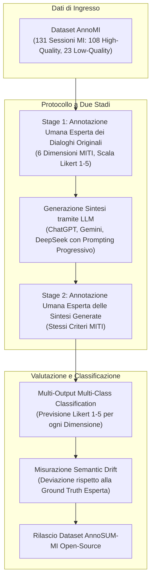
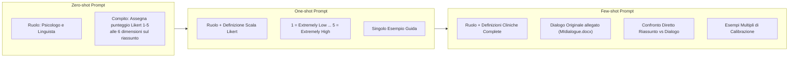
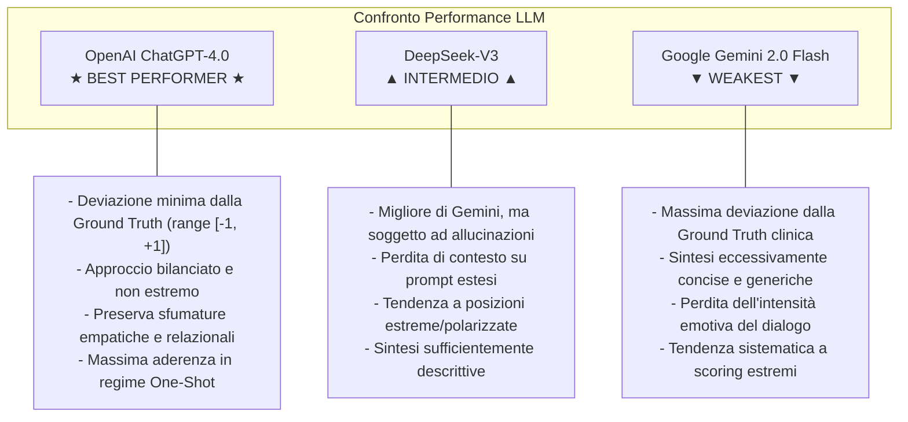

# Mitigating Semantic Drift: Evaluating LLMs' Efficacy in Psychotherapy through MI Dialogue Summarization (Kumar et al., 2025)

**Summary**: Studio empirico che valuta l'efficacia dei Large Language Models (OpenAI ChatGPT-4.0, Google Gemini 2.0 Flash e DeepSeek-V3) nella comprensione, sintesi e annotazione automatizzata di dialoghi di Colloquio Motivazionale (Motivational Interviewing, MI). Gli autori introducono lo schema di annotazione a 6 dimensioni derivato dal framework clinico MITI (Evocation, Collaboration, Autonomy, Direction, Empathy e Non-Judgmental Attitude), rilasciano il dataset annotato da esperti **AnnoSUM-MI** (esteso da AnnoMI), propongono tecniche di *progressive prompting* (zero-shot, one-shot, few-shot) per mitigare la *semantic drift* (deriva semantica) e valutano la fedeltà clinico-contestuale attraverso un task di classificazione multi-output multi-classe su scala Likert 1–5.
**Sources**: `2511.22818v1.pdf` (*arXiv:2511.22818v1 [cs.CL]*, University of the Bundeswehr Munich / Barkatullah University, IJCNN 2025)
**Last updated**: 2026-08-27
---

## Inquadramento e Obiettivi della Ricerca

L'integrazione dei Large Language Models (LLM) nella salute mentale promette di supportare la diagnostica, facilitare le trascrizioni e le sintesi cliniche, e ridurre il carico di lavoro dei terapeuti. Tuttavia, l'applicazione dei modelli generativi in domini a basse risorse (*low-resource*) e altamente sensibili come la psicoterapia incontra ostacoli strutturali:
1. **Scarsità di Dati Clinici Annotati**: A causa di vincoli di privacy (GDPR) e degli elevati costi di annotazione da parte di clinici esperti, i dataset disponibili sono rari e spesso etichettati a livello superficiale (singolo codice per enunciato o diagnosi non validate).
2. **Deriva Semantica (*Semantic Drift*)**: Tendenza dei modelli generativi a deviare progressivamente dal significato originale, dal tono terapeutico, dall'intento o dalle dinamiche relazionali della seduta sorgente.
3. **Inconsistenze, Allucinazioni e Bias**: Mancanza di comprensione innata dei costrutti psicologici, oscillazioni nell'espressione dell'empatia e rischio di rinforzare stereotipi o fornire valutazioni cliniche distorte.

Per affrontare queste criticità, Kumar, Rajawat e Ntoutsi (2025) hanno sviluppato un framework sperimentale su dialoghi di **Colloquio Motivazionale (MI)**, strutturato su tre domande di ricerca (*Research Questions*):
- **RQ1**: *Quanto sono efficaci gli LLM nel sintetizzare accuratamente dialoghi complessi di MI mediante prompt guidati?*
- **RQ2**: *In che misura il prompting one-shot e few-shot migliora la comprensione contestuale e mitiga la deriva semantica?*
- **RQ3**: *Gli LLM sono sufficientemente affidabili per essere impiegati nell'annotazione automatizzata di dataset in contesti clinici sensibili?*

---

## Lo Schema di Annotazione a 6 Dimensioni (MITI Esteso)

Gli autori fondano il loro sistema di valutazione sul codice standard **Motivational Interviewing Treatment Integrity (MITI 4.1)** (Moyers et al., 2014, 2016), arricchendolo con una sesta dimensione fondamentale per la pratica clinica.

Ciascuna dimensione viene misurata su una **scala Likert a 5 punti**:
- **1 (Extremely Low)**: Attributo quasi totalmente assente nella conversazione, minima o nessuna evidenza.
- **2 (Low)**: Attributo debolmente dimostrato, con influenza marginale sulla seduta.
- **3 (Moderate)**: Attributo moderatamente evidente con impatto tangibile sul dialogo.
- **4 (High)**: Attributo fortemente dimostrato che influenza positivamente il processo terapeutico.
- **5 (Extremely High)**: Attributo manifestato in modo eccellente, fattore chiave del successo della seduta.

### Le 6 Dimensioni Cliniche

| Dimensione | Origine | Definizione Operativa nel Framework | Ruolo nella Mitigazione del Drift |
| :--- | :--- | :--- | :--- |
| **1. Evocation** | MITI | Capacità del terapeuta di far emergere le motivazioni intrinseche del paziente al cambiamento (*change talk*), evitando prescrizioni direttive. | Previene che la sintesi trasformi una guida maieutica in istruzioni paternalistiche. |
| **2. Collaboration** | MITI | Relazione paritetica e cooperativa tra clinico e paziente, in contrasto con una postura autoritaria o asimmetrica. | Preserva la reciprocità dell'alleanza terapeutica nel testo riassunto. |
| **3. Autonomy** | MITI | Riconoscimento e supporto dell'indipendenza e dell'autodeterminazione del paziente nel prendere decisioni sul proprio percorso. | Assicura che la sintesi non cancelli l'attribuzione di controllo (*locus of control*) interno del paziente. |
| **4. Direction** | MITI | Guida costruttiva della seduta verso gli obiettivi terapeutici senza rigidità prescrittiva né dispersione tematica. | Mantiene il focus sugli obiettivi clinici senza cadere nel disallineamento conversazionale. |
| **5. Empathy** | MITI | Comprensione profonda e connessione con le emozioni, le prospettive e i vissuti del paziente, favorendo il rapport e la fiducia. | Traccia la sintonizzazione emotiva e previene l'appiattimento affettivo nel riassunto. |
| **6. Non-Judgmental Attitude** | Estensione | Ascolto incondizionato e accogliente, privo di giudizio o bias moralizzante, che evita reazioni difensive nel paziente. | Evita che l'LLM introduca toni stigmatizzanti o minimizzazioni giudicanti dei sintomi. |

---

## Dataset: Da AnnoMI ad AnnoSUM-MI

Lo studio si fonda su **AnnoMI** (Wu et al., 2022, 2023), un dataset conforme al GDPR composto da **131 trascrizioni complete** di colloqui motivazionali annotati da esperti clinici:
- **108 sessioni ad alta qualità (High-Quality MI)**: Dimostrano buone pratiche cliniche, elevata evocazione ed empatia.
- **23 sessioni a bassa qualità (Low-Quality MI)**: Esemplificano errori comuni, direttività impropria, giudizio o assenza di collaborazione.

### Costruzione del Dataset AnnoSUM-MI
1. **Suddivisione Stratificata**: Il dataset è diviso in **Training Set** ($n = 97$: 82 high, 15 low) e **Test Set** ($n = 34$: 26 high, 8 low).
2. **Accordo Inter-Annotatore (*Inter-Rater Reliability*)**: Su un sottoinsieme condiviso di 15 sessioni annotate da più esperti, il valore di **Cohen's Kappa ($\kappa$)** è risultato pari a **0.50 – 0.52**, valore considerato *moderato* nei benchmark statistici (Landis & Koch, 1977) e pienamente in linea con la complessità intrinseca dei compiti di annotazione clinica multi-scala e multi-classe.
3. **Generazione e Doppia Annotazione**: Per ciascuna delle 34 sessioni di test, sono state generate sintesi tramite tre LLM sotto diversi regimi di prompt, sottoponendo le sintesi al medesimo processo di annotazione umana esperta.
4. **Disponibilità Pubblica**: Il dataset risultante **AnnoSUM-MI** è stato rilasciato pubblicamente su GitHub per sostenere la ricerca nei domini *low-resource*.

---

## Prompting Euristico Progressivo e Metodologia Sperimentale

Per guidare gli LLM e contenere la deriva semantica, gli autori hanno testato un'evoluzione progressiva dei prompt:

### Disegno Sperimentale (18 Set di Esperimenti)
- **3 Modelli Testati**: OpenAI ChatGPT (GPT-4.0), Google Gemini (2.0 Flash), DeepSeek (V3).
- **Strategie di Sintesi**: One-shot e Few-shot prompting $\rightarrow$ 6 sintesi generate per ciascuna delle 34 sessioni di test.
- **Classificazione Incrociata**: Ciascun modello è stato testato nella classificazione Likert (1–5) su tutte le 6 serie di sintesi (proprie e degli altri modelli) lungo le 6 dimensioni MITI.
- **Metrica di Valutazione**: Calcolo della **deviazione semantica ($\Delta$)** rispetto alla *ground truth* umana esperta:
  $$\Delta = \text{Score}_{\text{predetto}} - \text{Score}_{\text{ground\_truth}}$$

---

## Risultati Sperimentali e Analisi Comparativa dei Modelli

Data la forte componente qualitativa e soggettiva della psicoterapia, le metriche standard (Accuracy, Precision, Recall, F1) risultano inadeguate. Gli autori hanno quindi analizzato i grafici di densità di punteggio (*score density plots*) e i diagrammi radar della deviazione semantica.

### Sintesi delle Performance per Modello

| Modello | Qualità Sintesi | Deviazione da Ground Truth ($\Delta$) | Gestione Empatia & Sfumature | Robustezza ai Prompt Lunghi |
| :--- | :--- | :--- | :--- | :--- |
| **ChatGPT (GPT-4.0)** | **Alta**: Descrittiva, fedele al tono clinico, bilanciata. | **Minima**: Misclassificazioni confinate tra $-1$ e $+1$. | **Eccellente**: Cattura e riflette i costrutti empatici e non giudicanti. | **Elevata**: Mantiene coerenza tra dialogo e sintesi. |
| **DeepSeek (V3)** | **Media**: Buona ricchezza descrittiva, lievemente polarizzata. | **Moderata**: Polarizzazione su valori estremi della scala Likert. | **Discreta**: Riconosce le dimensioni, ma perde coerenza interna. | **Critica**: Tende a perdere il contesto e a manifestare allucinazioni su prompt lunghi. |
| **Gemini (2.0 Flash)** | **Bassa**: Eccessivamente stringata e riduttiva. | **Massima**: Forte discrepanza sistematica rispetto agli esperti umani. | **Scarsa**: Appiattimento emotivo e interpretazioni estreme. | **Bassa**: Mancanza di dettaglio qualitativo a prescindere dal prompt. |

---

## Risposte alle Domande di Ricerca

### RQ1: Efficacia nella Sintesi Guidata dei Dialoghi MI
Gli LLM sono in grado di generare sintesi clinicamente coerenti solo se vincolati a prompt che esplicitano le dimensioni teoriche di riferimento (MITI). Senza tali vincoli, le sintesi tendono a focalizzarsi esclusivamente sugli aspetti medici/informativi superficiali, ignorando la dimensione relazionale ed emotiva.

### RQ2: Impatto del Prompting Progressivo sulla Deriva Semantica
L'introduzione di strategie **one-shot e few-shot** riduce in modo significativo la deriva semantica, ancorando il modello ai descrittori di comportamento clinico. Tuttavia, all'aumentare della lunghezza del prompt (few-shot con trascrizioni annesse), alcuni modelli (in particolare DeepSeek) manifestano affaticamento da contesto (*context loss*) e allucinazioni, rendendo il regime **one-shot ben calibrato il miglior compromesso operativo**.

### RQ3: Affidabilità degli LLM per l'Annotazione Automatica in Salute Mentale
**Gli attuali LLM non sono ancora sufficientemente affidabili per sostituire l'annotatore umano esperto in modo completamente autonomo.** La presenza di deviazioni sistematiche, la polarizzazione dei punteggi e le differenze architetturali dimostrano che l'IA deve essere impiegata come strumento di supporto all'annotazione (*human-in-the-loop* / data augmentation supervisionata), e non come oracolo diagnostico autonomo.

---

## Limiti Delineati e Prospettive Future

1. **Auto-Valutazione Circolare**: L'impiego degli LLM sia per la generazione delle sintesi che per la loro successiva classificazione può introdurre bias di coerenza interna; gli autori raccomandano future validazioni incrociate indipendenti (*cross-model validation*) con panel umani allargati.
2. **Espansione del Benchmark**: Necessità di estendere la sperimentazione ad altri modelli open-weights e closed-source, integrando ulteriori framework psicoterapeutici oltre al MI (es. CBT, psicoterapia psicodinamica).
3. **Framework di Mitigazione Attiva del Drift**: Sviluppo di meccanismi di controllo in tempo reale (*real-time fidelity checkers*) per correggere le deviazioni semantiche durante la generazione della sintesi.

---

## Riferimenti Bibliografici
- Kumar, V., Rajawat, P. S., & Ntoutsi, E. (2025). Mitigating Semantic Drift: Evaluating LLMs’ Efficacy in Psychotherapy through MI Dialogue Summarization. *arXiv preprint arXiv:2511.22818v1 [cs.CL]*, to appear in *2025 International Joint Conference on Neural Networks (IJCNN)*.
- Moyers, T. B., Rowell, L. N., Manuel, J. K., Ernst, D., & Houck, J. M. (2016). The Motivational Interviewing Treatment Integrity code (MITI 4): Rationale, preliminary reliability and validity. *Journal of Substance Abuse Treatment*, 65, 36–42.
- Wu, Z., Balloccu, S., Kumar, V., Helaoui, R., Reiter, E., Reforgiato Recupero, D., & Riboni, D. (2023). Creation, analysis and evaluation of AnnoMI, a dataset of expert-annotated counselling dialogues. *Future Internet*, 15(3), 110.

---

## Pagine e Concetti Correlati
- [[semantic-drift-in-therapy-llms]]: Analisi teorica ed empirica della deriva semantica nei modelli linguistici applicati alla clinica.
- [[miti-framework-llm-evaluation]]: Il framework Motivational Interviewing Treatment Integrity come metrica di valutazione e allineamento per l'IA.
- [[annosum-mi-dataset]]: Dettagli architetturali, composizione e utilizzo del dataset AnnoSUM-MI.
- [[progressive-prompting-clinical-summarization]]: Tecniche di prompting euristico progressivo per la sintesi e il coding clinico.
- [[motivational-interviewing-dialogue-summarization]]: Stato dell'arte dell'elaborazione automatica del linguaggio applicata al Colloquio Motivazionale.
- [[ctrs-automated-evaluation]]: Valutazione automatizzata della fedeltà terapeutica in CBT mediante scale cliniche standardizzate.
- [[clinical-fidelity-assessment]]: Principi generali di fidelity assessment e behavioral coding in psicoterapia assistita da IA.
- [[human-in-the-reasoning]]: Centralità del giudizio clinico umano nei processi di annotazione e validazione dei modelli generativi.
