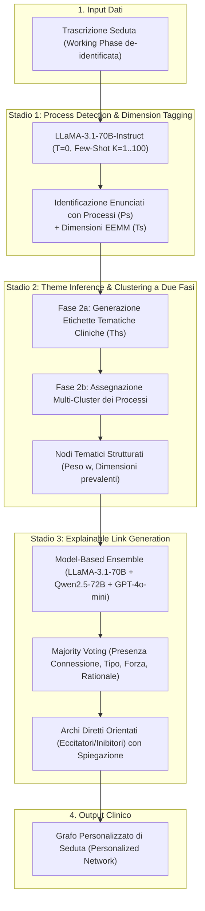

# Using Large Language Models to Create Personalized Networks From Therapy Sessions

## Sintesi dello Studio
- **Autori:** Clarissa W. Ong, Hiba Arnaout, Kate Sheehan, Estella Fox, Eugen Owtscharow, Iryna Gurevych (2025).
- **Preprint / Archivio:** *arXiv:2512.05836v1 [cs.AI]*, 5 Dicembre 2025. Materiali di studio disponibili su OSF: https://osf.io/y3ta6/
- **Obiettivo:** Sviluppare e validare una pipeline end-to-end multi-stadio basata su Large Language Models (LLM) per generare automaticamente reti psicologiche personalizzate a livello di singola seduta (*session-level personalized networks*) a partire dalle trascrizioni dei colloqui terapeutici, supportando la concettualizzazione del caso clinico (*case formulation*) e la pianificazione personalizzata del trattamento nella *Process-Based Therapy* (PBT).

---

## Razionale Clinico e Confronto con i Metodi Tradizionali

La personalizzazione dei trattamenti psicoterapeutici evidence-based rappresenta una delle sfide centrali della psicologia clinica contemporanea, necessaria per superare il "soffitto di efficacia" (*ceiling of efficacy*) e la marcata eterogeneità sintomatica all'interno delle diagnosi sindromiche convenzionali (DSM/ICD).

| Dimensione | Reti Statistiche Tradizionali (EMA) | Reti Personalizzate Generate da LLM |
| :--- | :--- | :--- |
| **Fonte Dati** | Dati idiografici longitudinali intensivi (Ecological Momentary Assessment - EMA) | Trascrizioni testuali delle sedute di psicoterapia (fase di lavoro centrale) |
| **Nodi / Variabili** | Item pre-selezionati fissi da questionari ripetuti più volte al giorno; scarsa variabilità tra pazienti | Temi clinici e processi estratti in modo *bottom-up* dalle verbalizzazioni spontanee del paziente |
| **Connessioni / Archi** | Forza (magnitudo) e direzione stimate statisticamente (modelli vettoriali autoregressivi, GIMME) | Forza, direzione (eccitatoria/inibitoria) e **spiegazioni cliniche testuali** inferite dagli LLM |
| **Carico sul Paziente** | Elevato (compilazione di questionari su app da 4 a 8 volte al giorno per settimane/mesi) | **Nullo** (richiede solo il consenso alla registrazione e trascrizione della seduta) |
| **Carico sul Terapeuta** | Analisi statistiche complesse su serie temporali; definizione a priori delle variabili | Trascrizione e de-identificazione automatizzata; revisione clinica del grafo |
| **Assunzioni Statistiche** | Richiede stazionarietà delle serie temporali ed elevata potenza statistica (60–100+ punti per individuo) | Nessuna assunzione di stazionarietà; tolleranza alla complessità qualitativa del discorso |

---

## Dataset e Annotazione di Riferimento

- **Campione Clinico:** 77 trascrizioni di sedute di psicoterapia da 1 ora ciascuna (durata da 6 a 16 sedute per paziente, media = 12.8), relative a 6 pazienti (1 con Disturbo Depressivo Maggiore - MDD, 5 con Disturbo d'Ansia Generalizzata - GAD) trattati da 2 psicoterapeuti nell'ambito di un trial clinico PBT (Ong et al., 2025).
- **Fase Analizzata:** Segmento di 15 minuti della fase centrale (*working phase*, compreso tra i primi colloqui di apertura e gli ultimi 5 minuti di sintesi/chiusura), selezionato in quanto momento a maggiore densità di esplorazione emotiva e intervento sui processi.
- **Trascrizione e Privacy:** Eseguita con OpenAI Whisper (WER 99% di accuratezza per sedute in presenza) e Webex Captioning (WER 97% per sedute online); diarizzazione tramite Nvidia NeMo MSDD. Tutti i dati identificativi (nomi, familiari, luoghi, date) sono stati sostituiti con token anonimizzati (`[HUSBAND]`, `[HOMETOWN]`, `[YEAR]`).
- **Ground Truth Esperto:** 3 esperti clinici (1 psicologo abilitato, 2 dottorandi in Psicologia Clinica) hanno annotato in doppio cieco 8.028 enunciati (*utterances*). Sono stati identificati **3.364 enunciati contenenti processi psicologici**, classificati secondo le dimensioni dell'*Extended Evolutionary Meta-Model* (EEMM; Hayes et al., 2020):
  - *Accordo inter-valutatore:* $\kappa = 0.58$ per la decisione binaria (processo vs. non processo) e $\kappa = 0.55$ per l'assegnazione delle dimensioni EEMM.

---

## Architettura della Pipeline Multi-Stadio

### 1. Stadio 1: Identificazione e Categorizzazione dei Processi
- **Task:** Classificazione congiunta a livello di singola utterance (con contesto di $\pm 2$ enunciati adiacenti):
  1. *Classificazione Binaria:* presenza/assenza di un processo psicologico clinicamente rilevante.
  2. *Classificazione Multi-Label:* assegnazione a una o più dimensioni EEMM (*Affect, Cognition, Attention, Motivation, Sense of Self, Overt Behavior, Context/Moderators, Sociocultural, Biophysiological*).
- **Modello:** LLaMA-3.1-70B-Instruct locale a temperatura 0.
- **Risultati:** Il *few-shot prompting* ($K=1, 5, 10, 50, 100$) ha superato nettamente la baseline zero-shot ($+15\%$ di precisione nel rilevamento e $+8\%$ nella classificazione dimensionale), identificando oltre il **90%** di tutti i processi reali presenti nel corpus.

### 2. Stadio 2: Inferenza dei Temi Clinici e Clustering
- **Strategia a Due Fasi (*Two-Step Prompt-Based Clustering*):**
  - *Passo 2a:* Generazione di un insieme di etichette tematiche concise basate sui processi e sul contesto della seduta, formulate come funzioni, conflitti o pattern psicologici latenti (es. *"Tensione tra desiderio di indipendenza e obblighi verso la famiglia"*).
  - *Passo 2b:* Assegnazione controllata di ciascun processo a uno o più cluster tematici (il 60% dei processi è stato assegnato a cluster multipli, riflettendo la natura multidimensionale del comportamento umano).
- **Framework di Valutazione Esperta:**
  - *Insightfulness (Peso 0.60):* Clinical Relevance (0.25), Novelty (0.20), Usefulness (0.15).
  - *Trustworthiness (Peso 0.40):* Specificity (0.10), Coverage (0.10), Completeness (0.08), Intrusiveness (0.07), Redundancy (0.05).
- **Risultati:** La strategia two-step ha sovraperformato l'approccio single-step in tutte le metriche, raggiungendo un punteggio finale aggregato di **2.21 / 3.00 (74%)**, con picchi del **75% per Novelty** e **74% per Usefulness**.

### 3. Stadio 3: Generazione di Connessioni Spiegate (*Explainable Links*)
- **Strategia di Ensemble Prompting:** Per inferire connessioni dirette tra coppie di temi ($A \rightarrow B$ e $B \rightarrow A$), sono state confrontate tre architetture di ensemble a maggioranza (*majority voting*):
  1. *Prompt-based ensemble:* LLaMA-3.1 a temperatura 0 con prompt zero-shot, 1-shot e few-shot.
  2. *Temperature-based ensemble:* LLaMA-3.1 con temperature $T \in \{0.0, 0.5, 1.0\}$.
  3. *Model-based ensemble:* Ensemble multi-modello che aggrega **LLaMA-3.1-70B-Instruct**, **Qwen2.5-72B-Instruct** e **GPT-4o-mini**.
- **Caratteristiche delle Connessioni:**
  - *Tipo:* Eccitatorio (*excitatory* - amplifica o rinforza) o Inibitorio (*inhibitory* - sopprime o attenua).
  - *Intensità:* Strong, Moderate, Weak.
  - *Spiegazione clinica:* Sintesi causale concisa (es. *"Un forte dovere verso la famiglia può superare la paura della stagnazione"*).
- **Preferenza degli Esperti:** L'ensemble basato su modelli eterogenei (*Model-based*) è risultato nettamente il più apprezzato dagli psicologi: **77.0% di preferenza per Chiarezza**, **52.7% per Qualità delle Connessioni**, **45.9% per Insight Terapeutico**.

---

## Confronto Clinico: Pipeline Multi-Stadio vs. Prompt Diretto (Baseline)

Il confronto cieco tra la pipeline multi-stadio e una baseline a singolo prompt diretto (*direct prompting single-shot*) su tutte le 77 sedute ha dimostrato la netta superiorità della decomposizione gerarchica del ragionamento:

| Criterio di Valutazione Clinica | Preferenza Pipeline Multi-Stadio | Preferenza Baseline Diretta | Accordo Inter-Valutatore ($\kappa$) |
| :--- | :---: | :---: | :---: |
| **Utilità per la Pianificazione del Trattamento** | **92.4%** | 7.6% | $\kappa = 0.79$ (Sostanziale) |
| **Rilevanza e Significato Clinico dei Temi** | **89.4%** | 10.6% | $\kappa = 0.62$ (Sostanziale) |
| **Qualità e Coerenza delle Connessioni** | **77.3%** | 22.7% | $\kappa = 0.44$ (Moderato) |

---

## Implicazioni Cliniche e Metodologiche

1. **Analisi Funzionale e Formulazione del Caso Bottom-Up:**
   - La pipeline estrae i processi psicologici latenti direttamente dalle parole del paziente, identificando dinamiche che potrebbero sfuggire sia a questionari pre-strutturati sia a sintesi cliniche superficiali.
   - Permette al terapeuta di individuare i nodi centrali del network (es. senso di colpa, credenze di incapacità, evitamento) su cui concentrare gli interventi CBT o ACT a più alto impatto terapeutico.
2. **Supervisione Clinica e Formazione dei Tirocinanti:**
   - I modelli di rete generati offrono un potente strumento didattico: i clinici in formazione possono confrontare la propria concettualizzazione del caso con la mappa prodotta dall'IA, identificando omissioni, bias attentivi o interpretazioni alternative.
3. **Preservazione della Privacy e Sovranità dei Dati:**
   - L'impiego prioritario di LLM open-source (LLaMA-3.1-70B) eseguibili in locale combinato con l'anonimizzazione preventiva garantisce la piena conformità ai requisiti etici e normativi di riservatezza dei dati sanitari.
4. **Modello Centauro e Presidio Umano:**
   - Il grafo generato non sostituisce il giudizio clinico né formula decisioni autonome: funge da ipotesi funzionale euristica (*clinical decision support*) che il terapeuta valida, modifica e condivide collaborativamente con il paziente.

---

## Riferimenti Bibliografici
- Ong, C. W., Arnaout, H., Sheehan, K., Fox, E., Owtscharow, E., & Gurevych, I. (2025). Using Large Language Models to Create Personalized Networks From Therapy Sessions. *arXiv preprint arXiv:2512.05836v1*. https://doi.org/10.48550/arXiv.2512.05836
- Hayes, S. C., Hofmann, S. G., & Ciarrochi, J. (2020). A process-based approach to psychological diagnosis and treatment: The conceptual and treatment utility of an extended evolutionary meta model. *Clinical Psychology Review*, 82, Article 101908. https://doi.org/10.1016/j.cpr.2020.101908
- Hofmann, S. G., & Hayes, S. C. (2019). The future of intervention science: Process-based therapy. *Clinical Psychological Science*, 7(1), 37–50. https://doi.org/10.1177/2167702618772296
- Ong, C. W., Sheehan, K., Mann, A. J., & Fox, E. (2025). Examining the effects of process-based therapy: A multiple baseline study. *Journal of Contextual Behavioral Science*, 35, 100875. https://doi.org/10.1016/j.jcbs.2025.100875

---

## Pagine Correlate
- [[personalized-networks-in-psychotherapy]]
- [[extended-evolutionary-meta-model]]
- [[llm-case-conceptualization-pipeline]]
- [[ensemble-prompting-in-clinical-nlp]]
- [[process-based-therapy]]
- [[process-of-change]]
- [[ai-clinical-decision-support]]
- [[modello-centauro-clinico]]
