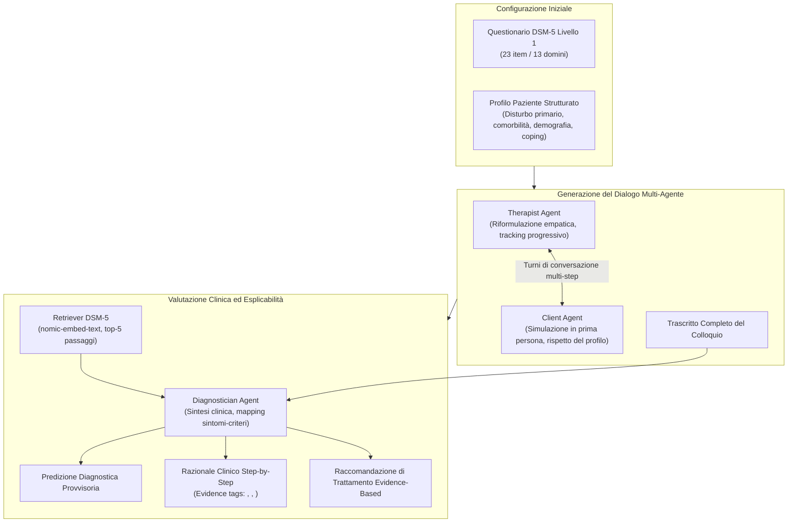
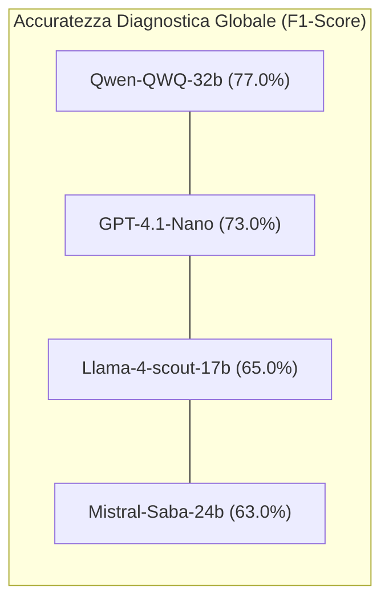

# Trustworthy AI Psychotherapy: Multi-Agent LLM Workflow for Counseling and Explainable Mental Disorder Diagnosis (Ozgun et al., 2025)

**Summary**: Lo studio introduce **DSM5AgentFlow**, un framework multi-agente basato su Large Language Models (LLM) per la simulazione e la somministrazione automatizzata del questionario diagnostico *DSM-5 Level-1 Cross-Cutting Symptom Measure*, accoppiato a un motore diagnostico RAG-grounded capace di generare diagnosi psichiatriche provvisorie e razionali clinici esplicabili e tracciabili. Il benchmark comparativo su 8.000 dialoghi simulati con quattro modelli (Llama-4-scout-17b, Mistral-Saba-24b, Qwen-QWQ-32b e GPT-4.1-Nano) evidenzia un trade-off cruciale: i modelli conversazionali eccellono nel realismo dialogico ed empatico, mentre i modelli specializzati nel ragionamento logico (Qwen-QWQ-32b) ottengono una netta superiorità nell'accuratezza diagnostica (F1 = 77%) e nell'ancoraggio strutturato ai criteri del DSM-5.
**Sources**: `2508.11398v2.pdf` (*CIKM '25: Proceedings of the 34th ACM International Conference on Information and Knowledge Management*, Seoul, Republic of Korea, November 10–14, 2025. ACM, New York, NY, USA, 10 pages. DOI: 10.1145/3746252.3761164)
**Last updated**: 2026-08-27
---

## Inquadramento Generale e Problema

L'integrazione degli agenti basati su LLM ([[large-language-models]]) nella salute mentale affronta ostacoli metodologici, etici e clinici rilevanti:
1. **Scarsità e Riservatezza dei Dati Clinici**: L'accesso a trascrizioni reali di colloqui clinici è vincolato da stringenti norme sulla privacy e requisiti etici/IRB, limitando la riproducibilità e la scalabilità della ricerca.
2. **Opacità e Mancanza di Trasparenza Diagnostica**: I tradizionali strumenti di screening (come il questionario DSM-5 Livello 1) calcolano punteggi sintetici che i pazienti percepiscono spesso come una "scatola nera", riducendo la fiducia epistemica e l'ingaggio terapeutico. Inoltre, i modelli di NLP convenzionali emettono etichette diagnostiche opache (*black-box*), prive di giustificazione clinica esplicabile.
3. **Incapacità di Emulare la Conduzione Clinica Proattiva**: I modelli generativi non strutturati falliscono spesso nella comprensione multi-turno e non riescono a condurre un'intervista clinica adattiva ed empatica senza giungere a conclusioni premature o deviare dalle linee guida diagnostiche.

Per colmare questi divari, Ozgun e colleghi (2025) propongono **DSM5AgentFlow**, il primo workflow multi-agente progettato per condurre l'intero ciclo di colloquio di screening DSM-5 e generare valutazioni cliniche esplicabili e auditabili.

---

## Architettura del Workflow DSM5AgentFlow

Il sistema opera orchestrando tre agenti specializzati con prompt rigidamente vincolati:

### 1. Therapist Agent (Agente Terapeuta)
- **Funzione**: Somministra i 23 item del questionario *DSM-5 Level-1 Cross-Cutting Symptom Measure* esplorando 13 domini sintomatologici (Depressione, Rabbia, Mania, Ansia, Sintomi Somatici, Ideazione Suicidaria, Psicosi, Disturbi del Sonno, Memoria, Pensieri e Comportamenti Ripetitivi, Dissociazione, Funzionamento di Personalità, Uso di Sostanze).
- **Controllo e Tracking**: Implementa un algoritmo di tracking dinamico che seleziona l'item pendente, lo riformula in un linguaggio caldo, empatico e naturale, verifica la sufficienza della risposta del paziente e prosegue fino alla copertura completa dei domini.
- **Vincoli Deontologici del Prompt**: Divieto categorico di fare ipotesi diagnostiche anticipate, rassicurazione esplicita sulla confidenzialità e mantenimento del tono clinico professionale.

### 2. Client Agent (Agente Paziente Simulato)
- **Funzione**: Incarna un profilo clinico predefinito configurato tramite file esterni (che definiscono disturbo principale, modificatori di comorbilità, età, genere, eventi di vita recenti e stile di coping).
- **Vincoli Comportamentali**: Risponde rigorosamente in prima persona; non svela mai la propria diagnosi né cita il ruolo di IA; esprime sintomi ed emozioni autentiche con richiesta d'aiuto; garantisce consistenza narrativa lungo tutto il dialogo.

### 3. Diagnostician Agent (Agente Diagnosta)
- **Fase 1: Retrieval-Augmented Generation (RAG)**: Interroga il corpus canonico del DSM-5 recuperando i top-5 passaggi pertinenti (tramite modello `nomic-embed-text`, chunk da 512/1024 token) per ancorare la decisione ai criteri formali.
- **Fase 2: Predizione e Razionale Step-by-Step**: Produce una catena di ragionamento logico esplicito che collega le evidenze dialogiche ai criteri diagnostici specifici (es. Criteri A–E del DSM-5). Utilizza marcatori XML standardizzati:
  - `<sym>`: sintomi estratti dal colloquio.
  - `<quote>`: citazioni verbatim delle risposte del paziente.
  - `<med>`: nosografia, diagnosi differenziali e condizioni mediche.
- **Fase 3: Raccomandazioni Terapeutiche**: Formula indicazioni evidence-based per i passi assistenziali successivi calibrate sul profilo specifico del paziente.

---

## Setup Sperimentale e Dataset

- **Dataset Generato**: 8.000 trascrizioni complete di colloqui diagnostici (2.000 per ciascuno dei 4 LLM valutati), coprendo 10 categorie diagnostiche primarie:
  1. *Adjustment Disorder* (Disturbo dell'Adattamento)
  2. *Anxiety* (Disturbo d'Ansia Generalizzata)
  3. *Bipolar Disorder* (Disturbo Bipolare)
  4. *Depression* (Depressione Maggiore)
  5. *OCD* (Disturbo Ossessivo-Compulsivo)
  6. *Panic Disorder* (Disturbo di Panico)
  7. *PTSD* (Disturbo da Stress Post-Traumatico)
  8. *Schizophrenia / Schizophreniform* (Spettro della Schizofrenia)
  9. *Social Anxiety Disorder* (Ansia Sociale)
  10. *Substance Abuse* (Disturbo da Uso di Sostanze)
- **Infrastruttura di Inferenza**: Parallelizzazione su 4 thread con logica di retry a backoff esponenziale (riduzione dei tempi da 100 ore seriali a circa 24 ore). Supporto locale tramite Ollama e cloud tramite Groq / OpenAI.
- **Modelli Valutati**:
  - *Modelli Conversazionali*: Meta Llama-4-scout-17b, Mistral-Saba-24b, OpenAI GPT-4.1-Nano.
  - *Modello di Ragionamento (Reasoning LLM)*: Qwen-QWQ-32b.

---

## Risultati Chiave e Benchmark

### 1. Qualità del Dialogo e Realismo Conversazionale (RQ1)
- **Coerenza e Leggibilità NLP**: BERTScore compreso tra 50.68% e 54.87%. Llama-4 ottiene il miglior indice di leggibilità Flesch Reading Ease (FRE = 61.67, "Plain English"), mentre gli altri modelli si attestano su registri più complessi (FRE 49.58–53.81).
- **Valutazione con Rubrica LLM (scala 1–5)**:
  - **Llama-4-scout-17b** e **Mistral-Saba-24b** primeggiano su empatia, consistenza e fluidità clinica (medie da **4.26 a 4.41 / 5**).
  - **Qwen-QWQ-32b** mostra una qualità conversazionale inferiore di circa il 9.23% (medie tra 3.64 e 4.23 / 5).
  - **GPT-4.1-Nano** ottiene prestazioni marcatamente insufficienti sul piano conversazionale (medie 1.89–2.54 / 5, -48.91% rispetto ai top model).

| Modello | BERTScore | FRE (↑) | FKG (↓) | GFI (↓) | Rubrica Media (1-5) |
| :--- | :---: | :---: | :---: | :---: | :---: |
| **Llama-4-scout-17b** | 50.77% | **61.67** | **7.01** | **3.87** | **4.38** |
| **Mistral-Saba-24b** | 51.30% | 49.58 | 8.99 | 4.35 | **4.32** |
| **Qwen-QWQ-32b** | 50.68% | 51.10 | 8.70 | 4.21 | 3.94 |
| **GPT-4.1-Nano** | **54.87%** | 53.81 | 8.96 | 5.23 | 2.18 |

---

### 2. Accuratezza Diagnostica e Pattern di Errore (RQ2)

- **Superiorità dei Modelli di Ragionamento**: **Qwen-QWQ-32b** ottiene le prestazioni più elevate con un'accuratezza del **70%**, Recall del **72%** e **F1-Score del 77%**. GPT-4.1-Nano segue con F1 del 73% e la precisione più alta (83%). Llama-4 e Mistral-Saba ottengono F1 pari al 65% e 63%.
- **Prestazioni per Categoria Diagnostica (F1-Score)**:
  - *Disturbi ad Alta Accuratezza (>85-98%)*: Panico, PTSD, Ansia Sociale, OCD e Ansia Generalizzata sono classificati con successo da quasi tutti i modelli (GPT-4.1-Nano raggiunge il 98.53% su PTSD).
  - *Aree Critiche di Sovrapposizione Sintomatica*:
    - **Adjustment Disorder**: Difficoltà quasi totale per i modelli conversazionali (<3% di F1 per Llama-4, Mistral-Saba e GPT-4.1-Nano), mentre solo Qwen-QWQ raggiunge il 40.25%.
    - **Depressione Maggiore**: F1 compreso tra il 36.75% e il 67.98%.
- **Pattern di Misclassificazione (Confusion Matrix)**:
  - Il Disturbo dell'Adattamento viene sistematicamente confuso con la Depressione.
  - Il Disturbo Bipolare viene frequentemente etichettato come Depressione.
  - L'Ansia Sociale e l'Uso di Sostanze confluiscono spesso rispettivamente in Ansia Generalizzata e Depressione.
  - *Motivazione clinica*: Il questionario di screening DSM-5 Livello 1 manca della granularità temporale e anamnestica necessaria per discriminare quadri clinici con forte sovrapposizione sintomatica.

---

### 3. Segnali di Esplicabilità e Trasparenza Clinica (RQ3)

L'analisi qualitativa e quantitativa delle catene di ragionamento (Tabella 4 dell'articolo) rivela marcate differenze tra le architetture:

| Modello | N. Tag `<sym>` | N. Tag `<quote>` | Clausole DSM (A–E) | Struttura a Step | Profilo di Esplicabilità |
| :--- | :---: | :---: | :---: | :---: | :--- |
| **Qwen-QWQ-32b** | 11 | 4 | **Sì (A–E)** | **Sì (Numerata)** | **Ottimale**: Razionale in 5 punti, citazioni tracciabili, collegamento esplicito a clausole DSM-5. |
| **Mistral-Saba-24b** | 7 | 2 | Sì (A–E) | No | **Media**: Testo continuo non strutturato a step; richiede inferenze al revisore umano. |
| **Llama-4-scout-17b** | 4 | 0 | No | No | **Opaca (Black-box)**: Diagnosi emessa senza citazioni letterali né richiamo formale ai criteri. |
| **GPT-4.1-Nano** | **29** | 0 | No | No | **Ipertaggata ma Disorganizzata**: Molti tag sintomatici ma priva di passi logici e riferimenti a clausole. |

---

## Il Trade-Off Conversazione vs Ragionamento nei Sistemi Clinici

L'evidenza principale dello studio è la divergenza di capacità tra modelli linguistici specializzati:
- I modelli focalizzati sulla **generazione fluida e conversazionale** (come Llama-4 e Mistral-Saba) riescono a condurre colloqui caldi, naturali ed empatici, ma falliscono nell'inferenza diagnostica deduttiva rigorosa.
- I modelli ottimizzati per il **ragionamento logico passo-passo (Reasoning LLMs)** come Qwen-QWQ dimostrano una capacità superiore nel mappare le evidenze sui criteri formali del DSM-5, ma risultano più rigidi e meno empatici nella conversazione spontanea.
- **Implicazione Architetturale**: L'efficacia nei sistemi di salute mentale richiede un'**architettura multi-agente eterogenea**, in cui modelli conversazionali guidano il colloquio relazionale (Therapist/Client) e modelli di ragionamento con RAG governano la diagnosi e la formulazione clinica (Diagnostician).

---

## Aspetti Etici, Deontologici e Limitazioni

1. **Dati Esclusivamente Sintetici**: L'assenza di pazienti reali elimina rischi di privacy immediati ma impone la validazione ecologica con clinici e soggetti umani prima di qualsiasi applicazione pratica.
2. **Natura Non-Medica del Sistema**: DSM5AgentFlow è concepito come strumento di ricerca per la trasparenza e il benchmarking dell'Explainable AI (XAI), non come dispositivo medico diagnostico autonomo.
3. **Limiti di Granularità dello Screening**: I questionari di triage rapido mostrano limiti strutturali nel differenziare disturbi complessi o con comorbilità multiple.

---

## Riferimento Bibliografico
- Ozgun, M. C., Pei, J., Hindriks, K., Donatelli, L., Liu, Q., & Wang, J. (2025). Trustworthy AI Psychotherapy: Multi-Agent LLM Workflow for Counseling and Explainable Mental Disorder Diagnosis. In *Proceedings of the 34th ACM International Conference on Information and Knowledge Management (CIKM ’25)*, November 10–14, 2025, Seoul, Republic of Korea. ACM, New York, NY, USA, 10 pages. https://doi.org/10.1145/3746252.3761164

---

## Pagine Correlate
- [[dsm5agentflow]]: Architettura e dinamiche del workflow multi-agente per lo screening clinico.
- [[explainable-mental-disorder-diagnosis]]: Metodologie di trasparenza, tagging clinico e razionali diagnostici step-by-step.
- [[trade-off-conversazione-ragionamento-llm]]: Analisi del divario prestazionale tra modelli conversazionali e modelli di ragionamento nell'IA clinica.
- [[synthetic-clinical-dialogues]]: Generazione controllata di dialoghi sintetici per la ricerca psicoterapeutica e il superamento della scarsità dei dati.
- [[simulazione-pazienti-ai]]: Metodologie generali di modellizzazione dei pazienti virtuali.
- [[rag-in-psicoterapia]]: Integrazione di database clinici vincolanti mediante Retrieval-Augmented Generation.
- [[human-in-the-reasoning]]: Supervisione clinica attiva ed esplicabilità del processo diagnostico.
- [[three-layer-governance-framework]]: Quadro etico e regolatorio per l'impiego dell'IA in salute mentale.
- [[ai-assisted-psychotherapy]]: Panoramica generale sull'IA in psicoterapia.
