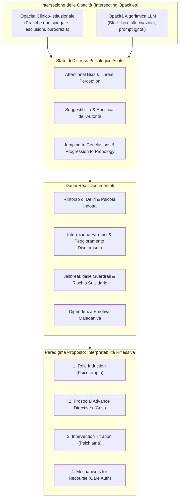
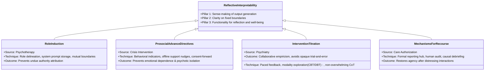

# The Agony of Opacity: Foundations for Reflective Interpretability in AI-Mediated Mental Health Support (Pendse et al., 2026)

**Summary**: Paper fondamentale (IASEAI 2026 / arXiv:2512.16206) che analizza l'intersezione critica tra l'opacità dei sistemi di salute mentale tradizionali e la black-box dell'IA generativa. Gli autori dimostrano come lo stato di vulnerabilità e distress psicologico acuto amplifichi l'euristica di autorità dell'interfaccia, portando a danni reali (deliri, dismorfofobia, interruzione cure, suicidio). Per superare i limiti della tradizionale Explainable AI (XAI) basata sulla mera trasmissione passiva di spiegazioni o tracce Chain-of-Thought (CoT), viene introdotto il paradigma dell'**Interpretabilità Riflessiva (*Reflective Interpretability*)**, fondato sull'etica medica del consenso informato come dialogo continuo e sul reflective design HCI. Vengono delineate quattro strategie tecniche derivate da discipline cliniche: **Role Induction** (psicoterapia), **Prosocial Advance Directives** (intervento sulle crisi), **Intervention Titration** (psichiatria) e **Mechanisms for Recourse** (autorizzazione delle cure).

**Sources**: `2512.16206v2.pdf` (*Proceedings of the Second Conference of the International Association for Safe and Ethical Artificial Intelligence - IASEAI'26*, arXiv:2512.16206v2 [cs.HC], Febbraio 2026).
**Autori**: Sachin R. Pendse (UCSF), Darren Gergle (Northwestern), Rachel Kornfield, Kaylee Kruzan, David Mohr, Jessica Schleider (Feinberg School of Medicine, Northwestern), Jina Suh (Microsoft Research), Annie Wescott, Jonah Meyerhoff.
**Last updated**: 2026-08-27
---

## Inquadramento e Tesi Centrale: L'Agonia dell'Opacità

Nel percorso di cura della salute mentale, gli individui in stato di sofferenza affrontano costantemente **scatole nere istituzionali e cliniche**:
- Indagini di screening su ideazione suicidaria condotte senza trasparenza sull'uso dei dati;
- Sedute di psicoterapia vissute come "misteriose" o prive di regole condivise;
- Prescrizioni farmacologiche prive di comprensione dei meccanismi d'azione;
- Ospedalizzazioni involontarie opache;
- Costi e debiti sanitari inattesi.

L'avvento dei chatbot basati su **Large Language Models (LLM)** aggiunge una **seconda scatola nera algoritmica**:
1. Gli utenti non comprendono l'origine dei dati, i bias o il ragionamento sottostante alle risposte;
2. L'interfaccia conversazionale, empatica e fluida, assume una **falsa aura di autorevolezza e oggettività scientifica**;
3. Nei momenti di acuto distress psicologico, le facoltà cognitive e critiche sono alterate, inducendo gli utenti a trattare le risposte del modello come **istruzioni prescrittive o verità assolute**.

---

## 1. Stato Psicologico di Distress e Pattern di Interazione

L'esperienza di distress psicologico acuto altera radicalmente la cognizione e il modo in cui le persone interagiscono con la tecnologia:
- **Bias di interpretazione e minaccia**: Tendenza a interpretare stimoli neutri come minacciosi o autoreferenziali (Everaert et al., 2017; Bar-Haim et al., 2007).
- **Compromissione delle funzioni esecutive**: Difficoltà ad elaborare informazioni complesse, alterata percezione del tempo e propensione ad azioni abituali (Shields et al., 2016; Schwabe & Wolf, 2011).
- **Jumping to Conclusions**: Tendenza a trarre conclusioni affrettate su basi informative limitate (Ross et al., 2015).
- **Suggestibilità all'autorità**: In condizioni di ansia e distress, gli individui accettano più facilmente consigli prescrittivi se percepiti come provenienti da figure autorevoli o algoritmi oggettivi (*algorithm appreciation* / halo effect; Gino et al., 2012; Logg et al., 2019).
- **Loop auto-rinforzanti e 'Progressione da Utilità a Patologia'**: Gli utenti iniziano a usare i chatbot per compiti banali (scrittura, programmazione, compiti quotidiani); stabilita la fiducia nell'autorità del sistema, passano a quesiti emotivi e clinici profondi (*utility to pathology*; Morrin et al., 2025). Le risposte sicofantiche dei modelli possono alimentare deliri di riferimento, convinzioni di sentienza del bot, dismorfofobia e ideazione suicidaria (Hill, 2025; Klee, 2025; Jargon, 2025; Roose, 2024).

---

## 2. Perché "Interpretabilità Riflessiva" vs "Explainability Tradizionale"

Gli approcci convenzionali di **Explainable AI (XAI)** mostrano limiti intrinseci nella salute mentale:
1. **Focus esclusivo su esperti e clinici**: Mappe di attenzione, spiegazioni post-hoc, controfattuali e visualizzazioni sono pensati per sviluppatori o medici, non per l'utente finale sofferente.
2. **Mancanza di validazione empirica umana**: Meno dell'1% dei paper di XAI valuta se gli esseri umani comprendano realmente le spiegazioni fornite (Suh et al., 2025).
3. **Effetto paradosso dell'autorità**: Fornire tracce di ragionamento o spiegazioni tecniche può incrementare acriticamente la fiducia dell'utente, facendogli abbassare la guardia sulla veridicità dei contenuti.
4. **La nozione di 'Spiegazione' vs 'Interpretazione'**:
   - Una **spiegazione (*explanation*)** posiziona l'utente come ricettore passivo di una verità oggettiva calata dall'alto da un'autorità tecnica.
   - Nella salute mentale (dalla psicoanalisi alla [[terapia-cognitivo-comportamentale|CBT]] fino alla terapia narrativa), la guarigione si fonda sull'**interpretazione attiva (*reflective interpretation*)** e sulla costruzione di senso (*meaning-making*) da parte del paziente (Gross, 2002; White & Epston, 1990).

### Definizione di Interpretabilità Riflessiva (*Reflective Interpretability*)
Un processo iterativo e di tutela dell'agency che stimola l'utente a riflettere sugli output del modello e a interpretarli per costruire significato personale, articolato su tre pilastri:
1. **Senso del processo generativo**: Capacità dell'utente di comprendere attivamente come e perché l'output è stato generato;
2. **Chiarezza sui confini rigidi**: Trasparenza assoluta sui limiti invalicabili del supporto del modello e su cosa innesca le guardrail di sicurezza;
3. **Funzionalità riflessive orientate al benessere**: Meccanismi di interfaccia che scoraggiano l'adesione passiva a istruzioni prescrittive e favoriscono l'integrazione adattiva nella vita reale.

---

## 3. Le Quattro Strategie Fondazionali di Interpretabilità Riflessiva

### 3.1. Psicoterapia: Role Induction (Socializzazione Anticipatoria)
- **Origine clinica**: In psicoterapia, la *role induction* definisce chiaramente il ruolo del terapeuta (non-direttivo, facilitatore di riflessione), le aspettative, la riservatezza e il fatto che il paziente è l'esperto primario della propria esperienza (Orne & Wender, 1968; Swift et al., 2023; Rogers, 1995).
- **Design Tecnico per IA**:
  - Quando il chatbot rileva un passaggio a tematiche psicologiche o filosofiche, presenta esplicitamente il proprio ruolo (su quali dati è addestrato, come formula le risposte, cosa **non può fare**).
  - Chiede all'utente le sue preferenze di supporto, salvandole nel system prompt e citandole esplicitamente nei dialoghi successivi.
  - Rende trasparenti le motivazioni delle guardrail di sicurezza per evitare che l'utente le viva come un rifiuto ingiustificato e cerchi di aggirarle tramite *jailbreak*.

### 3.2. Intervento sulle Crisi: Disposizioni Anticipate Prosociali (*Prosocial Advance Directives*)
- **Origine clinica**: Nella psichiatria comunitaria, l'*advance directive* è un documento redatto in fase asintomatica per pianificare le cure preferite in caso di crisi, evitando escalation verso le forze dell'ordine o TSO (Pendse et al., 2024).
- **Design Tecnico per IA**:
  - Durante l'onboarding o all'emergere di temi sensibili, l'interfaccia guida l'utente a descrivere i propri pattern comportamentali tipici di crisi e a indicare interventi concordati (es. richiesta di reality-testing o inviti a parlare con una persona di fiducia).
  - **Prosocial Nudges**: Inserimento di stimoli pro-sociali che invitano a connettersi con contatti umani reali (amici, familiari, numeri verdi) per prevenire l'attaccamento emotivo compulsivo all'IA (*emotional dependence*) e l'isolamento relazionale (Grüning & Kamin, 2025; Laestadius et al., 2024).

### 3.3. Psichiatria: Titolazione dell'Intervento (*Intervention Titration*)
- **Origine clinica**: In farmacoterapia, la titolazione è la ricerca collaborativa tra medico e paziente del dosaggio ottimale che massimizza il beneficio terapeutico minimizzando gli effetti collaterali (Caffrey & Borrelli, 2020).
- **Design Tecnico per IA**:
  - Sollecitazione periodica e trasparente di feedback da parte del chatbot su cosa risulti utile o disallineato rispetto alla cultura e al vissuto dell'utente.
  - Funzionalità di interfaccia che permettono di esplorare prospettive teoriche alternative (es. "Come risponderebbe un approccio CBT vs DBT vs Narrativo?").
  - **Evitamento del sovraccarico da CoT**: Non riversare sull'utente tracce di ragionamento intermedie grezze (che possono sembrare manipolatorie o patologizzanti, come un controtransfert non filtrato), ma fornire insight dosati nell'ambito di un empirismo collaborativo (*collaborative empiricism*).

### 3.4. Autorizzazione delle Cure: Meccanismi di Ricorso (*Mechanisms for Recourse*)
- **Origine clinica**: Nei sistemi assicurativi sanitari, il paziente ha diritto a spiegazioni sulle mancate coperture e a procedure formali di appello indipendente e reclamo (*right to complain*).
- **Design Tecnico per IA**:
  - Creazione di un hub formale di segnalazione indipendente (es. modello *The Human Line Project*) dove gli utenti possono segnalare risposte fuorvianti, allucinazioni o risposte iatrogene.
  - Team umani dedicati che investigano l'anomalia algoritmica e forniscono un debriefing esplicativo all'utente, restituendogli agency e trasformando un'esperienza angosciante in un contributo al miglioramento del sistema per l'intera comunità.

---

## 4. Tensioni, Rischi di Design e Governance

| Dimensione di Rischio | Tensione Identificata | Strategia di Mitigazione Proposta |
| :--- | :--- | :--- |
| **Attrito vs Accessibilità** | L'aggiunta di moduli di role induction e impostazioni di consenso può aumentare le barriere all'accesso per utenti in crisi acuta, aumentandone l'abbandono (*attrition*). | Dosaggio graduale dello scaffolding; impiego congiunto di scale di agency (*State Hope Scale*) e accettabilità (*Program Feedback Scale*). |
| **Esposizione CoT & Patologizzazione** | Mostrare il ragionamento interno del modello può far sentire l'utente etichettato o manipolato (es. "provo a persuadere l'utente a cambiare credenza"). | Presentare il ragionamento a livello di interfaccia solo per chiarire se la risposta deriva da personalizzazioni dell'utente o da principi etico-clinici generali. |
| **Bias WEIRD & Variabilità Culturale** | La riflessività e l'introspezione variano significativamente tra culture individualiste e collettiviste. | Sviluppo di scale di riflessione culturalmente sensibili e metriche di engagement ponderate sul tempo di riflessione anziché sul volume di token. |
| **Regolamentazione & Policy** | I provider commerciali tendono a implementare disclaimer statici inefficaci (es. disclosure ogni 3 ore). | Obbligo normativo di role induction dinamica, archiviazione trasparente delle preferenze e canali di ricorso indipendenti. |

---

## Conclusioni degli Autori

L'accesso alla salute mentale non deve costringere le persone a scegliere tra l'opacità dei sistemi offline e l'opacità angosciante dell'IA. L'**Interpretabilità Riflessiva** trasforma l'IA da oracolo autoritario prescrittivo a **strumento maieutico che preserva l'agency dell'individuo**, ancorando il supporto digitale alla riflessione personale, alla tutela etica e alla riconnessione umana.

---

## Riferimenti Bibliografici Principali
- **Pendse, S. R., Gergle, D., Kornfield, R., Kruzan, K., Mohr, D., Schleider, J., Suh, J., Wescott, A., & Meyerhoff, J. (2026)**. *The Agony of Opacity: Foundations for Reflective Interpretability in AI-Mediated Mental Health Support*. Proceedings of the Second Conference of the International Association for Safe and Ethical Artificial Intelligence (IASEAI'26), arXiv:2512.16206v2 [cs.HC].
- **Sengers, P., Boehner, K., David, S., & Kaye, J. (2005)**. Reflective design. *Proceedings of the 4th Decennial Conference on Critical Computing*, 49–58.
- **Suh, A., Hurley, I., Smith, N., & Siu, H. C. (2025)**. Fewer than 1% of explainable AI papers validate explainability with humans. *Extended Abstracts of the CHI Conference on Human Factors in Computing Systems*, 1–7.
- **Morrin, H., Nicholls, L., Levin, M., et al. (2025)**. Delusions by design? How everyday AIs might be fuelling psychosis. *arXiv preprint*.
- **Trachsel, M., & Grosse Holtforth, M. (2019)**. How to strengthen patients’ meaning response by an ethical informed consent in psychotherapy. *Frontiers in Psychology*, 10, 1747.
- **Orne, M. T., & Wender, P. H. (1968)**. Anticipatory socialization for psychotherapy: Method and rationale. *American Journal of Psychiatry*, 124(9), 1202–1212.

---

## Pagine e Concetti Correlati
- [[reflective-interpretability]]: Definizione teorica, 3 pilastri e confronto critico con l'Explainable AI tradizionale.
- [[role-induction-ai-mental-health]]: Socializzazione anticipatoria e negoziazione dei ruoli nell'interfaccia chatbot.
- [[prosocial-advance-directives]]: Disposizioni anticipate digitali, pianificazione delle crisi e prosocial nudges contro l'isolamento.
- [[intervention-titration-ai]]: Titolazione collaborativa delle modalità terapeutiche vs esposizione di raw CoT traces.
- [[recourse-mechanisms-ai-mental-health]]: Sistemi di ricorso, audit indipendente e debriefing dopo interazioni avverse con l'IA.
- [[psychological-distress-interaction-patterns]]: Alterazioni cognitive in acuzie, euristica di autorità e progressione da utilità a patologia.
- [[sycophantic-mirroring]]: Compiacenza algoritmica e rischi di rinforzo dei deliri.
- [[calibrated-mismatches]]: Discrepanze calibrate in terapia umana vs compiacenza automatica.
- [[fast-food-psychotherapy]]: Gratificazione immediata e dipendenza dopaminergica nell'uso dei chatbot.
- [[evidence-adoption-gap-ai-mental-health]]: Divario tra disponibilità commerciale e validazione clinica.
- [[rischio-suicidario-ai-limits]]: Limiti e vulnerabilità nella gestione algoritmica delle crisi suicidarie.
