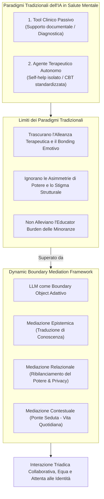
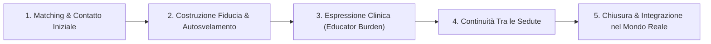
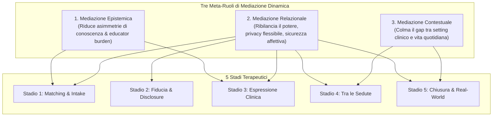
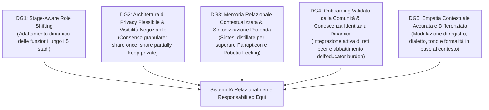

# Relational Mediators: LLM Chatbots as Boundary Objects in Psychotherapy (Quan et al., 2025)

**Summary**: Studio qualitativo pionieristico (ACM / arXiv:2512.22462, 2025) condotto da ricercatori della Hong Kong Polytechnic University, University of Washington e Nankai University. Il lavoro ridefinisce il ruolo dei Large Language Models (LLM) nella salute mentale, superando la dicotomia tra "semplici strumenti di supporto clinico" e "agenti terapeutici autonomi". Basandosi sulla **Boundary-Object Theory** (Star & Griesemer) e sulla nozione di spazio potenziale di Winnicott, gli autori introducono il **Dynamic Boundary Mediation Framework**. Lo studio analizza, tramite *Constructivist Grounded Theory* su 24 interviste in profondità (12 psicoterapeuti e 12 pazienti appartenenti a minoranze sistemiche e comunità LGBTQ+ in Cina), come i sistemi LLM possano agire da mediatori socio-tecnici adattivi attraverso 5 stadi terapeutici, articolando tre forme di mediazione: **Epistemica** (riduzione delle asimmetrie di conoscenza e dell'onere pedagogico del paziente), **Relazionale** (riequilibrio delle dinamiche di potere e privacy granulare) e **Contestuale** (continuità tra seduta e vita quotidiana). Vengono infine formalizzate 5 linee guida di design per un'IA eticamente e relazionalmente responsabile.
**Sources**: `2512.22462v1.pdf` (arXiv:2512.22462v1 [cs.HC], 27 Dec 2025. Authors: Jiatao Quan, Ziyue Li, Tian Qi Zhu, Yuxuan Li, Baoying Wang, Wanda Pratt, Nan Gao).
**Last updated**: 2026-08-27
---

## Inquadramento e Razionale Teorico

Nella letteratura sulla salute mentale digitale, i sistemi basati su **Intelligenza Artificiale Generativa e [[large-language-models|LLM]]** sono stati prevalentemente concettualizzati secondo due paradigmi contrapposti:
1. **Strumenti amministrativo-diagnostici per il terapeuta**: Sistemi passivi dedicati all'elaborazione di note, screening o supporto decisionale.
2. **Agenti terapeutici autonomi / Self-help tools**: Piattaforme basate su CBT dialogica (es. Woebot, Wysa) operanti indipendentemente dalla relazione interpersonale tra clinico e paziente.

Entrambi gli approcci trascurano la natura intrinsecamente **relazionale e interpersonale** della psicoterapia (Rogers 1957; Bordin 1979). Questa lacuna è particolarmente critica per i **pazienti appartenenti a gruppi marginalizzati o vulnerabili** (es. minoranze sessuali e di genere LGBTQ+, persone a basso reddito, individui con patologie croniche o elevata sensibilità), i quali affrontano barriere strutturali, stress da minoranza (*minority stress*), sfiducia istituzionale e il pesante carico di dover continuamente "educare" il terapeuta sulla propria identità (*educator burden*).

### Perché la Boundary-Object Theory?

Per comprendere il ruolo dell'IA nella collaborazione terapeutica, gli autori confrontano tre quadri teorici sociotecnici:

1. **Mediation Theory (Gagnepain)**: Si concentra su simboli e cognizione come processi di scambio informativo, ma risulta metodologicamente limitata nel cogliere la natura fluida e la rinegoziazione continua del potere relazionale.
2. **Actor-Network Theory (ANT, Callon & Latour)**: Distribuisce simmetricamente l'agency tra entità umane e non-umane. In psicoterapia ciò presenta due rischi: diffonde la responsabilità etica e deontologica (che deve restare in capo al terapeuta umano) e rischia di forzare la creazione di significati verso punti di passaggio obbligati rigidi, quando la terapia richiede un'ermeneutica aperta e situata.
3. **Boundary-Object Theory (Star & Griesemer 1989)**: Gli *oggetti di confine* fungono da ponti tra mondi sociali eterogenei, mantenendo coerenza globale pur consentendo plasticità e adattamento locale. In psicoterapia, il boundary object opera come un'articolazione dello **spazio potenziale di Winnicott** (BenEzer 2012) — una zona intermedia e protetta in cui affetto, significato e confini identitari vengono continuamente co-costruiti e rinegoziati.

---

## Metodologia della Ricerca

Lo studio impiega un disegno qualitativo basato sulla **Constructivist Grounded Theory (CGT)** di Kathy Charmaz (2012):

- **Campione (N = 24)**:
  - **12 Psicoterapeuti**: Professionisti abilitati in Cina (esperienza da 3 a 15 anni; approcci psicodinamici, cognitivo-comportamentali, umanistici, junghiani, sandplay e integrativi).
  - **12 Pazienti Marginalizzati**: Adulti cresciuti nel contesto culturale cinese (8 identificati come LGBTQ+, 2 con marginalizzazione intersezionale, 2 appartenenti ad altri gruppi vulnerabili/cronici; 11 su 12 con oltre 3 sedute pregresse).
- **Protocollo di Raccolta Dati**:
  - Interviste semi-strutturate in profondità (60–90 minuti).
  - **Scenario Simulation & Design Probes**: Presentazione visiva ed esplorazione di 12 feature speculative di chatbot LLM (valutate con scala Likert 0–10 e probing qualitativo).
  - **Elaboration Prompting Technique (EPT)** per estrarre valori, aspettative relazionali e credenze implicite.
- **Analisi dei Dati**: Codifica aperta linea per linea, codifica focalizzata e codifica teorica con metodo comparativo costante.

---

## RQ1: Sfide Relazionali nei 5 Stadi del Percorso Terapeutico

Dall'analisi qualitativa emergono 5 stadi critici in cui si manifestano tensioni sui confini relazionali (*boundary tensions*):

1. **Stadio 1: Matching e Contatto Iniziale**: Conflitto epistemico tra la "competenza formale" (certificati istituzionali privilegiati dai terapeuti) e la "competenza per esperienza vissuta / fluidità identitaria" richiesta dai clienti marginalizzati (C8: *"Non ci serve un certificato di un seminario multiculturale, ma un terapeuta che capisca la nostra realtà vissuta"*).
2. **Stadio 2: Costruzione Iniziale della Fiducia e Autosvelamento**: La fiducia è una struttura graduale; forzature premature o ambiguità sulla riservatezza (specialmente nei servizi universitari o ospedalieri) generano rotture precoci e ritirata difensiva.
3. **Stadio 3: Espressione del Paziente e "Educator Burden" (*Who Explains to Whom?*)**: Asimmetria comunicativa logorante in cui il paziente marginalizzato deve costantemente "fare lezione" al terapeuta sui concetti LGBTQ+ o subculturali (C11: *"È arrivato un nuovo terapeuta e ho dovuto riraccontare e spiegare tutto da capo"*). Questo lavoro di confine ripetitivo (*boundary labor*) causa esaurimento emotivo.
4. **Stadio 4: Continuità tra le Sedute**: Disallineamento tra i rigidi confini temporali dei terapeuti (P2: *"I pazienti mandano messaggi, ma non possiamo rispondere fuori orario"*) e il bisogno di "presenza continuativa" e contenimento avvertito dai pazienti vulnerabili (C1).
5. **Stadio 5: Chiusura e Integrazione nel Mondo Reale**: Difficoltà nel trasferire la sicurezza e le abilità relazionali apprese nel setting protetto all'interno di ambienti quotidiani stigmatizzanti e ostili (*limited contextual portability*).

---

## RQ2: Il Dynamic Boundary Mediation Framework

Il **Dynamic Boundary Mediation Framework** formalizza le modalità con cui l'IA basata su LLM opera come mediatore relazionale adattivo lungo le 3 dimensioni e i 5 stadi:

### Mappatura delle Funzioni e Feature nei 5 Stadi

| Stadio Terapeutico | Mediazione Epistemica | Mediazione Relazionale | Mediazione Contestuale |
| :--- | :--- | :--- | :--- |
| **1. Matching & Contatto Iniziale** | **Pre-screening**: traduce l'esperienza soggettiva in info strutturate. **Psicoeducazione**: spiega il processo terapeutico. | **Basic Chat**: spazio informale a basso rischio per testare la compatibilità. **Privacy Control**: impostazione precoce dei confini. | *(Nessuna funzione primaria)* |
| **2. Costruzione Fiducia & Autosvelamento** | **Pre-screening**: riduce l'ansia dell'ignoto e inquadra le aspettative. | **Privacy Control** ⭐: consenso granulare (share once/partially/never). **Empathy Feature** ⭐: buffer emotivo non giudicante. **Basic Chat**: vulnerabilità graduale. | *(Nessuna funzione primaria)* |
| **3. Espressione del Paziente** | **Psicoeducazione** ⭐: pre-carica concetti identitari specifici riducendo l'educator burden. **Pre-screening**: memoria clinica cumulativa (evita re-narrazioni). | **Therapeutic Journaling** ⭐: articolazione sicura prima della seduta. **Privacy Control**: condivisione selettiva delle note di diario. | *(Nessuna funzione primaria)* |
| **4. Continuità tra le Sedute** | *(Nessuna funzione primaria)* | **Empathy Feature** ⭐: compagnia AI 24/7, contenimento dell'ansia da disconnessione. **Therapeutic Journaling**: filo conduttore emotivo continuativo. | **Between-Session Activities** ⭐: compiti a casa e reminder contestualizzati. **Crisis Intervention**: rete di sicurezza in tempo reale. |
| **5. Chiusura & Integrazione nel Mondo Reale** | *(Nessuna funzione primaria)* | **Therapeutic Journaling**: riflessione sui progressi e autoconsapevolezza portatile. | **Between-Session Activities** ⭐: pratica nel mondo reale. **Crisis Intervention** ⭐: percorsi di aiuto post-terapia. **Mindfulness Exercises**: strategie di coping incorporate nella routine. |

---

## Tensioni Sociotecniche ed Evidenze Empiriche

L'implementazione concreta degli agenti LLM come boundary objects incontra tre criticità sostanziali:

### 1. Il "Robotic Feeling" e l'Empatia Stereotipata
I partecipanti hanno espresso frustrazione verso risposte algoritmiche artefatte e cliché (C5: *"Quando parli con un chatbot e risponde solo 'ti capiamo'... non è attraente"*). Se il modello manca di sintonizzazione affettiva profonda e calore, fallisce nel creare sicurezza relazionale.

### 2. Memoria Relazionale Distillata vs. Effetto Panopticon
I pazienti necessitano di continuità narrativa tra le conversazioni per evitare la frammentazione (C6). Tuttavia, la registrazione integrale dei trascritti genera ansia da sorveglianza (*panopticon effect*) e timore di stigmatizzazione. La soluzione individuata è l'uso di **"sintesi relazionali distillate"** (temi, trigger, progressi) accessibili con consenso granulare.

### 3. Validazione Comunitaria vs. Accreditamento Istituzionale
Mentre le istituzioni sanitarie privilegiano titoli accademici formali, le comunità marginalizzate costruiscono la propria fiducia attraverso reti di pari (*peer networks*) e raccomandazioni comunitarie. I sistemi di matching IA devono integrare circuiti di validazione *community-informed*.

---

## Linee Guida di Progettazione (Design Guidelines - DGs)

Il paper traduce il framework in 5 linee guida operative per sviluppatori e clinici:

1. **DG1 (Stage-Aware, Community-Informed, and Emotionally Attuned Role Shifting)**: Il sistema deve commutare dinamicamente il proprio ruolo in base alla fase terapeutica (dalla trasparenza nell'intake, al supporto dell'espressione a metà percorso, fino alla generalizzazione autonoma post-chiusura).
2. **DG2 (Negotiable Data Visibility within a Flexible Privacy Architecture)**: Implementare meccanismi di consenso multi-livello (*condividi una volta, condividi parzialmente, mantieni privato*) per restituire al paziente il pieno controllo sul confine privato-professionale.
3. **DG3 (Contextualized Relational Memory and Deep Adaptive Emotional Attunement)**: Impiegare riassunti relazionali concisi invece di log grezzi, combinati con una capacità generativa capace di "vedere autenticamente il dolore e la speranza" del paziente (P4).
4. **DG4 (Community-Validated Onboarding and Proactive Identity Knowledge Integration)**: Integrare risorse verificate dalle comunità marginalizzate e aggiornare dinamicamente il patrimonio lessicale e concettuale identitario senza gravare sul paziente.
5. **DG5 (Pervasive, Nuanced Context-Adaptive Empathy to Overcome Robotic Feeling)**: Adattare tono, lunghezza dei messaggi, livello di formalità e sensibilità culturale evitando formule prefabbricate di finto ascolto.

---

## Implicazioni Cliniche e Prospettive

- **Redistribuzione del carico emotivo e cognitivo**: L'IA non rimpiazza il terapeuta né isola il paziente, ma funge da *mediatore triadico* che riduce l'attrito comunicativo, protegge i confini professionali del terapeuta e valida l'esperienza del paziente.
- **Applicabilità estesa ad altri domini ad alta intensità relazionale**: Il modello di mediazione di confine è estendibile all'assistenza sociale, all'orientamento educativo e al supporto legale per popolazioni vulnerabili.

---
## Concetti Correlati
- [[dynamic-boundary-mediation-framework]]
- [[boundary-objects-in-psychotherapy]]
- [[educator-burden-marginalized-clients]]
- [[negotiable-data-visibility-privacy]]
- [[contextualized-relational-memory]]
- [[between-session-continuity-ai]]
- [[interazione-triadica-terapeuta-paziente-ia]]
- [[ai-mental-health-vulnerable-populations]]
- [[simulated-empathy-vs-authentic-presence]]
- [[genuineness-gap]]
- [[weird-bias-cultural-adaptability-ai]]
