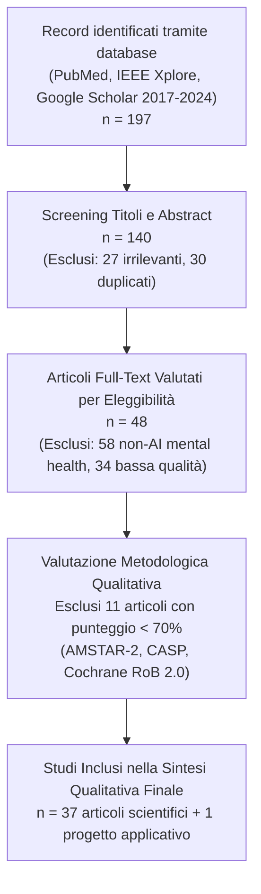
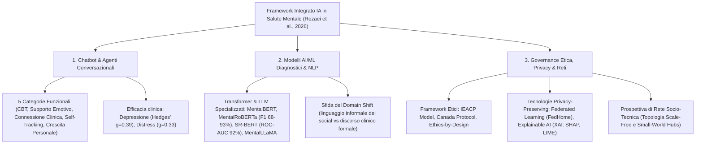

# Network-based Artificial Intelligence in Mental Healthcare: A Systematic Review of Chatbots, AI/ML Models and Ethical Considerations in Global Healthcare Networks

## Inquadramento Epidemiologico e Obiettivi

- **Autori:** Zahra Rezaei, Atieh Khorraminia, Dingjing Shi, Yaser Mike Banad (2026).
- **Rivista:** *DIGITAL HEALTH*, Vol. 12, pp. 1–30. DOI: [10.1177/20552076261421688](https://doi.org/10.1177/20552076261421688).
- **Contesto Epidemiologico Globale:**
  - Oltre **1 miliardo di persone** nel mondo convivono con disturbi mentali (WHO, 2025); ansia e depressione rappresentano la seconda causa principale di disabilità a lungo termine, con un costo economico globale stimato in circa **1.000 miliardi di dollari all'anno**.
  - La pandemia da COVID-19 ha causato un incremento del **27,6% del disturbo depressivo maggiore** e del **25,6% dei disturbi d'ansia**, con un impatto sproporzionato su donne e giovani (*Lancet Global Study*, 2021).
  - La spesa pubblica per la salute mentale rimane ferma a circa il **2% dei budget sanitari complessivi**.
  - **Trattamento e Disuguaglianze Strutturali (*Treatment Gap*):** Nei paesi a basso e medio reddito (LMIC), la copertura terapeutica per i disturbi depressivi è inferiore all'**8–10%**, contro il **33–50%** dei paesi ad alto reddito (Moitra et al., 2022; WHO, 2025).
  - **Divario tra Politiche e Implementazione (*Policy-Implementation Gap*):** Sebbene il 78–89% dei paesi disponga di politiche formali sulla salute mentale, la piena conformità è limitata al 45–60% e l'effettiva attuazione pratica scende al **2–14% nei contesti a basso reddito**.
  - **Allineamento con gli Obiettivi ONU:** Il lavoro si colloca nell'ambito del Sustainable Development Goal (SDG) 3 ("Good Health and Well-Being"), target 3.4, proponendo un'architettura a rete basata su IA per colmare i divari geografici ed economici.
- **Obiettivi della Review:**
  1. Analizzare e valutare l'efficacia clinica delle applicazioni di IA e chatbot nella salute mentale.
  2. Identificare i limiti metodologici e tecnici dei modelli predittivi e diagnostici ML/NLP.
  3. Esaminare le criticità etiche, la privacy, il bias algoritmico e proporre soluzioni di governance.
  4. Formulare raccomandazioni sistemiche per integrare l'IA come rete socio-tecnica di supporto ibrido con supervisione umana (*Human-in-the-Loop*).

---

## Metodologia di Ricerca e Selezione PRISMA 2020

1. **Strategia di Ricerca:** Stringhe booleane strutturate (es. `("Artificial Intelligence" OR "Machine Learning") AND ("Mental Health" OR "Psychiatry" OR "Psychological Support") AND ("Chatbot" OR "Conversational Agent") AND ("Ethics" OR "Privacy" OR "Bias")`) su PubMed, IEEE Xplore e Google Scholar (gennaio 2017 – dicembre 2024).
2. **Criteri di Qualità e Rigore:** Applicazione di strumenti standardizzati di valutazione metodologica in base al disegno di studio: **AMSTAR-2**, **Cochrane Risk of Bias 2.0 (RoB 2.0)**, **CONSORT-AI**, **SPIRIT-AI**, **CASP**, **STROBE**, **NIH Quality Assessment Tool** e **JBI Critical Appraisal Checklist**.
3. **Distribuzione Tematica della Letteratura (2017–2024):**
   - **47,2%**: Chatbot e agenti conversazionali di supporto terapeutico ed emotivo.
   - **30,6%**: Modelli di Machine Learning e Deep Learning per valutazione, screening e diagnosi.
   - **22,2%**: Aspetti etici, governance dei dati, trasparenza e privacy.

---

## Risultati per Domini Chiave

---

### 1. Chatbot e Agenti Conversazionali nella Salute Mentale

#### Tassonomia Funzionale in 5 Categorie

| Categoria | Funzione Primaria | Esempi Applicativi | Algoritmi / Meccanismi | Outcome Clinici Documentati |
| :--- | :--- | :--- | :--- | :--- |
| **1. Interventi basati su CBT** | Protocolli strutturati di Terapia Cognitivo-Comportamentale, reframing, compiti a casa (ABC). | **Woebot**, **Youper**, **Joyable**, **MindShift** | Alberi decisionali a regole, NLP guidato, mindfulness integrata. | Riduzione significativa di ansia e depressione; tassi di remissione sintomatica fino al 30% (He et al., 2022). |
| **2. Supporto Emotivo & Benessere** | Ascolto attivo, regolazione emotiva in tempo reale, check-in diurni. | **Wysa**, **Replika**, **Mindbloom**, **Sanvello**, **Shine**, **Happify** | Conversazione empatica AI, NLP affettivo, journaling guidato. | Gestione efficace di stress, distress psicologico e incremento della riflessione su di sé. |
| **3. Piattaforme di Connessione Clinica** | Triage algoritmico, matching e instradamento verso psicoterapeuti abilitati. | **Talkspace**, **Ginger**, **BetterHelp** | Sistemi di routing intelligente, analisi del testo per l'assegnazione clinica. | Accesso tempestivo e continuativo a professionisti della salute mentale in ambienti sicuri. |
| **4. Strumenti di Self-Tracking & Monitoraggio** | Tracciamento del tono dell'umore, diari clinici, psicoeducazione e peer support. | **Moodpath**, **7 Cups**, **MindDoc**, **My Possible Self** | Algoritmi di clustering (K-means), categorizzazione automatica dei pattern affettivi. | Aumento della consapevolezza emotiva, riduzione dell'evitamento e raccomandazioni personalizzate. |
| **5. Sviluppo Personale & Interventi Integrativi** | Supporto psicologico integrato multi-modale (CBT, ACT, Mindfulness) e self-improvement. | **Tess**, **Remente** | Modelli NLP ibridi, messaggistica multicanale (SMS, web, app). | Riduzione significativa di depressione (*d* = 0.64) e ansia (*d* = 0.52) in studenti e giovani adulti (Fulmer et al., 2018). |

#### Evidenze di Efficacia e Fattori di Interfaccia (UI/UX)
- **Dimensione dell'effetto:** Le meta-analisi evidenziano miglioramenti moderati nei sintomi depressivi (*Hedges' g* = 0.39) e nel distress (*g* = 0.33) (Abd-Alrazaq et al., 2020).
- **Coinvolgimento degli Adolescenti:** L'integrazione di elementi visivi multimediali (GIF) e domande a scelta multipla aumenta la probabilità di risposta fino al **20%** rispetto a domande aperte o formati binari sì/no (Mariamo et al., 2021). Toni eccessivamente amichevoli possono tuttavia generare diffidenza, richiedendo una personalizzazione bilanciata.
- **Supporto in Situazioni di Crisi (COVID-19):** Chatbot dedicati hanno ridotto l'ansia del **15–20% negli anziani** (Chou et al., 2024) e hanno mostrato elevata usabilità (System Usability Scale > 80) tra gli operatori sanitari sotto stress e burnout (Jackson-Triche et al., 2023).
- **Agenti Specializzati:**
  - *IDEABot* (Brasile): Input multimodale (voce + testo), accettazione >80%, aderenza ~90% negli adolescenti (Viduani et al., 2023).
  - *ChatPal* (Europa multilingue): Clustering degli archetipi utente tramite K-means su 579 utenti in 5 regioni europee (Booth et al., 2023; Potts et al., 2023).
  - *Rosie*: Educazione sanitaria ed estrazione informativa non supervisionata (*Dense Passage Retrieval*) per neomamme, con abbattimento dell'ansia post-partum (Nguyen et al., 2024).

---

### 2. Modelli di Machine Learning e NLP per Valutazione e Diagnosi

#### Panoramica dei Modelli e Prestazioni Tecniche

| Autore (Anno) | Modello / Sistema | Architettura / Metodo | Dataset di Training | Performance Documentata | Paese |
| :--- | :--- | :--- | :--- | :--- | :--- |
| **Ji et al. (2021)** | **MentalBERT / MentalRoBERTa** | Transformer preaddestrato su corpora specifici di salute mentale | Reddit (r/depression, r/SuicideWatch, r/Anxiety), Twitter | **F1-score: 68% – 93%** su compiti di classificazione di disturbi mentali | Globale |
| **Izmaylov et al. (2023)** | **SR-BERT** | Modello linguistico gerarchico basato su teorie psicologiche (estensione DialogBERT) | 40.000 sessioni di chat anonimizzate dell'organizzazione Sahar | **F2-score: 76,2%**, **ROC-AUC: 92%** nella predizione del rischio suicidario | Israele |
| **Lee et al. (2023)** | **GPT-3.5 con Chain-of-Empathy (CoE)** | Prompting sequenziale basato su costrutti psicoterapeutici | Dataset EPITOME (annotato per tattiche empatiche) | Balanced Accuracy: **0.340** nella generazione di risposte empatiche | USA |
| **Yang et al. (2023, 2024)** | **MentalLLaMA** | LLaMA fine-tuned per analisi interpretabile di salute mentale | Corpora clinici e dialoghi specializzati | Risposte empatiche coerenti e spiegazioni diagnostiche testuali | Globale |
| **Rubio-Martín et al. (2024)** | **BERT / BERTweet** | Transformer vs Classificatori classici (XGBoost, KNN, Decision Tree) | 400.000+ tweet su disturbo dello spettro autistico (ASD) | **Accuratezza: ~88%** nel rilevamento di marker testuali di autismo | Spagna |
| **Wongkoblap et al. (2021)** | **Deep Learning con Risoluzione delle Anafore** | Reti neurali profonde arricchite con risoluzione anaforica del discorso | Tweet di utenti con depressione | Identificazione accurata di espressioni autoreferenziali e dipendenze affettive | UK |
| **Ahmadi, Sharif & Banad (2025)** | **MCP Bridge** | Proxy RESTful leggero e agnostico per server Model Context Protocol | Infrastruttura di integrazione LLM | Ottimizzazione dello scambio dati e interfacciamento rapido dei modelli | USA |

#### Il Problema del Domain Shift (Linguaggio Social vs Contesto Clinico)
- **Discrepanza Semantica e Pragmatica:** Sebbene MentalBERT e MentalRoBERTa raggiungano F1-score elevati (fino al 93%), l'addestramento su Reddit e Twitter cattura il gergo informale, l'ironia, metafore e idioletti dei social network, ma fallisce quando applicato al **discorso clinico formale** o a trascrizioni terapeutiche.
- **Limiti delle Metriche Statistiche (F1, ROC-AUC):** Un F1 elevato certifica solo l'accuratezza tecnica di classificazione testuale, ma non misura l'utilità terapeutica, la sicurezza clinica o la capacità di comprendere meccanismi di difesa e pattern di evitamento cognitivo. I modelli attuali devono essere considerati strumenti di **decision-support e screening del rischio**, non sistemi diagnostici autonomi.

---

### 3. Considerazioni Etiche, Privacy e Framework di Governance

```mermaid
graph LR
    subgraph EthicalVulnerabilities ["Vulnerabilità Etiche Identificate"]
        E1["Ethics Gap:<br>Solo 1/3 degli studi dichiara approvazione etica formale"]
        E2["Bias WEIRD:<br>Sovrarappresentazione di culture occidentali individualiste"]
        E3["Opacità Algoritmica:<br>Black-box e assenza di metriche XAI (SHAP/LIME)"]
        E4["Diffusione della Responsabilità:<br>Assenza di chiarezza legale su errori e allucinazioni"]
    end

    subgraph SolutionsGovernance ["Standard di Governance & Soluzioni Tecniche"]
        S1["IEACP Framework<br>(Identify-Examine-Act-Check-Plan)"]
        S2["Canada Protocol<br>(Checklist di trasparenza, sicurezza e bias per suicidio)"]
        S3["Federated Learning (FedHome)<br>(Privacy decentralizzata senza condivisione dati grezzi)"]
        S4["Ethics-by-Design & Clinician Co-design<br>(Supervisione umana e allineamento terapeutico)"]
    end

    EthicalVulnerabilities --> SolutionsGovernance
```

1. **L'Ethics Gap tra Ricerca Clinica e NLP:** La review documenta che solo un terzo degli studi (prevalentemente RCT) riporta approvazioni etiche istituzionali o consensi informati espliciti, mentre la maggioranza dei lavori computazionali ha estratto dati da Reddit/Twitter senza tracciabilità del consenso o tutela della provenienza.
2. **Bias da Campionamento WEIRD (*Western, Educated, Industrialized, Rich, Democratic*):** I modelli riflettono norme culturali individualistiche occidentali, rischiando di interpretare erroneamente quadri clinici in culture collettiviste (dove il disagio si manifesta attraverso fattori somatici, contestuali e relazionali).
3. **Allineamento Terapeutico (*Therapeutic Alignment*):** Gli LLM generalisti possono erogare consigli disallineati rispetto agli obiettivi terapeutici, rafforzando inavvertitamente condotte disfunzionali per mancanza di autentico giudizio clinico.
4. **Trasparenza ed Explainable AI (XAI):** Meno della metà degli studi riporta calibrazioni algoritmiche o spiegazioni post-hoc (es. tramite SHAP o LIME). L'opacità alimenta la sfiducia sia nei pazienti sia nei clinici.
5. **Responsabilità Condivisa (*Shared Responsibility Framework*):** La responsabilità clinico-legale non può essere delegata all'algoritmo; il clinico deve mantenere l'autorità decisionale finale e gli sviluppatori devono garantire tracciabilità e audit periodici di conformità (es. GDPR, HIPAA).
6. **Privacy Avanzata tramite Federated Learning:** Modelli federati (es. *FedHome*, Ahmadi et al., 2025) consentono l'addestramento collaborativo di modelli su nodi decentralizzati (ospedali, dispositivi utente) senza mai trasferire all'esterno i dati sanitari grezzi.
7. **Framework Etici Standardizzati:**
   - **Modello IEACP (*Integrated Ethical Approach for Computational Psychiatry* - Putica et al., 2025):** Articolato in 5 fasi (*Identify, Examine, Act, Check, Plan*) ancorate ai principi di beneficenza, non maleficenza, autonomia, giustizia, trasparenza e integrità scientifica.
   - **Canada Protocol for AI in Suicide Prevention and Mental Health (Mörch et al., 2020):** Checklist standardizzata che vincola la trasparenza algoritmica, la stima del rischio clinico e la mitigazione del bias.
   - **Ethics-by-Design:** Integrazione dei requisiti di sicurezza e tutela fin dalle fasi iniziali di codifica architetturale.

---

## Prospettiva della Scienza delle Reti (*Network Science*)

- **Reti Socio-Tecniche di Cura:** Gli interventi di IA non operano come strumenti isolati, ma come nodi integrati all'interno di complesse reti socio-tecniche che collegano pazienti, clinici, cartelle elettroniche (EHR), dispositivi indossabili (wearable) e infrastrutture telematiche.
- **Topologia di Rete (*Small-World* e *Scale-Free*):** Le grandi piattaforme di chatbot (come Woebot o Wysa) operano come **hub centrali ad alta connettività**. Questa struttura conferisce grande resilienza sistemica (es. capacità di assorbire picchi di domanda durante emergenze sanitarie), ma presenta il rischio critico di **propagazione su larga scala di bias algoritmici** e vulnerabilità di sicurezza in caso di malfunzionamento del nodo centrale.
- **Modello di Cura Ibrido:** La configurazione ottimale di rete vede l'IA come snodo di primo contatto, triage continuo e supporto inter-sessione (*stepped care*), preservando la connessione con lo psicoterapeuta umano come garante della relazione di cura.

---

## Conclusioni e Direzioni Future

1. **Priorità di Validazione Longitudinale:** Superare gli studi a breve termine con follow-up limitati a poche settimane; condurre RCT multicentrici e cross-culturali su campioni demograficamente rappresentativi.
2. **Superamento del Divario di Dominio:** Adattare e validare i modelli di linguaggio su corpora clinici reali e de-identificati, superando la dipendenza esclusiva da testi informali dei social media.
3. **Integrazione "Ethics-by-Design" e Co-Design Clinico:** Coinvolgere attivamente psicoterapeuti, bioeticisti e pazienti nella progettazione algoritmica fin dalle fasi concettuali.
4. **Semplificazione dei Percorsi di Approvazione Etica Istituzionale:** Creare protocolli standardizzati per la ricerca su note cliniche de-identificate e promuovere l'adozione di architetture di Federated Learning su scala globale.

---

## Riferimento Bibliografico

- Rezaei, Z., Khorraminia, A., Shi, D., & Banad, Y. M. (2026). Network-based artificial intelligence in mental healthcare: A systematic review of chatbots, artificial intelligence/machine learning models and ethical considerations in global healthcare networks. *DIGITAL HEALTH*, 12, 1–30. https://doi.org/10.1177/20552076261421688

---

## Pagine Correlate e Concetti

- [[network-based-ai-mental-healthcare]]
- [[specialized-nlp-models-mental-health]]
- [[mental-health-chatbot-taxonomy]]
- [[ieacp-canada-protocol-ethical-frameworks]]
- [[weird-bias-cultural-adaptability-ai]]
- [[conversational-agents-mental-health]]
- [[algorithmic-bias-and-digital-inequalities]]
- [[etica-privacy-bias-ia-clinica]]
- [[rischio-suicidario-ai-limits]]
- [[stepped-care-ai-integration]]
- [[huynh-et-al-2026]]
- [[erdemir-sumbas-2026]]
