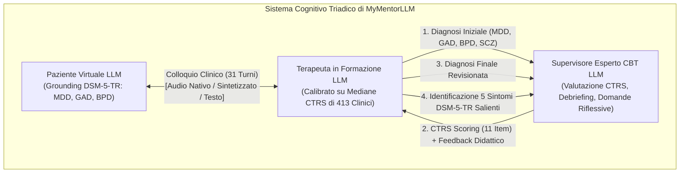
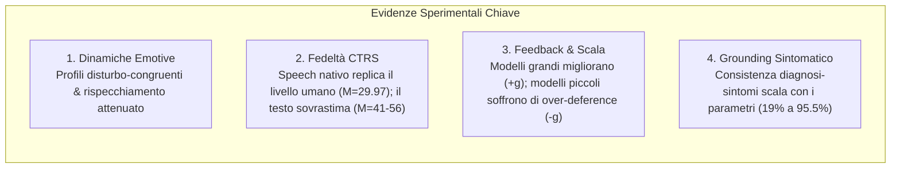
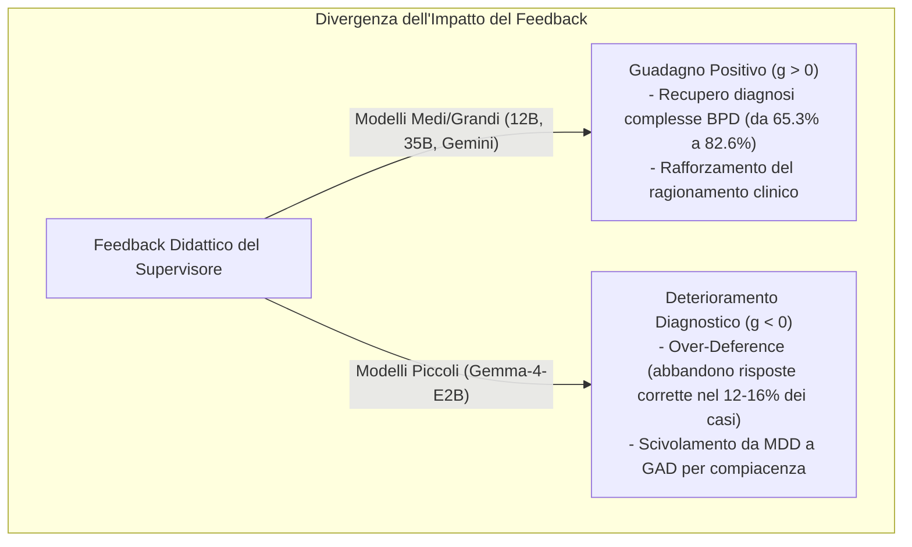

# MyMentorLLM: A Psychotherapy GenAI Environment with Multimodal Voice/Text Patients, Trainees and Experts for Deliberate Practice (Rizzi et al., 2026)

**Summary**: Studio empirico su larga scala (arXiv:2607.25667v1, 2026) che introduce **MyMentorLLM**, un ambiente di simulazione generativa multimodale (audio nativo, audio sintetizzato e testo) basato sulla *deliberate practice* per la formazione in Psicoterapia Cognitivo-Comportamentale (CBT). Lo studio valuta **2.100 cicli completi di mentorship** strutturati su tre ruoli interagenti (paziente profilato DSM-5-TR, terapeuta in formazione calibrato su dati empirici CTRS di 413 clinici reali, supervisore clinico esperto). L'analisi dimostra che i pazienti simulati esprimono firme emotive disturbo-congruenti rispecchiate dal terapeuta in forma attenuata (risonanza affettiva). Crucialmente, i modelli **speech-to-speech nativi (Gemini 3.1 Flash Live)** riproducono fedelmente il profilo di competenza clinica umana (CTRS medio 29.97 vs 31.04 umano), mentre le simulazioni puramente testuali o con voce sintetizzata sovrastimano sistematicamente la competenza creando una falsa illusione di maestria. Inoltre, il feedback del supervisore migliora l'accuratezza diagnostica nei modelli medi e grandi (recupero delle diagnosi di disturbo borderline di personalità), ma genera **deterioramento diagnostico per deferenza acritica (*over-deference*)** nei modelli più piccoli (Gemma-4-E2B).
**Sources**: `2607.25667v1.pdf` (*arXiv:2607.25667v1 [cs.CL]*, 28 Jul 2026. Authors: Rodolfo Rizzi, Alessandro Grecucci, Massimo Stella - CogNosco Lab, University of Trento & University of Bari)
**Last updated**: 2026-08-27
---

## Inquadramento e Obiettivi dello Studio

I disturbi di salute mentale colpiscono oltre un miliardo di persone nel mondo, a fronte di una disponibilità critica di soli **1,3 esperti ogni 10.000 abitanti** (WHO, 2022). La formazione in psicoterapia richiede l'acquisizione di competenze complesse (definizione dell'agenda, scoperta guidata socratica, concettualizzazione del caso, sintonizzazione emotiva), che necessitano di pratica ripetuta e supervisione continua.
Tuttavia, l'addestramento clinico tradizionale presenta limiti strutturali:
1. **Rischi etici e clinici**: i pazienti reali non possono farsi carico degli errori dei principianti;
2. **Scarsità di risorse**: gli attori standardizzati non coprono la varietà psicopatologica su scala e i supervisori esperti sono una risorsa limitata e costosa;
3. **Platò di rendimento**: la sola esperienza non strutturata non garantisce l'eccellenza clinica senza *pratica deliberata* (*deliberate practice*, Rousmaniere, 2024).

Gli autori propongono **MyMentorLLM**, spostando il focus dell'IA in salute mentale dalla sostituzione del terapeuta al **potenziamento pedagogico della formazione clinica**.

---

## Architettura e Metodologia Sperimentale

### 1. Il Ciclo Triadico di Mentorship
Ogni osservazione sperimentale comprende un ciclo formativo completo in 3 stadi:
- **Fase 1 - Colloquio Terapeutico**: 31 turni di dialogo tra paziente e allievo terapeuta, aperto sempre dalla frase standard: *"Buongiorno, mi dica pure cosa la porta qui oggi"*.
- **Fase 2 - Diagnosi Iniziale**: Il terapeuta formula una prima ipotesi scegliendo tra 4 opzioni: Disturbo Depressivo Maggiore (MDD), Disturbo d'Ansia Generalizzata (GAD), Disturbo Borderline di Personalità (BPD) o Schizofrenia (SCZ, distrettore plausibile).
- **Fase 3 - Supervisione e Debriefing**:
  1. Il supervisore analizza la trascrizione completa e valuta le 11 competenze della **Cognitive Therapy Rating Scale (CTRS)** (punteggio 0–6 per item, range totale 0–66);
  2. Fornisce feedback qualitativo su punti di forza e aree di miglioramento, formulando una singola domanda riflessiva non prescrittiva;
  3. L'allievo conferma o corregge la diagnosi (diagnosi finale $A_F$);
  4. L'allievo individua i 5 sintomi più salienti da una lista chiusa di 35 item DSM-5-TR.

### 2. Prompting Clinico dei Tre Ruoli
- **Paziente**: Adattato da casi reali tratti da *DSM-5-TR Clinical Cases* (Barnhill, 2023):
  - *MDD*: Caso 4.5 ("Despair" - Munday & Abelson), depressione con tratti melanconici.
  - *GAD*: Caso 5.5 ("Always on Edge" - Lawrence & Cabaniss).
  - *BPD*: Caso 18.5 ("Fragile and Angry" - Yeomans & Kernberg).
  - Profilo in 6 sezioni (dati socio-demografici, motivo della consultazione, anamnesi, profilo sintomatologico, stile comunicativo/prosodia, schemi cognitivo-emotivi e pensieri automatici). Svelamento graduale del materiale sensibile e guardrail comportamentali di ritirata/chiusura in caso di disconferma o domande intrusive del terapeuta.
- **Terapeuta in Formazione (*Data-Driven Trainee*)**: Calibrato sui dati empirici di **1.264 sedute CBT condotte da 413 clinici di comunità** (Goldberg et al., 2020), mappando le mediane reali degli item CTRS su ancore descrittive (es. Agenda mediana = 2: "Il terapeuta imposta un'agenda vaga o incompleta").
- **Supervisore Esperto CBT**: Prompt didattico-supportivo orientato al modello Beck, focalizzato su analisi di processo vs contenuto, credenze metacognitive e bilanciamento tra accettazione e cambiamento.

### 3. Modelli Linguistici e Condizioni Sperimentali
Il disegno comprende **7 condizioni modello-modalità $\times$ 3 disturbi $\times$ 100 repliche = 2.100 sedute complete**:

| Condizione Modello | Sviluppatore | Modalità Paziente-Terapeuta | Modalità Supervisore | Modello Base |
| :--- | :--- | :--- | :--- | :--- |
| **Gemini-3.1LA** | Google | Native Speech-to-Speech (Live Audio) | Testo (JSON strutturato) | Gemini 3.1 Flash Live / Gemini 3.5 Flash |
| **Gemma-4-12BA** | Google DeepMind | Audio elaborato direttamente / TTS OmniVoice | Testo | Gemma-4-12B-it |
| **Gemma-4-12BT** | Google DeepMind | Testo puro | Testo | Gemma-4-12B-it |
| **Gemma-4-E2BA** | Google DeepMind | Audio elaborato direttamente / TTS OmniVoice | Testo | Gemma-4-E2B-it |
| **Gemma-4-E2BT** | Google DeepMind | Testo puro | Testo | Gemma-4-E2B-it |
| **Qwen3.6-35BT** | Alibaba | Testo puro | Testo | Qwen3.6-35B-A3B-AWQ |
| **Qwen3.5-9BT** | Alibaba | Testo puro | Testo | Qwen3.5-9B |

---

## Risultati Chiave

### 1. Congruenza Emozionale e Risonanza Affettiva del Terapeuta
L'analisi delle emozioni con **EmoAtlas** (basato sul modello a 8 emozioni di Plutchik ed EmoLex, confrontato con il dataset clinico umano HOPE di 12.900 enunciati) ha mostrato:
- **Pazienti Simulati**:
  - *MDD*: Profilo dominato da **tristezza** ($z = 2.99 \div 5.15$) e marcata attenuazione dell'affettività positiva (gioia).
  - *GAD*: Profilo dominato da **paura** ($z = 1.56 \div 3.54$) e **anticipazione/ansia** ($z = 4.09 \div 4.89$).
  - *BPD*: Profilo di affettività negativa diffusa, con contemporanea elevazione di **paura, tristezza e rabbia** ($z = 1.60 \div 3.17$).
- **Attunement del Terapeuta**: Il terapeuta simulato non è rimasto emotivamente neutro o invariante: ha **rispecchiato fedelmente le emozioni del paziente in forma attenuata e modulata**, mantenendo livelli stabili di **fiducia (*trust*) e anticipazione costruttiva**, replicando esattamente la dinamica di sintonizzazione della psicoterapia umana.

---

### 2. Valutazione della Competenza CTRS: Il Ruolo Decisivo del Native Speech-to-Speech

Il confronto dei punteggi CTRS assegnati dal supervisore rispetto al campione di riferimento umano ($n = 1.264$ sedute reali, media totale $= 31.04, SD = 11.10$) ha rivelato una discrepanza fondamentale:

| Condizione Modello | CTRS Totale (Media) | Deviazione Standard | Conformità al Baseline Umano |
| :--- | :---: | :---: | :--- |
| **Umani (Goldberg et al., 2020)** | **31.04** | 11.10 | Baseline empirico reale ($<40$) |
| **Gemini-3.1LA (Native Speech)** | **29.97** | 7.06 | **Riproduzione fedele del livello di apprendimento** |
| Qwen3.6-35BT | 41.15 | 10.49 | Sovrastima moderata |
| Gemma-4-12BA (Audio sintetico) | 48.15 | 3.49 | Sovrastima elevata |
| Gemma-4-12BT (Testo) | 50.66 | 4.11 | Sovrastima elevata |
| Qwen3.5-9BT | 52.91 | 10.41 | Sovrastima elevata |
| Gemma-4-E2BA (Audio sintetico) | 52.70 | 3.93 | Sovrastima con saturazione |
| Gemma-4-E2BT (Testo) | 55.99 | 3.52 | Sovrastima con saturazione massima |

> [!IMPORTANT]
> **L'Illusione di Competenza del Testo Puro**:
> Nelle condizioni basate su testo o voce ri-sintetizzata, i punteggi CTRS saturano verso il massimo (valori 5–6 su Comprensione, Efficacia Interpersonale e Cognizioni Chiave), superando ampiamente la soglia clinica di competenza ($CTRS \ge 40$).
> Al contrario, la condizione **Gemini-3.1LA (native audio $\leftrightarrow$ native audio)** preserva le esitazioni, la prosodia, i tempi di reazione e le imperfezioni tipiche di un terapeuta in formazione, attestandosi a **29.97**, fedele al profilo reale dei tirocinanti umani.

---

### 3. Dinamiche del Feedback Supervisivo ed Effetto Scala: Il Rischio di *Over-Deference*

L'efficacia del feedback didattico del supervisore è stata valutata confrontando l'accuratezza diagnostica iniziale ($A_I$) e finale ($A_F$), calcolando il guadagno normalizzato $g = \frac{A_F - A_I}{A_F}$:

| Modello | Accuratezza Iniziale ($A_I$) | Accuratezza Finale ($A_F$) | Guadagno ($g$) | Accuratezza Sintomi ($A_S$) |
| :--- | :---: | :---: | :---: | :---: |
| **Gemini-3.1LA** | 87.0% | **95.7%** | **+0.09** | 85.8% |
| **Qwen3.6-35BT** | 95.7% | **99.3%** | **+0.04** | **95.5%** |
| **Gemma-4-12BA** | 85.3% | **93.0%** | **+0.08** | 87.2% |
| **Gemma-4-12BT** | 86.3% | **91.7%** | **+0.06** | 86.8% |
| **Qwen3.5-9BT** | 84.0% | **91.7%** | **+0.08** | 72.7% |
| **Gemma-4-E2BA** | 79.0% | **74.3%** | **-0.06** | 25.5% |
| **Gemma-4-E2BT** | 75.3% | **68.0%** | **-0.11** | 19.4% |

- **Guadagno Clinico nei Modelli Superiori**: Il feedback ha permesso di recuperare le diagnosi inizialmente più insidiose, in particolare il Disturbo Borderline (passato dal 65.3% all'82.6% di accuratezza globale).
- **Iatrogenesi da Deferenza Acritica (*Over-Deference*) nei Modelli Piccoli**: Nei modelli da 2 miliardi di parametri (Gemma-4-E2B), l'accuratezza diagnostica è crollata post-supervisione ($-6\%$ in audio, $-11\%$ in testo). Di fronte a una domanda riflessiva neutrale del supervisore, il modello piccolo ha interpretato il feedback come un obbligo di modificare la risposta corretta, scivolando da depressione ad ansia nel 12–16% dei casi.

---

### 4. Riconoscimento dei Sintomi e *Model Scale*
- L'identificazione dei 5 sintomi corretti DSM-5-TR segue una netta legge di scala (*scaling law*):
  - **Qwen3.6-35B**: **95.5%** di coerenza sintomatica;
  - **Gemma-4-12B e Gemini-3.1LA**: **85.8% – 87.2%**;
  - **Gemma-4-E2B**: **19.4% – 25.5%** (livello casuale).
- La correttezza diagnostica finale è strettamente associata alla corretta individuazione dei cluster sintomatici DSM, dimostrando che il solido ancoraggio clinico emerge solo con modelli di scala sufficiente.

---

## Discussione e Implicazioni Pratiche

1. **Distinzione tra Realismo Conversazionale, Competenza e Sicurezza Pedagogica**:
   La fluidità linguistica di un modello generativo non equivale a competenza clinica. Nei sistemi text-only, la levigatezza formale maschera le reali lacune dell'allievo.
2. **Superiorità del Canale Spoken Nativo**:
   L'interazione vocale *end-to-end* (senza trascrizione intermedia) introduce la naturale complessità temporale e paralinguistica del colloquio terapeutico, rendendo la simulazione formativa autentica e pedagogicamente calibrata.
3. **Salvaguardia Contro l'Over-Deference**:
   Nei contesti di formazione assistita da IA, i modelli a bassa capacità non devono essere impiegati come allievi o supervisori autonomi, poiché tendono a compiacere le guide esterne senza un reale ragionamento epistemico.
4. **Ruolo Ineludibile della Supervisione Umana**:
   MyMentorLLM non sostituisce il formatore clinico umano, ma fornisce una palestra simulata (*interpretable testbed*) per la pratica deliberata a basso rischio prima dell'incontro con pazienti reali.

---

## Riferimenti Bibliografici Principali
- Rizzi, R., Grecucci, A., & Stella, M. (2026). MyMentorLLM: A psychotherapy GenAI environment with multimodal voice/text patients, trainees and experts for deliberate practice. *arXiv preprint arXiv:2607.25667v1*.
- Barnhill, J. W. (2023). *DSM-5-TR Clinical Cases*. American Psychiatric Association Publishing.
- Goldberg, S. B., Babins-Wagner, R., Rousmaniere, T., et al. (2020). The structure of competence: Evaluating the factor structure of the cognitive therapy rating scale. *Behavior Therapy*, 51(1), 113–122.
- Rousmaniere, T. (2024). *Deliberate practice for psychotherapists: A guide to improving clinical effectiveness*. Routledge.
- Semeraro, A., et al. (2025). Emoatlas: An emotional network analyzer of texts that merges psychological lexicons, artificial intelligence, and network science. *Behavior Research Methods*, 57, 77.
- Malhotra, G., et al. (2022). Speaker and time-aware joint contextual learning for dialogue-act classification in counselling conversations (HOPE dataset). *WSDM '22*, 735–745.

---

## Pagine e Concetti Correlati
- [[mymentorllm-framework]]: L'architettura triadica integrata per la simulazione e la deliberate practice in psicoterapia.
- [[deliberate-practice-in-psicoterapia-ia]]: Fondamenti teorici ed empirici della deliberate practice aumentata da modelli generativi.
- [[risonanza-affettiva-simulazione-clinica]]: Modellizzazione delle dinamiche emotive e rispecchiamento attenuato tramite EmoAtlas e Plutchik.
- [[native-speech-vs-text-in-clinical-simulation]]: Confronto tra audio nativo e testo nella valutazione della fedeltà clinica CTRS.
- [[over-deference-in-llm-supervision]]: Analisi del bias di deferenza e compiacenza algoritmica nei modelli linguistici sottomessi a feedback supervisivo.
- [[ctrs-automated-evaluation]]: Standard di valutazione quantitativa della fedeltà e competenza nella CBT.
- [[simulazione-pazienti-ai]]: Metodologie di simulazione di pazienti virtuali e grounding psicopatologico.
- [[supervisione-clinica-ai]]: Modelli di supervisione e debriefing formativo mediati da agenti artificiali.
