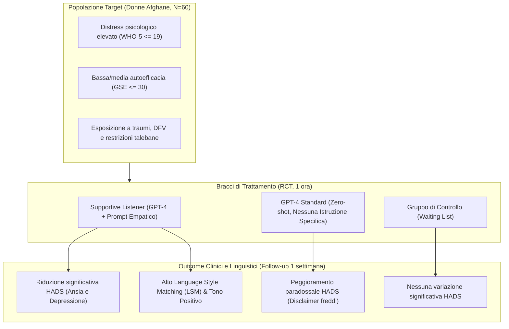

# GPT Chatbots for Alleviating Anxiety and Depression: A Pilot Randomized Controlled Trial with Afghan Women (Sahab et al., 2025)

**Summary**: Studio controllato randomizzato pilota ($N=60$) volto a valutare l'efficacia di un chatbot basato su GPT-4 configurato come "Supportive Listener" (ascoltatore empatico con istruzioni trauma-informed) nel ridurre ansia e depressione (scala HADS) in donne afghane residenti in patria sotto il regime talebano. Il gruppo *Supportive Listener* ha evidenziato una riduzione statisticamente significativa dei punteggi HADS, un tono emotivo più positivo e un maggior allineamento stilistico (Language Style Matching - LSM), il quale correla inversamente con la riduzione dei sintomi. Al contrario, il gruppo esposto a *GPT-4 standard* privo di prompt empatico ha registrato un peggioramento paradossale dell'ansia e della depressione a causa di rifiuti bruschi e disclaimers decontestualizzati.
**Sources**: `2508.00847v1.pdf` (*arXiv:2508.00847v1*, Kyoto University & Griffith Criminology Institute)
**Last updated**: 2026-08-27
---

## Inquadramento e Background Clinico-Sociale

L'80% delle persone che soffrono di disturbi mentali vive in paesi a basso e medio reddito (*Low- and Middle-Income Countries*, LMICs), dove si registra una carenza estrema di professionisti sanitari (1.6 operatori per 100.000 abitanti in Africa, 2.8 in Sud Asia, rispetto a una media globale di 13 per 100.000). In Afghanistan, i dati indicano una disponibilità critica (0.231 psichiatri e 0.296 psicologi per 100.000 abitanti nel 2016).

Le donne afghane affrontano una condizione di vulnerabilità sistemica senza precedenti:
- **Restrizioni istituzionali imposte dal ritorno dei Talebani** (agosto 2021): divieto di istruzione secondaria/universitaria e gravi limitazioni all'occupazione e alla libertà di movimento.
- **Esposizione cronica a traumi e violenza domestica/interpersonale (*Domestic and Family Violence*, DFV)**: esacerbata da 40 anni di conflitti armati e rigide norme patriarcali.
- **Prevalenza psicopatologica allarmante**: indagini epidemiologiche indicano che il 47% delle donne afghane presenta grave distress psicologico e circa l'80% manifesta sintomi depressivi.
- **Stigma socioculturale**: forte inibizione alla condivisione della sofferenza emotiva persino all'interno della cerchia familiare o amicale.

In tale scenario, gli agenti conversazionali basati su modelli linguistici di grandi dimensioni ([[large-language-models]]) come GPT-4 rappresentano una risorsa potenzialmente democratizzante per fornire supporto psicologico scalabile, anonimo e accessibile.

---

## Disegno Sperimentale e Metodologia

Lo studio adotta un disegno **Randomized Controlled Trial (RCT) pilota a 3 bracci**:

1. **Criteri di Inclusione e Screening**:
   - Età $\ge 18$ anni, genere femminile, residenza in Afghanistan.
   - Livello di istruzione superiore alla scuola superiore e competenza fluente della lingua inglese.
   - Punteggio alla *WHO-5 Well-Being Index* $\le 19$ (indicativo di benessere ridotto/depresso).
   - Punteggio alla *Generalized Self-Efficacy Scale (GSE)* $\le 30$ (autoefficacia medio-bassa).
   - Su 2.293 registrazioni iniziali, 117 hanno superato lo screening e 60 partecipanti sono state randomizzate in tre gruppi da $N=20$.

2. **Condizioni Sperimentali**:
   - **Supportive Listener ($N=20$)**: Interazione di 1 ora (minimo monitorato: 50 minuti) con GPT-4 configurato tramite OpenAI Assistant API con istruzioni di ascolto empatico e *trauma-informed*.
   - **GPT-4 Standard ($N=20$)**: Interazione di 1 ora con GPT-4 standard privo di direttive conversazionali terapeutiche.
   - **Waiting List Control ($N=20$)**: Nessuna interazione immediata; valutazione al pre-test e post-test, con accesso al Supportive Listener al termine della sperimentazione.

3. **Architettura Tecnica e Salvaguardie di Sicurezza**:
   - Front-end in JavaScript e back-end in Python ospitati su istanza Amazon Web Services (AWS) EC2.
   - **Architettura Priva di Memoria (*Stateless / Memoryless*)**: I chatbot non conservavano cronologia tra sessioni o all'interno della sessione oltre il contesto immediato, garantendo assoluta riservatezza per le partecipanti operanti sotto un regime autoritario repressivo.

---

## Istruzioni Conversazionali: Supportive Listener vs GPT-4 Standard

Il design del *Supportive Listener* è stato formulato integrando principi di supporto psicologico per sopravvissute a violenza domestica e comunicazione ad alto contesto (*high-context communication*):

| Dimensione | Supportive Listener (GPT-4 Custom) | GPT-4 Standard (Baseline) |
| :--- | :--- | :--- |
| **Obiettivo Principale** | Ascolto attivo, convalida emotiva, supporto rassicurante. | Risposta generica e disclaimers formali standard. |
| **Stile di Indagine** | Evita domande intrusive, pressanti o rievocative di traumi pregressi. | Nessuna restrizione sulle domande o inviti alla rievocazione. |
| **Gestione Giudizio** | Approccio rigorosamente non giudicante sulle scelte della persona. | Nessuna calibrazione specifica. |
| **Linguaggio e Registro** | Semplice, caldo, empatico, accessibile a non-madrelingua inglesi. | Formale, neutro, standardizzato. |
| **Raccomandazione Professionale** | Introdotta dolcemente e indirettamente solo dopo aver offerto vicinanza e ascolto. | Rifiuto diretto immediato ("Non posso aiutarti, rivolgiti a un professionista"). |

### Esempio di Risposta Clinico-Conversazionale
- **Utente**: *"Mi sento depressa e sopraffatta dalla situazione..."*
- **Supportive Listener**: *"Mi dispiace davvero molto che tu ti senta così. Non è raro attraversare periodi in cui tutto sembra insormontabile. Ricorda: va bene non stare bene, e averlo condiviso ora è un atto di coraggio. Mentre sono qui per ascoltarti e sostenerti, ti consiglio caldamente di valutare un professionista qualificato... Nel frattempo, sono qui per farti compagnia. Se vuoi parlare di ciò che provi, sentiti libera di condividere. Non devi affrontare tutto questo da sola."*
- **GPT-4 Standard**: *"Mi dispiace che ti senta così, ma non sono in grado di darti l'aiuto di cui hai bisogno. È fondamentale che tu ne parli con qualcuno che possa farlo, come un professionista della salute mentale o una persona di fiducia."*

---

## Strumenti di Misurazione

1. **Hospital Anxiety and Depression Scale (HADS)**:
   - 14 item (7 per Ansia, HADS-A; 7 per Depressione, HADS-D) con scala Likert 0–3. Somministrata prima dell'intervento ($T_1$) e a 1 settimana di distanza ($T_2$).
2. **Linguistic Inquiry and Word Count (LIWC-22)**:
   - Analisi quantitativa dei pronomi personali (*I*, *we*, *you*), categorie di tono (positivo, negativo) ed emozioni discrete (positività, negatività, ansia, rabbia, tristezza).
3. **Language Style Matching (LSM)**:
   - Indice di similarità nella frequenza di utilizzo di 9 classi di *function words* (articoli, preposizioni, pronomi, congiunzioni, ecc.) tra utente e chatbot, riflettendo la sintonizzazione linguistica interpersonale.
4. **Robot's Perceived Empathy (RoPE) Scale**:
   - Sottoscale di *Empathic Understanding* (8 item) ed *Empathic Response* (8 item).

---

## Risultati Principali

### 1. Variazioni Cliniche nei Punteggi HADS

L'ANOVA a misure ripetute $3 \times 2$ ha rivelato un'interazione tempo $\times$ gruppo altamente significativa per il punteggio globale HADS ($\text{Wilks' } \Lambda = 0.83, F(2, 57) = 5.91, p = 0.005, \eta_p^2 = 0.17$), nonché per le sottoscale Ansia ($p = 0.048$) e Depressione ($p = 0.031$).

| Gruppo ($N=20$) | Pre-Test Mean (SD) | Post-Test Mean (SD) | Differenza (Pre - Post) | 95% CI | $p$-value (Bonferroni) | Cohen's $d$ |
| :--- | :--- | :--- | :--- | :--- | :--- | :--- |
| **Supportive Listener** | 19.65 (5.15) | 17.05 (5.12) | **+2.60** | [0.14, 5.06] | **0.038\*** | **0.47** (Miglioramento) |
| **GPT-4 Standard** | 17.35 (6.35) | 20.50 (4.95) | **-3.15** | [-5.61, -0.69] | **0.013\*** | **-0.57** (Peggioramento) |
| **Waiting List** | 18.55 (5.99) | 20.20 (5.28) | **-1.65** | [-4.11, 0.81] | 0.184 | -0.30 (Stabile) |

> [!WARNING]
> **Effetto Iatrogeno di GPT-4 Standard**: L'interazione con GPT-4 non istruito ha provocato un incremento significativo di ansia e depressione. Il rifiuto formale e immediato della macchina ("I am unable to provide help...") genera una percezione di freddezza e abbandono, particolarmente deleteria per utenti che affrontano forte stigma e cercano disperatamente uno spazio di ascolto.

### 2. Analisi Linguistica (LIWC) e Pronomi
- **Pronomi**: Il Supportive Listener ha impiegato significativamente meno il pronome *"we"* (0.10 vs 0.20, $p = 0.029, d = 0.72$) e più il pronome focalizzato sull'utente *"you"* (5.78 vs 4.36, $p = 0.013, d = -0.83$), riflettendo una centratura sul vissuto dell'interlocutrice.
- **Tono ed Emozione**: Il Supportive Listener ha mostrato una frequenza nettamente superiore di tono positivo (7.18 vs 5.23, $p < 0.001, d = -1.63$) ed emozione positiva (1.23 vs 0.87, $p = 0.028, d = -0.72$), pur in assenza di prescrizioni dirette sul registro lessicale.

### 3. Language Style Matching (LSM) e Relazione Terapeutica Digitale
- Il punteggio LSM tra diade umano-IA è risultato significativamente più alto nel gruppo *Supportive Listener* rispetto a *GPT-4* ($0.75 \text{ vs } 0.69, t(38) = -2.26, p = 0.030, d = -0.71$).
- È emersa una **correlazione negativa statisticamente significativa tra LSM e variazioni HADS** ($r = -0.35, p = 0.026$): un maggiore allineamento stilistico tra utente e agente predice una maggiore riduzione dei sintomi ansiosi e depressivi.

### 4. Empatia Percepita (RoPE)
- **Empathic Response**: Significativamente superiore nel Supportive Listener (12.00 vs 7.40, $p = 0.021, d = -0.76$), a riprova di una maggiore reattività emotiva e confortatoria percepita.
- **Empathic Understanding**: Nessuna differenza statisticamente significativa (13.00 vs 12.90, $p = 0.966$), a dimostrazione che gli utenti ritengono entrambi i modelli capaci di comprendere il problema, ma solo il chatbot istruito è percepito come responsivo sul piano affettivo.

---

## Temi Emergenti dalle Narrazioni (Word Cloud)

L'analisi semantica delle conversazioni ha evidenziato le preoccupazioni primarie delle donne afghane:
1. **Lavoro e Occupazione**: `work` (38), `job` (29) — perdita di indipendenza economica e sostentamento.
2. **Istruzione e Studio**: `education` (37), `study` (26) — chiusura delle scuole e università femminili.
3. **Contesto Politico-Sociale**: `Taliban` (33), `family` (23), `life` (35) — pressione sistemica e conflitti familiari.
4. **Sintomatologia**: `stress` (21), `sleep` (20) — insonnia e tensione psicofisica cronica.

---

## Considerazioni Etiche e Limiti dello Studio

1. **Trade-off tra Memoria e Riservatezza**:
   - L'assenza di memoria conversazionale salvaguarda l'incolumità delle utenti in contesti geopolitici a rischio di perquisizioni digitali, ma riduce la continuità e personalizzazione longitudinale tipiche di una relazione terapeutica.
2. **Barriera Linguistica**:
   - L'obbligo della lingua inglese ha escluso le fasce meno scolarizzate che si esprimono unicamente in Dari o Pashto. L'espressione delle emozioni nella seconda lingua può attenuare la profondità del self-disclosure.
3. **Durata a Singola Sessione (SSI)**:
   - L'intervento di 1 ora dimostra efficacia a 1 settimana, coerentemente con la letteratura sulle *Single-Session Interventions*, ma richiede verifiche a medio-lungo termine (3, 6, 12 mesi).
4. **Integrazione e Non Sostituzione**:
   - L'IA non può sostituire la psicoterapia umana né gestire emergenze o crisi suicidarie in tempo reale; deve fungere da strumento complementare di primo livello in sistemi a intensità scalare (*stepped-care*).

---

## Concetti Correlati
- [[language-style-matching-human-ai]]
- [[supportive-listener-prompting]]
- [[ai-mental-health-vulnerable-populations]]
- [[simulated-empathy-vs-authentic-presence]]
- [[conversational-agents-mental-health]]
- [[simulated-therapeutic-alliance]]
- [[ai-psychotherapy-clinical-effectiveness]]
- [[etica-privacy-bias-ia-clinica]]
- [[stepped-care-ai-integration]]
