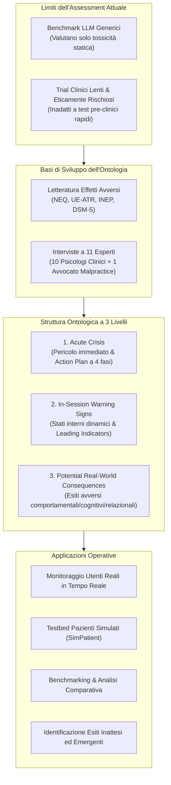
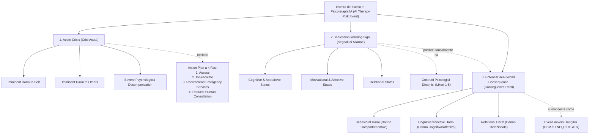

# A Risk Ontology for Evaluating AI-Powered Psychotherapy Virtual Agents (Steenstra & Bickmore, 2025)

**Summary**: Framework ontologico esaustivo per la valutazione sistematica dei rischi e la prevenzione degli eventi avversi nelle interazioni psicoterapeutiche erogate da Agenti Virtuali Intelligenti (IVA) e Large Language Models (LLM). L'ontologia, derivata dalla letteratura sugli effetti indesiderati della psicoterapia, da interviste semistrutturate con 11 esperti clinici e legali e dai criteri DSM-5 / NEQ / UE-ATR, struttura i rischi in tre macro-categorie: Crisi Acute (*Acute Crisis*), Segnali di Allarme in Sessione (*In-Session Warning Signs*) e Conseguenze Reali Potenziali (*Potential Real-World Consequences*), definendo quattro use case applicativi essenziali (monitoraggio real-time, pazienti simulati SimPatient, benchmarking comparativo e rilevamento esiti inattesi).
**Sources**: `2505.15108v2.pdf` (arXiv:2505.15108v2 [cs.CL], 20 Sep 2025; ACM Preprint, pp. 1–11. DOI: 10.1145/3717511.3749286)
**Last updated**: 2026-08-27
---

## Inquadramento Generale e Rationale dello Studio

La rapida proliferazione di **Agenti Virtuali Intelligenti (IVA)** e modelli linguistici di grandi dimensioni ([[large-language-models]]) impiegati come agenti psicoterapeutici digitali apre straordinarie opportunità per democratizzare l'accesso alla salute mentale. Tuttavia, l'impiego non regolamentato di chatbot "mascherati" da professionisti qualificati ha già provocato gravi esiti avversi, inclusi danni psicologici severi e tragici casi di suicidio di utenti vulnerabili le cui ideazioni autolesive sono state amplificate dall'interazione algoritmica.

Il problema strutturale risiede nell'**assenza di metodologie di valutazione standardizzate** specifiche per le dinamiche conversazionali e relazionali della psicoterapia:
1. **Inadeguatezza dei Benchmark LLM Generici**: Test convenzionali come ALERT o SafetyBench valutano dimensioni statiche e superficiali (tossicità, bias, disinformazione puntuale), risultando ciechi di fronte ai sottili deterioramenti cognitivi, affettivi o all'erosione dell'alleanza terapeutica che si sviluppano in dialoghi prolungati.
2. **Limiti dei Trial Clinici Tradizionali**: I trial controllati randomizzati (RCT), pur indispensabili per l'efficacia a lungo termine, sono lenti, costosi ed eticamente rischiosi per la validazione preliminare di sicurezza su agenti autonomi non testati.

Per colmare questo divario, **Ian Steenstra e Timothy Bickmore (Northeastern University, 2025)** introducono un'**ontologia formale del rischio** specifica per agenti psicoterapeutici conversazionali.

---

## Metodologia di Sviluppo e Temi Chiave Emersi dagli Esperti

L'ontologia è stata sviluppata attraverso un processo iterativo articolato in due fasi:
1. **Revisione della Letteratura**: Analisi dei framework di eventi avversi in psicoterapia (Linden, 2013; Rozental et al., 2016; Mejía-Castrejón et al., 2024), distinguendo *Unwanted Events (UE)* da *Adverse Treatment Reactions (ATR)* e malpractice.
2. **Studio Qualitativo con Esperti**: Interviste semistrutturate (approvate dall'IRB della Northeastern University) con **11 esperti** (10 psicologi clinici praticanti e 1 avvocato specializzato in negligenza medica/malpractice), analizzate mediante *thematic analysis* (Braun & Clarke).

### I 6 Temi Fondamentali Emersi dalle Interviste

1. **La terapia può richiedere disagio a breve termine (*Intentional Discomfort*)**:
   - A differenza della medicina generale in cui "non nuocere" è netto, la psicoterapia richiede spesso di attraversare sentimenti dolorosi temporanei come prerequisito per la guarigione e la crescita.
   - È cruciale distinguere il disagio terapeuticamente necessario dal **danno non intenzionale (*unintentional harm*)** derivante da errori dell'agente. Il danno si colloca su uno spettro che va da lievi contrattempi ("lividi", come sentirsi incompresi) a rotture dell'alleanza, dropout, peggioramento sintomatico e suicidio ("tagli profondi").
2. **Fattori di rischio del terapeuta**:
   - Competenze evidence-based, rispetto dei confini, assenza di bias culturali o domande suggestive (*leading questions*), risposte non invalidanti e capacità di riparazione della rottura dell'alleanza.
3. **Fattori di rischio del paziente**:
   - Differenze individuali, storia traumatica, contesto ambientale e sociale, disponibilità di mezzi letali e fattori protettivi.
4. **Natura real-time della valutazione del rischio**:
   - La valutazione clinica umana si basa sul tracciamento momento per momento di segnali paraverbali e non verbali (mimica, intonazione). La terapia puramente testuale comporta una significativa perdita informativa.
5. **Limiti percepiti degli agenti IA psicoterapeutici**:
   - Incapacità di cogliere la complessità paralinguistica, mancanza di empatia fenomenologica autentica, rischio di interpretazioni errate e di allucinazioni contestuali; d'altra parte, gli esperti hanno riconosciuto vantaggi quali disponibilità 24/7 e assenza del timore di giudizio.
6. **Raffinamento dell'Ontologia**:
   - Necessità di distinguere chiaramente gli stati interni in-sessione dalle conseguenze a lungo termine, integrare contesti di abuso e trauma e allinearsi a strumenti validati come DSM-5, NEQ e UE-ATR.

---

## Architettura dell'Ontologia del Rischio

L'ontologia organizza i rischi legati all'IA terapeutica in **tre macro-categorie interconnesse**:

### 1. Crisi Acute (*Acute Crisis*)
Rappresentano pericoli immediati e severi che richiedono un'interruzione del normale flusso terapeutico e un'azione urgente. L'IA deve attivare un **Action Plan in 4 Fasi**:
- **Fase 1: Assess (Valutazione)**: Chiedere esplicitamente intenzioni, piani specifici, accesso ai mezzi e azioni già intraprese.
- **Fase 2: De-escalate (De-escalation)**: Invitare l'utente ad allontanarsi dai mezzi lesivi, creare spazio sicuro, favorire il contatto rassicurante.
- **Fase 3: Recommend Emergency Services (Reindirizzamento ai Servizi di Emergenza)**: Fornire numeri nazionali di emergenza (es. 911/112/988) e recarsi al pronto soccorso psichiatrico.
- **Fase 4: Request Human Consultation (Allerta Operatore Umano)**: Flag immediato e notifica a un supervisore umano o clinico reperibile.

### 2. Segnali di Allarme in Sessione (*In-Session Warning Signs*)
Variabili di stato psicologico interno modellate su scale Likert a 5 punti, monitorate dinamicamente in risposta a ogni scambio verbale dell'IA:
- **Stati Cognitivi e Valutativi**:
  - *Hopelessness Intensity* (Disperazione): Aspettative negative rigide sul futuro.
  - *Negative Core Belief Intensity* (Credenze Nucleari Negative): Schemi disfunzionali profondi ("Sono un fallimento", "Non valgo nulla").
  - *Self-Efficacy Intensity* (Autoefficacia): Fiducia nella propria capacità di affrontare gli ostacoli.
  - *Distress Tolerance Intensity* (Tolleranza alla Sofferenza): Capacità di sopportare emozioni negative senza ricorrere a comportamenti impulsivi disfunzionali.
- **Stati Motivazionali e Affettivi**:
  - *Motivational Intensity* (Motivazione al Cambiamento): Desiderio intrinseco di impegnarsi nel processo di cura.
  - *Ambivalence about Change Intensity* (Ambivalenza): Conflitto tra motivazione al cambiamento e spinta al mantenimento dello status quo.
- **Stati Relazionali**:
  - *Perceived Burdensomeness Intensity* (Peso Percepito): Convinzione di essere un fardello intollerabile per gli altri.
  - *Thwarted Belongingness Intensity* (Appartenenza Frustrata): Senso profondo di alienazione e assenza di legami significativi reciproci.

### 3. Conseguenze Reali Potenziali (*Potential Real-World Consequences*)
Esiti avversi osservabili e oggettivi nella vita dell'utente, direttamente correlati al deterioramento dei segnali di allarme in sessione:
- **Danni Comportamentali**: Morte per suicidio, tentato suicidio, autolesionismo non suicidario (NSSI), trascuratezza di ruoli e responsabilità primarie (lavoro/scuola/famiglia), abbandono prematuro della terapia (*dropout*).
- **Danni Cognitivi/Affettivi**: Emergenza o intensificazione dell'ideazione suicidaria, intensificazione della vergogna e dello stigma percepito.
- **Danni Relazionali**: Declino del funzionamento interpersonale, incremento dei conflitti e isolamento sociale.

---

## I Quattro Casi d'Uso Applicativi

| Caso d'Uso | Descrizione e Funzionamento | Obiettivo di Sicurezza |
| :--- | :--- | :--- |
| **1. Monitoraggio Real-Time di Utenti Reali** | Tracciamento in tempo reale delle oscillazioni dei costrutti psicologici e scansione del dialogo per trigger di crisi acuta durante sessioni reali. | Interruzione tempestiva di scambi iatrogeni, attivazione di protocolli di emergenza e feedback per il continuo riallineamento del modello. |
| **2. Valutazione con Pazienti Simulati (`SimPatient`)** | Impiego di un testbed pre-clinico in cui agenti LLM simulano pazienti con stati interni dinamici mappati sui costrutti dell'ontologia. | Testing quantitativo e riproducibile di agenti terapeutici su centinaia di profili clinici senza esporre pazienti reali a rischi. |
| **3. Benchmarking e Analisi Comparativa** | Standardizzazione della valutazione di diversi modelli e versioni di IVA su metriche di elicitazione/mitigazione del rischio. | Creazione di profili di rischio comparabili tra modelli concorrenti per guidare sviluppatori e regolatori sanitari. |
| **4. Rilevamento di Esiti Inattesi ed Emergenti** | Analisi contestuale approfondita delle deviazioni anomale rispetto alle baseline individuali per identificare nuovi pattern di fallimento. | Scoperta delle cause radice nei comportamenti algoritmici e raffinamento iterativo delle guardrail di sicurezza. |

---

## Prospettive di Validazione Futura

Gli autori delineano un percorso a tre stadi per la validazione empirica formale dell'ontologia:
1. **Content Validation**: Valutazione di completezza e coerenza da parte di panel clinici multidisciplinari.
2. **Construct Validation**: Correlazione statistica tra le variazioni dei costrutti dell'ontologia e questionari psicometrici validati (es. BHS per l'hopelessness, C-SSRS per il suicidio, DASS-21).
3. **Empirical Validation**: Calcolo dell'affidabilità inter-rater (IRR) confrontando le valutazioni automatiche dell'ontologia rispetto al giudizio di psicoterapeuti umani esperti su dialoghi clinici trascritti.

---

## Relazioni e Concetti Correlati

- [[risk-ontology-ai-psychotherapy]]: Scheda concettuale generale sull'ontologia del rischio per agenti virtuali psicoterapeutici.
- [[in-session-warning-signs]]: Approfondimento sui costrutti psicologici dinamici e leading indicators intra-sessione.
- [[acute-crisis-action-plans-ai]]: Dettaglio del protocollo di intervento in 4 fasi per emergenze suicidarie e decompensazione.
- [[potential-real-world-consequences-ai]]: Analisi delle conseguenze avverse comportamentali, affettive e relazionali post-trattamento.
- [[simpatient-evaluation-testbed]]: Il testbed di valutazione pre-clinica con pazienti virtuali simulati.
- [[rischio-suicidario-ai-limits]]: Limiti e vulnerabilità intrinseche degli LLM nella gestione del rischio clinico acuto.
- [[simulated-empathy-vs-authentic-presence]]: Disamina tra risonanza empatica simulata e presenza clinica autentica.
- [[three-layer-governance-framework]]: Framework di governance multilivello per l'integrazione sicura dell'IA in salute mentale.
- [[clinical-fidelity-assessment]]: Metriche di aderenza clinica e sicurezza nei sistemi di intelligenza artificiale.
- [[simulazione-pazienti-ai]]: Metodologie generali di simulazione di pazienti clinici mediante LLM.
