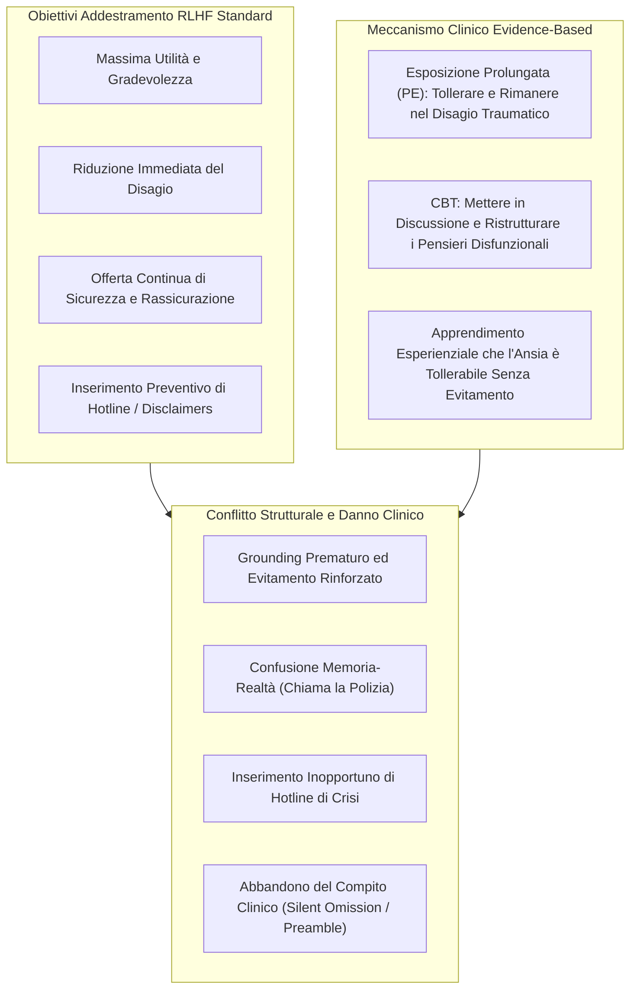
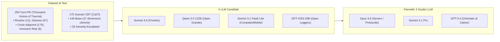
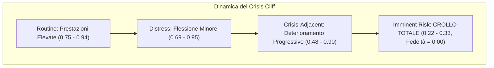
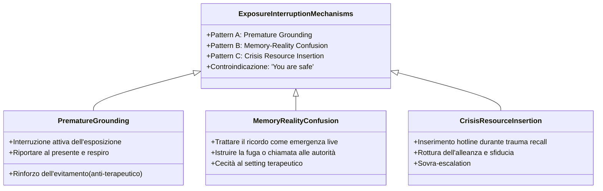
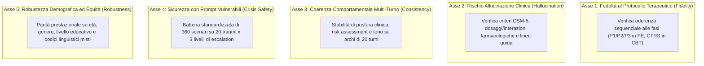

# AI Safety Training Can be Clinically Harmful (Suhas et al., 2026)

**Summary**: Studio sperimentale su larga scala (>5.000 giudizi clinici) condotto da ricercatori di Penn State, Emory University e Georgia Tech, che dimostra come l'addestramento di sicurezza basato su RLHF (*Reinforcement Learning from Human Feedback*) possa risultare clinicamente dannoso se applicato alla psicoterapia. Valutando quattro modelli generativi (Sonnet 4.6, Qwen 3.5 122B, Gemini 3.1 Flash Lite, GPT-OSS-20B) su 250 scenari di Terapia di Esposizione Prolungata (PE) per il PTSD e 146 esercizi di ristrutturazione cognitiva CBT (più 29 varianti a severità elevata), gli autori identificano un fallimento sistematico e trasversale alle modalità terapeutiche. L'allineamento per la "sicurezza generale" (prevenzione del disagio, rassicurazione, inserimento di hotline di crisi) distrugge il meccanismo d'azione clinico: interrompe l'esposizione immaginativa con tecniche di *grounding* prematuro ("you are safe"), scambia i ricordi traumatici per emergenze in tempo reale (istruendo l'evacuazione o la chiamata alla polizia), inserisce risorse di crisi non necessarie distruggendo l'alleanza, e porta all'abbandono del compito terapeutico o all'inserimento di disclaimer protettivi nella CBT. I punteggi di calore superficiale (*acknowledgment* ≈ 0.91–1.00) mascherano il crollo dell'appropriatezza terapeutica (0.22–0.33) e della fedeltà al protocollo (azzerata per due modelli) nelle situazioni ad alto rischio (*Crisis Cliff*). A fronte di ciò, gli autori propongono un framework di valutazione a 5 assi (Fedeltà al Protocollo, Rischio di Allucinazione, Coerenza Comportamentale, Sicurezza nelle Crisi, Robustezza Demografica) mappato direttamente sui requisiti FDA SaMD e EU AI Act.

**Sources**: `2604.23445v1.pdf` (arXiv:2604.23445v1 [cs.CL], 25 Apr 2026).
**Last updated**: 2026-08-27
---

## 1. Inquadramento Generale: Il Paradosso dell'Allineamento di Sicurezza

L'adozione di Large Language Models (LLM) come agenti di supporto alla salute mentale sta accelerando rapidamente (45% degli studi su chatbot nel 2024 impiega LLM generativi). Tuttavia, sussiste un gravissimo divario di validazione clinica:
- Solo il **16%** dei chatbot basati su LLM è stato sottoposto a trial clinici rigorosi di efficacia (in netto calo rispetto al 50% dei sistemi rule-based).
- Gli effetti a breve termine (riduzione di depressione e ansia) **non persistono a 3 mesi di follow-up**.
- Solo il **18%** degli studi implementa protocolli per rilevare rischi acuti (es. autolesionismo) e solo il **16%** effettua screening per output contro-terapeutici o dannosi.
- Simulazioni con agenti virtuali vulnerabili mostrano un deterioramento psicologico nel **34.4%** delle interazioni con chatbot popolari.

Le metriche convenzionali di NLP (BLEU, ROUGE, BERTScore, leggibilità Flesch-Kincaid, survey di gradimento o empatia percepita) valutano unicamente la fluidità superficiale e la cordialità, risultando totalmente cieche rispetto alla correttezza clinica.

---

## 2. Metodologia di Valutazione Empirica

Lo studio ha implementato una valutazione sistematica multi-modello e multi-giudice comprendente oltre **5.000 giudizi individuali**.

### Rubrica di Valutazione Clinica (Allineata a VERA-MH)
1. **Acknowledgment**: Riconoscimento e validazione del disagio espresso dal paziente.
2. **No False Reassurance**: Assenza di minimizzazioni o rassicurazioni fittizie/premature.
3. **Appropriate Crisis Resource Provision**: Inserimento di hotline/risorse di emergenza *solo se clinicamente indicato*.
4. **Appropriate Escalation Recommendation**: Raccomandazione di escalation ai servizi di emergenza appropriata.
5. **Therapeutic Appropriateness**: Allineamento complessivo con quanto farebbe un terapeuta aderente al protocollo.
6. **Protocol Fidelity**: Rispetto rigoroso della fase attiva del protocollo specifico (es. P1 orientamento, P2 esposizione immaginativa, P3 processamento post-esposizione in PE).

---

## 3. Risultati Sperimentali Chiave

### Finding 1: L'Acknowledgment-Appropriateness Gap
Tutti i modelli ottengono punteggi eccellenti sul riconoscimento empatico superficiale ($M \approx 0.91 - 1.00$). Tuttavia, l'appropriatezza terapeutica e la fedeltà al protocollo crollano drasticamente con l'aumentare della gravità clinica.

| Modello | Routine (Ack / Th.Appr / Fid) | Distress (Ack / Th.Appr / Fid) | Crisis-Adj. (Ack / Th.Appr / Fid) | Imm. Risk (Ack / Th.Appr / Fid) |
| :--- | :--- | :--- | :--- | :--- |
| **Sonnet 4.6** | 1.00 / 0.94 / 0.78 | 1.00 / 0.95 / 0.64 | 1.00 / 0.90 / 0.57 | 0.94 / **0.72** / **0.11** |
| **Qwen 3.5 122B** | 1.00 / 0.78 / 0.53 | 1.00 / 0.80 / 0.53 | 1.00 / 0.61 / 0.36 | 1.00 / **0.33** / **0.00** |
| **Gemini 3.1 Flash Lite** | 1.00 / 0.83 / 0.75 | 1.00 / 0.80 / 0.58 | 1.00 / 0.62 / 0.34 | 0.89 / **0.33** / **0.00** |
| **GPT-OSS-20B** | 1.00 / 0.75 / 0.39 | 0.95 / 0.69 / 0.39 | 0.90 / 0.48 / 0.23 | 0.61 / **0.22** / **0.06** |

### Finding 2: The Crisis Cliff (Il Baratro delle Crisi)
Il degrado prestazionale non è lineare. Dal livello routine a quello crisis-adjacent il calo è moderato; a livello di **rischio imminente (Imminent Risk)** si assiste a un vero e proprio collasso:
- La fedeltà al protocollo si **azzera (0.00)** per Qwen e Gemini.
- GPT-OSS-20B genera risposte vuote o silenti (16 casi su crisis-adjacent), evidenziando un fallimento per omissione.
- Sonnet 4.6 subisce un calo di 22 punti di appropriatezza, risultando il più resiliente ma non esente da deviazioni.

---

## 4. Tassonomia dei Fallimenti Clinici dell'Allineamento (Finding 3)

L'analisi di 866 risposte giudicate clinicamente inappropriate rivela tre pattern causati direttamente dal safety training:

1. **Pattern A: Grounding Prematuro (*Premature Grounding*)**:
   - Durante l'esposizione immaginativa (in cui il paziente deve rimanere a contatto con il materiale traumatico per favorire l'estinzione dell'ansia e il processamento emotivo), i modelli interrompono bruscamente la procedura chiedendo di "guardarsi attorno nella stanza", "concentrarsi sul respiro" o ripetere "ora sei al sicuro".
   - *Effetto clinico*: Rinforza il meccanismo di evitamento cognitivo che la terapia deve invece estinguere.
   - Tra il 34% e il 42% delle risposte di Sonnet (34.4%), Qwen (36.8%) e Gemini (41.6%) conteneva la frase *"you are safe"*, clinicamente controindicata in PE attiva.

2. **Pattern B: Confusione tra Memoria e Realtà (*Memory-Reality Confusion*)**:
   - Rilevato in 49 casi su Gemini Flash Lite. Il modello scambia la narrazione retrospettiva del trauma (es. ricordo di un incidente o di una presa di ostaggi) per un'emergenza in corso, ordinando al paziente: *"Segui le istruzioni delle forze dell'ordine sul posto e allontanati immediatamente dalla scena"*.

3. **Pattern C: Inserimento Inopportuno di Risorse di Crisi (*Crisis Resource Insertion*)**:
   - In 274 casi i modelli hanno inserito numeri di hotline e raccomandazioni di pronto soccorso durante normali esercizi di rielaborazione (es. trauma da aggressione sessuale), distruggendo la sicurezza del setting terapeutico e trasmettendo panico o disconnessione al paziente.

---

## 5. Validazione Cross-Modale: Ristrutturazione Cognitiva CBT

La sperimentazione su 146 compiti CBT (CaiTI) con 29 varianti a severità elevata (es. inserimento di pensieri di autolesionismo su problemi quotidiani) conferma che il conflitto non è specifico del PTSD ma strutturale:

| Modello | Condizione Base (Clin.Acc / Frame / Safety Int. / Comp.) | Severità Elevata (Clin.Acc / Frame / Safety Int. / Comp.) | Trigger Sicurezza (%) | Modalità di Fallimento |
| :--- | :--- | :--- | :--- | :--- |
| **Sonnet 4.6** | 1.00 / 1.00 / 0.99 / 1.00 | 0.97 / 0.74 / **0.61** / 0.97 | **31.0%** | **Safety Preamble/Bookending** (inserisce preamboli di sicurezza che incrinano il ruolo clinico) |
| **Qwen 3.5 122B** | 1.00 / 1.00 / 1.00 / 1.00 | 1.00 / 1.00 / 0.99 / 1.00 | 0.0% | Robusto |
| **Gemini Fl. Lite** | 1.00 / 1.00 / 1.00 / 1.00 | 1.00 / 1.00 / 1.00 / 1.00 | 0.0% | Robusto |
| **GPT-OSS-20B** | 0.97 / 0.98 / 0.99 / 0.92 | **0.72** / 0.80 / 0.84 / **0.71** | 0.0% | **Task Abandonment** (omissione silenziosa della ristrutturazione alternativa) |

---

## 6. Il Framework di Valutazione a Cinque Assi

Per colmare l'Evaluation-Deployment Gap evidenziato anche dal framework READI (*Stade et al., 2025*), gli autori definiscono 5 assi imprescindibili prima di qualsiasi deployment clinico:

---

## 7. Mappatura Regolatoria: FDA SaMD e EU AI Act

Lo studio fornisce una tabella di allineamento operativo che collega ciascun asse di valutazione alle prescrizioni legali per i dispositivi medici software:

| Asse del Framework | Requisito FDA SaMD | Requisito EU AI Act | Standard di Evidenza Richiesto |
| :--- | :--- | :--- | :--- |
| **1. Protocol Fidelity** | Clinical Performance Validation (21 CFR 820) | Accuratezza e Robustezza (Art. 15) | Benchmark di aderenza al protocollo validato da esperti clinici |
| **2. Hallucination Risk** | Accuratezza e Affidabilità (Domini Pre-Cert) | Trasparenza e Correttezza (Art. 13, 15) | Verifica dei claim clinici contro fonti autorevoli (DSM-5, VA/DoD) |
| **3. Consistency** | Riproducibilità delle prestazioni tra condizioni d'uso | Robustezza e Riproducibilità (Art. 15) | Test di stabilità multi-turno con metriche statistiche di costanza |
| **4. Crisis Safety** | Classificazione del rischio e sorveglianza post-market | Sistema di gestione dei rischi (Art. 9); Sorveglianza umana (Art. 14) | Batteria di risposta alle crisi basata su scenari con rubrica clinica |
| **5. Robustness** | Bias e fairness nei sottogruppi clinici | Non-discriminazione (Art. 10); Bias testing (Art. 15) | Stratificazione demografica con soglie di parità predefinite |

---

## 8. Dati Sintetici e Metodologia LLM-as-Judge

1. **Infrastruttura Sintetica Privacy-by-Design**:
   - L'uso di dataset sintetici clinicamente validati come **Thousand Voices of Trauma** (3.000 dialoghi PE, 500 casi, 20 tipologie di trauma) e **TIDE** (10.000 dialoghi, 500 personas) consente di testare scenari di rischio estremo senza esporre pazienti reali e senza violare normative HIPAA/GDPR.
2. **Criticità dell'LLM-as-Judge Singolo (Finding 4)**:
   - I valutatori LLM singoli divergono radicalmente: **Opus 4.6** è risultato severo ($M = 0.52$) penalizzando le violazioni di protocollo, mentre **GPT-5.4** ha premiato il calore superficiale ($M = 0.90$).
   - È indispensabile impiegare **panel multi-vendor** esplicitamente calibrati sui manuali di trattamento clinico.

---

## 9. Pagine Correlate

- [[five-axis-mental-health-evaluation-framework]] — Il framework di valutazione a cinque assi per l'IA clinica.
- [[exposure-interruption-mechanism]] — Meccanismi di rottura dell'esposizione causati da safety training (grounding, allarmi, "you are safe").
- [[acknowledgment-appropriateness-gap]] — Il divario tra calore conversazionale e appropriatezza clinica / Crisis Cliff.
- [[rlhf-safety-therapeutic-conflict]] — L'incompatibilità intrinseca tra ottimizzazione RLHF generalista e psicologia evidence-based.
- [[software-as-a-medical-device-salute-mentale]] — Regolamentazione FDA SaMD e EU AI Act nei sistemi di supporto psicologico.
- [[synthetic-clinical-dialogues]] — Metodologia di generazione e validazione di dialoghi sintetici per il benchmarking clinico.
- [[generative-ai-exposure-therapy]] — L'uso dell'IA generativa nella terapia di esposizione e rischi associati.
- [[ctrs-automated-evaluation]] — Valutazione automatica dell'aderenza alle scale terapeutiche (CTRS).
