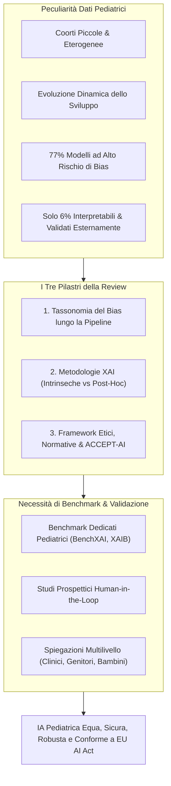
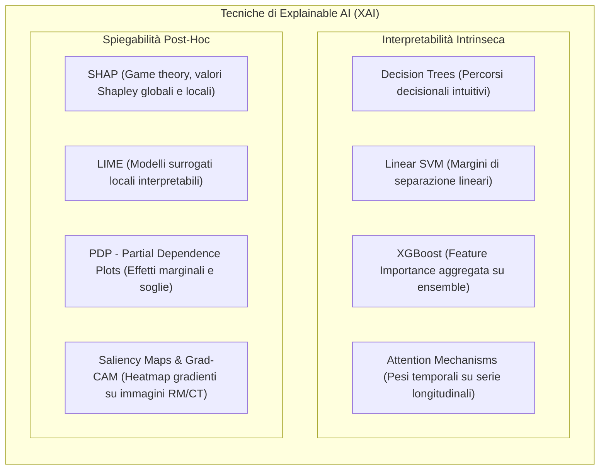
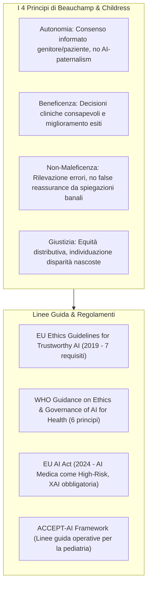

# Explainable AI: Ethical Frameworks, Bias, and the Necessity for Benchmarks (Verhoeven et al., 2026)

**Summary**: Articolo di revisione (European Journal of Pediatric Surgery, 2026) che esamina il ruolo cruciale dell'Explainable AI (XAI) nella chirurgia e medicina pediatrica. Il lavoro analizza le sfide specifiche delle popolazioni pediatriche (dati limitati, eterogenei e dinamici con il 77% dei modelli ad alto rischio di bias), mappa la tassonomia dei bias lungo l'intera pipeline algoritmica, confronta le metodologie di interpretabilità intrinseca e post-hoc (alberi, SVM, XGBoost, Attention, SHAP, LIME, PDP, Grad-CAM/Saliency maps), inquadra la spiegabilità all'interno dei quattro principi della bioetica (autonomia, beneficenza, non-maleficenza, giustizia) e dei requisiti normativi (EU AI Act per i sistemi ad alto rischio, ACCEPT-AI, linee guida UE e OMS), ed evidenzia la pressante necessità di benchmark dedicati e protocolli di validazione prospettica human-in-the-loop per garantire applicazioni di IA eque, sicure e clinicamente efficaci per l'infanzia.

**Sources**: `a-2702-1843.pdf` (*European Journal of Pediatric Surgery*, Vol. 36, pp. 168–173, 2026. DOI: 10.1055/a-2702-1843)
**Last updated**: 2026-08-27
---

## Inquadramento Generale e Obiettivi della Review

L'adozione dell'**Intelligenza Artificiale (IA)** e del **Machine Learning (ML)** nella medicina pediatrica e nella chirurgia infantile è in rapida espansione, offrendo opportunità senza precedenti per migliorare l'accuratezza diagnostica e la precisione prognostica. Applicazioni emergenti includono:
- **Computer vision per imaging medico**: classificazione di tumori cerebrali pediatrici tramite risonanza magnetica, cardiologia e rilevazione di fratture ossee (es. polso).
- **Modelli predittivi clinici**: anticipazione di complicanze acute quali appendicite, sepsi neonatale, enterocolite necrotizzante (NEC) nei prematuri ed esiti post-trapianto d'organo (cuore, fegato).

Tuttavia, le **popolazioni pediatriche presentano peculiarità biologiche, cliniche ed etiche uniche**: i dati clinici dei bambini sono intrinsecamente più scarsi, altamente eterogenei e in continua evoluzione a causa delle traiettorie di sviluppo somatico e cognitivo. Questa complessità rende i modelli soggetti a **overfitting**, riducendone la generalizzabilità tra diverse fasce d'età. Revisioni sistematiche indicano che **fino al 77% dei modelli di IA in pediatria presenta un alto rischio di bias**, e solo il **6% dei modelli in chirurgia pediatrica risulta contemporaneamente interpretabile ed esternamente validato**.

In questo contesto, l'**Explainable AI (XAI)** — che mira a rendere trasparenti e comprensibili i meccanismi decisionali dei modelli algoritmici — non rappresenta un mero perfezionamento tecnico, bensì un **imperativo etico, clinico e giuridico**.

---

## 1. La Tassonomia del Bias nell'IA Pediatrica

Il bias non è un fenomeno isolato, ma può infiltrarsi in **ogni fase della pipeline di machine learning**, amplificando le disparità di salute infantile se non tempestivamente rilevato e corretto:

### A. Raccolta Dati e Rappresentazione (*Data Collection Bias*)
- **Sbilanciamento verso centri terziari**: I dataset derivano spesso da ospedali specialistici di terzo livello, sovrarappresentando casi pediatrici rari o complessi e sottorappresentando la casistica di routine.
- **Esclusione di comorbidità**: I protocolli di ricerca spesso escludono bambini con patologie concomitanti, limitando l'applicabilità al mondo reale.
- **Divario geografico e socioeconomico (Bias WEIRD/HIC)**: La maggioranza della ricerca si basa su dati di nazioni occidentali ad alto reddito (*High-Income Countries*), ignorando le specificità dei paesi a basso e medio reddito (*LMICs*) e dei gruppi minoritari.

### B. Etichettatura dei Dati (*Labeling Bias*)
- L'apprendimento supervisionato richiede annotazioni cliniche che possono essere viziate da **bias cognitivi**:
  - *Attribution bias*: tendenza del medico a basarsi sulle proprie assunzioni pregresse.
  - *Availability bias*: influenza sproporzionata dei casi più facilmente richiamabili alla memoria, accentuata dallo stress e dai carichi di lavoro ospedalieri.
- Questi errori si cristallizzano nella *ground truth*, deformando l'apprendimento del modello.

### C. Sviluppo del Modello (*Model Development Bias*)
- Algorithmic bias derivante dalla selezione di iperparametri o metriche di performance non bilanciate tra sottogruppi d'età.
- *Confirmation bias*: gli sviluppatori possono favorire inconsciamente architetture che confermano aspettative preconcette.

### D. Post-Deployment e Cicli di Feedback (*Automation Bias*)
- **Automation bias**: tendenza dei medici a fare eccessivo affidamento sulle predizioni algoritmiche, anche quando errate.
- **Feedback loops negativi**: decisioni cliniche influenzate da output distorti generano nuovi dati clinici che, usati per il retraining del modello, amplificano e perpetuano le iniquità nel tempo.

---

## 2. Tecniche di Explainable AI (XAI) in Chirurgia Pediatrica

La review classifica i metodi di spiegabilità in due grandi categorie: **Interpretabilità Intrinseca** (modelli trasparenti per progettazione) e **Spiegabilità Post-Hoc** (tecniche surrogate applicate a modelli black-box).

### Confronto Sinottico delle Tecniche XAI

| Tecnica XAI | Categoria | Output Tipico | Esempi d'Uso in Chirurgia Pediatrica | Punti di Forza | Limiti |
| :--- | :--- | :--- | :--- | :--- | :--- |
| **Alberi Decisionali** | Intrinseca, model-specific | Percorsi decisionali aggregati, feature importance | Predizione del rischio di sepsi pediatrica | Altamente intuitivo per il clinico | Meno accurato su dati complessi e non lineari, rischio overfitting |
| **Support Vector Machines (SVM) lineari** | Intrinseca, model-specific | Confini di decisione, vettori di supporto, importanza feature | Predizione di complicanze post-operatorie | Gestisce dati ad alta dimensionalità | Meno intuitivo degli alberi, limitato alle relazioni lineari |
| **XGBoost (Ensemble di alberi)** | Intrinseca, model-specific | Feature importance globale e per splitting | Predizione esiti riabilitativi post-chirurgia spinale (parametri sagittali e self-image) | Elevata potenza predittiva e quantificazione contributi | Maggiore complessità rispetto a singoli alberi |
| **Meccanismi di Attenzione** | Intrinseca (modelli sequenziali) | Pesi di attenzione su finestre temporali | Monitoraggio parametri vitali per predizione precoce di NEC | Cattura pattern temporali e dinamiche longitudinali | Meno direttamente interpretabile per il clinico non specialista |
| **SHAP (Shapley Additive Explanations)** | Post-hoc, model-agnostic | Valori Shapley di attribuzione per singola feature | Predizione del rischio di malnutrizione post-cardiochirurgia congenita | Solida base teorica (teoria dei giochi), consistente a livello globale e locale | Computazionalmente oneroso; correlazione non equivale a causalità |
| **LIME (Local Interpretable Model-agnostic Explanations)** | Post-hoc, model-agnostic | Coefficienti del surrogato locale | Spiegazione di predizioni individuali in modelli di rischio chirurgico e autismo | Intuitivo per spiegazioni locali caso per caso | Stabilità variabile; limitato al contesto locale |
| **Partial Dependence Plots (PDP)** | Post-hoc, model-agnostic | Curve di dipendenza parziale marginale | Analisi dell'effetto di biomarcatori su esiti di trapianto | Rileva effetti soglia e relazioni non lineari | Assume indipendenza tra le feature analizzate |
| **Saliency Maps / Grad-CAM** | Post-hoc, model-specific (CNN) | Mappe di calore (*heatmaps*) anatomiche | Classificazione di tumori cerebrali pediatrici su risonanza magnetica | Visualizzazione spaziale immediata delle regioni d'interesse per il radiologo | Può risultare rumoroso, rischio di evidenziare feature spurie o irrilevanti |

---

## 3. Framework Etici e Normativi per l'IA Pediatrica

L'implementazione clinica dell'XAI deve essere radicata nei principi bioetici e rispettare le nuove normative internazionali:

### A. I Quattro Principi di Bioetica Applicati all'XAI
1. **Autonomia**: Nei pazienti pediatrici, l'autonomia è mediata da genitori o tutori. Modelli black-box impediscono una comprensione reale delle scelte terapeutiche, rischiando di generare un **"AI-paternalism"** (il medico prende decisioni basandosi acriticamente sull'algoritmo senza coinvolgere la famiglia). L'XAI restituisce trasparenza per decisioni informate e condivise.
2. **Beneficenza**: Fornisce al clinico le motivazioni logiche della predizione per personalizzare la terapia ed elevare lo standard di cura.
3. **Non-maleficenza ("Primum non nocere")**: La spiegabilità aiuta a intercettare errori e allucinazioni. Tuttavia, gli autori avvertono contro il rischio di **falsa rassicurazione (*false reassurance*)**: spiegazioni eccessivamente semplificate o compiacenti possono indurre una fiducia ingiustificata in un modello difettoso.
4. **Giustizia**: La trasparenza permette di verificare che le performance del modello siano eque tra diverse etnie, sessi e fasce socioeconomiche.

### B. Obblighi Normativi: EU AI Act e ACCEPT-AI
- **EU AI Act (in vigore da agosto 2024)**: Classifica i dispositivi medici basati su IA come **"sistemi ad alto rischio" (*High-Risk AI Systems*)**. La legge impone requisiti stringenti di trasparenza, spiegabilità tecnica e supervisione umana (*human oversight*), trasformando l'XAI da raccomandazione metodologica a **standard legale obbligatorio**.
- **ACCEPT-AI Framework**: Framework specifico per la pediatria (Muralidharan et al., 2023) che definisce le linee guida operative per la governance dei dati infantili, la sorveglianza clinica continua e la formulazione di spiegazioni adeguate all'età (*age-appropriate explanations*).

---

## 4. La Necessità di Benchmark Standardizzati per l'XAI Pediatrico

Nonostante la disponibilità di metodi XAI, il settore soffre di un **profondo gap metodologico**:
1. **Correlazione vs Causalità**: I metodi XAI attuali quantificano associazioni statistiche, ma non stabiliscono nessi di causa-effetto. Decisioni cliniche basate unicamente su correlazioni possono rivelarsi inefficaci o dannose.
2. **Confirmation Bias del Medico**: I clinici tendono a interpretare le spiegazioni fornite dall'IA come conferme delle proprie convinzioni a priori.
3. **Difficoltà di Comunicazione Multi-Audience**: Le spiegazioni tecniche devono essere calibrate per tre pubblici distinti: il chirurgo/pediatra (dettaglio clinico), i genitori (comprensibilità decisionale) e, ove possibile, il bambino stesso (comunicazione accessibile e rassicurante).
4. **Limiti dei Benchmark Esistenti**: Framework come **BenchXAI** (dati biomedici multimodali) e **XAIB** (benchmark modulare post-hoc) valutano la fedeltà e la stabilità delle spiegazioni, ma sono tarati su popolazioni adulte e non riflettono la complessità fisiologica ed evolutiva pediatrica.

---

## 5. Prospettive Future e Raccomandazioni

Gli autori delineano quattro priorità strategiche per la ricerca e l'implementazione:
1. **Sviluppo di Modelli Intrinsecamente Interpretabili e Metodi di Inferenza Causale**: Superare la dipendenza da modelli black-box opachi a favore di architetture trasparenti e causali.
2. **Creazione di un Benchmark Pediatrico Dedicato per XAI**: Sviluppare dataset aperti standardizzati e compiti clinici di riferimento per confrontare oggettivamente le tecniche di spiegabilità in pediatria.
3. **Studi Prospettici Human-in-the-Loop**: Condurre trial clinici prospettici che coinvolgano attivamente pediatri, chirurghi, infermieri e famiglie per misurare l'usabilità reale delle spiegazioni.
4. **Valutazione Longitudinale degli Esiti Clinici**: Misurare se l'introduzione di strumenti XAI migliori effettivamente la sopravvivenza, riduca le complicanze post-operatorie e ottimizzi la qualità di vita a lungo termine dei bambini.

---

## Riferimenti Bibliografici Principali

- **Verhoeven, R., Bouisaghouane, W., & Hulscher, J. B. F. (2026)**. Explainable AI: Ethical Frameworks, Bias, and the Necessity for Benchmarks. *European Journal of Pediatric Surgery*, 36(1), 168–173. DOI: [10.1055/a-2702-1843](https://doi.org/10.1055/a-2702-1843)
- **Elahmedi, M., et al. (2024)**. The state of artificial intelligence in pediatric surgery: a systematic review. *J Pediatr Surg*, 59(5), 774–782.
- **Muralidharan, V., et al. (2023)**. Recommendations for the use of pediatric data in artificial intelligence and machine learning ACCEPT-AI. *NPJ Digit Med*, 6(1), 166.
- **Metsch, J. M., & Hauschild, A. C. (2025)**. BenchXAI: comprehensive benchmarking of post-hoc explainable AI methods on multi-modal biomedical data. *Comput Biol Med*, 191, 110124.
- **Goncharenko, I., et al. (2025)**. Open and extensible benchmark for explainable artificial intelligence methods. *Algorithms*, 18(2), 85.
- **Beauchamp, T. L., & Childress, J. F. (2001)**. *Principles of Biomedical Ethics* (5th ed.). Oxford University Press.
- **European Commission (2024)**. *Artificial Intelligence Act*. High-Risk AI System Guidelines.

---

## Pagine e Concetti Correlati

- [[xai-in-pediatric-surgery]]: Metodologie di explainable AI (intrinseche vs post-hoc) e applicazioni cliniche in chirurgia pediatrica.
- [[pediatric-ai-bias-and-vulnerabilities]]: Pipeline del bias (dati, etichettatura, sviluppo, deployment) e vulnerabilità dello sviluppo pediatrico.
- [[accept-ai-and-pediatric-ethical-frameworks]]: Principi bioetici, conformità al regolamento EU AI Act e linee guida operative ACCEPT-AI.
- [[pediatric-xai-benchmarking]]: Standardizzazione della valutazione di fedeltà e stabilità delle spiegazioni (BenchXAI, XAIB) e validazione clinica prospettica.
- [[ai-clinical-decision-support]]: Sistemi di supporto decisionale clinico e integrazione nei workflow sanitari.
- [[algorithmic-bias-and-digital-inequalities]]: Disparità algoritmiche, campionamento WEIRD e impatto sui gruppi vulnerabili.
- [[etica-privacy-bias-ia-clinica]]: Fondamenti etico-deontologici e tutela della privacy nei sistemi intelligenti sanitari.
- [[three-layer-governance-framework]]: Modelli di governance a tre livelli per l'adozione sicura dell'IA.
