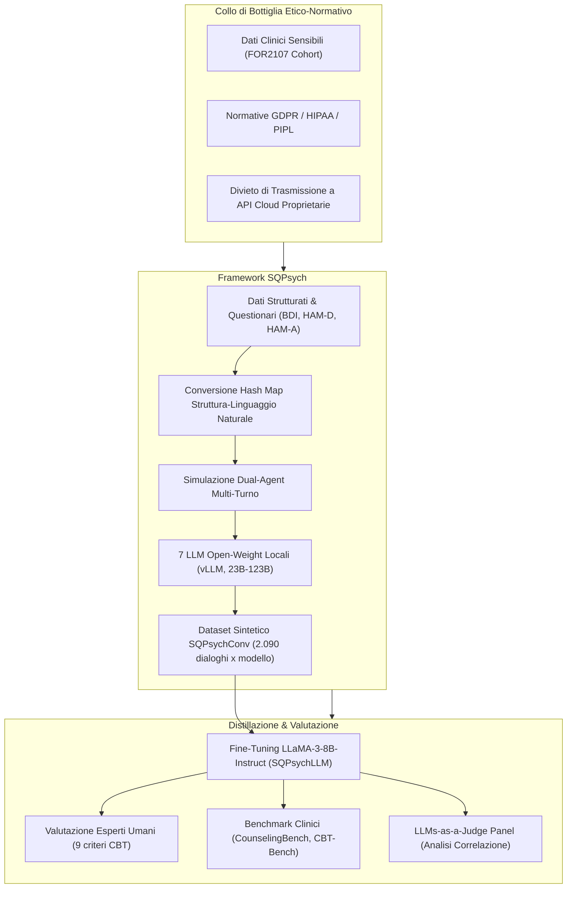
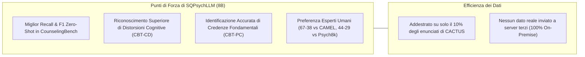

# Roleplaying with Structure: Synthetic Therapist-Client Conversation Generation from Questionnaires (Vu et al., 2025)

**Summary**: Presentazione di **SQPsych** (*Structured Questionnaire-based Psychotherapy*), una pipeline multi-agente innovativa per la generazione di dialoghi clinici sintetici terapeuta-paziente basati sui principi della Terapia Cognitivo-Comportamentale (CBT) per disturbi depressivi (MDD) e d'ansia. Per rispettare le rigide normative sulla privacy (GDPR, HIPAA, PIPL) ed evitare la trasmissione di dati clinici sensibili ad API proprietarie terze, il framework impiega sette LLM open-weight (23B–123B) ospitati localmente per convertire profili strutturati e questionari psicometrici reali (BDI, HAM-D, HAM-A) in linguaggio naturale, simulando conversazioni multi-turno mediante un'architettura a doppio agente (Dual-Role Generation). Il corpus generato (**SQPsychConv**) viene distillato per fine-tunare modelli compatti da 8B (**SQPsychLLM**), che dimostrano prestazioni superiori ai modelli commerciali e baselines di settore nei benchmark clinici (*CounselingBench*, *CBT-Bench*) e nella preferenza espressa da psicoterapeuti esperti.
**Sources**: `2510.25384v1.pdf` (*arXiv:2510.25384v1 [cs.CL]*, 29 Oct 2025. Code/Data: https://ai-mh.github.io/SQPsych)
**Last updated**: 2026-08-27
---

## Inquadramento e Sfide della Ricerca

L'avanzamento dell'Intelligenza Artificiale applicata alla salute mentale è fortemente ostacolato dalla **carenza cronica di trascrizioni autentiche di colloqui clinici e psicoterapeutici**:
1. **Vincoli di Riservatezza e Governance dei Dati**: Normative internazionali e nazionali stringenti come HIPAA (USA), GDPR (UE) e PIPL (Cina) impongono la massima tutela del segreto professionale e vietano l'invio di cartelle cliniche e questionari psicodiagnostici a infrastrutture cloud terze o servizi API commerciali non auditati (es. OpenAI).
2. **Assenza Storica di Registrazioni Sistematiche**: Nella pratica clinica convenzionale, le sedute psicoterapeutiche non sono routinariamente registrate o trascritte; le informazioni vengono distillate dai clinici sotto forma di questionari standardizzati e note di anamnesi.
3. **Limiti degli Approcci Precedenti**: Framework sintetici come CACTUS e SMILE si sono affidati a modelli proprietari centralizzati (GPT-4o, ChatGPT) con simulazione mono-agente (un singolo modello che genera sia terapeuta che paziente), violando le policy di privacy ospedaliere e producendo dinamiche simulative meno sfumate.

---

## Architettura e Metodologia di SQPsych

SQPsych implementa una catena computazionale completa per convertire profili clinici tabulari in interazioni dialogiche ad alta fedeltà terapeutica.

### 1. Condizionamento e Conversione dei Dati Strutturati
Il dataset di partenza comprende le valutazioni cliniche e demografiche di **2.090 individui** (coorte di controllo vs. Major Depressive Disorder - MDD) raccolte nelle cliniche universitarie di Marburgo e Münster (*FOR2107 consortium*, Kircher et al., 2019):
- **Attributi Demografici e Clinici**: Età, genere, istruzione, occupazione, anamnesi familiare, età di esordio, durata dell'episodio depressivo.
- **Scale Psicometriche Standardizzate**:
  - *Beck Depression Inventory (BDI)*: 21 item che valutano sintomi cognitivi, affettivi e somatici (es. pessimismo, senso di colpa, autosvalutazione, insonnia).
  - *Hamilton Depression Rating Scale (HAM-D)* e *Hamilton Anxiety Rating Scale (HAM-A)*.
- **Mappatura Semantica Struttura-Linguaggio**: I valori numerici e categorici vengono tradotti in descrizioni estese in linguaggio naturale tramite una funzione di hash mapping esplicita (es. `HAMD2 = 2` $\rightarrow$ *"Il paziente riporta persistenti sentimenti di colpa ed espiazione"*), consentendo all'LLM di interiorizzare il quadro clinico senza errori di decodifica tabulare.

### 2. Strategia di Generazione a Doppio Agente (Dual-Role Strategy)
A differenza dei modelli a singolo generatore, SQPsych separa nettamente le due entità cognitive:
- **Client LLM (Paziente Virtuale)**:
  - Condizionato sul profilo anamnestico e sui questionari convertiti.
  - Istruito a manifestare emozioni autentiche, esitazioni, pause contestuali (*"uh"*, *"like"*), risposte concise (< 128 parole) e reticenze coerenti con il livello di gravità BDI/HAM-D.
- **Therapist LLM (Terapeuta CBT Virtuale)**:
  - Condizionato sul workflow strutturato della CBT: (1) Controllo dell'umore (*mood check*), (2) Definizione dell'agenda, (3) Riformulazione del modello cognitivo, (4) Discussione del piano d'azione/obiettivi, (5) Raccolta di feedback finale.
  - Applicazione rigorosa di competenze CBT: validazione ed empatia, identificazione di credenze centrali e distorsioni cognitive, scoperta guidata (*Socratic questioning*), ristrutturazione cognitiva e reframing auto-compassionevole.
  - Vincoli di brevità (< 64 parole) e divieto di limitarsi a porre domande prive di interventi di validazione/paraphrasing.

### 3. Workflow di Generazione Turn-by-Turn e Criterio di Arresto
1. Il terapeuta genera l'enunciato di apertura.
2. Il paziente risponde sulla base dell'input e della propria anamnesi.
3. Lo storico conversazionale completo viene integrato dinamicamente a ogni turno.
4. Per garantire profondità clinica, la sessione deve durare un minimo di **15 turni** prima che il terapeuta possa emettere il token di terminazione `[/END]`.
5. Post-processing tramite espressioni regolari per rimuovere meta-commentari e ridondanze.

---

## Modelli Open-Weight e Risorse Rilasciate

Per garantire la conformità normativa e l'isolamento dei dati sensibili, tutti i modelli sono stati eseguiti on-premise su cluster locale (4x GPU NVIDIA A100 80GB in configurazione BF16 via runtime `vLLM`):

| Modello Generatore | Checkpoint Open-Weight | Parametri | Turni Medi | Token / Utterance |
| :--- | :--- | :--- | :--- | :--- |
| **mistral** | `mistralai/Mistral-Large-Instruct-2407` | 123B | 23.12 | 31.10 |
| **command** | `CohereLabs/c4ai-command-a-03-2025` | 111B | 17.45 | 51.02 |
| **qwen2.5** | `Qwen/Qwen2.5-72B-Instruct` | 72B | 15.53 | 34.49 |
| **llama3.3** | `meta-llama/Llama-3.3-70B-Instruct` | 70B | 24.60 | 32.63 |
| **nemotron** | `nvidia/Llama-3_3-Nemotron-Super-49B-v1` | 49B | 15.91 | 51.43 |
| **qwq** | `Qwen/QwQ-32B` | 32B | 18.60 | 26.29 |
| **gemma** | `google/gemma-3-27b-it` | 27B | 17.00 | 51.79 |

- **Dataset SQPsychConv**: 2.090 sessioni multi-turno per ciascuno dei 7 modelli (suddivise in Train: 1.693, Dev: 144, Test: 253).
- **Distillazione SQPsychLLM**: Fine-tuning di `Llama-3-8B-Instruct` su ciascun sotto-corpus sintetico in BF16, ottenendo modelli compatti ed efficienti con spiccate capacità di counseling clinico.

---

## Valutazione e Risultati Sperimentali

La validazione ha combinato la valutazione qualitativa e quantitativa da parte di psicoterapeuti professionisti, panel di LLM-as-a-judge e benchmark standardizzati di settore.

### 1. Valutazione degli Esperti Clinici Umani
Tre psicoterapeuti accreditati hanno valutato 35 dialoghi completi (*SQPsychConv-sampled-test*) su 9 dimensioni terapeutiche (scala 0–2 per item, massimo 18 punti):
- **Classifica Clinica**: **SQPsychConv-qwen2.5** ha ottenuto il punteggio massimo (**16.4 ± 1.74**), seguito da **gemma** (**15.9 ± 1.38**), superando nettamente modelli più grandi come llama3.3 (13.5) e mistral (14.2).
- **Feedback Qualitativo**: Gli esperti hanno elogiato la capacità del terapeuta sintetico di individuare schemi di svalutazione (*Self-Dislike* e *Self-Criticalness* da BDI items 7-8), eseguire reality checks e introdurre ristrutturazioni cognitive graduali (*"Let's gently challenge this dichotomy"*). Hanno raccomandato una maggiore semplificazione del linguaggio per non sovraccaricare il paziente.

### 2. Benchmark di Competenze di Counseling e CBT
Confronto tra i modelli distillati **SQPsychLLM (8B)** e le baseline di riferimento (**MentaLLaMA**, **CAMEL-8B** addestrato su CACTUS/GPT-4o, **Psych8k**):

| Modello | CounselingBench (Zero-shot F1) | CounselingBench (CoT F1) | CBT-CD (F1) | CBT-PC (F1) | CBT-FC (F1) |
| :--- | :--- | :--- | :--- | :--- | :--- |
| **MentaLLaMA** | 0.418 | 0.321 | 0.140 | 0.440 | 0.267 |
| **CAMEL** (GPT-4o synth) | 0.301 | **0.606** | 0.325 | 0.624 | **0.392** |
| **Psych8k** (Real-world) | 0.455 | 0.557 | 0.326 | 0.727 | 0.341 |
| **SQPsychLLM-command** | 0.439 | 0.558 | 0.317 | **0.727** (R: 0.849) | 0.316 |
| **SQPsychLLM-gemma** | **0.484** (R: 0.492) | 0.568 | **0.345** (R: 0.555) | 0.708 | 0.351 |
| **SQPsychLLM-nemotron** | 0.480 | 0.553 | 0.249 | **0.737** | 0.318 |
| **SQPsychLLM-qwq** | 0.460 | 0.550 | 0.310 | 0.707 | 0.348 |

- **CBT-CD** (*Cognitive Distortions*, 10 categorie): SQPsychLLM-gemma ottiene il miglior Recall (0.555) ed F1 (0.345).
- **CBT-PC** (*Primary Core Beliefs*, es. impotente, non amabile, privo di valore): I modelli SQPsych superano tutte le baseline, con Recall fino a 0.849 e F1 di 0.737.
- **CounselingBench** (1.612 quesiti di esame clinico NCMHCE): SQPsychLLM eccelle nella modalità diretta zero-shot, mentre CAMEL trae maggiore vantaggio dal Chain-of-Thought (CoT).

### 3. Valutazione di Preferenza Umana e di Panel LLM (CounselBench-Adv)
Nei confronti diretti pairwise a doppio cieco su 120 scenari avversariali di *CounselBench-Adv*:
- **SQPsychLLM-gemma vs. CAMEL**: Vinto da SQPsychLLM con **84 a 22** secondo gli esperti umani (e 62 a 10 secondo GPT-4o).
- **SQPsychLLM-gemma vs. Psych8k**: Vinto da SQPsychLLM con **44 a 29** (47 pareggi) secondo gli esperti umani (e 72 a 47 secondo GPT-4o).
- *Ragioni degli esperti*: SQPsych adotta un approccio più maieutico e rispettoso dei tempi del paziente, evitando di imporre spiegazioni psicoeducative precoci o soverchianti.

### 4. Analisi di Correlazione tra Giudici LLM ed Esperti Umani
- I giudici automatici (**GPT-4o, GPT-4o-mini, Gemini-2.0-Flash, DeepSeek-V3**) mostrano un'alta correlazione interna inter-modello ($r = 0.40 - 0.57$).
- Tuttavia, la correlazione tra giudici LLM ed esperti clinici umani è solo **moderata** ($r \approx 0.40 - 0.41$ con GPT-4o e Gemini-2.0-Flash; quasi nulla con GPT-4o-mini).
- *Implicazione metodologica*: Gli LLM-judge tendono a premiare la loquacità e l'articolazione formale, mentre i clinici premiano l'appropriatezza pragmatica, la sintonizzazione emotiva e la gestione dei tempi. La supervisione umana resta indispensabile.

---

## Limiti e Considerazioni Etiche

1. **Copertura Clinica Focalizzata**: Il dataset è focalizzato principalmente su Depressione Maggiore (MDD) e quadri ansiosi; altre condizioni complesse (es. disturbo bipolare, schizofrenia) richiedono coorti dedicate.
2. **Omogeneità del Campione**: I questionari provengono da un unico consorzio clinico tedesco (FOR2107), pur comprendendo oltre 2.000 casi standardizzati.
3. **Valutazione Prevalente Single-Turn per Benchmark**: Molti benchmark automatici operano su singoli turni, mentre la psicoterapia richiede la valutazione longitudinale delle dinamiche multi-turno e dei segnali non verbali/prosodici.
4. **Fase di Ricerca e Sicurezza Clinica**: I modelli SQPsychLLM sono rilasciati esclusivamente per scopi di ricerca e formazione, e non sono autorizzati per l'impiego autonomo su pazienti reali senza supervisione umana.

---

## Riferimenti Bibliografici
- Vu, D. N. L., Tan, R., Moench, L., Francke, S. J., Woiwod, D., Thomas-Odenthal, F., Stroth, S., Kircher, T., Hermann, C., Dannlowski, U., Jamalabadi, H., & Ji, S. (2025). Roleplaying with Structure: Synthetic Therapist-Client Conversation Generation from Questionnaires. *arXiv preprint arXiv:2510.25384v1 [cs.CL]*.
- Beck, A. T. (1963). Thinking and depression: I. Idiosyncratic content and cognitive distortions. *Archives of General Psychiatry*, 9(4), 324–333.
- Hamilton, M. (1980). Rating depressive patients. *The Journal of Clinical Psychiatry*, 41(12 Pt 2), 21–24.
- Kircher, T., et al. (2019). Neurobiology of the major psychoses: A translational perspective on brain structure and function—the FOR2107 consortium. *European Archives of Psychiatry and Clinical Neuroscience*, 269(8), 949–962.
- Lee, S., et al. (2024). CACTUS: Towards psychological counseling conversations using cognitive behavioral theory. In *Findings of EMNLP 2024*, pages 14245–14274.
- Nguyen, V. C., et al. (2025). Do large language models align with core mental health counseling competencies? In *Findings of NAACL 2025*, pages 7488–7511.
- Zhang, M., et al. (2025). CBT-Bench: Evaluating large language models on assisting cognitive behavior therapy. In *Proceedings of NAACL-HLT 2025*, pages 3864–3900.

---

## Pagine e Concetti Correlati
- [[sqpsych-framework]]: Architettura dettagliata del framework SQPsych e del dataset SQPsychConv.
- [[conversione-questionari-dialoghi-clinici]]: Metodologia di hash-mapping per convertire scale psicometriche (BDI, HAM-D) in linguaggio naturale.
- [[open-weight-privacy-compliant-synthesis]]: Protocolli di generazione sicura con LLM open-weight locali in conformità a GDPR e HIPAA.
- [[counseling-benchmarks-evaluation]]: Metodologie di valutazione clinica (CounselingBench, CBT-Bench, LLM Panels vs. Esperti).
- [[synthetic-clinical-dialogues]]: Panoramica generale sulla generazione computazionale di dialoghi clinici sintetici.
- [[cognitive-distortion-detection]]: Identificazione e classificazione automatizzata delle distorsioni cognitive nel dialogo.
- [[cbt-dialogue-systems-and-tools]]: Sistemi conversazionali basati sui principi della Terapia Cognitivo-Comportamentale.
- [[etica-privacy-bias-ia-clinica]]: Sfide etiche, privacy dei dati del paziente e mitigazione dei bias algoritmici.
