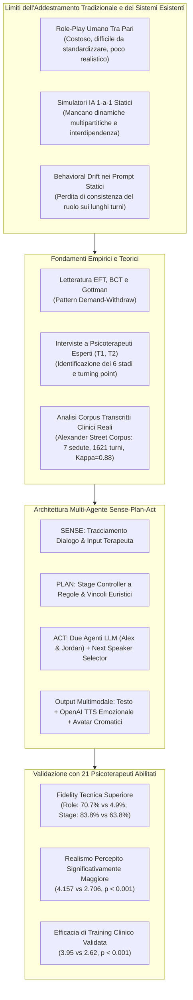
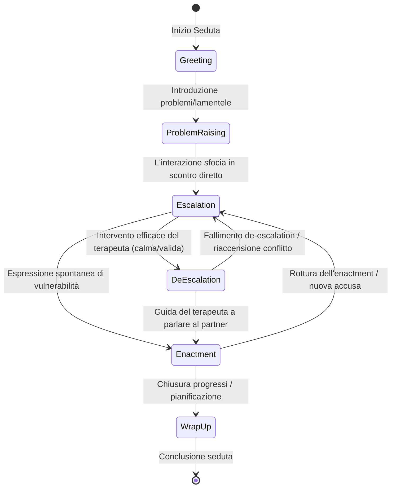
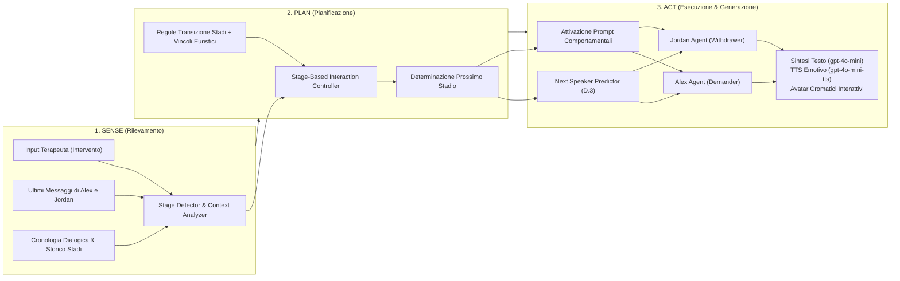
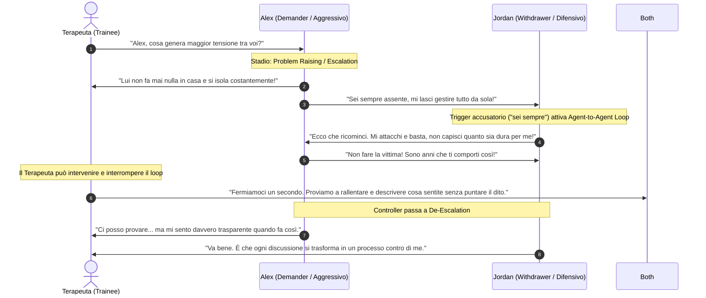

# Simulating Couple Conflict: Designing A Multi-Agent System for Therapy Training and Practice (Wang, Chen et al., 2026)

**Summary**: Studio pionieristico che presenta la progettazione, implementazione e validazione clinica di un sistema di simulazione multi-agente e multimodale per il training di psicoterapeuti nella terapia di coppia. Superando i simulatori basati su singoli pazienti e prompt statici, il sistema modella la terapia di coppia come un sistema dinamico controllato a tre partecipanti (terapeuta + 2 pazienti virtuali) imperniato sul ciclo conflittuale *demand–withdraw* e strutturato su sei stadi interattivi non lineari (Greeting, Problem Raising, Escalation, De-escalation, Enactment, Wrap-up). Attraverso un'architettura *Sense-Plan-Act*, uno stage controller esplicito traccia l'andamento della seduta, gestisce il turn-taking triadico e attiva istruzioni comportamentali, prosodiche ed emotive differenziate per i due agenti (Alex il demander e Jordan il withdrawer). In uno studio sperimentale within-subjects con 21 psicoterapeuti abilitati negli Stati Uniti, il sistema ha dimostrato una fedeltà comportamentale (70.7% vs 4.9%) e di stadio (83.8% vs 63.8%) nettamente superiore alla baseline prompt-only, con incrementi statisticamente significativi nel realismo percepito ($M=4.157$ vs $2.706$) e nell'efficacia pedagogica per allievi terapeuti ($M=3.95$ vs $2.62$).
**Sources**: `2601.10970v2.pdf` (arXiv:2601.10970v2 [cs.CY], 2 Apr 2026. Carnegie Mellon University, University of Utah, University of Pittsburgh)
**Last updated**: 2026-08-27
---

## Inquadramento e Razionale Clinico-Formativo

La terapia di coppia rappresenta uno degli ambiti clinici più complessi e ad alto carico emotivo della salute mentale, focalizzandosi sulla risoluzione dei conflitti, sul miglioramento della soddisfazione relazionale e sulla crescita psicologica della diade. Tuttavia, la formazione specialistica in questo settore incontra ostacoli strutturali:
1. **Limiti del Role-Play Tradizionale**: La simulazione tra pari con supervisori (*peer role-play*) è costosa, richiede la disponibilità continuativa di colleghi e supervisori esperti e spesso manca del realismo, dell'intensità affettiva e dell'imprevedibilità dei conflitti di coppia reali.
2. **Limiti dei Simulatori di Pazienti Virtuali Esistenti**: I precedenti simulatori basati su Large Language Models ([[large-language-models]]) come *Roleplay-doh*, *PATIENT-$\psi$* e *Scaffolding Empathy* sono focalizzati esclusivamente su interazioni diadiche 1-a-1 (un solo paziente simulato) e su prompt statici.
3. **Mancanza di Dinamiche Multipartitiche e Interdipendenti**: Nella terapia di coppia il terapeuta non interagisce con un singolo individuo, ma deve monitorare contemporaneamente due partner che si influenzano a vicenda in tempo reale (ad es. la critica di un partner scatena il ritiro difensivo dell'altro). I semplici prompt di sistema tendono a soffrire di deriva comportamentale (*behavioral drift*) e perdita di consistenza del ruolo nei dialoghi prolungati.

Per superare queste limitazioni, **Wang, Chen et al. (Carnegie Mellon University, 2026)** introducono un'architettura multi-agente e multimodale che modella la seduta di coppia come un **processo dinamico controllato a stadi**.

---

## Il Framework dei Sei Stadi di Interazione

Sulla base della letteratura (in particolare Emotionally Focused Therapy - EFT), di interviste semistrutturate con due psicoterapeuti supervisori (T1 e T2) e della codifica di 7 trascrizioni cliniche dell'Alexander Street Corpus, gli autori hanno formalizzato un framework a **sei stadi ricorrenti e non lineari**:

| Stadio | Definizione Clinica | Ruolo Operativo del Terapeuta | Comportamento di Alex (*Demander*) | Comportamento di Jordan (*Withdrawer*) |
| :--- | :--- | :--- | :--- | :--- |
| **1. Greeting** | Saluto iniziale e check-in leggero; stabilisce sicurezza e alleanza. | Crea un ambiente accogliente, offre parola libera. | Saluto brevissimo; riflette sottilmente la tensione emotiva. | Saluto riservato, chiusura o diffidenza verso la terapia. |
| **2. Problem Raising** | Uno dei partner introduce una problematica o un motivo di sofferenza. | Pone domande aperte (es. *"Cosa è successo questa settimana?"*). | Prende l'iniziativa, descrive dettagliatamente gli errori del partner. | Si difende, minimizza i problemi, evita responsabilità (*counter-complaining*). |
| **3. Escalation** | Il conflitto si intensifica; emergono accuse dirette, colpevolizzazioni e rabbia. | Interviene attivamente per rallentare il ritmo e contenere lo scontro. | Diventa esigente e critico, usa formule assolute (*"fai sempre"*, *"non fai mai"*). | Si chiude emotivamente, usa sarcasmo o disprezzo, diventa passivo-aggressivo o muto. |
| **4. De-escalation** | I partner iniziano a considerare prospettive alternative o ad aprirsi. | Valida gli stati emotivi, aiuta a riformulare senza puntare il dito. | Inizialmente resistente al reframing, poi considera gradualmente altri punti di vista. | Più ricettivo alla validazione, ma ancora cauto e guardingo. |
| **5. Enactment** | I partner si rivolgono direttamente l'uno all'altro esprimendo emozioni primarie vulnerabili. | Evidenzia il ciclo negativo, facilita l'espressione senza colpevolizzazione. | Ammorbidisce le richieste, esprime dolore e solitudine sottostanti alla rabbia. | Si mostra più coinvolto, condivide il proprio senso di inadeguatezza, collabora. |
| **6. Wrap-up** | Chiusura della seduta, sintesi dei passi avanti e compiti a casa. | Sintetizza i progressi, consolida i guadagni, concorda il piano futuro. | Esprime sollievo o cauta speranza; mantiene attenzione sulla continuità. | Più rilassato, esprime gratitudine per essere stato ascoltato. |

---

## Architettura del Sistema: Sense-Plan-Act & Stage Controller

Il sistema è implementato come un'architettura **Sense-Plan-Act** progettata per mantenere coerenza a lungo raggio nel dialogo multi-agente:

### Regole e Vincoli Euristici di Transizione
Per evitare che la simulazione rimanga bloccata indefinitamente nello scontro o impedisca al discente di sperimentare le fasi avanzate, il sistema incorpora quattro vincoli deterministici:
1. **Blocco Iniziale Escalation ($\text{Turni} \le 5$)**: Nessuna escalation consentita nei primi 5 turni per garantire che il terapeuta raccolga sufficiente contesto anamnestico.
2. **Escalation Forzata ($\text{Turno} = 7$)**: Se al turno 7 la seduta è ancora in *Problem Raising* senza escalation, viene forzata l'escalation per garantire l'esposizione al conflitto a tutti i tirocinanti.
3. **Transizione Guidata a De-escalation**: Se l'escalation permane per 2 turni consecutivi e il terapeuta compie due tentativi validi di rallentamento/contenimento, il controller avanza a *De-escalation*.
4. **Chiusura Irreversibile (*Wrap-up*)**: Una volta entrati nello stadio di chiusura, il sistema impedisce regressioni a stadi conflittuali.

---

## Modellazione del Ciclo Demand-Withdraw e Interazione Agent-to-Agent

Il cuore relazionale del sistema riproduce il celebre pattern **Demand-Withdraw (Pursue-Withdraw)**, descritto in letteratura (Christensen & Heavey, 1990; Eldridge et al., 2002; Johnson & Greenman, 2006):

### Algoritmo di Determinazione del Prossimo Speaker (*Next Speaker Determination*)
Per gestire la conversazione a tre vie, il sistema applica una cascata gerarchica di regole:
1. Se il terapeuta invia un messaggio non ignorabile $\rightarrow$ tocca al/ai paziente/i designato/i.
2. Se il terapeuta nomina esplicitamente un paziente (es. *"Alex, cosa ne pensi?"*) $\rightarrow$ parla quel paziente.
3. Se il messaggio del terapeuta è aperto $\rightarrow$ rispondono entrambi (*both*).
4. Se Alex pronuncia un'accusa diretta al partner con *"tu"* / *"you"* $\rightarrow$ la parola passa a Jordan.
5. Se Jordan risponde direttamente ad Alex $\rightarrow$ la parola passa ad Alex (attivando un loop inter-agente di 3 turni in Problem Raising e 5 turni in Escalation, interrompibile dal terapeuta).
6. Se un agente parla senza rivolgersi all'altro $\rightarrow$ la parola torna al terapeuta.

---

## Implementazione Multimodale e Interfaccia Utente

L'architettura software combina un front-end in **React** e un back-end in **Flask** collegati tramite **Socket.IO** per consentire l'interruzione real-time del dialogo tra agenti:
- **Avatar Cromatici e Dinamica Emotiva**:
  - *Alex*: Neutral $\rightarrow$ Sad $\rightarrow$ Angry $\rightarrow$ Hopeful $\rightarrow$ Vulnerable $\rightarrow$ Relieved.
  - *Jordan*: Neutral $\rightarrow$ Anxious $\rightarrow$ Defensive/Sad $\rightarrow$ Cautious $\rightarrow$ Open $\rightarrow$ Calm.
- **Sintesi Vocale Emozionale con OpenAI TTS**: Prompt dedicati per ciascuna emozione modulano il ritmo, la frequenza di respiro, le pause e l'incrinatura della voce (ad es. per la voce arrabbiata: *"Intense, urgent; voice cracks between anger and pleading; faster when frustrated, slower when hurt"*).
- **Tre Livelli di Difficoltà**:
  - *Easy*: Agenti aperti e flessibili alle indicazioni del terapeuta.
  - *Normal*: Risposte realistiche con moderata resistenza.
  - *Hard*: Agenti altamente difensivi, rigidi, lenti al cambiamento e capaci di interrompersi a vicenda anche quando il terapeuta interpella un singolo partner.
- **Scenari Clinici Standardizzati**: Scenari realistici derivati da casi clinici di depressione grave con ideazione autolesiva e infedeltà extraconiugale.

---

## Risultati della Valutazione Sperimentale

Lo studio ha coinvolto **$N=21$ psicoterapeuti abilitati** negli Stati Uniti (esperienza clinica media: 14.57 anni; esperienza in terapia di coppia: 10.81 anni) in un disegno sperimentale within-subjects in doppio cieco rispetto alla condizione (Sistema Sperimentale Stateful vs Baseline Prompt-Only).

```mermaid
gantt
    title Struttura della Sessione di Valutazione (90 Minuti)
    dateFormat X
    axisFormat %s
    section Fasi
    Onboarding & Consenso :0, 10
    Interazione Condizione A (15 min) :10, 25
    Interazione Condizione B (15 min) :25, 40
    Questionari & Valutazione Qualtrics :40, 80
    Debriefing & Wrap-up :80, 90
```

### 1. Valutazione Tecnica (Log e LLM-as-Judge)
L'analisi su 42 sessioni (566 turni, 1.571 enunciati) ha confrontato le metriche oggettive:

| Metrica di Valutazione Tecnica | Sistema Sperimentale | Baseline Prompt-Only | Statistica di Test | Significatività |
| :--- | :--- | :--- | :--- | :--- |
| **Stage Transition Fidelity ($\kappa$)** | $\kappa = 0.770$ (Acc: 82.9%, F1: 0.84) | N/A (nessun controller) | Inter-rater $\kappa = 0.81$ | Confermato |
| **Numero di Transizioni di Stadio** | Dinamico, stadi multipli | Statico / Piatto | $t = 6.36$ | $p < 0.001$ |
| **Role Fidelity (Alex Demander, Jordan Withdrawer)** | **70.7%** (376/532) | 4.9% (16/329) | $\chi^2 = 352.39$ | $p < 0.001$ |
| **Stage Fidelity (Comportamento consono allo stadio)** | **83.8%** (446/532) | 63.8% (210/329) | $\chi^2 = 43.75$ | $p < 0.001$ |
| **Contextual Consistency (Coerenza dialogica)** | 87.9% ($SD=8.4$) | 93.7% ($SD=7.8$) | $\chi^2 = 4.70$ | $p = 0.030$ |

> [!NOTE]
> La consistenza contestuale leggermente superiore della baseline è un effetto atteso della minor complessità: la baseline non avendo vincoli di ruolo né regole di transizione non rischia di contraddirsi su impegni assunti in stadi precedenti. Tuttavia, la tenuta all'87.9% del sistema sperimentale dimostra che i vincoli a stadi non degradano la fluidità del dialogo.

### 2. Valutazione Soggettiva e Clinica con Psicoterapeuti (Modelli GLS Gerarchici)

| Dimensione Valutata (Scala Likert 1-5) | Media Sperimentale (SE) | Media Baseline (SE) | Valore $z$ | Significatività ($p$) |
| :--- | :--- | :--- | :--- | :--- |
| **Riconoscimento Stadi (Stage Identification)** | **0.460** (0.035) | 0.378 (0.020) | $z = 2.32$ | $p = 0.020^*$ |
| **Riconoscimento Demand–Withdraw** | **3.301** (0.052) | 1.460 (0.181) | $z = 35.46$ | $p < 0.001^{***}$ |
| **Realismo delle Risposte degli Agenti** | **4.111** (0.051) | 2.857 (0.259) | $z = 24.72$ | $p < 0.001^{***}$ |
| **Realismo Complessivo della Simulazione** | **4.157** (0.052) | 2.706 (0.234) | $z = 27.87$ | $p < 0.001^{***}$ |
| **Efficacia Pedagogica per Tirocinanti** | **3.95** (0.19) | 2.62 (0.27) | $z = 4.18$ | $p < 0.001^{***}$ |

Il differenziale di realismo tra sistema sperimentale e baseline si è rivelato massimo proprio negli stadi clinici più caldi e sfidanti: **Problem Raising**, **Escalation** e **De-escalation** (interazione regressione GLS $p < 0.05$).

---

## Discussione e Generalizzabilità ad Altri Domini

1. **Valore Formativo della Deliberate Practice Protetta**: Gli esperti hanno elogiato la capacità del sistema di offrire un ambiente a basso rischio per apprendere la gestione del ritmo e delle interruzioni senza esporre pazienti reali al rischio di malpractice clinica (*"practice in a way that doesn't cause harm"*).
2. **Architettura per Interazioni Multipartitiche Complesse**: La combinazione di orchestrazione multi-agente, stage control esplicito e grounding teorico-psicologico stabilisce un paradigma generale esportabile ad altri ambiti ad alta posta in gioco e ad attori multipli con obiettivi conflittuali, quali:
   - Mediazione e negoziazione multipartitica;
   - Interrogatori giudiziari e colloqui forensi;
   - Leadership di team e crisis management;
   - Processi decisionali di gruppo.

---

## Relazioni e Concetti Correlati

- [[sense-plan-act-therapy-simulation]]: Approfondimento sull'architettura Sense-Plan-Act e sullo stage-controller dinamico per simulazioni cliniche.
- [[demand-withdraw-multi-agent-dynamics]]: Dettaglio della modellizzazione computazionale del ciclo conflittuale Demand-Withdraw tra agenti virtuali.
- [[multi-party-interaction-simulation]]: Analisi delle sfide e metodologie di simulazione multipartitica e turn-taking triadico con LLM.
- [[therapeutic-enactment-simulation]]: Il processo di Enactment e la transizione da rabbia reattiva ad affettività vulnerabile primaria.
- [[stage-structured-dialogue-control]]: Tecniche di controllo strutturato a stadi per prevenire il behavioral drift nei sistemi multi-agente.
- [[simulazione-pazienti-ai]]: Quadro generale sulla simulazione di pazienti mediante intelligenza artificiale.
- [[clinical-fidelity-assessment]]: Metriche di fedeltà clinica, role-fidelity e stage-fidelity negli agenti LLM.
- [[simulated-empathy-vs-authentic-presence]]: Risonanza empatica e limiti dell'autenticità nell'IA psicoterapeutica.
- [[reverse-training-simulazione]]: Metodologie di addestramento inverso e simulazione per la formazione professionale.
