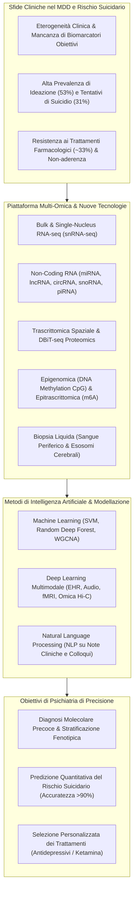
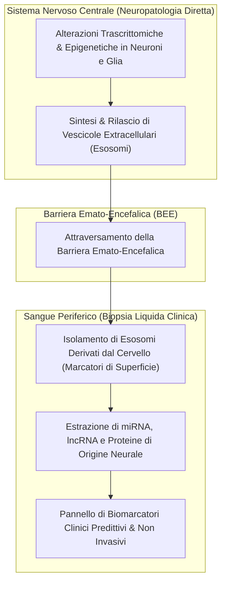

# Recent Developments in Omics Studies and Artificial Intelligence in Depression and Suicide (Wang & Dwivedi, 2025)

**Summary**: Review sistematica e fondamentale pubblicata su *Translational Psychiatry* da Qingzhong Wang e Yogesh Dwivedi (University of Alabama at Birmingham) che sintetizza lo stato dell'arte e le frontiere emergenti nell'applicazione delle tecnologie omiche ad alto rendimento (bulk RNA-seq, single-cell/single-nucleus RNA-seq, trascrittomica spaziale, epigenomica, proteomica) e dell'Intelligenza Artificiale (Machine Learning, Deep Learning, Natural Language Processing) nello studio del Disturbo Depressivo Maggiore (MDD) e del comportamento suicidario. Il lavoro esamina in dettaglio i profili trascrittomici in cervello postmortem, sangue periferico e modelli animali, categorizza l'intero panorama degli RNA non codificanti (miRNA, lncRNA, circRNA, snoRNA, piRNA) e delinea come i modelli computazionali avanzati (SVM, Random Deep Forest, reti neurali multimodali) stiano trasformando la scoperta di biomarcatori diagnostici, la stratificazione del rischio suicidario e la previsione di risposta ai trattamenti antidepressivi.

**Sources**: `41398_2025_Article_3497.pdf` (*Translational Psychiatry* (2025) 15:275; DOI: [10.1038/s41398-025-03497-y](https://doi.org/10.1038/s41398-025-03497-y))
**Last updated**: 2026-08-27
---

## Inquadramento e Razionale Clinico-Biologico

Il **Disturbo Depressivo Maggiore (MDD)** è una delle patologie psichiatriche più diffuse e invalidanti, con una prevalenza lifetime stimata tra il 15% e il 17% della popolazione generale. È caratterizzato da umore depresso, anedonia, autosvalutazione, alterazioni cognitive, del sonno e dell'appetito. Il rischio di suicidio nei soggetti con MDD è pari a circa il 15%, mentre le metanalisi documentano una prevalenza di ideazione suicidaria del 53% e di tentativi di suicidio del 31%.

Nonostante la gravità epidemiologica, la gestione clinica è ostacolata da due criticità fondamentali:
1. **Assenza di Criteri Diagnostici e Prognostici Obiettivi**: La diagnosi e la valutazione del rischio suicidario dipendono esclusivamente da colloqui clinici soggettivi e scale psicometriche.
2. **Gap di Efficacia e Risposta Eterogenea**: Circa un terzo dei pazienti non risponde ai trattamenti antidepressivi di prima linea (*treatment-resistant depression*), e la non-aderenza terapeutica è fortemente legata a fattori complessi (età giovanile, comorbilità con disturbi di personalità e abuso di sostanze, effetti collaterali, scarso insight).

---

## Analisi del Trascrittoma Bulk: Cervello, Sangue e Modelli Animali

L'esplorazione trascrittomica *hypothesis-free* tramite microarray e RNA-sequencing (RNA-seq) ha fornito le prime mappe dei circuiti molecolari alterati:

### 1. Studi su Cervello Postmortem Umano
- **Regioni Indagate**: Corteccia prefrontale dorsolaterale e dorsomediale (dlPFC, dmPFC), corteccia cingolata anteriore (ACC), corteccia orbitofrontale (OFC), amigdala, ippocampo e ipotalamo.
- **Circuiti Disfunzionali**: Costanti evidenze di alterazioni nelle vie di segnalazione **glutamatergiche** e **GABAergiche**, nonché nell'attività endoteliale, gliale e nell'omeostasi delle ATPasi.
- **Dimorfismo Sessuale Trascrizionale**: Studi su larga scala in sei aree cerebrali (Labonté et al., 2017; Mansouri et al., 2023) hanno rivelato una quasi totale assenza di geni differenzialmente espressi (DEGs) sovrapposti tra uomini e donne con MDD, dimostrando che l'architettura molecolare della depressione è altamente specifica per genere.
- **Marcatori Distintivi del Suicidio**: L'integrazione di dataset di MDD con e senza suicidio ha identificato geni chiave differenziali come `PRS26`, `ARNT`, `SYN3`, `MTRNRL8` e `IL8`. Inoltre, i moduli trascrittomici legati all'ideazione suicidaria mostrano un massiccio arricchimento in percorsi di risposta immunitaria, infiammazione e infezione microbica.

### 2. Studi su Sangue Periferico (Biopsia Liquida)
- Il sangue periferico rappresenta un marker surrogato non invasivo accessibile longitudinalmente.
- **Biomarcatori di Risposta Antidepressiva**:
  - La riduzione all'ammissione di `RORα` (retinoid-related orphan receptor α), `GCET2` e `CHI3L2` predice l'efficacia dei farmaci, mentre `LSP1` si riduce marcatamente dopo 5 settimane di trattamento efficace.
  - Livelli aumentati di mRNA di `CHN2` (regolatore della neurogenesi ippocampale) e `JAK2` (attivatore dell'immunità innata/adattiva) predicono la mancata risposta a 8 settimane di escitalopram.
- **Convergent Functional Genomics (CFG)**: Approccio integrato bayesiano che combina dati genomici, funzionali e trascrittomici per prioritizzare biomarcatori ematici di disturbi dell'umore e rischio suicidario (Le-Niculescu et al.).
- **Moduli di Ideazione Suicidaria**: Identificati 19 moduli genici co-espressi nel sangue significativamente correlati alla presenza di ideazione suicidaria attiva.

### 3. Modelli Animali di Depressione e Stress
- **Paradigmi Sperimentali**: *Learned Helplessness* (LH), *Unpredictable Chronic Mild Stress* (UCMS), *Social Defeat Stress* (SDS).
- **Modello Two-Hit e Gene Otx2**: L'esposizione a stress postnatale precoce (PND 2–12 o 10–20) incrementa la vulnerabilità allo stress sociale in età adulta (PND 60–70). La trascrittomica nell'area tegmentale ventrale (VTA) e nel nucleus accumbens (NAc) ha identificato `Otx2` come regolatore a monte: la sua sovraespressione transitoria nella VTA previene e inverte la suscettibilità depressiva nell'adulto (Peña et al., 2017).
- **Epitrascrittomica m6A**: Nei modelli UCMS, il trattamento con ipericina corregge i comportamenti depressivi up-regolando gli enzimi metiltransferasi `METTL3` e `WTAP`, potenziando il pathway dei fattori neurotrofici.
- **Vulnerabilità di Rete e Neuroni GABAergici**: L'integrazione di registrazioni elettrofisiologiche EEG in vivo e snRNA-seq nella PFC ha dimostrato che i profili di espressione genica dei neuroni GABAergici guidano l'attività di rete negli stati cerebrali vulnerabili allo stress.

---

## Lo Spettro degli RNA Non Codificanti (ncRNA) nel MDD e nel Suicidio

Gli RNA non codificanti costituiscono la componente maggioritaria dell'output trascrizionale umano e svolgono ruoli regolatori cardine nella neuroplasticità, nello sviluppo sinaptico e nell'adattamento allo stress:

```mermaid
classDiagram
    class MicroRNA_miRNA {
        +Lunghezza: ~22 nt
        +Biogenesi: DROSHA/DGCR8 -> Exportin 5 -> Dicer/TRBP -> RISC
        +Meccanismo: Repressione traduzionale / Degradazione mRNA su 3' UTR
        +Marcatori Chiave: miR-124-3p, miR-19a-3p, miR-1202, miR-135a, miR-16
        +Funzioni: Plasticita sinaptica, neurogenesi, regolazione citochine (TNF-alpha)
    }

    class LongNonCoding_lncRNA {
        +Lunghezza: >200 nt (40% cervello-specifici)
        +Meccanismo: Scaffold cromatinici, decoy, regolazione splicing e nucleare
        +Marcatori Donna-Specifici: LINC00473 (resilienza), FEDORA (ketamina)
        +Marcatori Suicidio Violento: LINC01268 (aggressivita, fMRI PFC)
    }

    class CircularRNA_circRNA {
        +Struttura: Anello covalente chiuso da back-splicing
        +Meccanismo: Spugna per miRNA (miRNA sponge), stabilita elevata
        +Marcatori Ematici: hsa_circRNA_103636, circFKBP8, circMBNL1, circDYM
    }

    class SmallNonCoding_snoRNA_piRNA {
        +snoRNA: Modifiche rRNA e splicing (SNORD90 regola NRG3 e glutammato)
        +piRNA: 24-32 nt, legame PIWI, Dicer-independent, difesa trasposoni, memoria
    }

    MicroRNA_miRNA <|-- EpigeneticRegulation
    LongNonCoding_lncRNA <|-- EpigeneticRegulation
    CircularRNA_circRNA <|-- EpigeneticRegulation
    SmallNonCoding_snoRNA_piRNA <|-- EpigeneticRegulation
```

### 1. microRNA (miRNA)
- **Rete della PFC**: PCR array e miRNA-seq hanno rivelato una downregulation generalizzata di miRNA nella PFC di soggetti suicidi, con un network di 29 miRNA che coordina apoptosi, metilazione del DNA, splicing e crescita assonale.
- **Frazione Sinaptica (Synaptosomal miRNome)**: Identificati 351 miRNA differenzialmente espressi nei sinaptosomi purificati della dlPFC, evidenziando schemi di regolazione locale della plasticità sinaptica.
- **miR-124-3p**: Incrementato nel cervello postmortem e nel sangue di pazienti con MDD, controlla le vie di segnalazione glutamatergiche.
- **miR-19a-3p e Asse Neuroinfiammatorio**: Nel cervello di vittime di suicidio, miR-19a-3p perde la capacità di reprimere l'mRNA di TNF-α a causa della competizione con la proteina legante l'RNA **HuR**, provocando una sintesi incontrollata e continua di TNF-α.
- **Risposta Farmacologica**: Marcatori ematici e cerebrali come miR-1202 (specifico dei primati, modulatore del recettore metabotropico del glutammato GRM4), miR-135a, miR-16, miR-146a/b-5p e miR-425-3p predicono la risposta agli antidepressivi.

### 2. Long Non-Coding RNA (lncRNA)
- **LINC00473**: Bersaglio sesso-specifico, marcatamente downregolato solo nella PFC di donne con depressione; la sua espressione promuove la resilienza comportamentale femminile.
- **FEDORA**: Upregulato nella PFC e nel sangue di donne con MDD, arricchito in neuroni e oligodendrociti; i suoi livelli ematici correlano con la risposta clinica rapida alla **ketamina**.
- **LINC01268**: Iperespresso nella PFC di individui morti per suicidio violento rispetto a suicidi non violenti e controlli. I portatori dell'allele minore associato a tale incremento mostrano punteggi elevati di aggressività lifetime e ridotta attivazione funzionale della PFC (fMRI) durante compiti di elaborazione di volti arrabbiati.

### 3. Circular RNA (circRNA)
- Molecole estremamente stabili grazie alla struttura ad anello chiuso derivante dal back-splicing di esoni; agiscono da "spugne molecolari" per miRNA.
- Marcatori ematici candidati nel MDD includono `hsa_circRNA_103636`, `circFKBP8`, `circMBNL1` e `circDYM`.

### 4. snoRNA e piRNA
- **snoRNA (Small Nucleolar RNA)**: `SNORD90` viene incrementato dai farmaci antidepressivi monoaminergici, reprimendo il gene bersaglio `NRG3` (neuregulina 3) e aumentando la disponibilità di glutammato; `SNORD85` risulta ridotto del 50% nei sinaptosomi corticali.
- **piRNA (PIWI-interacting RNA)**: Piccoli RNA (24–32 nt) Dicer-indipendenti; i modelli murini knockout per `Miwi/Piwil1` e `Piwil2` mostrano iperattività, comportamenti simil-ansiosi e alterazioni nel consolidamento della memoria di paura, implicando i piRNA nella regolazione epigenetica neurale.

---

## Frontiere Tecnologiche: Single-Cell RNA-Seq e Trascrittomica Spaziale

La transizione dal tessuto bulk alla risoluzione a singola cellula e spaziale consente di superare l'eterogeneità istologica del cervello:

| Tecnologia | Caratteristiche Metodologiche | Scoperte Salienti nel MDD e Suicidio | Riferimenti Chiave |
| :--- | :--- | :--- | :--- |
| **snRNA-seq (Single-nucleus RNA-seq)** | Isolamento di singoli nuclei da tessuto postmortem congelato; supera la mancata dissociazione di cellule intatte. | - **Dimorfismo cellulare**: Nelle donne con MDD i DEGs si concentrano in **microglia e interneuroni parvalbumina (PV)**; negli uomini in **neuroni eccitatori profondi, astrociti e oligodendrociti**. - **Precursori degli Oligodendrociti (OPCs)**: Principali contributori alle alterazioni trascrizionali ed epigenetiche (metilazione DNA) nel suicidio. | Maitra et al., 2023; Zhou et al., 2023; Zeng et al., 2024 |
| **snATAC-seq + scRNA-seq** | Profilazione simultanea dell'accessibilità cromatinica e dell'espressione genica cellulare. | Valutazione dell'architettura cromatinica di ordine superiore e dei meccanismi epigenetici tipo-specifici che regolano la vulnerabilità allo stress. | von Ziegler et al., 2022 |
| **Spatial Transcriptomics (ST)** | Cattura in situ di mRNA su vetrini con primer dotati di barcode posizionali; ricostruzione della mappa anatomica. | Mappatura dell'espressione genica nei 6 strati della corteccia prefrontale umana e nei sottocampi dell'ippocampo; identificazione della micro-anatomia molecolare della disfunzione affettiva. | Maynard et al., 2021; Thompson et al., 2025; Yao et al., 2023 |
| **DBiT-seq Spatial Proteomics / scMS** | Spettrometria di massa a singola cellula (scMS) e barcoding deterministico tissutale per proteomica spaziale. | Quantificazione simultanea di centinaia di proteine e modifiche post-traduzionali (PTM) preservando le coordinate spaziali senza necessità di anticorpi. | Liu et al., 2020; Lee et al., 2023 |

---

## Intelligenza Artificiale e Machine Learning: Modelli Predittivi e Diagnostici

L'integrazione di set di dati multi-omici ad altissima dimensionalità tramite algoritmi di Machine Learning (ML), Deep Learning (DL) e Natural Language Processing (NLP) sta consentendo il passaggio da modelli descrittivi a strumenti clinici predittivi:

```mermaid
flowchart LR
    subgraph MultiModalInputs ["Dati di Input Eterogenei"]
        I1["Espressione Genica Ematica (mRNA / ncRNA)"]
        I2["Metiloma Ematico (Siti CpG Differenziali)"]
        I3["EHR & Cartelle Cliniche (Narrativa NLP)"]
        I4["Dati Acustici & Vocali (Interviste Cliniche)"]
        I5["Neuroimaging Funzionale (fMRI / EEG)"]
    end

    subgraph AIArchitectures ["Algoritmi & Framework di Apprendimento"]
        M1["Support Vector Machines (SVM) & Random Forest"]
        M2["Random Deep Forest con Leave-One-Out CV"]
        M3["Deep Neural Networks & PsychENCODE Hi-C Fusion"]
        M4["Large Language Models / NLP Transformers"]
    end

    subgraph ClinicalPredictions ["Performance Predittive Validate"]
        P1["Diagnosi MDD vs SSD vs Controlli: 100% Accuratezza (48 geni)"]
        P2["Diagnosi MDD: Sensibilità/Specificità 90.6% (10 trascritti)"]
        P3["Stratificazione Rischio Suicidario: Accuratezza 92.6% (63 siti CpG)"]
        P4["Stima Quantitativa Scale Cliniche: R² = 0.961 (HDRS) e 0.943 (SSI)"]
    end

    MultiModalInputs --> AIArchitectures
    AIArchitectures --> ClinicalPredictions
```

### 1. Modelli di Classificazione e Biomarcatori Ematici
- **Support Vector Machines (SVM)**:
  - Applicato all'espressione genica ematica in pazienti al primo episodio depressivo (drug-free), forme sub-sindromiche (SSD) e controlli sani: identificato un pannello di **48 signature geniche con un'accuratezza del 100%** nella classificazione a tre vie (Yi et al., 2012).
  - Un modello SVM basato su un pannello ridotto di soli **10 trascritti ematici** ha raggiunto una **sensibilità e specificità validate del 90.6%** per la diagnosi di MDD (Yu et al., 2016).
- **Random Deep Forest su Multi-Omica (Trascrittoma + Metiloma)**:
  - L'integrazione di DEGs e siti CpG differenzialmente metilati nel sangue tramite algoritmo Random Deep Forest ha permesso di distinguere individui depressi con o senza tentativi di suicidio con un'**accuratezza del 92.6%**, in cui 63 feature predittive erano costituite esclusivamente da siti di metilazione del DNA (Bhak et al., 2019).
- **Regressione Predittiva su Scale Psichiatriche**:
  - Modelli di machine learning addestrati su dati multi-omici ematici hanno predetto con precisione straordinaria i punteggi quantitativi della scala di depressione di Hamilton (**HDRS-17, $R^2 = 0.961$**) e della scala di ideazione suicidaria (**Scale for Suicide Ideation, $R^2 = 0.943$**).

### 2. Deep Learning Multimodale ed Elaborazione del Linguaggio Naturale (NLP)
- **Integrazione Genomica-Funzionale (PsychENCODE)**: Reti neurali profonde integrate con WGCNA su dati trascrittomici, varianti SNP e conformazione cromatinica (Hi-C) hanno decodificato i moduli sinaptici e immunologici condivisi tra disturbi affettivi e psicosi.
- **NLP su Cartelle Cliniche Elettroniche (EHR) e Social Media**: Modelli basati su reti neurali sequenziali estraggono pattern semantici ed emotivi da narrazioni cliniche e testi digitali per identificare l'esordio depressivo e il rischio imminente di suicidio (Al Hanai et al., 2018; Walsh et al., 2018).
- **Biomarcatori Vocali e Acustici**: Algoritmi di machine learning processano il segnale vocale durante le interviste psichiatriche registrate, estraendo pattern prosodici e acustici oggettivi che correlano con lo stato clinico.

---

## Traduzione Clinica: Il Paradigma della Biopsia Liquida ed Esosomi Cerebrali

Una delle sfide maggiori nella neuropsichiatria traslazionale è la discrepanza tra l'organo bersaglio (cervello) e il tessuto accessibile nella pratica clinica (sangue):

1. **Esosomi Cerebrali Circolanti (*Brain-Derived Extracellular Vesicles*)**:
   - Le vescicole extracellulari rilasciate dalle cellule neurali attraversano intatte la barriera emato-encefalica (BEE) e possono essere isolate dal sangue periferico tramite specifici antigeni di superficie neuronali o gliali.
   - Il carico genetico (miRNA, lncRNA, frammenti di mRNA) presente all'interno degli esosomi agisce come una vera e propria **"finestra molecolare non invasiva sul cervello"**, consentendo di distinguere le alterazioni neuropatologiche primarie dalle risposte infiammatorie sistemiche.
2. **Psichiatria di Precisione e Selezione Farmacologica**:
   - L'impiego integrato di algoritmi di intelligenza artificiale su profili multi-omici ematici consente di superare l'approccio empirico del *trial-and-error*, guidando la scelta del trattamento farmacologico (es. SSRI, SNRI, ketamina, terapie biologiche) in base al profilo molecolare del singolo paziente.

---

## Limiti Attuali e Direzioni Future

Gli autori identificano le priorità per la ricerca futura:
1. **Dimensioni Campionarie e Validazione Indipendente**: Necessità di ampie coorti cliniche multicentriche per evitare l'overfitting dei modelli di machine learning e garantire la generalizzabilità su popolazioni eterogenee.
2. **Integrazione Multi-Omica con Neuroimaging ed Elettrofisiologia**: Fusione sistematica di dati omici con risonanza magnetica funzionale (fMRI), spettroscopia (MRS) e tracciati EEG.
3. **Modelli Cellulari 3D (Organoidi Cerebrali)**: Utilizzo di organoidi derivati da iPSC di pazienti per validare funzionalmente i target molecolari individuati dall'IA e testare molecole farmacologiche *in vitro*.
4. **Standardizzazione Clinica e Regolatoria**: Definizione di pipeline certificate per l'adozione della biopsia liquida multi-omica come standard di cura nella diagnosi e nella prevenzione del suicidio.

---

## Riferimenti Bibliografici
- Wang, Q., & Dwivedi, Y. (2025). Recent developments in omics studies and artificial intelligence in depression and suicide. *Translational Psychiatry*, 15(1), 275. https://doi.org/10.1038/s41398-025-03497-y

---

## Pagine Correlate nel Knowledge Base
- [[multi-omics-depression-suicide]]: Integrazione di genomica, trascrittomica, epigenomica e proteomica nel MDD e nel rischio suicidario.
- [[non-coding-rna-biomarkers-psychiatry]]: Il ruolo regolatorio di miRNA, lncRNA, circRNA, snoRNA e piRNA nei disturbi dell'umore.
- [[single-cell-and-spatial-transcriptomics-in-mental-health]]: Deconvoluzione cellulare cerebrale (snRNA-seq, ST, DBiT-seq) e dimorfismo sessuale.
- [[ai-multi-omics-psychiatric-biomarkers]]: Algoritmi di Machine Learning e Deep Learning applicati a dati omici e clinici multimodali.
- [[peripheral-blood-biomarkers-and-exosomes-in-mdd]]: Biopsia liquida, biomarcatori trascrittomici periferici ed esosomi cerebrali circolanti.
- [[treatment-outcome-and-relapse-prediction]]: Predizione dell'esito clinico e della risposta ai trattamenti in salute mentale.
- [[rischio-suicidario-ai-limits]]: Limiti clinici ed etici dei modelli linguistici nella rilevazione dell'ideazione suicidaria.
- [[ai-clinical-decision-support]]: Sistemi di supporto alle decisioni cliniche in psichiatria e psicoterapia.
