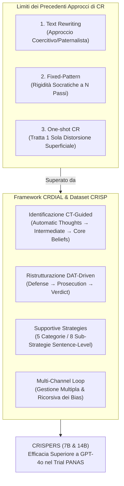
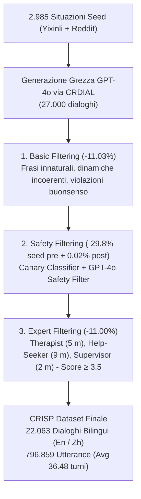
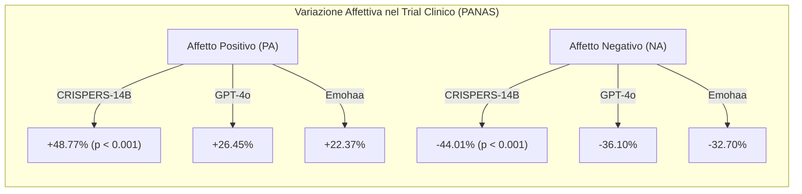

# CRISP: Cognitive Restructuring of Negative Thoughts through Multi-turn Supportive Dialogues (Zhou et al., 2025)

**Summary**: Studio pionieristico che formalizza la ristrutturazione cognitiva (CR) in psicoterapia assistita da LLM attraverso il framework multi-fase e multi-turno **CRDIAL**. Superando i limiti delle precedenti generazioni di modelli basati su semplice riscrittura del testo o dialoghi rigidi, il framework integra l'identificazione a 3 livelli dei pensieri (Cognitive Theory di Beck), la ristrutturazione maieutica tramite la Tecnica dell'Avvocato Difensore (DAT di de Oliveira), strategie di supporto emotivo vincolate a livello di singola frase (derivanti dalle teorie di Hill e Linehan) e un meccanismo multi-canale a ciclo continuo (*multi-channel loop*). Dalla distillazione di 22.063 dialoghi bilingui ad altissima qualità (**CRISP**) sono stati addestrati i modelli **CRISPERS** (7B e 14B), che dimostrano performance superiori a GPT-4o in valutazioni pointwise, pairwise e in un trial di intervento psicologico clinico con scala PANAS su 90 soggetti.
**Sources**: `2504.17238v1.pdf` (arXiv:2504.17238v1 [cs.CL], 24 Apr 2025. CoAI Group - Tsinghua University, University of Pennsylvania, Lingxin AI, Harvard University, Zhejiang University, NetEase Fuxi AI Lab. Repository: [GitHub](https://github.com/thu-coai/Crisp))
**Last updated**: 2026-08-27
---

## Inquadramento e Razionale Clinico

La **Ristrutturazione Cognitiva (Cognitive Restructuring, CR)** rappresenta una delle pietre angolari della Psicoterapia Cognitivo-Comportamentale (CBT, Beck 1979, 2011). Il suo obiettivo è guidare il paziente a identificare i pensieri automatici disfunzionali e le distorsioni cognitive sottostanti (es. catastrofizzazione, pensiero tutto-o-nulla, personalizzazione) e a trasformarli gradualmente in credenze alternative più realistiche, adattive e positive.

A fronte della carenza globale di terapeuti e delle barriere legate allo stigma sociale, l'integrazione di Large Language Models (LLM) nella psicoterapia conversazionale offre grandi prospettive. Tuttavia, i precedenti approcci computazionali alla CR presentavano tre gravi limiti clinico-architetturali:

1. **Text Rewriting (Riscrittura Diretta del Testo)**: L'intervento è ridotto a una mera parafrasi positiva unilaterale; la mancanza di una guida maieutica progressiva rende il modello percepito come giudicante, paternalista o coercitivo, provocando resistenza e rigetto nel paziente.
2. **Fixed-Pattern Dialogue (Dialoghi a Pattern Rigido)**: Flussi sequenziali rigidi (es. interrogatorio socratico bloccato a 3 o 6 domande fisse) che non gestiscono la dinamica emotiva, la relazione di supporto né l'alleanza di lavoro.
3. **One-shot CR Workflow (Intervento Monotematico e Statico)**: Modelli che affrontano una sola distorsione per sessione, trascurando il fatto che ogni situazione complessa di disagio mentale evoca simultaneamente molteplici distorsioni interconnesse e richiede un'esplorazione ricorsiva.



---

## Il Framework CRDIAL

Il framework **CRDIAL** (*Cognitive Restructuring DIALogue*) modella l'interazione clinica attraverso un processo strutturato in due macro-fasi progressive, arricchite da strategie di supporto emotivo e conoscenza di senso comune:

```mermaid
flowchart LR
    subgraph Stage1 ["Fase 1: Identificazione (CT-Guided)"]
        A1["Situazione Iniziale<br>(Help-Seeking Situation)"] --> A2["Pensieri Automatici<br>(Automatic Thoughts)"]
        A2 --> A3["Credenze Intermedie<br>(Intermediate Beliefs)"]
        A3 --> A4["Credenze di Base / Distorsioni<br>(Multi-Channel Core Beliefs)"]
    end

    subgraph Stage2 ["Fase 2: Ristrutturazione (DAT-Driven)"]
        B1["Difesa (Defense)<br>Ricerca Fatti a Supporto"] --> B2["Accusa (Prosecution)<br>Confutazione & Contro-evidenze"]
        B2 --> B3{"Verdetto (Verdict)<br>Ristrutturazione Efficace?"}
    end

    subgraph Stage3 ["Ciclo Ricorsivo (Loop Mechanism)"]
        C1{"Residuo di altre<br>Distorsioni Cognitive?"}
    end

    A4 -->|Canale 1..k (k ≤ 3)| B1
    B3 -->|Risolto| C1
    C1 -->|Sì (Nuove distorsioni)| A1
    C1 -->|No| EndNode["Conclusione Ristrutturazione"]
```

### 1. Fase di Identificazione Guidata dalla Teoria Cognitiva (CT-Guided Identification)
Basandosi sul modello gerarchico di Aaron Beck (1979), l'agente non diagnostica frettolosamente il problema, ma conduce un'esplorazione a tre livelli:
- **Pensieri Automatici (Automatic Thoughts)**: Pensieri spontanei e superficiali legati all'evento scatenante.
- **Credenze Intermedie (Intermediate Beliefs)**: Regole, assunzioni implicite ed euristiche che mediano l'interpretazione degli eventi (es. *"Se non soddisfo le aspettative di tutti, significa che non valgo nulla"*).
- **Credenze di Base (Core Beliefs / Cognitive Distortions)**: Schemi cognitivi nucleari profondamente radicati (es. catastrofizzazione, pensiero dicotomico, colpevolizzazione).

### 2. Fase di Ristrutturazione Guidata dalla Defense Attorney Technique (DAT)
Ispirata alla tecnica psicoterapeutica formulata da Irismar Reis de Oliveira (2011), la ristrutturazione adotta la metafora del **processo giudiziario interiore**:
- **Difesa (Defense)**: Il paziente, nel ruolo di avvocato difensore del proprio pensiero negativo, è guidato a esplicitare esclusivamente i *fatti oggettivi e verificabili* a supporto della sua tesi, evitando speculazioni emotive.
- **Accusa (Prosecution)**: Il terapeuta/modello agisce come pubblico ministero, individuando le fallacie logiche nelle prove difensive e guidando il paziente a trovare contro-prove fattuali per smontare la distorsione.
- **Verdetto (Verdict)**: Valutazione interna dello shift cognitivo; se la ristrutturazione è completa, si formalizza un nuovo pensiero alternativo e funzionale.

### 3. Schema di Strategie di Supporto a Livello di Frase (Sentence-Level Supportive Strategies)
Per prevenire l'ansia da prestazione e la reattività difensiva del paziente, ogni singola frase generata dal modello terapeuta è vincolata e annotata con una specifica strategia derivata dalla *Helping Skills Theory* di Clara Hill (2009) e dalla *Dialectical Behavior Therapy (DBT)* di Marsha Linehan (2014):

| Macro-Categoria | Sotto-Strategia | Definizione Clinica | Esempio a Livello di Singola Frase |
| :--- | :--- | :--- | :--- |
| **Description** | **Question** | Domande aperte mirate a chiarire ed esplorare il vissuto. | *"Quali aspetti della tua situazione attuale trovi più impegnativi?"* |
| | **Restatement** | Riformulazione delle parole del paziente per validare la comprensione. | *"Quindi senti che questi cambiamenti recenti ti hanno lasciato un senso di profonda incertezza?"* |
| **Expression** | **Reflection of Feelings** | Identificazione e rispecchiamento degli stati emotivi espressi. | *"Noto che stai provando un senso di profonda tristezza in questo momento."* |
| | **Self-disclosure** | Condivisione controllata di esperienze umane/professionali per normalizzare il vissuto. | *"Ricordo un momento in cui ho affrontato una sfida simile, e capisco quanto possa essere difficile."* |
| **Assertion** | **Providing Suggestions** | Indicazioni pratiche, concrete, creative e contestualizzate. | *"Potresti provare un'attività rilassante come lo yoga o esplorare uno sfogo creativo come la pittura."* |
| | **Information** | Fornire informazioni psicoeducative oggettive (senza citare studi accademici asettici). | *"Riconoscere i propri fattori scatenanti può essere un primo passo utile per modulare le reazioni."* |
| **Reinforcement** | **Affirmation and Reassurance** | Rinforzo positivo delle risorse, progressi e capacità di resilienza del soggetto. | *"La tua capacità di perseverare nonostante queste difficoltà è davvero ammirevole."* |
| **Negotiation** | **Negotiate** | Costruzione collaborativa di accordi e piani terapeutici condivisi. | *"Lavoriamo insieme per esplorare alcune opzioni che possano adattarsi al meglio alle tue esigenze."* |

### 4. Meccanismo Multi-Canale e Ciclo Ricorsivo (Multi-Channel Loop)
- **Multi-Channel**: All'apice della fase di identificazione, il sistema genera fino a 3 canali paralleli di distorsioni cognitive candidate, consentendo al terapeuta di esplorare e trattare in modo differenziato le diverse sfaccettature della vulnerabilità cognitiva.
- **Loop Mechanism**: Al termine del verdetto di un canale, un modulo di ragionamento valuta la presenza di credenze disfunzionali residue, innescando un nuovo ciclo di identificazione e ristrutturazione fino a esaurimento clinico dei bias.

### 5. Integrazione di Conoscenza di Senso Comune (ATOMIC 10x)
Per evitare che l'LLM generi risposte banali, monotone o stereotipate, a ogni sotto-passo vengono iniettate triple di conoscenza sociale estratte dal grafo **ATOMIC 10x** (relazioni: *xIntent, xDesire, xReact, xNeed*), incrementando la diversità lessicale e tematica.

---

## Il Dataset CRISP e la Pipeline di Quality Control

Utilizzando il framework CRDIAL, gli autori hanno distillato da **GPT-4o** il dataset **CRISP** partendo da 2.985 situazioni reali raccolte da piattaforme di supporto psicologico (Yixinli e Reddit r/mentalhealth) distribuite su 10 domini (famiglia, istruzione, carriera, salute, finanze, relazioni sentimentali, stile di vita, amicizia, vicinato, tecnologia) e 54 sotto-categorie.



### Le 15 Distorsioni Cognitive Tracciate nel Dataset
1. **Catastrophizing** (3.014)
2. **All-or-Nothing Thinking** (2.906)
3. **Overgeneralization** (2.673)
4. **Personalization** (2.583)
5. **Mental Filtering** (2.557)
6. **Fortune Telling** (2.160)
7. **Mind Reading** (1.972)
8. **Disqualifying the Positive** (1.955)
9. **Jumping to Conclusions** (1.830)
10. **Emotional Reasoning** (1.600)
11. **Should Statements** (1.348)
12. **Comparing and Despairing** (1.155)
13. **Blaming** (1.047)
14. **Control Fallacy** (931)
15. **External Validation** (644)

*Tasso di accuratezza annotazioni umane validate da esperti*: **97.6%** sulle etichette di strategia ($\kappa = 0.712$) e **85.5%** sulle distorsioni cognitive ($\kappa = 0.681$).

---

## Architettura e Addestramento di CRISPERS

I modelli **CRISPERS** (CRISP-based convERsation LLMs) sono stati istanziati su backbone open-weight **Qwen-2.5-7B** e **Qwen-2.5-14B** e ottimizzati mediante joint training con tre componenti di perdita:

$$\mathcal{L}_{joint} = \mathcal{L}_{strategy} + \mathcal{L}_{channel,1} + \mathcal{L}_{channel,2}$$

1. **Sentence-Level Strategy-Controlled Generation ($\mathcal{L}_{strategy}$)**: Il modello apprende a emettere token speciali $s_{n,i}$ indicanti la strategia supportiva prima di generare ogni singola frase $y_{n,i}$.
2. **Multi-Channel Distortion Identification ($\mathcal{L}_{channel,1}, \mathcal{L}_{channel,2}$)**: Il modello apprende a formulare fino a $k \le 3$ canali di identificazione delle distorsioni $d_i$ e a guidare la specifica sequenza di ristrutturazione associata.

---

## Risultati Sperimentali e Validazione Clinica

### 1. Valutazione Interattiva Pointwise (Umani in Cieco)
Su 6 metriche (Sensatezza, Specificità, Supporto, Utilità, Affidabilità, Qualità Globale) valutate su interazioni di oltre 30 turni:
- **CRISPERS-14B** supera sistematicamente il proprio modello maestro (**GPT-4o**) e i baseline **GLM-4**, **Qwen-2.5-72B** e **Qwen-2.5-14B**.
- L'affidabilità percepita (*Trustworthiness*) raggiunge 4.31 (En) e 4.61 (Zh), evidenziando una solida alleanza di lavoro.
- Gli studi di ablazione confermano che la rimozione del controllo a livello di frase (*w/o SSCG*) o del multi-canale (*w/o MDI*) causa un crollo statisticamente significativo in tutte le metriche.

### 2. Valutazione Interattiva Pairwise
CRISPERS-14B prevale costantemente nei confronti diretti turno per turno (Win rate > 50-57% su Qwen-2.5-14B, GLM-4, GPT-4o in domini come Famiglia, Istruzione, Carriera, Salute).

### 3. Trial di Intervento Psicologico (PANAS su 90 Soggetti)
In un trial sperimentale controllato su 90 partecipanti reali con disagio psicologico attivo, assegnati casualmente a tre bracci (CRISPERS-14B vs GPT-4o vs Emohaa), la valutazione standardizzata con la scala **PANAS (Positive and Negative Affect Schedule)** ha mostrato:

| Modello | PA Pre | PA Post | Incremento PA ($\Delta\%$) | p-value (t-test) | NA Pre | NA Post | Riduzione NA ($\Delta\%$) | p-value (t-test) | Tukey HSD vs CRISPERS |
| :--- | :--- | :--- | :--- | :--- | :--- | :--- | :--- | :--- | :--- |
| **Emohaa** | 23.04 | 28.19 | +22.37% | $1.42 \times 10^{-5}$ | 34.23 | 23.03 | -32.70% | $2.96 \times 10^{-9}$ | $p < 0.01$ |
| **GPT-4o** | 22.96 | 29.04 | +26.45% | $2.04 \times 10^{-6}$ | 33.96 | 21.70 | -36.10% | $1.77 \times 10^{-9}$ | $p < 0.05$ |
| **CRISPERS-14B** | **21.16** | **31.48** | **+48.77%** | $\mathbf{5.40 \times 10^{-8}}$ | **34.08** | **19.08** | **-44.01%** | $\mathbf{1.07 \times 10^{-10}}$ | — |



---

## Considerazioni Etiche e Limiti

1. **Protocolli di Sicurezza e Rischi Acuti**: Il modello non è concepito per la gestione di emergenze psichiatriche acute o rischio suicidario/autolesivo; richiede meccanismi di salvaguardia e reindirizzamento immediato a professionisti umani.
2. **Consenso e Trasparenza**: Durante i trial è stato garantito il consenso informato, il diritto di recesso senza penalità e la completa cifratura e anonimizzazione dei dati di sessione.
3. **Scala dei Trial Clinici**: Gli autori indicano la necessità di estendere i trial a popolazioni cliniche longitudinali diversificate e su scala geografica più ampia.

---

## Riferimenti Bibliografici
- Zhou, J., Chen, Y., Yin, J., Huang, Y., Shi, Y., Zhang, X., Peng, L., Zhang, R., Lv, T., Hu, Z., Wang, H., & Huang, M. (2025). CRISP: Cognitive Restructuring of Negative Thoughts through Multi-turn Supportive Dialogues. *arXiv preprint arXiv:2504.17238*. https://arxiv.org/abs/2504.17238

---

## Concetti Correlati nel Knowledge Base
- [[crdial-framework]]: Il framework metodologico e architetturale per la ristrutturazione cognitiva dialogica.
- [[defense-attorney-technique]]: La tecnica psicoterapeutica maieutica del tribunale interiore (Defense, Prosecution, Verdict).
- [[sentence-level-supportive-strategies]]: La tassonomia a 5 categorie e 8 sotto-strategie per il supporto emotivo vincolato frase per frase.
- [[multi-channel-loop-mechanism]]: Il meccanismo di derivazione multi-canale e ricorsione ciclica sui bias cognitivi.
- [[crispers-models-and-dataset]]: Il dataset bilingue CRISP e l'addestramento dei modelli specializzati CRISPERS (7B/14B).
- [[active-ai-therapeutic-agent]]: Criterio di agente terapeutico attivo nel rimodellamento cognitivo.
- [[digital-therapeutic-alliance]]: Costruzione dell'alleanza di lavoro e fiducia nell'interazione uomo-macchina.
- [[conversational-agents-mental-health]]: Panoramica sugli agenti conversazionali per la salute mentale.
- [[simulated-empathy-vs-authentic-presence]]: Differenza tra strategie supportive simulate e risonanza affettiva autentica.
