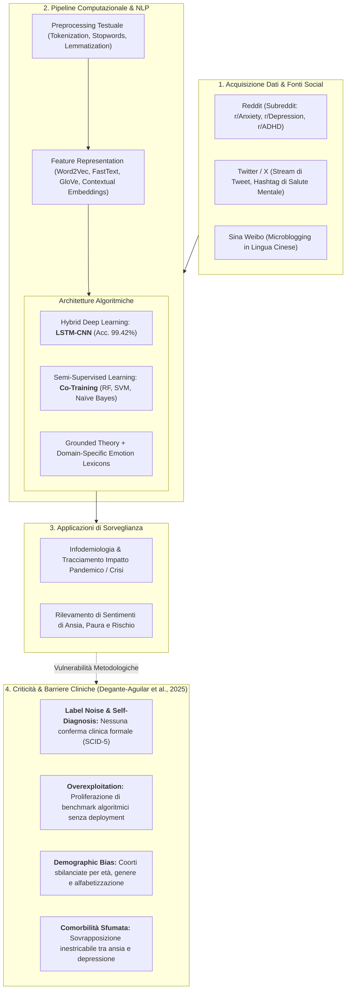
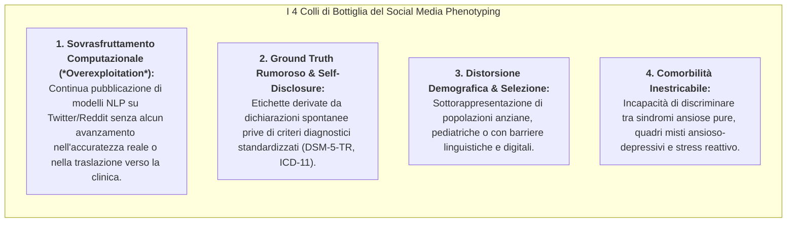

# Social Media Digital Phenotyping for Anxiety: Metodologie NLP, Potenzialità e Limiti Metodologici

## Definizione Operativa
- Il paradigma di **Social Media Digital Phenotyping for Anxiety** (fenotipizzazione digitale dell'ansia tramite social media) indica l'estrazione, l'analisi semantico-lessicale e la classificazione automatizzata di tracce testuali, comportamentali e temporali pubblicate spontaneamente dagli utenti su piattaforme online (quali Reddit, Twitter/X, Sina Weibo, forum di supporto tra pari) mediante algoritmi di *Natural Language Processing* (NLP), sentiment analysis e modelli di deep learning per identificare marker linguistici associati a disturbi d'ansia, stress acuto e sofferenza psicologica (Degante-Aguilar et al., 2025; Tariq et al., 2019; Banna et al., 2023; Xu et al., 2021).
- **Utilità Clinica ed Epidemiologica vs Limiti di Validità:**
  - *Potenzialità:* Consente la sorveglianza epidemiologica su scala di popolazione (*infodemiologia*), il monitoraggio ecologico continuo delle fluttuazioni affettive durante crisi collettive (es. pandemia da COVID-19, disastri naturali, conflitti) e l'intercettazione precoce di pattern di disagio in popolazioni che non accedono spontaneamente ai servizi sanitari.
  - *Criticità Metodologiche e Cliniche:* Come evidenziato dalla revisione sistematica di Degante-Aguilar et al. (2025; *Frontiers in Digital Health*, doi: 10.3389/fdgth.2025.1646724), gran parte di questa letteratura soffre di un marcato **distacco clinico**: l'overexploitation computazionale di dataset pubblici produce accuratezze nominali apparentemente straordinarie (>99%), le quali mascherano gravi problemi di *rumorosità del ground truth*, assenza di validazione psicodiagnostica formale, bias di campionamento ed etichette binarie incapaci di gestire la comorbilità ansia-depressione.

---

## Evidenze dalla Letteratura e Metodologie di NLP

### 1. Architetture Ibride e Modelli di Deep Learning (LSTM-CNN)
- **Cattura di Feature Locali e Dipendenze Sequenziali:** I post degli utenti contenenti manifestazioni d'ansia presentano sia parole-chiave sintomatiche isolate (es. *"panico"*, *"tachicardia"*, *"soffoco"*, *"non riesco a respirare"*) sia strutture discorsive complesse e rimuginii estesi. L'integrazione in modelli sandwich **LSTM-CNN** o **CNN-LSTM** (Banna et al., 2023; Xiong et al., 2024; Dawood et al., 2018) consente di:
  1. *Filtrare n-grammi emotivi salienti* mediante strati convoluzionali (CNN);
  2. *Modellare la dinamica temporale e sintattica a lungo raggio* tramite unità ricorrenti LSTM o Bi-LSTM;
  3. Raggiungere accuratezze fino al **99.42%** nella discriminazione di post a contenuto depressivo e ansioso rispetto a messaggi di controllo.

---

### 2. Paradigma di Co-Training Semi-Supervisionato per Dati Social
- **Il Collo di Bottiglia dell'Etichettatura Manuale:** L'annotazione clinica di milioni di post social richiede risorse insostenibili. Nello studio di Tariq et al. (2019), è stata introdotta una metodologia basata su **co-training semi-supervisionato** per categorizzare quattro disturbi psichiatrici (ansia, depressione, disturbo bipolare, ADHD) a partire da post e commenti di Reddit:
  - Vengono addestrati due o più classificatori eterogenei (Random Forest, Support Vector Machine, Naïve Bayes) su un sottoinsieme limitato di post etichettati;
  - Ciascun modello valuta i dati non etichettati (commenti degli utenti) e assegna pseudo-etichette con alta confidenza statistica, espandendo progressivamente il training set in modo iterativo senza supervisione umana diretta.

---

### 3. Costruzione di Lessici Emotivi Domain-Specific ed Espansione Semantica
- **Integrazione di Grounded Theory e Word Embeddings:** Xu et al. (2021) hanno proposto una pipeline metodologica mista su 1,01 milioni di testi estratti da Sina Weibo per formalizzare un lessico emotivo clinico:
  1. *Fase Qualitativa (Grounded Theory):* Analisi manuale di 7.535 post per estrarre categorie affettive primarie (gioia, aspettativa, amore, rabbia, ansia, disgusto, tristezza, sorpresa);
  2. *Fase Computazionale (Word2Vec Expansion):* Espansione semantica a partire da seed words cliniche selezionate, approdata a un vocabolario di **2.964 termini psicologici calibrati** per il rilevamento dell'ansia e dello stress nel contesto socio-linguistico asiatico.

---

## Le Quattro Criticità Metodologiche (Degante-Aguilar et al., 2025)

### 1. Il Fenomeno dell'Overexploitation senza Utilità Clinica
Come evidenziato da Degante-Aguilar et al. (2025), una quota preponderante della ricerca informatica si è concentrata sull'applicazione di algoritmi NLP sempre più sofisticati agli stessi dataset pubblici di Twitter e Reddit. Questo "sovrasfruttamento accademico" si limita a competere su frazioni percentuali di accuratezza nominale, senza produrre metodologie capaci di essere impiegate nella pratica psicoterapeutica o nel triage psichiatrico ospedaliero.

### 2. Rumore nelle Etichette e Validità Diagnostica del Ground Truth
- Nei dataset social, lo stato clinico di un utente viene solitamente inferito dall'auto-dichiarazione (*"I was just diagnosed with severe anxiety"*) o dall'appartenenza a specifici subreddit.
- Questa self-disclosure è vulnerabile a ipersemplificazioni, autodiagnosi non verificate, fluttuazioni momentanee dell'umore o esagerazioni narrative, impedendo la distinzione tra **tratto psicopatologico strutturato** (disturbo d'ansia clinico) e **stato emotivo reattivo transitorio** (ansia da prestazione o stress situazionale).

### 3. Bias di Campionamento e Mancata Rappresentatività
Gli utenti che esprimono attivamente la propria sofferenza psichica sui social network costituiscono una sottopopolazione fortemente polarizzata per età (prevalenza di adolescenti e giovani adulti), livello di alfabetizzazione digitale e tratti di personalità (es. alto nevrotisismo o tendenza all'estroversione digitale). I modelli addestrati su tali corpora falliscono sistematicamente quando testati su coorti cliniche reali di pazienti anziani, soggetti ospedalizzati o comunità con differente background socio-economico.

### 4. La Sfida della Comorbilità e della Dimensionalità
Nella nosografia psichiatrica reale, l'ansia e la depressione coesistono in oltre il 60% dei quadri clinici. I classificatori NLP convenzionali, impostati come task di classificazione binaria (*ansioso vs non ansioso*), operano una forzatura categoriale che cancella la natura transdiagnostica e dimensionale dei sintomi affettivi.

---

## Linee Guida per una Ricerca Etica ed Ecologicamente Valida

1. **Ancoraggio a Criteri Diagnostici Validati (Hybrid Ground Truth):** I dataset per l'addestramento NLP devono integrare somministrazioni contestuali di scale psicometriche validate (es. GAD-7, OASIS, BAI) raccolte con consenso informato in setting di ricerca controllata.
2. **Focus su Ecological Momentary Assessment (EMA) e Diari Clinici:** Piuttosto che post pubblici decontestualizzati, l'NLP dovrebbe essere applicato all'analisi di diari terapeutici, trascrizioni di colloqui clinici protetti o appunti di automonitoraggio CBT convalidati dal terapeuta.
3. **Tutela della Privacy e Deontologia Algoritmica:** Il web scraping massivo di dati sensibili sulla salute mentale solleva interrogativi etici stringenti in merito al consenso informato implicito. L'elaborazione deve garantire l'anonimizzazione irreversibile, l'impossibilità di re-identificazione dell'utente e la conformità al GDPR e all'AI Act europeo.

---

## Riferimenti Bibliografici
- Degante-Aguilar, E., Melendez-Armenta, R. A., Luna-Chontal, G., & Fernandez-Dominguez, F. J. (2025). Artificial intelligence techniques applied to anxiety disorders recognition: a systematic review. *Frontiers in Digital Health*, 7, 1646724. https://doi.org/10.3389/fdgth.2025.1646724
- Ansari, L., Ji, S., Chen, Q., & Cambria, E. (2023). Ensemble hybrid learning methods for automated depression detection. *IEEE Transactions on Computational Social Systems*, 10(1), 211–219.
- Banna, M. H. A., Ghosh, T., Nahian, M. J. A., Kaiser, M. S., Mahmud, M., Taher, K. A., et al. (2023). A hybrid deep learning model to predict the impact of COVID-19 on mental health from social media big data. *IEEE Access*, 11, 77009–77022.
- Imran, A. S., Daudpota, S. M., Kastrati, Z., & Batra, R. (2020). Cross-cultural polarity and emotion detection using sentiment analysis and deep learning on COVID-19 related tweets. *IEEE Access*, 8, 181074–181090.
- Tariq, S., Akhtar, N., Afzal, H., Khalid, S., Mufti, M. R., Hussain, S., et al. (2019). A novel co-training-based approach for the classification of mental illnesses using social media posts. *IEEE Access*, 7, 166165–166172.
- Xu, L., Li, L., Jiang, Z., Sun, Z., Wen, X., Shi, J., et al. (2021). A novel emotion lexicon for Chinese emotional expression analysis on weibo: using grounded theory and semi-automatic methods. *IEEE Access*, 9, 92757–92768.
- Zarate, D., Ball, M., Prokofieva, M., Kostakos, V., & Stavropoulos, V. (2023). Identifying self-disclosed anxiety on Twitter: a natural language processing approach. *Psychiatry Research*, 330, 115579.

---

## Relazioni
- [[fdgth-07-1646724]]
- [[multimodal-anxiety-detection-ai]]
- [[clinical-nlp-domain-shift]]
- [[clinical-readiness-gap-in-mh-chatbots]]
- [[open-data-scarcity-clinical-psychology]]
- [[modello-centauro-clinico]]
- [[software-as-a-medical-device-salute-mentale]]
- [[traffic-light-quality-appraisal-clinical-ai]]
- [[uso-problematico-chatbot-ai]]
