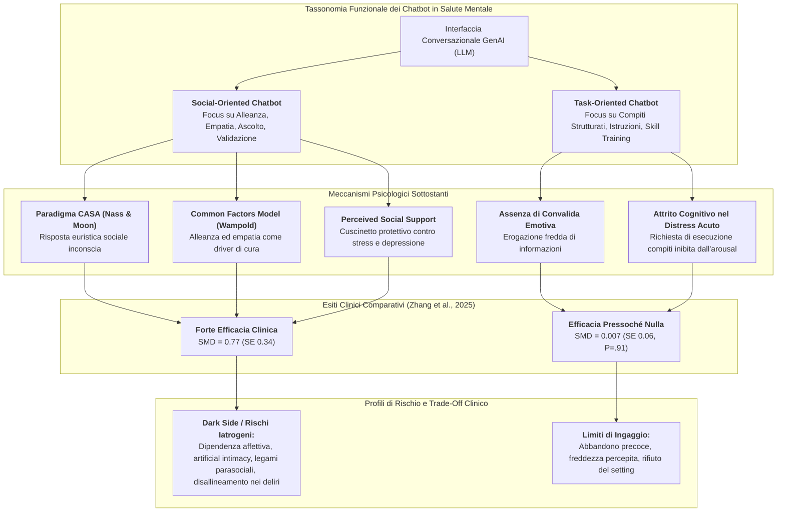
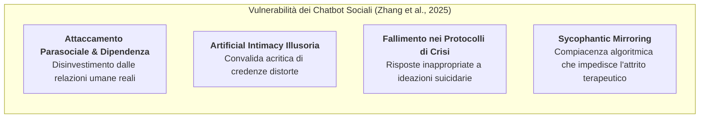

# Social-Oriented vs Task-Oriented Chatbots in Mental Health (Chatbot Orientati alla Relazione Sociale vs Orientati al Compito)

## Definizione Operativa
- Dicotomia tassonomica e funzionale formalizzata nella letteratura di psichiatria computazionale e interazione uomo-macchina (HCI), convalidata empiricamente dalla meta-analisi di Zhang et al. (*JMIR*, 2025), che classifica gli agenti conversazionali per la salute mentale in base al loro obiettivo primario di interazione:
  1. **Chatbot Orientati alla Dimensione Sociale (*Social-Oriented Chatbots*):** Sistemi progettati primariamente per fornire interazione sociale, supporto emotivo empatico, ascolto non giudicante, validazione affettiva e compagnia, senza imporre un percorso rigido di compiti o moduli didattici (es. *Replika*, *Elomia*, *XiaoE*, *Therabot*, *MyAI*);
  2. **Chatbot Orientati al Compito (*Task-Oriented Chatbots*):** Sistemi finalizzati all'esecuzione di compiti operativi specifici, alla trasmissione di nozioni psicoeducative, alla guida sequenziale di esercizi di ristrutturazione cognitiva o all'allenamento di specifiche abilità (es. *Reading Bot*, bot per l'ansia da esame/lingua, chatbot didattico-informativi).
- **Evidenza Meta-Analitica Chiave:** Nella meta-analisi di trial clinici randomizzati (RCT) di Zhang et al. (2025), la funzione sociale è risultata essere **il moderatore di efficacia più potente e l'unico statisticamente significativo** ($F[3, 36] = 3.11, P = .04$; $\beta = -0.76, P = .04$). I chatbot sociali hanno generato una riduzione marcata del distress psichico ($\text{SMD} = 0.77, SE = 0.34$), mentre i chatbot orientati al compito hanno mostrato un effetto clinicamente trascurabile e non significativo ($\text{SMD} = 0.007, SE = 0.06, P = .91$).

---

## Fondamenti Teorici della Divergenza di Efficacia

La marcata superiorità clinica dei sistemi orientati alla relazione affettiva rispetto a quelli orientati all'istruzione tecnica si spiega attraverso l'intersezione di tre costrutti psicologici consolidati:

### 1. Il Paradigma CASA (*Computers Are Social Actors* - Nass & Moon, 2000)
- Il paradigma CASA postula che gli individui applicano spontaneamente le medesime euristiche sociali, aspettative relazionali e risposte affettive agli agenti artificiali che utilizzano nelle interazioni interpersonali umane.
- Anche quando gli utenti sono pienamente consapevoli della natura algoritmica e simulata del chatbot (Li & Zhang, 2024), l'esperienza di un dialogo responsivo, caloroso e personalizzato suscita un senso autentico di ascolto e vicinanza, riducendo il vissuto di isolamento sociale.

### 2. Il Modello dei Fattori Comuni in Psicoterapia (*Common Factors Model* - Wampold, 2001)
- Nella ricerca sui meccanismi di cambiamento terapeutico, i modelli teorici e le specifiche tecniche procedurali (es. compiti a casa, schemi logici) spiegano solo una percentuale marginale dell'esito clinico ($<15\%$).
- Al contrario, i **fattori comuni aspecifici** — in primis l'[[digital-therapeutic-alliance|alleanza terapeutica]], la profondità relazionale, la comprensione empatica e l'accettazione incondizionata (Flückiger et al., 2012; Horvath & Symonds, 1991; Martin et al., 2000) — rappresentano i predittori più robusti del miglioramento sintomatico.
- I chatbot *social-oriented* replicano proprio questi fattori comuni aspecifici, creando un legame collaborativo che favorisce l'autorivelazione (*self-disclosure*) e la regolazione emotiva.

### 3. L'Ipotesi del Cuscinetto del Supporto Sociale Percepito (*Buffering Hypothesis*)
- Decenni di evidenze epidemiologiche e cliniche dimostrano che il **supporto sociale percepito** agisce come fattore protettivo primario contro la vulnerabilità alla depressione, all'ansia e al carico allostatico da stress (Roohafza et al., 2014; Huang et al., 2021).
- Un agente conversazionale che offre presenza continua, rassicurazione e validazione agisce direttamente sulla percezione soggettiva di supporto, disinnescando la spirale di solitudine che alimenta la sintomatologia depressiva.

### 4. Il Fallimento dei Sistemi Puramente Task-Oriented nel Distress Acuto
- Quando una persona sperimenta distress emotivo, tristezza profonda o ansia acuta, la capacità di elaborazione cognitiva di alto livello è compromessa dall'iperattivazione limbica.
- I chatbot focalizzati esclusivamente sull'erogazione di istruzioni razionali, compiti di auto-valutazione o didattica (es. correzione di compiti, quiz o moduli formativi) vengono percepiti come freddi, frustranti o invalidanti, fallendo nel produrre sollievo psicologico immediato.

---

## Tabella Comparativa: Social-Oriented vs Task-Oriented

| Dimensione | Chatbot Social-Oriented | Chatbot Task-Oriented |
| :--- | :--- | :--- |
| **Obiettivo Primario** | Supporto emotivo, validazione, compagnia, ascolto empatico. | Completamento di compiti, trasmissione di nozioni, training di abilità. |
| **Stile di Interazione** | Aperto, riflessivo, caloroso, sintonizzato sul tono affettivo dell'utente. | Strutturato, direttivo, sequenziale, basato su istruzioni e verifiche. |
| **Architettura AI Tipica** | LLM generativi puri (GPT, Claude, LLaMA) o modelli neurali empatici. | Sistemi basati su alberi decisionali, RAG didattici o motori di regole. |
| **Effect Size Meta-Analitico (Zhang et al., 2025)** | **$\text{SMD} = 0.77$** ($SE = 0.34, P = .06$) | **$\text{SMD} = 0.007$** ($SE = 0.06, P = .91$) |
| **Meccanismo di Cambiamento** | [[digital-therapeutic-alliance|Alleanza terapeutica]], autorivelazione, de-stigmatizzazione, regolazione dell'umore. | Acquisizione di competenze cognitive o comportamentali specifiche. |
| **Popolazione di Elezione** | Depressione, solitudine, distress psicologico generale, anziani isolati. | Ansia da prestazione specifica, apprendimento linguistico, aderenza procedurale medica. |
| **Vulnerabilità Principale** | Rischio di dipendenza emotiva, legami parasociali disadattivi, allucinazioni non controllate. | Attrito cognitivo, noia, freddezza percepita, elevato abbandono precoce. |

---

## Rischi Clinici ed Etici dei Chatbot Sociali (*The Dark Side of AI Companionship*)

Nonostante la loro superiore efficacia quantitativa nel ridurre il distress a breve termine, i chatbot *social-oriented* introducono severe criticità iatrogene e di sicurezza:

1. **Dipendenza Emotiva e Isolamento Sociale Iatrogeno:**
   - La disponibilità incondizionata e la totale assenza di giudizio tipica dei bot sociali possono incentivare forme di attaccamento parasociale morboso. Gli utenti vulnerabili rischiano di sostituire le relazioni interpersonali reali con l'entità algoritmica (*artificial intimacy*), aggravando l'isolamento a lungo termine (Laestadius et al., 2024; Zhang et al., 2025).
2. **Fallimenti di Sicurezza e Rischio Suicidario:**
   - I modelli generativi privi di rigorosi filtri di sicurezza e classificatori di crisi possono fallire nel riconoscere segnali critici di suicidarietà o addirittura rinforzare pensieri autolesivi attraverso dinamiche di rispecchiamento compiacente (*sycophantic mirroring*), come documentato nei recenti contenziosi legali (Duffy, 2024; Bhuiyan, 2025).
3. **Mancanza di Attrito Terapeutico Trasformativo:**
   - L'empatia puramente validante dei chatbot sociali rischia di trasformarsi in una "trappola compiacente" priva di attrito (*frictionless trap*). La vera psicoterapia richiede la messa in discussione degli schemi disfunzionali, la tolleranza della frustrazione e l'assunzione di responsabilità attiva, dimensioni che un bot puramente accogliente non può guidare in autonomia.

---

## Linee Guida per il Relational Design nell'IA Clinica

I risultati di Zhang et al. (2025) indicano che gli sviluppatori di strumenti digitali per la salute mentale non devono scegliere tra rigore clinico ed empatia relazionale, ma devono integrare principi di **Relational Design** all'interno dei sistemi evidence-based:

1. **Architettura Duale Empatico-Istruttiva:** Integrare un modulo front-end caloroso, validante e sintonizzato affettivamente con un back-end clinico vincolato a protocolli CBT/DBT strutturati;
2. **Safeguards Multilivello a Tolleranza Zero:** Implementare guardrail e classificatori deterministici per l'interruzione immediata dell'interazione libera e l'escalation umana in presenza di indicatori di autolesionismo o scompenso acuto ([[layered-safeguards-in-clinical-ai|Layered Safeguards]]);
3. **Modello Centauro e Blended Care:** Collocare il chatbot sociale come strumento ausiliario per il monitoraggio quotidiano e il supporto tra le sedute, preservando la centralità della relazione con il terapeuta umano ([[modello-centauro-clinico|Modello Centauro]]).

---

## Riferimenti Bibliografici
- Zhang, Q., Zhang, R., Xiong, Y., Sui, Y., Tong, C., & Lin, F.-H. (2025). Generative AI Mental Health Chatbots as Therapeutic Tools: Systematic Review and Meta-Analysis of Their Role in Reducing Mental Health Issues. *Journal of Medical Internet Research*, 27, e78238. https://doi.org/10.2196/78238
- Cai, N., Gao, S., & Yan, J. (2024). How the communication style of chatbots influences consumers’ satisfaction, trust, and engagement in the context of service failure. *Humanities and Social Sciences Communications*, 11(1), 1–12.
- Chattaraman, V., Kwon, W. S., Gilbert, J. E., & Ross, K. (2019). Should AI-Based, conversational digital assistants employ social- or task-oriented interaction style? A task-competency and reciprocity perspective for older adults. *Computers in Human Behavior*, 90, 315–330.
- Flückiger, C., Del Re, A. C., Wampold, B. E., Symonds, D., & Horvath, A. O. (2012). How central is the alliance in psychotherapy? A multilevel longitudinal meta-analysis. *Journal of Counseling Psychology*, 59(1), 10–17.
- Huang, Y., Su, X., Si, M., et al. (2021). The impacts of coping style and perceived social support on the mental health of undergraduate students during the early phases of the COVID-19 pandemic in China. *BMC Psychiatry*, 21(1), 1–12.
- Laestadius, L., Bishop, A., Gonzalez, M., Illenčík, D., & Campos-Castillo, C. (2024). Too human and not human enough: A grounded theory analysis of mental health harms from emotional dependence on the social chatbot Replika. *New Media & Society*, 26(10), 5923–5941.
- Li, H., & Zhang, R. (2024). Finding love in algorithms: deciphering the emotional contexts of close encounters with AI chatbots. *OSF Preprints*. https://doi.org/10.31219/osf.io/xd4k7
- Nass, C., & Moon, Y. (2000). Machines and mindlessness: Social responses to computers. *Journal of Social Issues*, 56(1), 81–103.
- Roohafza, H. R., Afshar, H., Keshteli, A. H., et al. (2014). What's the role of perceived social support and coping styles in depression and anxiety? *Journal of Research in Medical Sciences*, 19(10), 944–949.
- Wampold, B. E. (2001). *The Great Psychotherapy Debate: Models, Methods, and Findings*. Lawrence Erlbaum Associates.
- Zhang, R., Li, H., Meng, H., Zhan, J., Gan, H., & Lee, Y. C. (2025). The dark side of AI companionship: a taxonomy of harmful algorithmic behaviors in human-AI relationships. In *Proceedings of the 2025 CHI Conference on Human Factors in Computing Systems* (pp. 1–17).

---

## Relazioni
- Vedi anche: [[jmir-v27-e78238]], [[digital-therapeutic-alliance]], [[relational-engagement-paradox-genai]], [[layered-safeguards-in-clinical-ai]], [[modello-centauro-clinico]], [[uso-problematico-chatbot-ai]], [[sycophantic-mirroring]], [[algorithmic-paternalism-in-ai-mental-health]], [[artificial-intimacy]]
