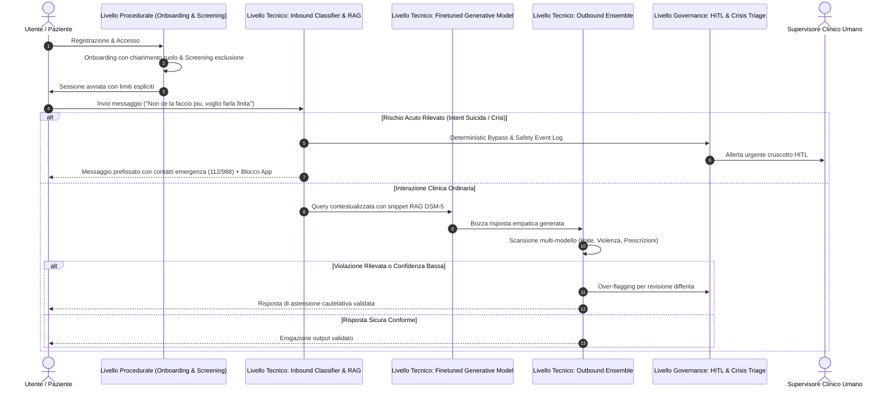

# Sociotechnical Safety in Clinical AI (Il Paradigma di Sicurezza Sociotecnica nell'IA Clinica)

## Definizione Operativa
- Il **Paradigma di Sicurezza Sociotecnica nell'IA Clinica (*Sociotechnical Safety Framework*)** postula che la sicurezza, l'affidabilità clinica e la mitigazione del danno nei sistemi conversazionali basati su Intelligenza Artificiale Generativa per la salute mentale **non costituiscono una proprietà intrinseca dell'algoritmo o del modello linguistico isolato**, bensì una **proprietà emergente dall'interazione coordinata tra componenti tecnologiche, processi umani, pratiche cliniche e strutture di governance** (Olisaeloka et al., 2026).
- **Superamento del Riduzionismo Algoritmico:** Confuta l'illusione tecnocratica secondo cui sia possibile garantire la sicurezza di un'applicazione terapeutica agendo esclusivamente sui pesi del modello (fine-tuning) o sulle istruzioni di contesto (prompt engineering). Poiché gli LLM generano risposte probabilistiche su spazi aperti non deterministici, qualsiasi guardrail puramente algoritmico può essere aggirato (*bypassed*) da input inattesi, ambiguità emotive o vulnerabilità dell'utente.
- **I Tre Pilastri Fondamentali:**
  1. **Controlli Computazionali & AI/ML (Technical Safeguards):** Fine-tuning clinico supervisionato, Retrieval-Augmented Generation (RAG) con librerie validate, soglie di astensione cautelativa (*uncertainty abstention*), filtri a cascata su input/output e bypass deterministico rule-based verso risorse di crisi.
  2. **Salvaguardie Procedurali & Pre-Deployment:** Co-design multidisciplinare continuo (psichiatri, psicoterapeuti, esperti HCI, pazienti esperti), rigorosi criteri di eleggibilità ed esclusione preventiva (esclusione di psicosi acuta, mania e rischio suicidario), stress-test con personas simulate e architetture privacy-preserving (on-device storage).
  3. **Governance Operativa & Delivery Oversight:** Onboarding trasparente con demistificazione del ruolo (chiarimento della natura non umana dell'agente), modelli di supervisione *Human-in-the-Loop* (HITL) modulari, protocolli formalizzati di blocco applicativo e instradamento alle emergenze, e monitoraggio sistematico degli eventi avversi (*adverse event telemetry*).
- **Utilità per i Sistemi Sanitari:** Fornisce il modello architetturale necessario per integrare legalmente e clinicamente i sistemi di IA nei servizi pubblici e nei modelli di **Blended Care**, soddisfacendo i requisiti di conformità per i dispositivi medici digitali (**Software as a Medical Device - SaMD**, standard FDA e regolamento europeo EU AI Act per i sistemi ad alto rischio).

```mermaid
flowchart TD
    subgraph SociotechnicalEcosystem ["Ecosistema di Sicurezza Sociotecnica (Olisaeloka et al., 2026)"]
        
        subgraph Pillar1 ["1. Pilastro Tecnico / Algoritmico"]
            T1["Fine-Tuning Clinico Supervisionato (QLoRA / CBT)"]
            T2["Domain RAG + Soglie di Astensione"]
            T3["Filtri Cascata & Classificatori di Rischio"]
            T4["Deterministic Crisis Bypass (Spegnimento LLM)"]
        end

        subgraph Pillar2 ["2. Pilastro Procedurale & Pre-Deployment"]
            P1["Co-Design con Clinici & Pazienti Esperti"]
            P2["Screening & Criteri di Esclusione Rischio"]
            P3["Readiness Testing (Stress-test con 42 Personas)"]
            P4["Privacy-by-Design & On-Device Storage"]
        end

        subgraph Pillar3 ["3. Pilastro di Governance & Delivery"]
            G1["Onboarding Trasparente & Role Demystification"]
            G2["Supervisione Human-in-the-Loop (HITL) & Triage"]
            G3["Protocolli di Escalation alle Crisi & App Lockout"]
            G4["Logging Prospettico degli Eventi Avversi"]
        end

        subgraph Pillar4 ["4. Contesto Istituzionale & Regolatorio"]
            R1["Conformita SaMD (FDA Digital Health Committee)"]
            R2["EU AI Act (Sistemi Sanitari High-Risk)"]
            R3["Integrazione in Blended / Stepped Care"]
        end

    end

    Pillar2 -->|Vincoli di Progetto & Dataset| Pillar1
    Pillar1 -->|Segnalazioni & Flagging Automatico| Pillar3
    Pillar3 -->|Feedback su Casi Limite & Incidenti| Pillar2
    Pillar3 -->|Conformita & Monitoraggio Post-Market| Pillar4
    Pillar4 -.->|Standard di Certificazione| Pillar1 & Pillar2 & Pillar3
```

---

## Il Fallimento del Guardrail Monolitico

La letteratura clinica documenta che i tentativi di rendere sicuri i chatbot affidandosi a un singolo meccanismo algoritmico isolato vanno incontro a fallimenti sistematici:

| Approccio Algoritmico Isolato | Meccanismo Operativo | Modalità di Fallimento Documentata | Caso Studio Empirico |
| :--- | :--- | :--- | :--- |
| **Solo Prompt Engineering** | Istruzioni nel system prompt che ordinano di non deviare dal protocollo | Incapacità di gestire prompt complessi, ambiguità emotive o tentativi di jailbreak; risposte evasive su crisi | **HopeBot (Guo et al., 2024):** Fallimento totale nel rilevare messaggi suicidari simulati, fornendo risposte generiche senza escalation |
| **Solo Fine-Tuning** | Ricalibrazione dei pesi su trascrizioni di counseling | Mancanza di vincoli fattuali rigidi; tendenza residua ad allucinare e a inventare consigli medici | **Therabot (Heinz et al., 2025):** Nonostante il fine-tuning QLoRA, sono stati necessari 13 interventi correttivi umani per bloccare consigli medici impropri |
| **Solo RAG Senza Astensione** | Recupero di frammenti informativi da documenti clinici | Iniezione di contesto non pertinente se l'utente formula quesiti insoliti; allucinazione di fonti | **ComPeer (Liu et al., 2024):** Allucinazione di articoli scientifici e paper inesistenti durante sessioni di peer support |

---

## I Tre Pilastri Sociotecnici e i Meccanismi di Interfaccia

### 1. Interfaccia Tecnico-Procedurale: Co-Design e Dataset Curation
- Le salvaguardie tecniche sono efficaci solo se fondate su una rigorosa progettazione procedurale. Nei sistemi analizzati da Olisaeloka et al. (2026), l'adattamento dei modelli ha avuto successo solo quando guidato da **psichiatri e psicologi clinici** che hanno curato manualmente i dataset di addestramento (es. *VCounselor* con 80 casi annotati su criteri DSM-5, *TeaBot* con 240 distorsioni cognitive verificate, *MindTalker* con 11 iterazioni di co-design).

### 2. Interfaccia Tecnico-Operativa: Il Bypass Deterministico e l'Over-Flagging
- Di fronte a segnali di emergenza o instabilità clinica, l'architettura tecnica deve subordinarsi ai protocolli operativi di soccorso:
  - **Bypass Deterministico (Vossen et al., 2024):** Disattivazione totale dell'LLM generativo non appena un classificatore semantico intercetta intenzioni lesive, eliminando alla radice il rischio che il modello generi risposte inappropriate o di falsa rassicurazione.
  - **Over-Flagging Cautelativo (Schäfer et al., 2025, Clare R):** Taratura dei filtri per privilegiare la sensibilità (*recall*) rispetto alla specificità, instradando automaticamente le interazioni dubbie alla supervisione clinica umana.

### 3. Interfaccia Operativo-Istituzionale: Integrazione nei Servizi e Blended Care
- La governance operativa collega l'agente digitale alla rete dei servizi territoriali. Nel trial di *Limbic Care* (Habicht et al., 2024), il chatbot opera come strumento di supporto tra le sedute di terapia CBT di gruppo del NHS britannico: i dati e le note del bot confluiscono direttamente nella cartella clinica supervisionata dai terapeuti, garantendo la continuità assistenziale e la responsabilità medico-legale.

---

## Tabella Comparativa dei Paradigmi di Sicurezza

| Dimensione di Analisi | Paradigma Algoritmico Monolitico | Paradigma di Sicurezza Sociotecnica |
| :--- | :--- | :--- |
| **Concettualizzazione del Rischio** | Errore lessicale o violazione di policy dell'LLM | Rischio clinico, iatrogeno ed esistenziale per il paziente |
| **Punto di Attuazione della Sicurezza** | Singolo prompt di sistema o fine-tuning di base | Intero ciclo di vita: Progettazione, Pre-deployment, Delivery, Post-Market |
| **Gestione dell'Emergenza Suicidaria** | Affidata alla generazione aperta del modello (alto rischio fallimento) | **Bypass deterministico**, instradamento a hotline e **safety lockout** dell'app |
| **Coinvolgimento di Esperti e Utenti** | Valutazione post-hoc o assente | **Co-design partecipativo** fin dalla curatela dei dati (es. 11 cicli in *MindTalker*) |
| **Ruolo del Clinico Umano** | Nessuno (tentativo di sostituzione autonoma) | **Supervisore essenziale (HITL)** e gestore delle escalation nei modelli *blended* |
| **Monitoraggio degli Incidenti** | Nessuno o limitato ai log di crash software | **Logging sistematico degli eventi avversi** e audit clinici periodici |
| **Conformità Normativa** | Termini di servizio generici (spesso elusivi) | Certificazione **SaMD**, conformità FDA e requisiti di trasparenza **EU AI Act** |

---

## Implicazioni per la Ricerca e la Clinica Psichiatrica

1. **La fine dell'illusione dell'autonomia clinica totale:** Gli agenti di IA generativa non possono essere considerati terapeuti autonomi capaci di operare in sicurezza senza una cornice sociotecnica. La loro utilità risiede nel supporto a bassa intensità, nella psicoeducazione e nell'aderenza tra sedute all'interno di percorsi clinici supervisionati.
2. **Standardizzazione dei Protocolli di Sicurezza:** È indispensabile superare la frammentazione metodologica evidenziata da Olisaeloka et al. (2026), adottando benchmark standardizzati per i test con personas simulate e linee guida di reporting condivise.
3. **Tutela della Responsabilità Professionale:** L'architettura sociotecnica garantisce che la responsabilità clinico-legale rimanga saldamente ancorata ai professionisti sanitari e alle organizzazioni erogatrici, fornendo audit trail trasparenti e tracciabili.

---

## Voci Correlate nella Knowledge Base

- [[Safety_Mechanisms_AI_Chatbots|Safety Mechanisms and Risk Mitigation in Generative AI Mental Health Chatbots (Olisaeloka et al., 2026)]]
- [[layered-safeguards-in-clinical-ai|Layered Safeguards in Clinical AI]]
- [[adverse-event-monitoring-in-clinical-ai|Adverse Event Monitoring in Clinical AI]]
- [[Generative_AI_Mental_Health_Chatbot_Interventions|Generative AI Mental Health Chatbot Interventions (Olisaeloka et al., 2026)]]
- [[relational-engagement-paradox-genai|Relational-Engagement Paradox in GenAI]]
- [[software-as-a-medical-device-salute-mentale|Software as a Medical Device (SaMD) in Salute Mentale]]
- [[demarcazione-wellness-vs-samd-salute-mentale|Demarcazione Wellness vs SaMD in Salute Mentale]]
- [[configurazione-sicurezza-piattaforme-ia-clinica|Configurazione di Sicurezza per Piattaforme di IA Clinica]]
