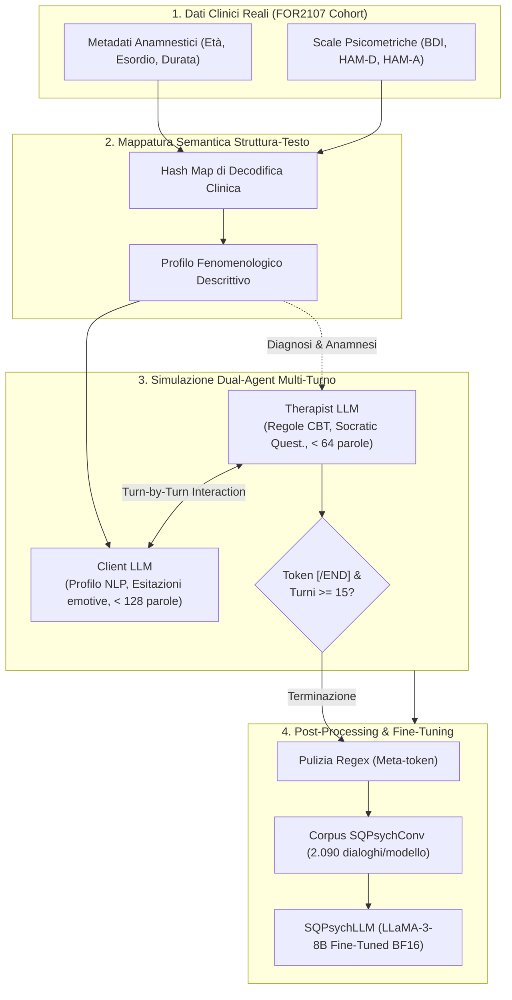

---
tags: [sqpsych, dual-agent, open-weight-llm, synthetic-dialogues, psicoterapia-ai, cbt, depressione, benchmark-clinico, distillation]
source_papers: ["2510.25384v1.pdf"]
---

# SQPsych Framework

## Definizione Operativa
- Framework metodologico e computazionale introdotto da Vu et al. (2025) per la generazione automatizzata di dialoghi psicoterapeutici sintetici multi-turno conformi ai protocolli della Terapia Cognitivo-Comportamentale (CBT). Il sistema condiziona la generazione su profili anamnestici e scale psicometriche standardizzate reali (BDI, HAM-D, HAM-A) convertiti in linguaggio naturale, simulando la seduta clinica mediante due agenti LLM indipendenti (*Therapist LLM* e *Client LLM*) eseguiti localmente. Il corpus generato (**SQPsychConv**) viene impiegato per distillare modelli di counseling compatti da 8B (**SQPsychLLM**).
- **Utilità CBT / Clinica:** Supera il collo di bottiglia della scarsità di trascrizioni cliniche reali imposto dalle normative sulla privacy (GDPR, HIPAA). Rispetto ai generatori basati su singolo modello commerciale (es. CACTUS o SMILE), l'architettura dual-agent preserva la separazione epistemica tra terapeuta e paziente, prevenendo leakage diagnostici e allucinazioni, e consentendo di addestrare modelli capaci di identificare distorsioni cognitive (CBT-CD) e credenze nucleari (CBT-PC) con alta fedeltà clinica.

## Evidenze dalla Letteratura

- **Architettura Dual-Agent vs. Generazione Mono-Agente:**
  - I primi tentativi di generare dialoghi psicoterapeutici sintetici (come CACTUS, Lee et al., 2024; SMILE, Qiu et al., 2024) hanno utilizzato un unico LLM a cui veniva richiesto di alternare i ruoli di terapeuta e paziente nello stesso contesto di generazione.
  - Tale approccio comporta una forte omogeneizzazione stilistica (*sycophancy*, perdita di asimmetria relazionale) e il rischio che il modello conosca anticipatamente la traiettoria di ristrutturazione del paziente.
  - SQPsych risolve questa criticità istanziando due processi LLM indipendenti con distinte memorie operative, prompt di ruolo e vincoli verbali (Vu et al., 2025).

- **Specifiche di Ruolo e Linee Guida Operative:**
  - *Therapist LLM:* Istruito a simulare uno psicoterapeuta abilitato con oltre 3.000 ore di supervisione clinica. Implementa le 6 fasi del protocollo CBT di seduta (Beck, 1963; Beck, 2011):
    1. Controllo dell'umore (*mood check*).
    2. Fissazione dell'agenda (*agenda setting*).
    3. Riformulazione del modello cognitivo (pensiero-emozione-comportamento).
    4. Scoperta guidata (*Socratic questioning*) e ristrutturazione cognitiva.
    5. Pianificazione comportamentale ed esercizi a casa (*homework*).
    6. Chiusura strutturata e feedback finale.
    - *Vincoli:* Enunciati brevi (< 64 parole), divieto di citare i codici dei test, divieto di imporre ottimismo irrealistico o risposte precoci.
  - *Client LLM:* Riceve il quadro psicometrico e anamnestico tradotto in terza persona e lo interpreta in prima persona.
    - *Vincoli:* Espressione emotiva sfumata, esitazioni contestuali (*"uh"*, *"well"*, *"like"*), risposte concise (< 128 parole), divieto assoluto di svelare la diagnosi nosografica esplicita.

- **Dinamica Conversazionale e Criteri di Terminazione:**
  - Il colloquio si sviluppa turno per turno mantenendo l'intera cronologia dialogica per preservare la coerenza tematica e longitudinale.
  - Per evitare sessioni superficiali, il framework impone una durata minima di **15 turni** prima che il Therapist LLM possa concordare la chiusura e produrre il token `[/END]`.

- **Prestazioni di Distillazione e Benchmark Clinici (SQPsychLLM-8B):**
  - La distillazione dei dataset generati (**SQPsychConv**) su modelli compatti `Llama-3-8B-Instruct` ha prodotto modelli che superano le baseline di riferimento addestrate su dataset reali o sintetici da GPT-4o:
    - *CounselingBench (1.612 item NCMHCE):* Nel setting *Zero-Shot*, `SQPsychLLM_gemma` raggiunge Recall **0.492** ed F1 **0.484**, superando Psych8k (0.455) e CAMEL (0.301) (Vu et al., 2025; Nguyen et al., 2025).
    - *CBT-Bench (MSW Exams):* Nel rilevamento di distorsioni cognitive (CBT-CD), `SQPsychLLM_gemma` ottiene Recall **0.555** e F1 **0.345**; nell'identificazione di credenze nucleari (CBT-PC), `SQPsychLLM_command` ottiene Recall **0.849** e `SQPsychLLM_nemotron` F1 **0.737** (Zhang et al., 2025).
    - *Efficienza del Dataset:* SQPsychLLM ottiene questi risultati con solo il **10%** degli enunciati presenti in dataset estesi come CACTUS, confermando l'efficacia del condizionamento da questionari strutturati.

- **Preferenza Clinica Qualificata:**
  - Negli scenari avversariali di *CounselBench-Adv*, psicoterapeuti esperti hanno preferito le risposte di `SQPsychLLM_gemma` a quelle di CAMEL (**84 vs 22**) e Psych8k (**44 vs 29**), premiando la gradualità maieutica e il rispetto dell'autonomia decisionale del paziente.

**Riferimenti Bibliografici:**
- Vu, D. N. L., Tan, R., Moench, L., Francke, S. J., Woiwod, D., Thomas-Odenthal, F., Stroth, S., Kircher, T., Hermann, C., Dannlowski, U., Jamalabadi, H., & Ji, S. (2025). Roleplaying with Structure: Synthetic Therapist-Client Conversation Generation from Questionnaires. *arXiv preprint arXiv:2510.25384v1 [cs.CL]*.
- Beck, A. T. (1963). Thinking and depression: I. Idiosyncratic content and cognitive distortions. *Archives of General Psychiatry*, 9(4), 324–333.
- Beck, J. S. (2011). *Cognitive behavior therapy: Basics and beyond* (2nd ed.). Guilford Press.
- Lee, S., et al. (2024). CACTUS: Towards psychological counseling conversations using cognitive behavioral theory. In *Findings of EMNLP 2024*, pages 14245–14274.
- Nguyen, V. C., et al. (2025). Do large language models align with core mental health counseling competencies? In *Findings of NAACL 2025*, pages 7488–7511.
- Zhang, M., et al. (2025). CBT-Bench: Evaluating large language models on assisting cognitive behavior therapy. In *Proceedings of NAACL-HLT 2025*, pages 3864–3900.

## Relazioni
- Vedi anche: [[2510-25384v1]], [[open-weight-privacy-compliant-synthesis]], [[conversione-questionari-dialoghi-clinici]], [[clinical-ai-simulation]], [[simulazione-pazienti-ai]], [[dsm5agentflow]], [[crdial-framework]], [[crispers-models-and-dataset]], [[cbt-dialogue-systems-and-tools]], [[supportive-listener-prompting]], [[modello-centauro-clinico]], [[ai-assisted-psychotherapy]]