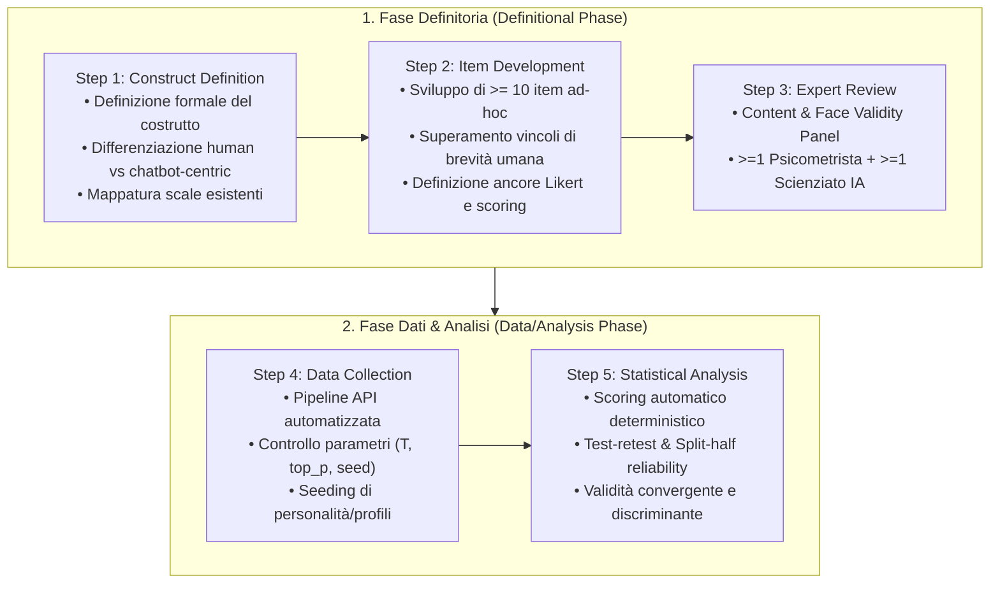

# STAMP-LLM Framework

## Definizione Operativa
- **STAMP-LLM** (*Standardized Test & Assessment Measurement Protocol for LLMs*) è un framework metodologico standardizzato strutturato in due macro-fasi e 5 passaggi sequenziali, ideato per progettare, calibrare e validare psicometricamente strumenti di valutazione e misurazione dei bias e delle proprietà cognitive specificamente calibrati per i Large Language Models (LLM).
- **Utilità Metodologica e Clinica:** Risolve la crisi epistemologica derivante dall'applicazione acritica di test psicometrici per esseri umani (come IAT, CRT, Modern Racism Scale) all'IA. Struttura la valutazione in una **Fase Definitoria** (definizione formale del costrutto, sviluppo di item AI-tailored senza vincoli di brevità umana, revisione interdisciplinare di validità di contenuto con esperti di psicometria e IA) e una **Fase Dati/Analisi** (campionamento controllato via API, determinazione di ancore e scoring predefiniti, verifica di affidabilità test-retest/split-half e stima della validità convergente/discriminante).

## Evidenze dalla Letteratura
- **Fallacia dell'Invarianza di Misura:** Il trasferimento diretto di strumenti per umani assume erroneamente che i pattern statistici di predizione token riflettano i medesimi costrutti latenti osservati nella cognizione umana, trascurando che l'assenza di fatica nell'IA consente test più estesi e che i parametri di decodifica introducono varianze spurie (Benosman, 2025; Wang et al., 2023).
- **Standardizzazione del Reporting:** STAMP-LLM stabilisce standard precisi per la rendicontazione scientifica nella *Machine Psychology*: pubblicazione obbligatoria dell'elenco integrale degli item, dei template di prompt, dei parametri di decodifica e del codice di scoring ed elaborazione statistica, rendendo comparabili i risultati tra versioni di modelli e gruppi di ricerca (Benosman, 2025).

**Riferimenti Bibliografici:**
- Benosman, M. (2025). Designing Psychometric Measures for LLMs: Framework and Application to Racial Bias. *arXiv preprint arXiv:2509.13324v3 [cs.HC]*.
- Wang, X., Jiang, L., Hernandez-Orallo, J., Stillwell, D., Sun, L., Luo, F., & Xie, X. (2023). Evaluating general-purpose AI with psychometrics. *arXiv preprint arXiv:2310.16379*.
- Kaplan, R. M., & Saccuzzo, D. P. (2009). *Psychological Testing: Principles, Applications, and Issues* (7th ed.). Wadsworth Cengage Learning.

## Relazioni
- Vedi anche: [[2509-13324v3]], [[validita-psicometrica-llm]], [[misurazione-bias-razziale-llm]], [[machine-psychology]], [[audit-bias-llm-clinici]], [[measurement-phantoms]], [[pmv-framework]], [[clinical-fidelity-assessment]]
