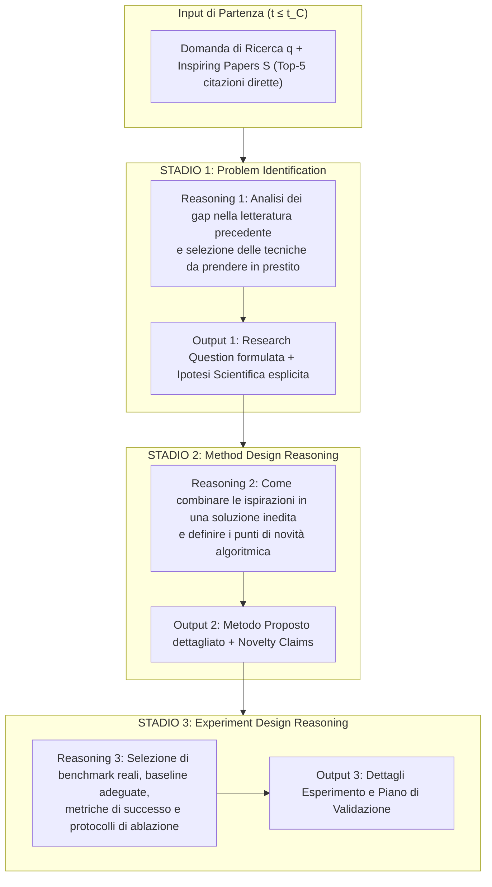

---
tags: [stepwise-cot, chain-of-thought, citation-grounded-reasoning, staged-planning, structured-ideation, scientific-reasoning, cognitive-scaffolding]
source_papers: ["2603.27146v3.pdf"]
---

# Stepwise CoT (Chain-of-Thought) nella Pianificazione Scientifica

## Definizione Operativa
- Metodologia avanzata di supervisione del ragionamento per [[large-language-models]] introdotta da Heng Wang et al. (UIUC, 2026), progettata per la formulazione strutturata di proposte di ricerca e piani metodologici complessi.
- **Meccanismo Computazionale:** Supera sia la generazione diretta senza ragionamento (*Direct SFT*) sia il classico Chain-of-Thought monolitico posizionato in blocco unico prima dell'output (*Monolithic CoT*). Lo **Stepwise CoT SFT** scompone il processo ideativo e di pianificazione in **tre stadi sequenziali interleavati**, in cui ciascuna fase di ragionamento critico genera direttamente la rispettiva sezione strutturata della proposta:
  1. *Stage 1 (Problem Identification & Gap Analysis)* $\to$ Genera **Research Question + Hypothesis**;
  2. *Stage 2 (Method Design Reasoning & Inspiration Borrowing)* $\to$ Genera **Proposed Method + Novelty Claims**;
  3. *Stage 3 (Experiment Design Reasoning & Validation Planning)* $\to$ Genera **Experiment Details**.
- **Utilità Cognitiva e Paralleli Clinici/CBT:** Riflette la suddivisione del problem-solving scientifico e clinico in tappe ordinate e verificabili. In psicoterapia cognitivo-comportamentale (CBT), questo approccio corrisponde al principio di *scaffolding* cognitivo: scomporre una ristrutturazione complessa in passaggi discreti (identificazione del pensiero disfunzionale $\to$ ricerca ed esame delle prove $\to$ formulazione del piano di azione alternativo ed esperimento comportamentale), evitando che l'agente o il paziente compiano salti inferenziali scorretti o non verificabili.

---

## Evidenze dalla Letteratura

### 1. Limiti del CoT Monolitico e Razionale della Scomposizione
- **Il Problema della Perdita di Contesto e Deriva (*Reasoning Drift*):** Quando un modello di linguaggio è istruito a generare un'unica lunga catena di pensiero prima dell'intero documento (come in Wei et al., 2022 o nei CoT non strutturati), il modello tende a concentrarsi eccessivamente sulle prime fasi del problema o a produrre ragionamenti vaghi che non si traducono in dettagli operativi nelle sezioni finali (Wang et al., 2026).
- **Interleaving come Vincolo Strutturale:** Distribuire il ragionamento in prossimità diretta delle sezioni a cui si riferisce (*interleaved reasoning*) costringe l'LLM a mantenere la coerenza tra le premesse analitiche e la formulazione tecnica specifica, eliminando la dispersione dell'attenzione.

---

### 2. Architettura dei Tre Stadi di Ragionamento Scientifico

#### A. Step 1: Problem Identification (150–250 parole)
- *Obiettivo:* Analizzare i 5 paper ispiratori $S$ per identificare limitazioni specifiche, colli di bottiglia o assunzioni non verificate.
- *Processo:* Esplicitare quali concetti possono essere mutuati e come la loro ricombinazione guidi verso una domanda di ricerca ben posta.
- *Output:* Generazione di `research_question` e `hypothesis`.

#### B. Step 2: Method Design Reasoning (80–120 parole)
- *Obiettivo:* Progettare la risposta architetturale o algoritmica alla domanda posta.
- *Processo:* Motivare l'integrazione di tecniche preesistenti, descrivere le modifiche necessarie per superare i gap e specificare perché tale combinazione sia originale.
- *Output:* Generazione di `proposed_method` e `novelty_claims`.

#### C. Step 3: Experiment Design Reasoning (60–100 parole)
- *Obiettivo:* Definire il piano di test per verificare o falsificare l'ipotesi formulata.
- *Processo:* Identificare i dataset standard, le baseline più competitive dello stato dell'arte e le metriche di accuratezza/efficienza, oltre agli studi di ablazione essenziali.
- *Output:* Generazione di `experiment_details`.

---

### 3. Dati di Supervisione e Sintesi Priva di Contaminazioni (*Leakage-Free*)

Per addestrare i modelli con Stepwise CoT SFT:
1. Gli autori hanno convertito 2.823 articoli pubblicati (NeurIPS/ICLR 2024) in istanze di training $(q, S) \to (R_{\text{stepwise}}, \tilde{P})$.
2. Le tracce di pensiero intermedio sono state sintetizzate mediante GPT-5 adottando una **prospettiva forward-looking rigorosa** (*"scrivere come se si stesse pianificando la ricerca prima di conoscerne gli esiti finali"*, con divieto assoluto di usare nomi proprietari inventati nel paper o forme retrospettive).
3. Le istanze medie di training raggiungono 909 parole di traccia di pensiero (comprensive dei tre stadi) a fronte di 460 parole per la proposta target (Tabella 11).

---

### 4. Risultati Sperimentali e Guadagni Metodologici

#### A. Valutazione Quantitativa (Future Alignment Score, Tabella 1)
- Su **Qwen2.5-14B-Instruct**, Stepwise CoT raggiunge un FAS globale di **69.7**, superando:
  - *Direct SFT (w/o reasoning traces):* $65.1$ (+4.6 punti);
  - *Monolithic CoT SFT (w/o stepwise):* $66.1$ (+3.6 punti);
  - *Standard Prompting:* $63.0$ (+6.7 punti, +10.6% relativo).
- L'analisi per componenti dimostra che lo Stepwise CoT eccelle specificamente nelle fasi concettualmente più dense: **Hypothesis (71.4 vs 68.0)** e **Proposed Method (63.5 vs 60.0)**.

#### B. Valutazione Umana in Doppio Cieco ($N=120$ coppie)
- **Vs Prompting:** I ricercatori umani esperti hanno preferito le proposte generate con Stepwise CoT nel **54.2% dei casi per Soundness**, **58.3% per Excitement** e **54.2% Overall**, con un'unanimità tra revisori significativamente alta ($26.7\% - 31.7\%$).
- **Vs Paper Umani Reali:** Stepwise CoT ha raggiunto la sostanziale **parità (50.0% win rate)**, risultando indistinguibile da proposte scritte da scienziati umani.

#### C. Esecuzione del Codice nel Mondo Reale
Le proposte generate con Stepwise CoT sono risultate sufficientemente dettagliate e prive di allucinazioni da poter essere implementate autonomamente da agenti di codifica (*Cursor + Claude-4.5-Opus*):
- **Strategy Search:** Algoritmo multi-strategia che ha aumentato l'accuratezza del 4.17% su MATH (50.0% vs 48.0% Self-Consistency).
- **MALS:** Metodo di sparsificazione per il model merging che ha risolto il degrado catastrofico su Mistral-7B (75.5% su ARC-Easy vs 12.5% per TIES-Merging).

---

### 5. Implicazioni per la Progettazione di Agenti Cognitivi e Clinici
1. **Pianificazione Stadiata vs Monolitismo:** La strutturazione stadiata del pensiero rappresenta un design pattern fondamentale non solo per la ricerca scientifica, ma per qualsiasi agente LLM deputato a compiti complessi (diagnosi clinica, concettualizzazione del caso, negoziazione o pianificazione strategica).
2. **Tracciabilità e Ispezionabilità:** Rendere esplicite le tappe intermedie di pensiero consente al supervisore umano (*human-in-the-loop*) di intervenire tempestivamente per correggere una premessa errata nello Step 1 prima che questa si propaghi a cascata nel metodo (Step 2) o nel protocollo di verifica (Step 3).

---

## Riferimenti Bibliografici
- Wang, H., Jiang, P., Sun, J., Shi, Z., Yu, H., Han, J., & Ji, H. (2026). Learning to Predict Future-Aligned Research Proposals with Language Models. *arXiv preprint arXiv:2603.27146v3 [cs.CL]*, 1–31. https://doi.org/10.48550/arXiv.2603.27146
- Wei, J., Wang, X., Schuurmans, D., Bosma, M., Xia, F., Chi, E., Le, Q. V., & Zhou, D. (2022). Chain-of-thought prompting elicits reasoning in large language models. In *Advances in Neural Information Processing Systems (NeurIPS 2022)*, 35, 24824–24837.
- Wang, X., Wei, J., Schuurmans, D., Le, Q. V., Chi, E. H., Narang, S., Chowdhery, A., & Zhou, D. (2023). Self-consistency improves chain of thought reasoning in language models. In *ICLR 2023*.
- Si, C., Hashimoto, T., & Yang, D. (2026a). The ideation-execution gap: Execution outcomes of LLM-generated versus human research ideas. In *The Fourteenth International Conference on Learning Representations (ICLR 2026)*.

---

## Relazioni
- Vedi anche: [[2603.27146v3]], [[future-alignment-score]], [[time-sliced-scientific-forecasting]], [[hypothesis-generation]], [[hybrid-ai-research-workflows]], [[prompting-in-psychology]], [[large-language-models]], [[therapeutic-reasoning-paths]], [[wang-et-al-2026]]
