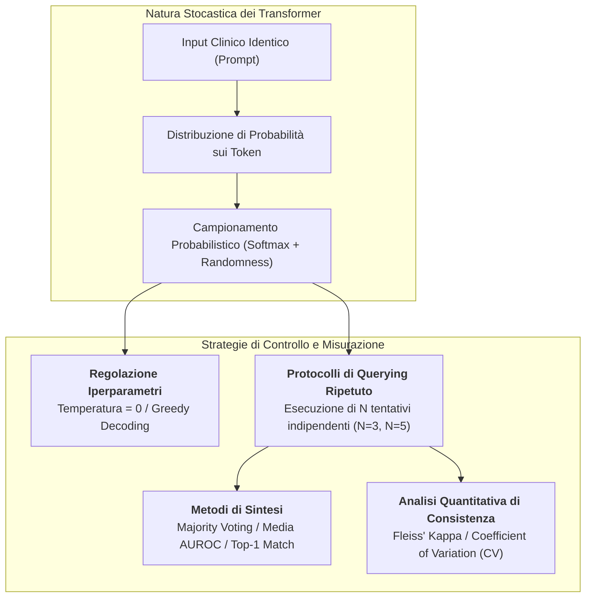
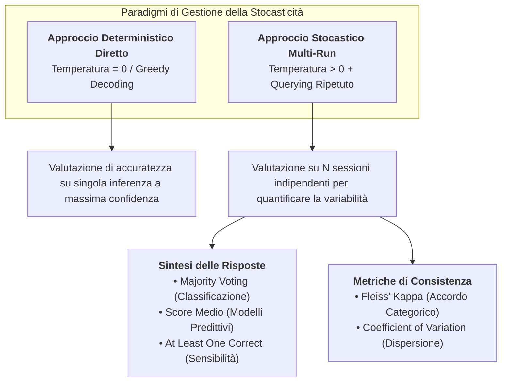

# Stochasticity Management and Output Reliability in Clinical LLMs

## Definizione Operativa
- La **Gestione della Stocasticità (*Stochasticity Management*)** nell'intelligenza artificiale clinica definisce l'insieme di strategie metodologiche, iperparametriche e statistiche volte a controllare, quantificare e sintetizzare la variabilità non deterministica intrinseca alle risposte generate dai Large Language Models (LLM) e Large Multimodal Models (LMM).
- **Meccanismo Probabilistico Fondamentale:** A differenza degli algoritmi di intelligenza artificiale convenzionali (modelli discriminativi, alberi decisionali, reti neurali convoluzionali deterministiche) che restituiscono un output identico per il medesimo input, i modelli basati su architettura Transformer autoregressiva generano sequenze testuali campionando token successivi da una distribuzione di probabilità calcolata tramite la funzione *softmax*.
- **Rilevanza per la Ricerca Clinica:** In medicina e radiologia, la stocasticità può indurre il modello a formulare diagnosi differenziali discordanti o ad assegnare categorie nosografiche eterogenee (es. LI-RADS 3 vs LI-RADS 4) per la medesima vignetta clinica. Come formalizzato dalle linee guida **[[MI-CLEAR-LLM_2025|MI-CLEAR-LLM]]** (Park et al., 2025) e [[chart-reporting-guideline|CHART]], una rigorosa rendicontazione dei parametri di casualità e dei protocolli di aggregazione delle risposte è indispensabile per validare l'affidabilità scientifica e la sicurezza regolatoria dei modelli sanitari.

---

## Meccanismi Tecnici della Stocasticità

### 1. La Funzione Softmax e la Temperatura ($T$)
Durante l'inferenza, il modello calcola i logit $z_i$ per ciascun token nel vocabolario. Le probabilità $P(w_i)$ vengono derivate applicando la temperatura $T$:

$$P(w_i) = \frac{\exp(z_i / T)}{\sum_j \exp(z_j / T)}$$

- **Temperatura Tendente a Zero ($T \to 0$ / $T = 0$):** I logit vengono scalati verso valori estremi, concentrando la probabilità quasi al $100\%$ sul token con punteggio massimo (*greedy search decoding*). Il comportamento diventa formalmente pseudo-deterministico.
- **Temperatura Standard ($T \in [0.7, 1.0]$):** La distribuzione di probabilità viene appiattita, consentendo al generatore di selezionare token con probabilità inferiori. Questo favorisce la creatività e la fluidità linguistica ma introduce una marcata variabilità diagnostica inter-sessione.
- **Top-p (Nucleus Sampling) & Top-k:** Parametri che limitano il campionamento ai token che cumulano una probabilità cumulativa $\le p$ o ai primi $k$ candidati più probabili.

### 2. Sorgenti Nascoste di Non-Determinismo
Anche impostando $T = 0$, un modello può generare risposte lievemente eterogenee su cluster cloud distribuiti a causa di:
- **Architetture Mixture-of-Experts (MoE):** Instabilità nell'instradamento stocastico tra esperti (*expert routing*).
- **Operazioni Parallele su GPU (Floating-Point Non-Determinism):** L'ordine di esecuzione delle operazioni atomiche di riduzione su hardware fortemente parallelo (CUDA kernels) può causare minime discrepanze numeriche a livello di frazioni di precisione.
- **Infrastrutture API Multi-Tenant:** Ribilanciamento dinamico del carico su server con quantizzazioni o versioni del driver hardware eterogenee.

---

## Protocolli di Valutazione Sperimentale

Per misurare e governare l'impatto della stocasticità negli accuracy report clinici, lo standard MI-CLEAR-LLM identifica due approcci metodologici primari:

### 1. Protocollo Multi-Querying e Metodi di Sintesi
Quando la valutazione viene condotta in regime stocastico, il ricercatore deve sottomettere ciascun quesito clinico per un numero prefissato $N$ di iterazioni indipendenti (tipicamente $N = 3$ o $N = 5$) e dichiarare la regola di aggregazione:

| Metodo di Sintesi | Definizione Operativa | Applicazione Clinica Elettiva |
| :--- | :--- | :--- |
| **Majority Vote (Votazione a Maggioranza)** | Viene adottata come diagnosi finale quella selezionata dalla maggioranza delle $N$ sessioni indipendenti (es. 2 su 3 o 3 su 5). | Task di classificazione diagnostica categoriale (es. resecabilità oncologica, stadiazione TNM). |
| **Punteggio Medio (Average Score)** | Calcolo della media aritmetica o mediana dei punteggi di rischio/probabilità generati nelle $N$ iterazioni. | Valutazione di score prognostici continui (es. rischio cardiovascolare a 10 anni calcolato da Han et al., 2024). |
| **At Least One Correct ("Top-N Repetitions")** | L'output è considerato corretto se la diagnosi corretta compare in almeno una delle $N$ ripetizioni. | Misurazione del potenziale diagnostico massimale (limite superiore teorico della conoscenza del modello). |
| **First-Attempt Baseline** | Utilizzo esclusivo della prima risposta generata, impiegando le successive solo per l'analisi di consistenza. | Simulazione realistica dell'interazione *point-of-care* del clinico che interroga il chatbot una sola volta. |

---

## Metriche Statistiche di Consistenza e Robustezza

La rendicontazione completa della stocasticità richiede la misurazione quantitativa della concordanza tra sessioni:

### 1. Fleiss' Kappa ($\kappa$) per Variabili Categoriche
Valuta l'accordo tra valutatori multipli o sessioni multiple per dati nominali/ordinali:
$$\kappa = \frac{\bar{P} - \bar{P}_e}{1 - \bar{P}_e}$$
Un valore di $\kappa < 0.60$ segnala un'instabilità diagnostica inaccettabile per l'impiego clinico indipendente, mentre $\kappa \ge 0.81$ indica un accordo quasi perfetto.

### 2. Coefficiente di Variazione ($CV$) per Variabili Continue
Rapporto tra la deviazione standard ($\sigma$) e la media ($\mu$) delle stime fornite attraverso le ripetizioni:
$$CV = \frac{\sigma}{\mu} \times 100\%$$
Consente di quantificare se le stime probabilistiche del modello fluttuano in modo critico per il medesimo profilo paziente.

### 3. Variazione dell'AUROC
Misurazione dell'Area Sotto la Curva ROC calcolata su ciascuna iterazione e sul punteggio medio combinato, verificando se la stocasticità degrada o potenzia il potere discriminativo dell'algoritmo.

---

## Checklist Operativa di Rendicontazione (MI-CLEAR-LLM Item 7)

Ogni studio clinico su LLM deve esplicitare nella sezione Metodi:
1. [ ] **Parametri di Casualità:** Valore esatto di temperatura ($T$), top-p, top-k o applicazione esplicita di *greedy decoding*.
2. [ ] **Ripetizioni:** Numero esatto di interrogazioni indipendenti condotte per ciascun caso/paziente.
3. [ ] **Metodo di Aggregazione:** Descrizione della formula o logica impiegata per sintetizzare le risposte multiple.
4. [ ] **Analisi di Affidabilità:** Indici quantitativi di concordanza inter-sessione (Fleiss' Kappa, ICC, CV).
5. [ ] **Isolamento di Sessione:** Garanzia che ciascuna ripetizione sia stata effettuata come chiamata API atomica indipendente o in una nuova sessione chat priva di cronologia pregressa.

---

## Related pages
- [[mi-clear-llm-guideline]]
- [[MI-CLEAR-LLM_2025]]
- [[chart-reporting-guideline]]
- [[CHART2025]]
- [[elevate-genai-framework]]
- [[ELEVATE-GenAI2025]]
- [[gamer-reporting-guideline]]
- [[GAMER2025]]
- [[clinical-fidelity-assessment]]
- [[single-task-zero-shot-evaluation-trap]]
- [[power-safety-paradox]]
- [[prompting-in-psychology]]
- [[large-language-models]]
- [[software-as-a-medical-device-salute-mentale]]
