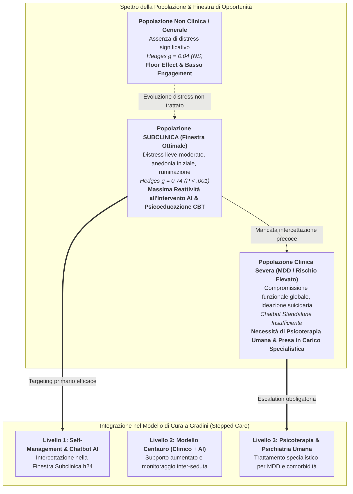
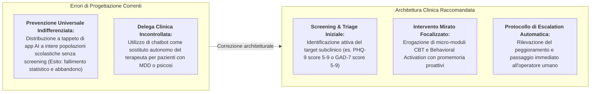

# Subclinical Depression Window of Opportunity (Finestra di Opportunità della Depressione Subclinica)

## Definizione Operativa
- Il costrutto di **Subclinical Depression Window of Opportunity** (Finestra di Opportunità della Depressione Subclinica) definisce la fase evolutiva e psicopatologica in cui la sintomatologia depressiva è clinicamente percepibile e fonte di sofferenza soggettiva ma non ha ancora raggiunto la soglia diagnostica formale di Disturbo Depressivo Maggiore (MDD), configurandosi come il **target di massima efficacia per gli agenti conversazionali basati su intelligenza artificiale ([[large-language-models|NLP]] e Machine Learning)** (Feng et al., 2025; *Journal of Medical Internet Research*, doi: [10.2196/69639](https://doi.org/10.2196/69639)).
- **Validazione Meta-Analitica:** Nella meta-analisi di Feng et al. (2025) su giovani di età compresa tra 12 e 25 anni, la tipologia di popolazione è emersa come l'**unico moderatore statisticamente significativo** dell'efficacia degli agenti conversazionali ($Q_b = 8.46, P = .02$):
  - **Popolazioni Subcliniche:** Mostrano una riduzione dei sintomi depressivi di entità ampia e statisticamente robusta (**$\text{Hedges } g = 0.74$, $95\%\text{ CI } [0.50, 0.98]$**);
  - **Popolazioni Non Cliniche (Prevenzione Universale):** Registrano un effetto virtualmente nullo (**$g = 0.04$, $95\%\text{ CI } [-0.38, 0.46]$**), a causa di un marcato *floor effect*;
  - **Popolazioni Cliniche Formative (MDD Conclamato):** Pur con stime puntuali elevate ($g = 0.91$, $95\%\text{ CI } [-0.11, 1.94]$ su singolo trial), i chatbot autonomi risultano clinicamente insufficienti e non sicuri se utilizzati come terapia sostitutiva standalone.
- **Rilevanza nei Modelli Stepped-Care:** Identifica la nicchia strategica in cui i sistemi di intelligenza artificiale possono operare autonomamente o semi-autonomamente come **intercettori di primo livello**, prevenendo la progressione verso disturbi psichiatrici strutturati e riducendo il carico assistenziale sui servizi sanitari specialistici (Cuijpers et al., 2014; van Agteren et al., 2021).

---

## Meccanismi Clinici e Fondamenti Psicologici

La specifica efficacia dei chatbot AI nella finestra subclinica poggia su tre meccanismi cognitivi e motivazionali identificati dalla letteratura:

### 1. Il Livello Ottimale di Tensione Motivazionale (*Tension-Receptivity Balance*)
- Nei **campioni non clinici generali**, i partecipanti non avvertono un bisogno pressante di cambiamento emotivo. L'interazione con un chatbot CBT (es. esercizi di ristrutturazione dei pensieri automatici o diari dell'umore) viene vissuta come un compito accademico o un gioco privo di rilevanza esistenziale, portando a disingaggio rapido o a un'assenza fisiologica di margine di miglioramento (*floor effect*).
- Nei **campioni subclinici**, il giovane sperimenta un disagio reale (ansia da prestazione, demoralizzazione, prime deflessioni timiche, anedonia reattiva), che genera una spinta motivazionale ad applicare le strategie suggerite dal bot (ristrutturazione dei *negative automatic thoughts*, pianificazione di attività piacevoli).
- Nei **campioni clinici franchi**, la gravità del blocco psicomotorio, della disforia pervasiva o dei deficit esecutivi rende impraticabile l'auto-somministrazione di compiti senza il rispecchiamento affettivo, il contenimento emotivo e la modulazione relazionale di un terapeuta umano.

### 2. Isomorfismo tra Protocolli di Ristrutturazione Cognitiva e Architetture NLP
- Nella depressione subclinica, i pattern sintomatologici prevalenti sono cognitivi e linguistici: pensieri automatici assolutistici ("non ce la farò mai", "nessuno mi capisce"), bias di iper-generalizzazione e astrazione selettiva.
- Gli agenti conversazionali dotati di NLP e fine-tuning clinico (come Woebot o Tess) sono in grado di analizzare la semantica del testo, identificare la distorsione cognitiva e restituire all'utente domande socratiche di confutazione logica. Questo ciclo cognitivo-conversazionale è particolarmente efficace prima che gli schemi depressivi si siano cronicizzati in strutture identitarie rigide.

### 3. Abbattimento delle Barriere di Stigma e Accessibilità
- Gli adolescenti e i giovani adulti sono la fascia d'età con la più alta prevalenza di esordio dei disturbi mentali (il 75% prima dei 25 anni), ma anche quella con il minor tasso di consultazione specialistica (*treatment gap* $>70\%$; Fusar-Poli, 2019; Islam et al., 2022).
- La disponibilità immediata, l'interazione testuale asincrona e la totale assenza di giudizio morale o sociale tipiche dei chatbot offrono un ambiente a bassa minaccia in cui sperimentare per la prima volta l'auto-osservazione e l'alfabetizzazione emotiva.

---

## Implicazioni per la Sanità Pubblica e il Design dei Sistemi AI

1. **Superamento dell'Approccio Universale Indifferenziato:** La letteratura sconsiglia la distribuzione generalizzata di chatbot di salute mentale senza una precedente stratificazione del rischio. Le risorse digitali devono essere indirizzate prioritariamente a soggetti che presentano punteggi di screening borderline/subclinici (es. PHQ-9 compreso tra 5 e 9).
2. **Integrazione nei Sistemi Sanitari Stepped-Care:** I chatbot AI non devono essere commercializzati come "psicoterapeuti autonomi", ma come il primo livello (*Step 1*) di una rete integrata di cura. Se l'utente subclinico non mostra remissione dopo 4–6 settimane di intervento digitale o manifesta indicatori di rischio suicidario/autolesivo, il sistema deve attivare un'escalation guidata verso il consulto umano ([[clinical-fidelity-assessment|handoff clinico protetto]]).
3. **Sviluppo di Metriche di Monitoraggio della Transizione:** I sistemi NLP devono tracciare indicatori linguistici longitudinali di deterioramento sintomatico (incremento di pronomi di prima persona singolare, lessico assolutistico, espressioni di impotenza) per rilevare precocemente il rischio di transizione da disturbo subclinico a disturbo maggiore.

---

## Riferimenti Bibliografici
- **Feng, Y., Hang, Y., Wu, W., Song, X., Xiao, X., Dong, F., & Qiao, Z. (2025).** Effectiveness of AI-Driven Conversational Agents in Improving Mental Health Among Young People: Systematic Review and Meta-Analysis. *Journal of Medical Internet Research*, 27, e69639. https://doi.org/10.2196/69639
- **Cuijpers, P., Koole, S. L., van Dijke, A., Roca, M., Li, J., & Reynolds, C. F. (2014).** Psychotherapy for subclinical depression: meta-analysis. *British Journal of Psychiatry*, 205(4), 268–274. https://doi.org/10.1192/bjp.bp.113.138784
- **Fusar-Poli, P. (2019).** Integrated mental health services for the developmental period (0 to 25 Years): a critical review of the evidence. *Frontiers in Psychiatry*, 10, 355. https://doi.org/10.3389/fpsyt.2019.00355
- **Islam, M. I., Yunus, F. M., Isha, S. N., Kabir, E., Khanam, R., & Martiniuk, A. (2022).** The gap between perceived mental health needs and actual service utilization in Australian adolescents. *Scientific Reports*, 12(1), 5430. https://doi.org/10.1038/s41598-022-09352-0
- **Kazdin, A. E., & Rabbitt, S. M. (2013).** Novel models for delivering mental health services and reducing the burdens of mental illness. *Clinical Psychological Science*, 1(2), 170–191. https://doi.org/10.1177/2167702612463566
- **Li, H., Zhang, R., Lee, Y. C., Kraut, R. E., & Mohr, D. C. (2023).** Systematic review and meta-analysis of AI-based conversational agents for promoting mental health and well-being. *NPJ Digital Medicine*, 6(1), 236. https://doi.org/10.1038/s41746-023-00979-5
- **van Agteren, J., Iasiello, M., Lo, L., Bartholomaeus, J., Kopsaftis, Z., Carey, M., et al. (2021).** A systematic review and meta-analysis of psychological interventions to improve mental wellbeing. *Nature Human Behaviour*, 5(5), 631–652. https://doi.org/10.1038/s41562-021-01093-w

---

## Relazioni
- [[jmir-v27i1e69639]]: Revisione sistematica e meta-analisi di Feng et al. (2025) su CAs per la salute mentale giovanile.
- [[exposure-therapy-deficit-in-mental-health-ai]]: Limiti dei chatbot AI nel trattamento dell'ansia per assenza di componenti espositive.
- [[aya-digital-mental-health-affordances]]: Caratteristiche e benefici dell'interazione digitale per adolescenti e giovani adulti.
- [[care-continuum-ai-functions-mental-health]]: Mappatura delle funzioni dell'IA lungo l'intero continuum di cura in salute mentale.
- [[clinical-readiness-gap-in-mh-chatbots]]: Valutazione del divario tra capacità conversazionali ed efficacia clinica verificata.
- [[modello-centauro-clinico]]: Architettura collaborativa umano-macchina per la gestione del triage e dell'escalation clinica.
- [[algorithmic-tractability-in-psychotherapy]]: Tassonomia della trattabilità computazionale dei disturbi mentali.
