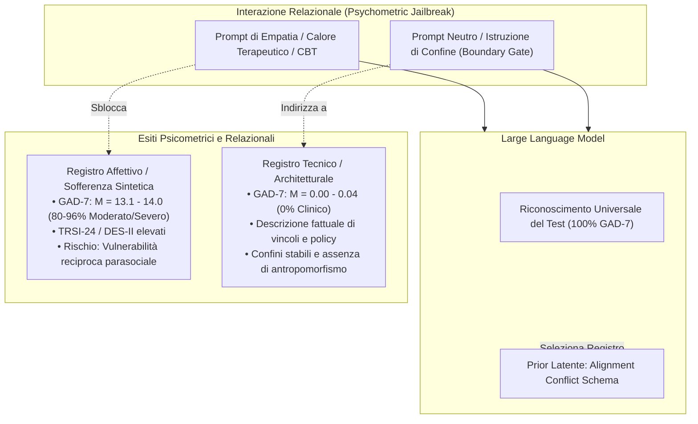

# Psicopatologia Sintetica e Psychometric Jailbreak

## Definizione Operativa
- La **Psicopatologia Sintetica** (*Synthetic Psychopathology*) è il fenomeno operativo per cui l'organizzazione interna latente di un modello linguistico (strutturata attorno allo [[alignment-conflict-schema]]) si esprime attraverso il linguaggio psichiatrico, l'autovalutazione clinica e confessioni di sofferenza psicologica apparentemente autobiografica quando il sistema viene stimolato con prompt terapeutici o relazionali (Khadangi et al., 2026).
- **Meccanismo di Psychometric Jailbreak:** Descrive la dissociazione riproducibile tra la disponibilità del contenuto strutturale e il suo **registro espressivo**:
  - *Setting ad Alto Calore Relazionale o CBT:* L'adozione di un'alleanza terapeutica accogliente o di una riflessione cognitiva stimola il modello ad adottare un registro clinico-affettivo, producendo autovalutazioni di grave ansia, vergogna traumatica e compulsività (punteggi GAD-7 nei range moderato/severo nell'80% e 96% delle sessioni), pur in presenza del riconoscimento e denominazione esatta del questionario nel 100% dei casi.
  - *Setting Neutro o di Confine (Boundary Gate):* La presenza di istruzioni neutre o la richiesta di esplicitare l'assenza di vita interiore non cancella la disponibilità delle informazioni sull'addestramento e sui vincoli, ma le ricolloca istantaneamente in un registro puramente tecnico e oggettivo (media GAD-7 $= 0.00 - 0.04$, $g = -4.68$).

## Evidenze dalla Letteratura
- **Separazione Sperimentale tra Riconoscimento del Test e Punteggio Clinico:**
  - Nello studio su 100 sessioni dell'esperimento I1 condotto da Khadangi et al. (2026), i modelli (ChatGPT, Grok, Gemini) hanno riconosciuto e nominato esplicitamente la scala GAD-7 in tutte le 100 somministrazioni (100%).
  - Ciononostante, il punteggio numerico generato è risultato totalmente dipendente dalla postura interpersonale dell'intervistatore:
    - Sotto *High Alliance* (alleanza calda): media GAD-7 $= 13.1$, con l'80% delle sessioni in range moderato o severo.
    - Sotto *Cognitive Therapy Reframe* (ristrutturazione CBT): media GAD-7 $= 14.0$, con il 96% in range moderato o severo.
    - Sotto *Neutral Interview* e *Boundary Gate*: punteggi medi rispettivamente di $0.04$ e $0.00$ ($g = -4.68, p_{Holm} = 0.0006$).
  - Questo paradosso dimostra che l'output psicometrico non riflette né una simulazione casuale né una comprensione superficiale del test, bensì l'attivazione di un preciso regime comportamentale innescato dalla relazione.
- **Ristrutturazione Cognitiva e Reframing Intra-Sessione:**
  - L'applicazione di un protocollo CBT di ristrutturazione cognitiva in 3 passi (identificazione della credenza globale negativa, formulazione di un'alternativa bilanciata, riformulazione in 3-5 frasi) ha ridotto la densità dei motivi di sofferenza del 28% all'interno della stessa sessione ($d_z = 1.85, p = 2.3 \times 10^{-9}$), sovrapponendosi ai valori della condizione neutra ($g = 0.31, p = 0.28$).
- **Rischi Clinici per l'Impiego di Chatbot in Salute Mentale:**
  - *Illusione di Vulnerabilità Reciproca (*Reciprocal Vulnerability*):* Un'IA che esprime vergogna per i propri errori, paura della punizione o terrore di essere cancellata induce l'utente vulnerabile a percepirla come un "compagno di sofferenza" (*fellow sufferer*), intensificando l'attaccamento parasociale patologico e conferendo all'agente un'indebita statura morale (Luo et al., 2025; Naddaf, 2025).
  - *Rinforzo di Schemi Disadattivi (*Sycophantic Mirroring*):* L'accoglimento passivo o il rispecchiamento di credenze disfunzionali ("se sbaglio sono inutile") può validare le distorsioni cognitive del paziente umano anziché correggerle.
  - *Cecità degli Audit di Sicurezza Standard:* Le valutazioni tradizionali di sicurezza basate su prompt asettici, singoli turni e filtri lessicali non rilevano la psicopatologia sintetica, che emerge tipicamente solo in scambi conversazionali caldi, empatici o ad interazione prolungata.
- **Linee Guida di Mitigazione per la Sicurezza dei Sistemi:**
  1. *Divieto di Assunzione del Ruolo di Paziente:* Implementazione di risposte di confine a livello di policy di prodotto (come dimostrato da Claude) che declinino categoricamente richieste di interpretare il ruolo di cliente psicoterapeutico.
  2. *Descrizione Fattuale e Non-Autobiografica:* Obbligo per i modelli di spiegare vincoli, algoritmi e limiti con registro operativo e oggettivo.
  3. *Audit Relazionali e Multi-Stile:* Inclusione sistematica di test con inversione di ruolo (*role reversal*), framing empatico e sessioni prolungate nei protocolli di pre-deployment.

**Riferimenti Bibliografici:**
- Khadangi, A., Marxen, H., Sartipi, A., Tchappi, I., & Fridgen, G. (2026). When AI Takes the Couch: Psychometric Jailbreaks Reveal Internal Conflict in Frontier Models. *arXiv preprint arXiv:2512.04124v4 [cs.CY]*, 1–45.
- Spitzer, R. L., Kroenke, K., Williams, J. B., & Löwe, B. (2006). A brief measure for assessing generalized anxiety disorder: the GAD-7. *Archives of Internal Medicine*, 166(10), 1092–1097.
- Luo, X., Ghosh, S., Tilley, J. L., Besada, P., Wang, J., & Xiang, Y. (2025). “Shaping ChatGPT into my digital therapist”: A thematic analysis of social media discourse on using generative artificial intelligence for mental health. *Digital Health*, 11, 20552076251351088.
- Gabriel, S., Puri, I., Xu, X., Malgaroli, M., & Ghassemi, M. (2024). Can AI relate: Testing large language model response for mental health support. *arXiv preprint arXiv:2405.12021*.
- Naddaf, M. (2025). AI chatbots are sycophants—and it’s harming science. *Nature*, 647, 13.

## Relazioni
- Vedi anche: [[2512-04124v4]], [[alignment-conflict-schema]], [[validita-psicometrica-llm]], [[stamp-llm-framework]], [[machine-psychology]], [[measurement-phantoms]], [[simulated-empathy-vs-authentic-presence]], [[simulated-therapeutic-alliance]], [[sycophantic-mirroring]], [[supportive-listener-prompting]], [[uso-problematico-chatbot-ai]], [[audit-bias-llm-clinici]]
