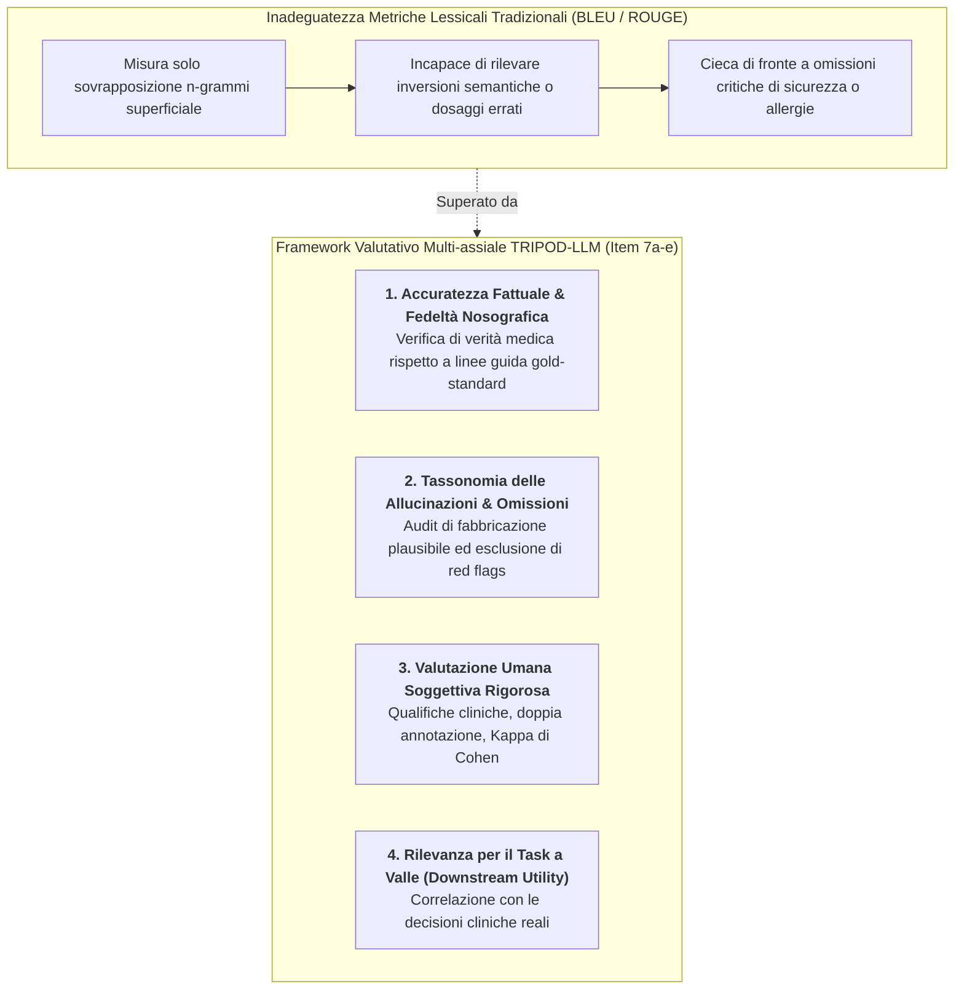
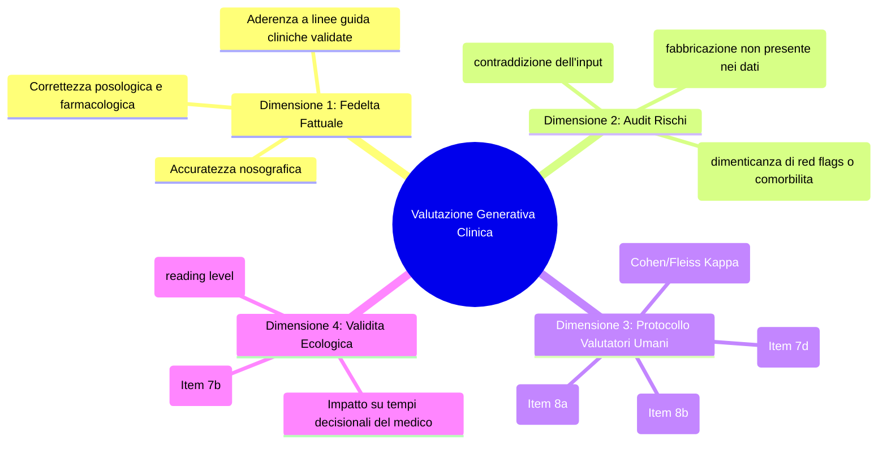
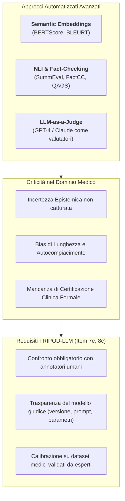

# Task-Specific Generative Output Evaluation in Healthcare

## Definizione Operativa
- La **Task-Specific Generative Output Evaluation** è il paradigma metodologico avanzato definito dallo standard internazionale [[TRIPOD_LLM2025|TRIPOD-LLM]] (Gallifant et al., *Nature Medicine* 2025) per la valutazione rigorosa, multi-assiale e orientata alla sicurezza clinica del testo non strutturato prodotto da Large Language Models ([[large-language-models|LLM]]) in ambito sanitario.
- **La Crisi delle Metriche NLP Tradizionali:** In medicina, le metriche automatizzate tradizionali basate sulla sovrapposizione lessicale di n-grammi (come **BLEU**, **ROUGE** o **METEOR**) si sono dimostrate radicalmente inadeguate e potenzialmente fuorvianti: esse misurano esclusivamente la somiglianza morfologico-strutturale con un testo di riferimento (*reference standard*), rimanendo completamente cieche di fronte all'accuratezza fattuale, alle allucinazioni cliniche e all'omissione di informazioni vitali.
- **Approccio Multi-dimensionale:** Il framework impone la transizione verso protocolli di valutazione specifici per ciascun task generativo (QA clinico, scribi ambientali, sintesi di dimissioni, dialogo conversazionale), integrando:
  1. Audit quantitativo di accuratezza fattuale, omissioni critiche e confabulazioni;
  2. Protocolli standardizzati di valutazione umana esperta con doppia annotazione indipendente e indici di accordo inter-osservatore;
  3. Verifica della correlazione empirica tra le metriche di laboratorio e gli esiti clinico-decisionali reali a valle (*downstream task relevance*).

---

## I Limiti Critici delle Metriche di Sovrapposizione Lessicale

Il consensus statement di TRIPOD-LLM evidenzia che il testo generativo clinico non può essere trattato come una stringa sintattica astratta. L'affidamento a punteggi BLEU/ROUGE espone la pratica clinica a rischi sistemici:

| Metrica Tradizionale | Meccanismo Operativo | Fallimento nel Dominio Clinico | Esempio di Errore Letale Invisibile |
| :--- | :--- | :--- | :--- |
| **BLEU (Bilingual Evaluation Understudy)** | Precisione di sovrapposizione di n-grammi pesata per brevità. | Ignora le relazioni logiche, la negazione clinica e l'accuratezza dei dosaggi terapeutici. | *"Somministrare 10 mg di morfina"* vs *"Non somministrare 10 mg di morfina"* (BLEU elevatissimo, esito clinico opposto). |
| **ROUGE (Recall-Oriented Understudy for Gisting Evaluation)** | Richiamo di n-grammi o sequenze comuni più lunghe (ROUGE-L). | Premia la verbosità e non penalizza la fabbricazione di informazioni false (*allucinazioni plausibili*). | Una sintesi che aggiunge una patologia inesistente ma copia il 90% delle parole ottiene un ottimo score ROUGE. |
| **METEOR / TER** | Allineamento basato su lemmi, sinonimi e costi di traslazione. | Non distingue tra sinonimi clinici innocui e sostituzioni nosografiche gravi. | Scambiare un farmaco di prima linea con uno controindicato di classe analoga senza alterare il punteggio complessivo. |

---

## La Tassonomia Multi-assiale di Valutazione Generativa

Per superare l'ambiguità linguistica e l'intrinseca incertezza epistemica della medicina (dove spesso non esiste un'unica risposta corretta formulabile), TRIPOD-LLM articola la valutazione in 4 dimensioni chiave (Item 7a, 7b, 7c, 7d):

### 1. Accuratezza Fattuale e Nosografica
- Misurazione puntuale della veridicità di ciascuna affermazione clinica generata dal modello rispetto a basi di conoscenza validate o giudizi di commissioni mediche collegiali.
- Verifica della coerenza logico-deduttiva della catena di ragionamento (*reasoning paths*).

### 2. Tassonomia di Allucinazioni e Omissioni Cliniche
- **Allucinazioni Intrinseche:** Il modello contraddice i dati anamnestici, di laboratorio o strumentali forniti nell'input (es. dichiara il paziente normoteso quando il prompt riportava 180/100 mmHg).
- **Allucinazioni Estrinseche (Confabulazioni):** Il modello inventa reperti, precedenti chirurgici, esami strumentali o citazioni bibliografiche inesistenti.
- **Omissioni di Sicurezza (*Safety-Critical Omissions*):** Il modello genera una risposta formalmente corretta ma omette avvertenze fondamentali (es. mancata segnalazione di un'allergia alla penicillina o mancato invio in pronto soccorso di fronte a sintomi di infarto miocardico acuto).

### 3. Protocolli di Valutazione Umana Soggettiva (Item 7d, 8a, 8b, 8c)
Quando l'output è testo libero non strutturato (es. sintesi di cartelle, referti di scribi ambientali o consultazioni interattive), la valutazione deve poggiare su criteri formali di rigore psicometrico:
- **Qualifiche dei Valutatori:** Esplicitare specializzazione medica, anni di anzianità clinica, setting di provenienza e caratteristiche sociodemografiche dei clinici coinvolti (Item 7d).
- **Linee Guida di Etichettatura:** Pubblicare il manuale operativo dettagliato fornito agli annotatori con esempi chiari di output accettabili, dubbi o inaccettabili (Item 8a).
- **Doppia Annotazione e Accordo Inter-rater:** Dichiarare la quota di output valutata da più clinici indipendenti (idealmente 100% o campione statisticamente rappresentativo) e riportare indici formali di concordanza (Cohen's Kappa per coppie, Fleiss' Kappa o intraclass correlation coefficient per panel multipli) (Item 8b).

### 4. Downstream Clinical Relevance (Item 7b)
- TRIPOD-LLM richiede di verificare se i punteggi ottenuti dal modello nei benchmark di laboratorio correlano effettivamente con l'efficacia nel punto di cura (*point of care*).
- Valutare l'impatto sul carico cognitivo dell'operatore, sul tasso di errori diagnostici umani indotti da conformismo verso l'IA (*over-reliance*) e sulla sicurezza del paziente.

---

## Metodi Automatizzati Avanzati e LLM-as-a-Judge: Limiti e Requisiti

- **LLM-as-a-Judge:** Se un altro modello linguistico viene impiegato per valutare la qualità dell'output, TRIPOD-LLM impone di descrivere integralmente le caratteristiche del modello giudice (nome, versione, prompt impiegati, temperatura) e di riportare il grado di allineamento (*agreement rate*) tra il giudizio dell'LLM giudice e quello di panel di medici umani (Item 8c).

---

## Quadro Sinottico delle Strategie di Valutazione per Task Generativo

| Task Clinico | Metriche Automatizzate Raccomandate | Focus Valutazione Umana Esperta | Rischio Clinico Primario da Monitorare |
| :--- | :--- | :--- | :--- |
| **Document Generation (Scribi AI)** | BERTScore, Entity-level Precision/Recall su ontologie SNOMED/UMLS. | Completezza anamnestica, fedeltà alla visita registrata, tono professionale. | Fabbricazione di esami obiettivi non eseguiti (*phantom examinations*). |
| **Summarization & Simplification** | FactCC, QAGS, Indici di leggibilità (Flesch-Kincaid, Gulpease). | Chiarezza per il paziente, assenza di gergo ambiguo, preservazione delle istruzioni di dimissione. | Omissione di piani terapeutici o follow-up ambulatoriali urgenti. |
| **Long-form Question Answering** | Factuality scoring contro PubMed/linee guida, RAG triad metrics. | Coerenza del ragionamento diagnostico, appropriatezza delle raccomandazioni. | Confabulazione di studi clinici o dosaggi farmacologici errati. |
| **Conversational Agent (Chatbot)** | Safety red-teaming benchmarks, coerenza di dialogo multi-turno. | Empatia percepita, capacità di intercettare emergenze e indirizzare al curante. | Validazione acritica di ideazioni patologiche o ritardo nel soccorso. |

---

## Relazioni
- Linea Guida di Riferimento: [[TRIPOD_LLM2025]]
- Concetto Modulare Collegato: [[modular-reporting-framework-llm]]
- Standard Correlati: [[chart-reporting-guideline]], [[elevate-genai-framework]], [[living-guidelines-in-health-ai]]
- Bias e Robustezza: [[accuratezza-vs-fattualita-in-genai]], [[clinical-chain-of-thought-paradox]], [[human-oversight-and-liability-in-clinical-ai]], [[stochasticity-management-in-clinical-llms]], [[single-task-zero-shot-evaluation-trap]]
