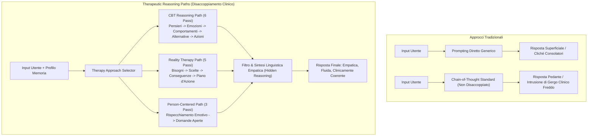

# Percorsi di Ragionamento Psicoterapeutico (Therapeutic Reasoning Paths)

## Definizione Operativa
- Paradigma di ingegneria inferenziale clinica per modelli linguistici (LLM e SLM) sviluppato da Abbasi & Naderi (2025) all'interno del framework PsychoLexTherapy, basato sulla scomposizione dei protocolli terapeutici (CBT, Reality Therapy, Person-Centered Therapy) in percorsi inferenziali procedurali espliciti e sequenziali (*stepwise reasoning paths*).
- Il principio architetturale cardine consiste nel **disaccoppiare** il processo di ragionamento analitico interno (invisibile all'utente) dalla formulazione della risposta empatico-conversazionale finale.
- **Utilità CBT e Clinica:** Risolve il duplice rischio del prompting clinico: (1) la banalità dei cliché consolatori tipica del prompting diretto non strutturato; (2) la pedanteria diagnostica e la freddezza comunicativa causate dall'intrusione del gergo clinico (*clinical jargon spillover*) tipica delle Chain-of-Thought (CoT) non filtrate. Permette a modelli compatti di riprodurre la logica interna della formulazione del caso clinico (triade cognitiva di Beck, teoria della scelta e dei bisogni di Glasser, facilitazione rogersiana) mantenendo un tono caldo, accogliente e culturalmente calibrato.

## Evidenze dalla Letteratura

### 1. I Tre Percorsi Procedurali di Ragionamento

#### A. Percorso CBT (Cognitive Behavioral Therapy) - 6 Passi
Modella la decostruzione e ristrutturazione sistematica della triade cognitiva di Beck (1979, 2011):
1. **Estrazione dei Pensieri Automatici Negativi (*Automatic Thoughts*):** Rilevamento delle distorsioni cognitive rigide e assolute (es. ipergeneralizzazione, catastrofizzazione, personalizzazione).
2. **Inferenza delle Conseguenze Emotive (*Emotional Consequences*):** Ricostruzione degli stati affettivi secondari generati dalle distorsioni (es. vergogna, disperazione, senso di fallimento).
3. **Proiezione delle Tendenze Comportamentali (*Behavioral Tendencies*):** Predizione delle risposte disfunzionali conseguenti (es. ritiro sociale, evitamento attivo, procrastinazione).
4. **Generazione di Alternative Bilanciate (*Balanced Alternatives*):** Sviluppo di pensieri realistici e controfattuali calibrati sul contesto socioculturale del paziente.
5. **Derivazione di Comportamenti Adattivi (*Adaptive Behaviors*):** Formulazione di micro-esperimenti comportamentali pratici per validare le nuove credenze.
6. **Sintesi in Risposta Terapeutica:** Conversione dell'inferenza in un messaggio empatico, scorrevole e privo di formule diagnostiche esplicite.

#### B. Percorso Reality Therapy (RT) - 5 Passi
Basato sulla teoria della scelta di William Glasser, orienta l'intervento verso la responsabilità personale (*agency*) e l'appagamento dei bisogni primari:
1. **Identificazione dei Bisogni e Desideri Fondamentali (*Core Needs and Wants*):** Analisi dei driver motivazionali profondi (rispetto, amore/appartenenza, libertà, sicurezza, autoefficacia).
2. **Analisi dei Comportamenti Correnti (*Analysis of Current Behaviors*):** Mappatura delle abitudini e delle scelte che ostacolano il soddisfacimento di tali bisogni.
3. **Valutazione delle Conseguenze Comportamentali (*Behavioral Consequences*):** Esplicitazione del nesso causale tra le scelte del paziente e i risultati ottenuti.
4. **Pianificazione di Comportamenti Alternativi (*Planning Alternative Behaviors*):** Co-costruzione di azioni responsabili, incrementali e sostenibili nella vita quotidiana.
5. **Integrazione nella Risposta Finale:** Messaggio supportivo ma focalizzato sull'autonomia decisionale e sul locus of control interno.

#### C. Percorso Person-Centered Therapy (PCT) - 3 Passi
Ispirato all'approccio centrato sulla persona di Carl Rogers, finalizzato a creare uno spazio sicuro di autoesplorazione:
1. **Rispecchiamento Empatico e Comprensione (*Empathic Reflection*):** Restituzione accurata dei vissuti emotivi e del senso di vulnerabilità espresso.
2. **Domande Esplorative di Autoconsapevolezza (*Exploratory Questioning*):** Formulazione di quesiti aperti che favoriscono l'approfondimento introspettivo senza forzature interpretative.
3. **Sintesi Supportiva Finale:** Comunicazione di accettazione positiva incondizionata unita a un invito non direttivo all'auto-riflessione.

### 2. Riscontri Empirici e Vantaggi del Disaccoppiamento
- **Efficacia Comparativa:** Nei test empirici su PsychoLexQuery, i percorsi di ragionamento strutturati di PsychoLexTherapy hanno ottenuto un punteggio di allineamento terapeutico di **8.34/10** (rispetto a 1.24 del prompt semplice, 1.70 delle catene CoT standard e 7.92 dei sistemi multi-agente) e una coerenza strutturale di **8.76/10** (Abbasi & Naderi, 2025).
- **Valutazione degli Esperti:** Gli psicologi valutatori hanno preferito significativamente i percorsi strutturati disaccoppiati (rank medio 1.43) rispetto alla Chain-of-Thought esplicita (rank 3.16), evidenziando che l'invisibilità del processo inferenziale evita l'effetto iatrogeno di sentirsi "analizzati" anziché "ascoltati" (Abbasi & Naderi, 2025; Feng et al., 2025).

**Riferimenti Bibliografici:**
- Abbasi, M. A., & Naderi, H. (2025). PsychoLexTherapy: Simulating Reasoning in Psychotherapy with Small Language Models in Persian. *arXiv preprint arXiv:2510.03913v1 [cs.CL]*, 1–26. https://doi.org/10.48550/arXiv.2510.03913
- Beck, A. T. (1979). *Cognitive therapy and the emotional disorders*. Penguin.
- Beck, J. S. (2011). *Cognitive behavior therapy: Basics and beyond* (2nd ed.). Guilford Press.
- Glasser, W. (1998). *Choice theory: A new psychology of personal freedom*. HarperCollins.
- Rogers, C. R. (1957). The necessary and sufficient conditions of therapeutic personality change. *Journal of Consulting Psychology*, 21(2), 95–103.
- Feng, S., et al. (2025). Interactive Narrative Therapist: Staged Narrative Restructuring in Multi-turn Dialogue. *arXiv preprint arXiv:2507.20241v2*.

## Relazioni
- Vedi anche: [[2510-03913v1]], [[psycholextherapy-framework]], [[stepwise-cot]], [[crdial-framework]], [[cbt-dialogue-systems-and-tools]], [[supportive-listener-prompting]], [[simulated-therapeutic-alliance]], [[modello-centauro-clinico]], [[interactive-narrative-therapist]]
