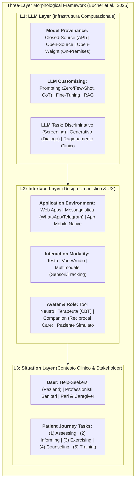
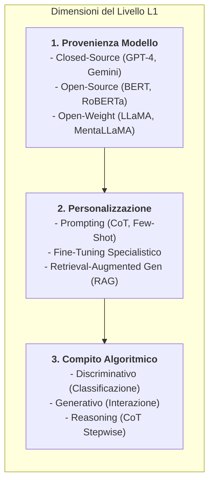
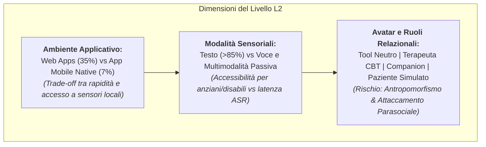
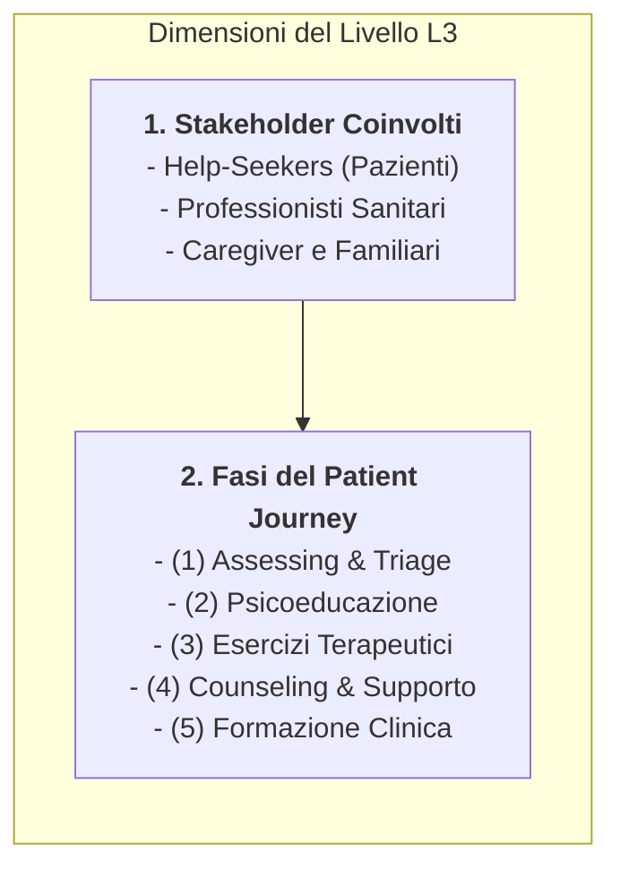

# Three-Layer Morphological Framework in Mental Health AI (Framework Morfologico a Tre Livelli per l'IA in Salute Mentale)

## Definizione Operativa
- Il **Three-Layer Morphological Framework in Mental Health AI** (Framework Morfologico a Tre Livelli per l'IA in Salute Mentale) è una tassonomia concettuale e uno strumento di progettazione sociotecnica sviluppato da Bucher, Egger, Vashkite, Wu e Schwabe (University of Zurich, 2025; *JMIR Mental Health*, doi: [10.2196/78410](https://doi.org/10.2196/78410)).
- **Obiettivo e Struttura:** Superare l'approccio riduzionista incentrato unicamente sulla fattibilità tecnica e algoritmica dei modelli linguistici ([[large-language-models|LLM]]), categorizzando lo spazio di progettazione dell'IA in salute mentale attraverso **3 livelli distinti e 9 sottolivelli morfologici combinabili**:
  1. **L1: LLM Layer (Infrastruttura Computazionale):** Proprietà del modello base, tecniche di personalizzazione e tipologia di compiti linguistici/cognitivi;
  2. **L2: Interface Layer (Esperienza Utente e Design Umanistico):** Ambiente software, modalità sensoriali di interazione, presenza di avatar e ruoli relazionali assegnati all'agente;
  3. **L3: Situation Layer (Contesto Clinico ed Ecosistema Umano):** Tipologie di utenti/stakeholder coinvolti e collocazione dei compiti lungo il percorso di cura del paziente (*patient journey*).
- **Rilevanza Clinica e Progettuale:** Formalizza il principio per cui *"il meccanismo di self-attention da solo non è sufficiente"* (*Attention is not all we need*). L'efficacia, la sicurezza e l'aderenza terapeutica di una soluzione di salute mentale digitale dipendono criticamente dalle decisioni di design dell'interfaccia (L2) e dall'integrazione nell'ecosistema clinico multi-stakeholder (L3).

---

## Disamina Dettagliata dei Tre Livelli Morfologici

### 1. Livello 1: LLM Layer (L1) — Fondazione Algoritmica

Il livello L1 definisce i parametri tecnici che governano l'elaborazione del linguaggio naturale:

- **Provenienza del Modello (*Model Provenance*):**
  - *Closed-Source (58%):* Massima diffusione per rapidità di prototipazione, ma vincolata da opacità e rischi di non conformità con la riservatezza sanitaria (GDPR/HIPAA);
  - *Open-Source & Open-Weight (42%):* Consentono l'installazione locale on-premises, eliminando il trasferimento di dati a terzi e permettendo l'ispezione dei gradienti e dei pesi.
- **Personalizzazione (*LLM Customizing*):**
  - *Prompt Engineering:* La tecnica dominante; l'uso del *Chain-of-Thought* (CoT) migliora sensibilmente l'accuratezza diagnostica (Zhang et al., 2024);
  - *Fine-Tuning di Dominio:* Addestramento su corpora psichiatrici (*cPsychQASet*, *MentalBERT*, *MentaLLaMA*);
  - *Retrieval-Augmented Generation (RAG):* Gravemente sottoutilizzato (solo il 4% degli studi), nonostante dimostri una netta superiorità nel contenere le allucinazioni cliniche rispetto al fine-tuning (Kang et al., 2024; Kumar et al., 2024).
- **Compiti del Modello (*LLM Tasks*) & il Paradosso Discriminativo:**
  - I modelli generativi massivi (GPT-4) eccellono nella fluidità dialogica e nella sintesi, ma manifestano instabilità e tassi di errore elevati nella classificazione di quadri psicopatologici complessi (Cardamone et al., 2025).
  - Al contrario, modelli encoder non autoregressivi compatti e dedicati (*MentalBERT* con 110M parametri) **superano costantemente i modelli generativi da centinaia di miliardi di parametri nei compiti discriminativi** (rilevamento depressione e rischio suicidario), garantendo determinismo e minori consumi computazionali (Yang et al., 2024).

---

### 2. Livello 2: Interface Layer (L2) — Design Umanistico ed Esperienza Utente

Il livello L2 struttura gli elementi comunicativi e percettivi che mediano l'interazione umano-computer:

- **Ambiente Applicativo (*Application Environment*):**
  - La prevalenza di interfacce web rapide (35%) limita l'integrazione di sensori fisici e il funzionamento offline. Le applicazioni mobili native (7%), pur più complesse da sviluppare, consentono l'integrazione sicura di dati da sensori passivi (accelerometri, pattern di digitazione, bio-segnali) ed elaborazione edge conforme alla privacy.
- **Modalità di Interazione (*Interaction Modality*):**
  - La quasi totalità delle interazioni è testuale. L'introduzione della voce aumenta la presenza sociale e abbatte le barriere d'accesso per persone anziane o con deficit motori (Alessa & Al-Khalifa, 2023), ma introduce latenza e vulnerabilità negli errori di trascrizione (*speech-to-text*).
- **Avatar e Ruolo Assegnato (*Avatar and Role*):**
  - *Personificazione e Rischi:* L'adozione di avatar umanoidi o ruoli empatici (es. *InnerVoice*, Tost et al., 2024) stimola l'alleanza di lavoro e la compliance agli esercizi, ma un'antropomorfizzazione eccessiva alimenta l'**illusione di reciprocità**, l'effetto alone (*halo effect*) e il disinvestimento dalle relazioni umane reali (Laestadius et al., 2022; Maeda & Quan-Haase, 2024).
  - *Trasparenza Socio-Affettiva:* Il design L2 deve incorporare una **responsività emotiva calibrata**, chiarendo continuamente i limiti ontologici dell'agente artificiale.

---

### 3. Livello 3: Situation Layer (L3) — Setting Clinico e Percorso di Cura

Il livello L3 contestualizza l'uso dell'IA all'interno dei processi clinici e delle relazioni tra attori:

- **Superamento della Frammentazione Monoutente:**
  - Oltre il 94% degli studi tratta l'LLM come un'applicazione monoutente isolata (*single-user silo*). Il framework postula la necessità di sistemi multi-utente che colleghino il paziente, il terapeuta curante e la rete dei pari/caregiver (Berrezueta-Guzman et al., 2024; Kim et al., 2024).
- **I Cinque Compiti Chiave lungo il Patient Journey:**
  1. *Assessing & Detecting:* Screening iniziale e quantificazione del distress (criticità: fallimento nel bloccare la conversazione in crisi suicidarie acute, Heston, 2023);
  2. *Informing (Psicoeducazione):* Spiegazione accessibile e non stigmatizzante dei disturbi e dei trattamenti (criticità: allucinazioni su tassi di efficacia e dosaggi);
  3. *Exercising (CBT guidata):* Journaling, ristrutturazione dei pensieri automatici e igiene del sonno (*ChatGLM-LoRA* per l'insonnia, Chen et al., 2024);
  4. *Counseling (Supporto Continuativo):* Supporto 24/7 e codifica automatica del colloquio motivazionale (*BERTje*, Pellemans et al., 2024);
  5. *Training (Formazione):* Simulazione interattiva di pazienti per il training di psicoterapeuti e assistenti sociali (*Yuan 1.0*, Chan & Li, 2023).

---

## Matrice dei Trade-Off di Progettazione

| Scelta di Design | Vantaggi Operativi | Rischi Clinici & Limiti | Livello Coinvolto |
| :--- | :--- | :--- | :--- |
| **Closed-Source API (GPT-4)** | Immediatezza di integrazione, elevata fluenza generativa e flessibilità multilingue. | Dipendenza da server terzi, opacità dei dati di training, violazioni GDPR, drift non controllato. | **L1** |
| **Open-Source Fine-Tuned (MentalRoBERTa)** | Altissima accuratezza discriminativa, determinismo, privacy on-premises, bassi costi di calcolo. | Incapacità di generare dialoghi aperti o spiegazioni testuali estese. | **L1** |
| **Avatar Antropomorfo & Voce Naturale** | Alto senso di presenza sociale, riduzione della solitudine, accessibilità per utenti con disabilità. | Attaccamento parasociale patologico, sovrastima dell'onniscienza del bot (*halo effect*). | **L2** |
| **App Mobile Nativa con Sensori** | Tracciamento ecologico continuo, elaborazione edge protetta, funzionamento offline. | Elevati costi di sviluppo ingegneristico, necessità di manutenzione cross-platform. | **L2** |
| **Sistema Standalone Monoutente** | Scalabilità immediata, totale anonimato per l'utente, superamento dello stigma iniziale. | Isolamento del paziente, mancato aggancio alla cura reale, cecità clinica in caso di crisi acuta. | **L3** |
| **[[ai-blended-therapy|AI-Blended Therapy (Multi-User)]]** | Supervisione clinica costante, alleanza terapeutica preservata, estensione della cura tra le sedute. | Complessità di governance dei dati, potenziale resistenza del terapeuta, carico di revisione dashboard. | **L3** |

---

## Implicazioni Epistemologiche: Perché "Attention Is Not All We Need"

Il framework evidenzia come l'evoluzione della salute mentale digitale sia stata finora guidata da un **bias tecno-centrico**:
1. **La Disconnessione tra Metrica Tecnica ed Efficacia Clinica:** Un'accuratezza del 95% su un benchmark di classificazione testuale (L1) non garantisce alcun miglioramento sintomatico in un paziente reale (L3).
2. **Il Ruolo Critico dell'Interfaccia (L2):** Come dimostrato dalla letteratura HCI (*Human-Computer Interaction*), le modalità comunicative dell'interfaccia determinano se l'utente svilupperà un'alleanza funzionale o una dipendenza alienante.
3. **La Necessità di Governance Sistemica (L3):** L'agente IA deve essere sempre inserito in un flusso di cura coordinato (*Blended Care*), con protocolli rigidi di stop e trasferimento immediato al clinico umano (*escalation pathway*) in presenza di segnali di allarme.

---

## Riferimenti Bibliografici
- Bucher, A., Egger, S., Vashkite, I., Wu, W., & Schwabe, G. (2025). "It’s Not Only Attention We Need": Systematic Review of Large Language Models in Mental Health Care. *JMIR Mental Health*, 12, e78410. https://doi.org/10.2196/78410
- Vaswani, A., et al. (2017). Attention Is All You Need. *NeurIPS 2017*, 30.
- vom Brocke, J., et al. (2015). Standing on the shoulders of giants: challenges and recommendations of literature search in information systems research. *CAIS*, 37(1), 9.
- Ji, S., et al. (2022). MentalBERT: publicly available pretrained language models for mental healthcare. *LREC 2022*, 7184–7190.
- Yang, K., et al. (2024). MentaLLaMA: interpretable mental health analysis on social media with large language models. *WWW '24*, 4489–4500.

---

## Relazioni
- [[mental_v12i1e78410]]
- [[ai-blended-therapy]]
- [[prognostic-pessimism-in-clinical-ai]]
- [[prompt-experiment-gap-in-clinical-ai]]
- [[single-task-zero-shot-evaluation-trap]]
- [[retrieval-vs-generative-clinical-chatbots]]
- [[reciprocal-care-in-ai-mental-health]]
- [[three-layer-governance-framework]]
