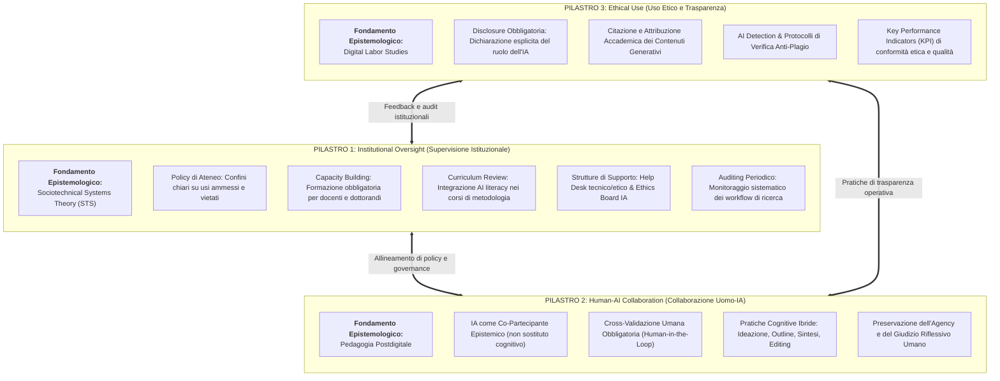
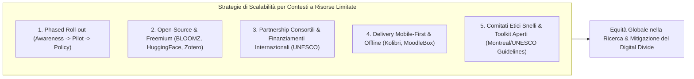

# Three-Pillar Postgraduate AI Framework (Framework a Tre Pilastri per l'Integrazione Responsabile della GenAI)

## Definizione Operativa
- Il **Three-Pillar Postgraduate AI Framework** è un modello teorico-operativo di governance e pedagogia scientifica formalizzato da Vicent Mabirizi, Calorine Katushabe, Gloria Muhoza e Jack Rugasira (2025; *Discover Artificial Intelligence*, doi: [10.1007/s44163-025-00495-3](https://doi.org/10.1007/s44163-025-00495-3)) per guidare l'integrazione sistematica, etica e pedagogicamente sostenibile dell'Intelligenza Artificiale Generativa (GenAI) e dei Large Language Models (LLM) nella ricerca post-laurea e nei percorsi di dottorato (PhD).
- **Superamento della Dicotomia Proibizionismo vs Laissez-Faire:** Il framework rifiuta sia i divieti generalizzati (*blanket bans*)—inefficaci a fronte di tassi di adozione spontanea superiori al 75–81% (Jung et al., 2024; Liao et al., 2024)—sia l'approccio deregolamentato (*laissez-faire*), documentato in oltre il 72% degli atenei (Kaplan, 2024), che espone gli studenti a declino del pensiero critico, allucinazioni bibliografiche e sottomissioni acritiche senza revisione (Noy & Zhang, 2023; Zhai et al., 2024).
- **Integrazione Tripartita e Triangolazione Teorica:** Il framework si struttura su tre pilastri interdipendenti, ciascuno ancorato a una solida tradizione epistemologica:
  1. **Supervisione Istituzionale (*Institutional Oversight*):** Fondata sulla *Sociotechnical Systems Theory (STS)* (Mumford, 2006; Trist, 1981; Bostrom et al., 2009);
  2. **Collaborazione Uomo-IA (*Human-AI Collaboration*):** Fondata sulla *Pedagogia Postdigitale* (Fawns, 2022; Knox, 2019; Jandrić et al., 2018; Jiang et al., 2024);
  3. **Uso Etico e Trasparenza (*Ethical Use*):** Fondato sui *Digital Labor Studies* (Wittel, 2014; Couldry & Mejias, 2019; Singh & Pushpanadham, 2024).

---

## I Tre Pilastri Fondamentali

### 1. Pilastro 1: Supervisione Istituzionale (*Institutional Oversight*)

La *Sociotechnical Systems Theory (STS)* postula che le performance ottimali in ambienti complessi emergono dal co-design armonico tra la componente tecnologica e la struttura sociale e organizzativa:
- **Policy d'Ateneo Chiare e Contestualizzate:** Definizione esplicita delle pratiche permesse (es. brainstorming, editing stilistico, traduzione, esplorazione bibliografica) e delle pratiche rigorosamente interdette (es. generazione autonoma di testi d'esame/tesi senza revisione, valutazione acritica della letteratura, delega di decisioni analitiche; vedi anche [[criteria-centric-genai-integration]]).
- **Capacity Building Continuo e Curriculare:** Superamento dei workshop estemporanei tramite l'integrazione obbligatoria di moduli di *AI literacy* nei corsi di metodologia della ricerca scientifica per laureandi e dottorandi, accompagnata dalla formazione continua del corpo docente e dei supervisori (Tadimalla & Maher, 2024; Grande et al., 2024).
- **Strutture di Supporto e Comitati Etici con Competenze IA:** Istituzione di sportelli tecnici e consultivi (*Help Desk*) per dirimere dubbi operativi e costituzione di *Research Ethics Boards* dotati di expertise specifica sui modelli linguistici e sulle tecnologie generative.
- **Audit e Valutazione Continua:** Monitoraggio periodico per identificare tempestivamente gap emergenti, nuove vulnerabilità (es. jailbreak, bias) e adeguare le policy all'evoluzione dei modelli.

---

### 2. Pilastro 2: Collaborazione Uomo-IA (*Human-AI Collaboration*)

La *Pedagogia Postdigitale* supera la separazione dualistica tra dimensione analogica e digitale, riconoscendo che l'apprendimento contemporaneo è intrinsecamente mediato da reti socio-materiali e computazionali:
- **L'IA come Co-Partecipante Epistemico:** L'algoritmo non è inteso come un sostituto del pensiero umano né come un mero motore di ricerca passivo, bensì come un interlocutore dialogico che partecipa alla co-costruzione del significato (Siemens et al., 2022; Chang & Li, 2025).
- **Cross-Validazione Umana e Giudizio Riflessivo (*Human-in-the-Loop*):** Ogni output generato deve essere rigorosamente verificato, contestato e rifinito dal ricercatore. Il giudizio epistemico e la validazione delle fonti rimangono ad esclusivo presidio umano, contrastando il rischio di *cognitive offloading* e overconfidence acritica (Lee et al., 2025).
- **Riconfigurazione dei Compiti di Ricerca:** Scomposizione del workflow in passaggi ibridi:

| Fase del Flusso di Ricerca | Ruolo dell'Agente GenAI | Presidio Inderogabile del Ricercatore Umano |
| :--- | :--- | :--- |
| **Ideazione & Brainstorming** | Generazione di prospettive multiple, stimolo di ipotesi alternative, scaffolding concettuale | Selezione critica, rilevanza teorica, formulazione della domanda di ricerca originale |
| **Esplorazione della Letteratura** | Mappatura semantica preliminare, sintesi di abstract, bozze di query booleane | Lettura e verifica dei testi integrali, validazione delle fonti, valutazione critica del rigore |
| **Stesura e Strutturazione** | Proposta di scalette, superamento del blocco della pagina bianca, riorganizzazione paragrafi | Argomentazione teorica, integrazione epistemologica, sintesi originale dei risultati |
| **Refining Linguistico & Editing** | Correzione sintattica e grammaticale, traduzione accademica (supporto a ricercatori ESL) | Verifica dell'accuratezza concettuale, preservazione delle sfumature terminologiche |

---

### 3. Pilastro 3: Uso Etico e Trasparenza (*Ethical Use*)

I *Digital Labor Studies* esaminano criticamente le dinamiche di produzione del valore intellettuale, la mercificazione del lavoro cognitivo e la potenziale alienazione dell'autorialità:
- **Dichiarazione Obbligatoria (*Mandatory Disclosure*):** Obbligo per il ricercatore di documentare in modo trasparente in appendice o nella sezione metodologica: (1) nome e versione del modello utilizzato, (2) prompt impiegati, (3) scopo dell'interrogazione, (4) modifiche apportate dall'autore umano.
- **Riconoscimento e Citazione dei Contributi Algoritmici:** Adozione di convenzioni citazionali standardizzate (es. APA 7th, Chicago, IEEE) per identificare i passaggi generati da IA, impedendo che l'output della macchina sia spacciato per opera originale (*intellectual misattribution of labor*).
- **Protocolli di Verifica e AI Detection:** Utilizzo responsabile di strumenti diagnostici per rilevare l'impiego non dichiarato e audit manuali incrociati su DOI e citazioni per intercettare allucinazioni bibliografiche (Athaluri et al., 2023; Bhattacharyya et al., 2023).
- **Metriche KPI di Integrità:** Monitoraggio periodico di indicatori chiave (es. tasso di aderenza alle disclosure, frequenza di segnalazioni per plagio computazionale, qualità metodologica delle tesi).

---

## Strategie di Scalabilità e Giustizia Epistemica Globale

Per consentire l'adozione del framework anche in contesti con vincoli economici, scarsa connettività o assenza di comitati etici strutturati (*Global South*), Mabirizi et al. (2025) articolano 5 direttrici applicative:
1. **Adozione a Scaglioni (*Phased Roll-out*):** Passaggio graduale dall'alfabetizzazione di base a progetti pilota dipartimentali con monitoraggio continuo, fino alla regolamentazione istituzionale complessiva.
2. **Valorizzazione dell'Ecosistema Open-Source:** Integrazione di modelli liberi (*open-weight*), tier gratuiti commerciali e gestori bibliografici aperti (Zotero) secondo i principi delle *Open Educational Resources (OER)* (Butcher, 2015).
3. **Modelli di Partnership Inter-Istituzionale:** Alleanze strategiche con atenei dotati di cluster di calcolo avanzati e consorzi sovranazionali per la condivisione di risorse didattiche.
4. **Piattaforme Mobile-First e Strumenti Offline:** Utilizzo di ambienti educativi offline-ready (*Kolibri*, *MoodleBox*) per garantire la continuità formativa in campus rurali o a banda limitata (Hoepfl, 2013).
5. **Comitati Etici Snelli e Toolkit Internazionali:** Adozione immediata di linee guida etiche aperte (es. *Montreal AI Ethics Guidelines*, *Raccomandazioni UNESCO*) evitando la paralisi burocratica.

---

## Riferimenti Bibliografici
- Mabirizi, V., Katushabe, C., Muhoza, G., & Rugasira, J. (2025). A systematic review of the impact of generative AI on postgraduate research: opportunities, challenges, and ethical implications. *Discover Artificial Intelligence*, 5, Article 238. https://doi.org/10.1007/s44163-025-00495-3
- Athaluri, S. A., Manthena, S. V., Kesapragada, V. S. R. K. M., Yarlagadda, V., Dave, T., & Duddumpudi, R. T. S. (2023). Exploring the boundaries of reality: investigating the phenomenon of artificial intelligence hallucination in scientific writing through ChatGPT references. *Cureus*, 15(4), e37432. https://doi.org/10.7759/cureus.37432
- Bhattacharyya, M., Miller, V. M., Bhattacharyya, D., & Miller, L. E. (2023). High rates of fabricated and inaccurate references in ChatGPT-generated medical content. *Cureus*, 15(5), e39238. https://doi.org/10.7759/cureus.39238
- Bostrom, R. P., Gupta, S., & Thomas, D. (2009). A meta-theory for understanding information systems within sociotechnical systems. *Journal of Management Information Systems*, 26(1), 17–48. https://doi.org/10.2753/MIS0742-1222260102
- Couldry, N., & Mejias, U. A. (2019). Data colonialism: rethinking big data's relation to the contemporary subject. *Television & New Media*, 20(4), 336–349. https://doi.org/10.1177/1527476418796632
- Fawns, T. (2022). An entangled pedagogy: looking beyond the pedagogy—technology dichotomy. *Postdigital Science and Education*, 4(3), 711–728.
- Grande, V., Kiesler, N., & Francisco, R. M. A. (2024). Student Perspectives on Using a Large Language Model (LLM) for an Assignment on Professional Ethics. In *Proceedings of the 2024 on Innovation and Technology in Computer Science Education* (Vol. 1, pp. 478–484). ACM.
- Jandrić, P., Knox, J., Besley, T., Ryberg, T., Suoranta, J., & Hayes, S. (2018). *Postdigital science and education*. Taylor & Francis.
- Jiang, J., Vetter, M. A., & Lucia, B. (2024). Toward a 'more-than-digital' AI literacy: Reimagining agency and authorship in the postdigital era with ChatGPT. *Postdigital Science and Education*, 6(3), 922–939.
- Kaplan. (2024). *Kaplan Survey: Most Colleges and Universities Take Laissez Faire Approach Towards Use of GenAI in Admissions*. Kaplan Press.
- Knox, J. (2019). What does the 'Postdigital' mean for education? Three critical perspectives on the digital, with implications for educational research and practice. *Postdigital Science and Education*, 1(2), 357–370.
- Lee, H.-P., Sarkar, A., Tankelevitch, L., Drosos, I., Rintel, S., Banks, R., & Wilson, N. (2025). The impact of generative AI on critical thinking: Self-reported reductions in cognitive effort and confidence effects from a survey of knowledge workers. In *Proceedings of the 2025 CHI Conference on Human Factors in Computing Systems* (pp. 1–22). ACM.
- Mumford, E. (2006). The story of socio-technical design: reflections on its successes, failures and potential. *Information Systems Journal*, 16(4), 317–342.
- Noy, S., & Zhang, W. (2023). Experimental evidence on the productivity effects of generative artificial intelligence. *Science*, 381(6654), 187–192. https://doi.org/10.1126/science.adh2586
- Siemens, G., Marmolejo-Ramos, F., Gabriel, F., Medeiros, K., Marrone, R., Joksimovic, S., & de Laat, M. (2022). Human and artificial cognition. *Computers and Education: Artificial Intelligence*, 3, 100107.
- Singh, P., & Pushpanadham, K. (2024). AI Ethics in Higher Education: Bridging the Gap Between Principles and Practices. In *Generative Artificial Intelligence in Higher Education: A Handbook for Educators and Leaders* (p. 64).
- Tadimalla, S. Y., & Maher, M. L. (2024). AI Literacy for All: Adjustable Interdisciplinary Socio-technical Curriculum. *arXiv preprint*, arXiv:2409.10552.
- Trist, E. L. (1981). *The evolution of socio-technical systems* (Vol. 2). Ontario Quality of Working Life Centre.
- Wittel, A. (2014). Digital labor: the internet as playground and factory. *Information, Communication & Society*, 17(7), 910–912.
- Zhai, C., Wibowo, S., & Li, L. D. (2024). The effects of over-reliance on AI dialogue systems on students' cognitive abilities: a systematic review. *Smart Learning Environments*, 11, 24.

---

## Relazioni
- Vedi anche: [[s44163-025-00495-3]], [[individual-boost-vs-collective-homogenization]], [[criteria-centric-genai-integration]], [[eight-step-genai-research-workflow]], [[structured-literature-reviews]], [[three-layer-governance-framework]], [[ai-literacy-in-academia]], [[ai-research-ethics]], [[mabirizi-et-al-2025]]
