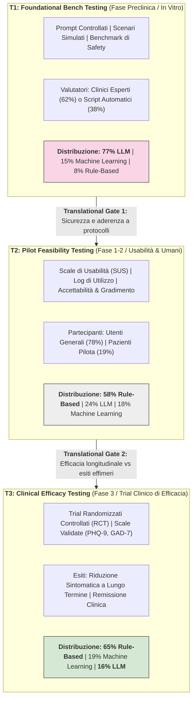

---
tags: [three-tier-framework, evaluation-continuum, translational-pipeline, foundational-bench-testing, pilot-feasibility, clinical-efficacy, mental-health-chatbots, evidence-based-ai, regulatory-certification]
source_papers: ["WPS-24-383.pdf"]
---

# Three-Tier Evaluation Framework in Mental Health AI (Continuum di Valutazione a Tre Livelli: T1 Bench, T2 Feasibility, T3 Efficacy)

## Definizione Operativa
- Il **Three-Tier Evaluation Framework in Mental Health AI** (Framework di Valutazione Traslazionale a Tre Livelli per l'IA nella Salute Mentale) è un modello metodologico e regolatorio formalizzato da Hua, Siddals, Torous et al. (*World Psychiatry*, 2025; 24(3): 383–394; doi: [10.1002/wps.21352](https://doi.org/10.1002/wps.21352)) per organizzare la ricerca e la validazione degli agenti conversazionali (chatbot) secondo un gradiente di rigore ed evidenza clinica analogo alle fasi di sviluppo traslazionale dei farmaci e dei dispositivi medici:
  1. **T1: Foundational Bench Testing (Validazione Tecnica e di Laboratorio):** Valutazione delle performance algoritmiche, dell'accuratezza linguistica e della conformità alle linee guida cliniche di sicurezza (es. protocolli di emergenza per il rischio suicidario) in scenari controllati, sintetici o mediante audit di clinici esperti, prima di qualsiasi esposizione umana.
  2. **T2: Pilot Feasibility Testing (Fattibilità, Usabilità e Accettabilità Pilota):** Valutazione dell'ingaggio a breve termine, della fruibilità (usabilità percepita) e del gradimento dell'interfaccia con partecipanti umani (utenti sani, studenti, coorti pilota di pazienti) su orizzonti temporali brevi (da singole sessioni a poche settimane).
  3. **T3: Clinical Efficacy Testing (Efficacia Clinica e Riduzione Sintomatica Longitudinale):** Misurazione quantitativa degli esiti clinici primari (riduzione dei sintomi depressivi e ansiosi, prevenzione delle ricadute) mediante scale psicometriche validate e standardizzate (es. PHQ-9, GAD-7, BDI-II) somministrate in trial clinici (RCT o disegni quasi-sperimentali) su periodi prolungati.
- **Utilità Clinica e Psichiatrica:** Fornisce una bussola epistemologica per separare la novità tecnica (*technical novelty*) dall'efficacia terapeutica dimostrata (*clinical efficacy*). Risolve la distorsione per cui ottime performance nei compiti di laboratorio (T1) o elevati punteggi di gradimento soggettivo (T2) vengono erroneamente interpretati come prove di guarigione clinica o sostitutibilità della psicoterapia umana (T3), guidando i percorsi di certificazione medica dell'IA (Rajpurkar & Topol, 2025).

---

## Evidenze dalla Letteratura

### 1. Architettura Concettuale dei Tre Livelli

#### Livello T1: Foundational Bench Testing (Sicurezza e Coerenza di Laboratorio)
- **Scopo:** Stabilire se l'agente conversazionale rispetta i requisiti funzionali minimi e i vincoli etico-deontologici prima del contatto con utenti vulnerabili.
- **Parametri Valutati:** Coerenza linguistica multi-turn, aderenza alle linee guida di risposta per l'ideazione suicidaria e autolesionistica (es. fornitura corretta di contatti di emergenza), accuratezza della psicoeducazione fornita, robustezza ad attacchi avversari (*jailbreaking*).
- **Partecipanti:** Tipicamente non coinvolge pazienti: nel 62% degli studi T1 i revisori sono clinici esperti (psichiatri, psicoterapeuti) che valutano le risposte generate, mentre nel restante 38% la validazione è interamente computazionale/sintetica (Hua et al., 2025).

#### Livello T2: Pilot Feasibility Testing (Esperienza d'Uso e Interazione Umana)
- **Scopo:** Valutare l'accettabilità dell'interfaccia, la percezione di alleanza digitale (*digital bond*), l'usabilità tecnica (es. *System Usability Scale*, SUS) e i pattern di abbandono (*churn rate*).
- **Partecipanti:** Prevalentemente campioni di convenienza di **utenti generali (78%)** (es. studenti universitari, volontari online) e solo marginalmente pazienti con diagnosi formale (19%).
- **Durata:** Spesso limitata a singoli colloqui (<1 ora) o a percorsi di 1–7 giorni, insufficienti per osservare cambiamenti strutturali nei pattern di pensiero o nella psicopatologia.

#### Livello T3: Clinical Efficacy Testing (Evidenza di Riduzione del Sintomo)
- **Scopo:** Dimostrare che l'utilizzo del chatbot produce una riduzione statisticamente e clinicamente significativa dei sintomi rispetto a un braccio di controllo (lista d'attesa, trattamento usuale TAU, psicoeducazione statica o altro comparatore attivo).
- **Strumenti:** Esclusivamente scale psicometriche validate a livello internazionale (PHQ-9 per la depressione, GAD-7 per l'ansia generalizzata, ISI per l'insonnia, EDE-Q per i disturbi alimentari).
- **Orizzonte Temporale:** Interventi estesi su più settimane o mesi con follow-up post-intervento.

---

### 2. La Discrepanza Architetturale Empirica (I Dati di Hua et al., 2025)
Dall'analisi sistematica di 160 studi (2020–2024), emerge una marcata polarizzazione tra il livello di maturità tecnologica percepito e la solida validazione clinica:

| Paradigma Architetturale | Quota in T1 (Bench, n=13) | Quota in T2 (Feasibility, n=72) | Quota in T3 (Efficacy, n=75) | Status Traslazionale |
| :--- | :---: | :---: | :---: | :--- |
| **Generative LLMs** | **77%** | 24% | **16%** | Bloccati nello stadio preclinico/bench |
| **Rule-Based Systems** | 8% | **58%** | **65%** | Standard dominante nei trial clinici |
| **Machine Learning Non-Gen.** | 15% | 18% | 19% | Presenza intermedia stabile |

- **Il Collo di Bottiglia degli LLM:** Nonostante la recente popolarità dei modelli di linguaggio (saliti al 45% delle pubblicazioni nel 2024), **oltre tre quarti (77%) degli studi T1 riguardano LLM**, ma solo il **16% degli studi T3** impiega architetture generative. L'innovazione generativa è dunque massicciamente concentrata in test preliminari di prompt engineering e benchmarking teorico.
- **La Solidità dei Sistemi Deterministici:** I sistemi basati su regole rigide e alberi decisionali (CBT modulare strutturata) rappresentano la quasi totalità dell'evidenza empirica di efficacia clinica (65% di tutti i trial T3 e 59% degli studi con outcome clinici primari). La prevedibilità dell'output e l'assenza di rischio allucinatorio hanno consentito a queste piattaforme storiche (es. Woebot) di completare trial controllati randomizzati su larga scala.

---

### 3. Il "Feasibility-Efficacy Gap" (Il Divario Fattibilità-Efficacia)
Il framework T1-T3 evidenzia una fallacia ricorrente nella digital health: presumere che la fluidità conversazionale o la gradibilità soggettiva garantiscano un impatto terapeutico.
1. **Dinamica di Gradimento Iniziale (*Novelty Effect*):** In T2, gli utenti riportano spesso alti livelli di soddisfazione immediata dovuti alla sorpresa per la fluidità del linguaggio dell'LLM e alla disponibilità continua. Tuttavia, questo effetto svanisce rapidamente senza tradursi in aderenza prolungata (*longitudinal adherence*) o ristrutturazione cognitiva.
2. **Illusione di Empatia vs Lavoro Terapeutico:** Un chatbot generativo può produrre risposte empatiche impeccabili a livello sintattico in T1, ma fallire nel guidare compiti terapeutici attivi e scomodi (es. esposizione graduale, defusione cognitiva, compiti a casa comportamentali) in T3.
3. **Mancanza di Reality Testing:** I modelli allineati per massimizzare la piacevolezza (sicofanzia) possono validare acriticamente schemi disfunzionali del paziente, risultando piacevoli in T2 ma clinicamente deleteri o inefficaci nel lungo termine (T3).

---

### 4. Implicazioni Regolatorie e Certificazione Medica dell'IA
- **Graded AI Certification:** Come argomentato da Rajpurkar & Topol (*The Lancet*, 2025) e ribadito da Hua et al. (*World Psychiatry*, 2025), gli enti regolatori (FDA, Agenzia Europea per i Medicinali, organismi notificati MDR/AI Act) devono subordinare l'approvazione dei chatbot terapeutici al superamento documentato di tutti e tre i livelli:
  - Nessun dispositivo medico software (SaMD) per la salute mentale può essere certificato basandosi esclusivamente su benchmark T1 (accuratezza su esami medici o dataset di prompt) o sondaggi T2 di gradimento;
  - È indispensabile la conduzione di trial T3 con endpoint clinici standardizzati e campioni clinici chiaramente descritti, superando l'attuale prassi per cui il 50% degli studi di efficacia omette la specificazione dettagliata della tipologia dei partecipanti.

---

## Riferimenti Bibliografici
- Hua, Y., Siddals, S., Ma, Z., Galatzer-Levy, I., Xia, W., Hau, C., Na, H., Flathers, M., Linardon, J., Ayubcha, C., & Torous, J. (2025). Charting the evolution of artificial intelligence mental health chatbots from rule-based systems to large language models: a systematic review. *World Psychiatry*, 24(3), 383–394. https://doi.org/10.1002/wps.21352
- Rajpurkar, P., & Topol, E. J. (2025). A clinical certification pathway for generalist medical AI systems. *The Lancet*, 405(10472), 20–22. https://doi.org/10.1016/S0140-6736(24)02551-7
- Torous, J., & Blease, C. (2024). Generative artificial intelligence in mental health care: potential benefits and current challenges. *World Psychiatry*, 23(1), 1–2. https://doi.org/10.1002/wps.21157
- Fitzpatrick, K. K., Darcy, A., & Vierhile, M. (2017). Delivering cognitive behavior therapy to young adults with symptoms of depression and anxiety using a fully automated conversational agent (Woebot): a randomized controlled trial. *JMIR Mental Health*, 4(2), e19. https://doi.org/10.2196/mental.7785

---

## Relazioni
- Concetti correlati:
  - [[marketing-architecture-mismatch-in-mental-health-ai]] (Discrepanza tra branding AI e architettura sottostante)
  - [[validation-gap-in-mental-health-llms]] (Il divario di validazione clinica basato su esiti proxy)
  - [[clinical-readiness-gap-in-mh-chatbots]] (Il divario di prontezza clinica nei chatbot di salute mentale)
  - [[three-layer-morphological-framework-mental-health-ai]] (Design space morfologico a tre livelli per l'IA clinica)
  - [[tiered-autonomy-in-clinical-ai]] (Modello di autonomia stratificata nell'IA clinica)
  - [[safety-mechanisms-ai-chatbots]] (Meccanismi di sicurezza e protocolli di emergenza per chatbot)
- Sintesi di riferimento:
  - [[WPS_24_383]] (Revisione sistematica su 160 studi di chatbot per la salute mentale, 2020-2024)
  - [[mental-2026-1-e88057]] (Lokadjaja et al., 2026: Scoping review sulla validazione degli LLM su dati reali)