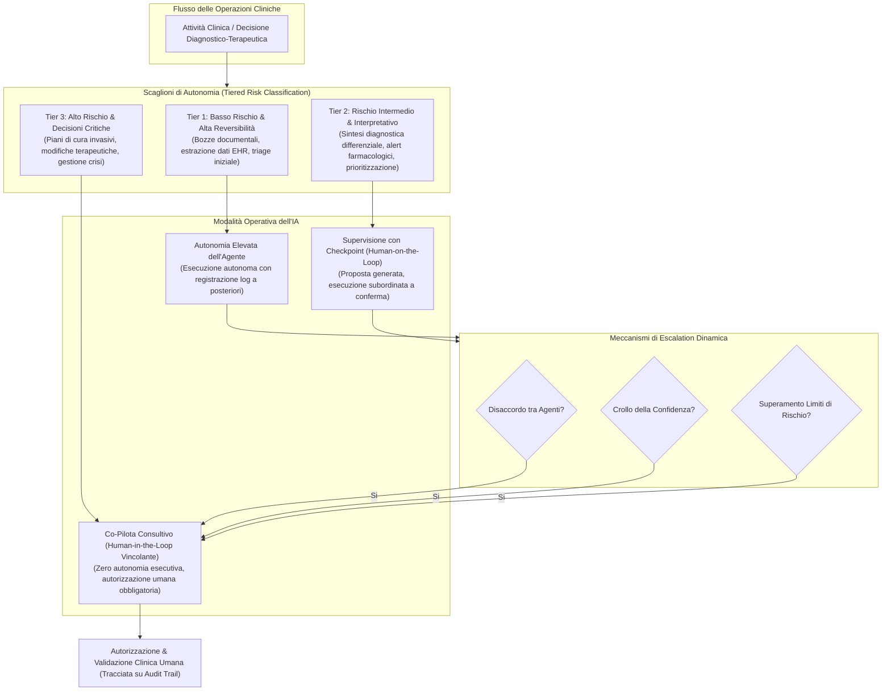
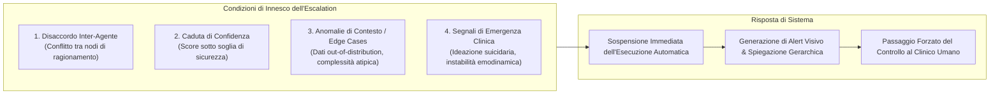

# Autonomia a Scaglioni nell'IA Clinica (Tiered Autonomy in Clinical AI)

## Definizione Operativa
- Modello architetturale, etico e procedurale di governance formalizzato da **Kim et al. (2025)**, **Xie et al. (2026)** e **Hughes et al. (2025)** per disciplinare l'integrazione di sistemi di Intelligenza Artificiale Agentica e Multi-Agente (*Multi-Agent Systems - MAS*) nei contesti sanitari.
- **Assunto Cardine:** L'autonomia decisionale ed esecutiva non deve essere trattata come una caratteristica binaria o uniforme dell'intero sistema, bensì come un gradiente regolabile (*tiered / phased autonomy*) allocato dinamicamente in funzione del **livello di rischio clinico**, della complessità del contesto e della **reversibilità dell'azione (*action reversibility*)**.
- **Finalità Clinica e Deontologica:** Trasforma il principio astratto di *human oversight* in vincoli operativi applicabili nei flussi di lavoro, prevenendo l'affidamento acritico (*automation bias*) e la degradazione della supervisione umana a mera ratifica formale (*rubber-stamping*), preservando l'autorità decisionale insostituibile del medico e dello psicologo nei momenti clinici critici.

---

## Architettura e Articolazione dei Tre Livelli (*Tiers*)

### 1. Tier 1: Bassa Criticità e Alta Reversibilità (Autonomia Operativa Delegata)
- **Ambiti Tipici:** Redazione di bozze di referti e note cliniche di seduta, recupero e aggregazione di parametri fisiologici da cartella elettronica (EHR), trascrizione ed estrazione terminologica, scheduling amministrativo.
- **Modalità di Controllo:** L'agente o il cluster di agenti opera con elevata autonomia senza necessità di approvazione preventiva in tempo reale.
- **Salvaguardia:** Ogni azione è documentata in un registro immutabile e può essere revocata, rettificata o cancellata retroattivamente dal professionista senza pregiudizio per la sicurezza del paziente (*reversible by design*).

---

### 2. Tier 2: Media Criticità e Ragionamento Interpretativo (Supervisione Guidata)
- **Ambiti Tipici:** Proposte di diagnosi differenziale, calcolo di score prognostici complessi, rilevazione di interazioni farmacologiche asintomatiche, suggerimento di protocolli riabilitativi personalizzati.
- **Modalità di Controllo:** *Human-on-the-loop*. Il sistema sintetizza le evidenze multimodali e formula una raccomandazione motivata, ma l'avvio della procedura o l'archiviazione del referto richiede una conferma esplicita (*active confirmation checkpoint*) da parte del clinico.
- **Interfaccia Centrata sull'Incertezza:** La dashboard visualizza visivamente i margini di incertezza, i livelli di confidenza statistica e le eventuali ipotesi alternative scartate, stimolando il pensiero critico ed evitando la delega passiva.

---

### 3. Tier 3: Alta Criticità e Decisioni a Esito Irreversibile (Controllo Umano Assoluto)
- **Ambiti Tipici:** Interventi di chirurgia robotica autonoma, somministrazione o modifica di farmaci salvavita ad alto indice terapeutico, attivazione di protocolli di emergenza per rischio suicidario o psicosi acuta, formulazione di diagnosi definitive con impatto legale o esistenziale.
- **Modalità di Controllo:** *Human-in-the-loop vincolante*. L'autonomia operativa degli agenti è azzerata: l'IA opera unicamente come supporto conoscitivo consultivo (*supportive companion*).
- **Regola di Blocco:** Nessuna azione clinica può essere eseguita in modo diretto dal software; l'atto medico è imputabile esclusivamente alla firma e all'intenzionalità del curante umano.

---

## Trigger di Escalation Dinamica (*Dynamic Escalation Triggers*)

Il passaggio automatico da un livello di autonomia inferiore a un livello superiore (es. da Tier 1 a Tier 3) è regolato da trigger computazionali stringenti:

1. **Disaccordo tra Agenti (*Inter-Agent Disagreement*):** Se durante la negoziazione interna due moduli specializzati (es. un agente diagnostico e un agente farmacologico) giungono a conclusioni incompatibili o divergenti, il processo si arresta istantaneamente e richiede l'arbitrato del clinico.
2. **Crollo della Metrica di Confidenza (*Confidence Gaps*):** Quando la stima dell'incertezza probabilistica supera una soglia predeterminata dal comitato etico-clinico, l'autonomia delegata decade automaticamente.
3. **Identificazione di Casi Limite (*Edge Cases & Out-of-Distribution*):** Riconoscimento di parametri rari, comorbidità complesse o fattori psicosociali non mappati nel dataset di addestramento primario (risoluzione della [[fpubh-14-1792627|cecità contestuale]]).
4. **Rilevazione di Crisi Imminente:** Comparsa di alert salvavita (es. indicatori vocali di scompenso psicotico o instabilità clinica acuta) che impongono la presa in carico umana immediata.

---

## Principi Fondanti di Sicurezza e Implementazione

| Principio di Sicurezza | Descrizione Tecnica | Garanzia per la Pratica Clinica |
| :--- | :--- | :--- |
| **Reversibilità dell'Azione (*Action Reversibility*)** | Architettura a stati che consente di annullare qualsiasi comando eseguito da agenti Tier 1 senza effetti collaterali persistenti. | Protegge il paziente da modifiche errate delle cartelle o invii non verificati. |
| **Meccanismi Obbligatori di Dissenso e Override** | Pulsanti fisici/software di interruzione forzata (*hard stop*) che scavalcano ogni raccomandazione algoritmica. | Assicura che l'autorità del medico prevalga sempre sulla decisione della macchina (Hutler et al., 2023). |
| **Audit Trail Strutturato e Immutabile** | Registrazione su registri crittografici o blockchain di: timestamp, ID agente, tier applicato, trigger di escalation, confidenza ed esito dell'override umano (Phiri, 2025; Kulothungan, 2025). | Fornisce la base probatoria per l'analisi forense in caso di contenzioso medico-legale o incidente avverso. |
| **Supervisione dell'Ethical AI Officer** | Monitoraggio sistematico dei livelli di autonomia e auditing periodico dei comportamenti emergenti mediante *model checking* (Thurzo, 2025). | Garantisce che l'adattabilità degli agenti rimanga conforme ai vincoli deontologici e normativi (EU AI Act, 2024). |

---

## Riferimenti Bibliografici
- Kim, Y., Jeong, H., Park, C., Park, E., Zhang, H., Liu, X., et al. (2025). Tiered agentic oversight: a hierarchical multi-agent system for AI safety in healthcare. *arXiv preprint arXiv:2506.12482*.
- Xie, Z., Wang, H., Dai, L., Wang, Z., Song, H., & Qian, J. (2026). Ethical issues in multi-agent AI systems for healthcare: a narrative review. *Frontiers in Public Health*, 14, 1792627. https://doi.org/10.3389/fpubh.2026.1792627
- American Psychological Association [APA] - Mental Health Technology Advisory Committee [MHTAC]. (2025). *Ethical Guidance for AI in the Professional Practice of Health Service Psychology*. Washington, D.C.: APA.
- European Union. (2024). Regulation Laying Down Harmonised Rules on Artificial Intelligence (Artificial Intelligence Act). *Official Journal of the European Union*.
- Hughes, L., Dwivedi, Y. K., Malik, T., Shawosh, M., Albashrawi, M., Jeon, I., et al. (2025). AI agents and agentic systems: a multi-expert analysis. *Journal of Computer Information Systems*, 65, 489–517. https://doi.org/10.1080/08874417.2025.2483832
- Hutler, B., Rieder, T. N., Mathews, D. J. H., Handelman, D., & Greenberg, A. M. (2023). Designing robots that do no harm: understanding the challenges of Ethics for Robots. *AI and Ethics*, 4, 463–471. https://doi.org/10.1007/s43681-023-00283-8
- Kulothungan, V. (2025). Using blockchain ledgers to record AI decisions in IoT. *IoT*, 6, 37. https://doi.org/10.3390/iot6030037
- Panda, O. D., & Binkley, C. E. (2025). Governance of direct-to-user digital mental health tools: emphasizing transparency over paternalism. *Hastings Center Report*, 3, 29–33. https://doi.org/10.1002/hast.5009
- Phiri, C. C. (2025). Creating characteristically auditable agentic AI systems. In *Proceedings of the Intelligent Robotics FAIR (2025)*. https://doi.org/10.1145/3759355.3759356
- Salehi, S., Singh, Y., Habibi, P., & Erickson, B. (2025). Beyond single systems: how multi-agent ai is reshaping ethics in radiology. *Bioengineering*, 12, 1100. https://doi.org/10.3390/bioengineering12101100
- Thurzo, A. (2025). Provable AI ethics and explainability in medical and educational AI agents: trustworthy ethical firewall. *Electronics*. https://doi.org/10.20944/preprints202502.2232.v1

---

## Relazioni
- Vedi anche: [[fpubh-14-1792627]], [[compound-opacity-in-multi-agent-systems]], [[human-oversight-and-liability-in-clinical-ai]], [[modello-centauro-clinico]], [[three-layer-governance-framework]], [[automated-clinical-ai-red-teaming]], [[clinical-decision-making-and-artificial-intelligence]], [[over-deference-in-llm-supervision]], [[gdpr-governance-mental-health-ai]], [[ethical-guidance-professional-practice-1]]
