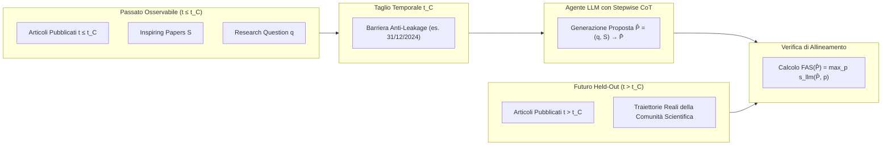

---
tags: [time-sliced-scientific-forecasting, scientific-forecasting, future-alignment, methodology, proposal-generation, llm-benchmarking]
source_papers: ["2603.27146v3.pdf"]
---

# Time-Sliced Scientific Forecasting

## Definizione Operativa
- Paradigma metodologico introdotto da Heng Wang et al. (UIUC, 2026) che riformula l'addestramento e la valutazione dell'ideazione scientifica nei [[large-language-models]] come un problema di **previsione temporale retrospettiva a divisione temporale (*time-sliced forecasting*)**.
- **Principio Fondamentale:** Anziché misurare concetti astratti e soggetti a bias umano (come "creatività" o "eleganza"), il framework suddivide un corpus scientifico cronologico in:
  1. *Contesto Osservabile ($t \le t_C$):* Letteratura scientifica, citazioni e domande di ricerca disponibili prima di una data limite $t_C$.
  2. *Corpus Futuro Held-Out ($t > t_C$):* L'insieme reale delle pubblicazioni peer-reviewed comparse successivamente a $t_C$.
- L'agente genera una proposta strutturata utilizzando unicamente il contesto osservabile; la qualità viene poi verificata oggettivamente misurando quanto tale proposta anticipi semanticamente le traiettorie di ricerca scoperte e pubblicate dalla comunità scientifica nel corpus futuro attraverso il **[[future-alignment-score|Future Alignment Score (FAS)]]**.

---

## Evidenze dalla Letteratura

### 1. Inquadramento Metodologico e Rationale
- **Superamento della Valutazione Statica:** Nei benchmark tradizionali di NLP (QA, classificazione, traduzione), la risposta esatta è immutabile. Nella ricerca scientifica, invece, l'eccellenza di una proposta risiede nella sua fertilità predittiva e nella sua capacità di orientare gli sviluppi futuri (Ajith et al., 2026; Wen et al., 2025).
- **Prevenzione del Data Contamination:** Il vincolo temporale $t_C$ garantisce un isolamento sperimentale perfetto: i modelli vengono testati su articoli che non potevano in alcun modo far parte del loro dataset di pre-training o del loro contesto di prompt (Wang et al., 2026).

---

### 2. Componenti Operativi del Paradigma
1. **Leakage-Controlled Query Extraction:** Estrazione della domanda di ricerca $q$ dal testo del paper target senza anticipare la soluzione algoritmica proprietaria.
2. **Two-Stage Inspiring Citation Selection:** Selezione automatica delle 5 citazioni più influenti ($S$) escludendo pietre miliari generiche (come Transformer o BERT) e premiando i lavori metodologici specifici più recenti ($\le 2$ anni).
3. **Stepwise Reasoning Synthesis:** Generazione di tracce di pensiero in tre stadi (identificazione problema, ideazione metodo, progettazione sperimentale).
4. **Verifiable Scoring (FAS):** Dense retrieval su corpus futuro held-out + scoring semantico tramite LLM-judge con aggregazione al valore massimo.

---

### 3. Vantaggi e Ambiti di Applicazione
- **Scalabilità:** Consente di condurre audit e benchmark su migliaia di proposte senza costi umani proibitivi.
- **Generalizzabilità:** Sebbene testato inizialmente nel Machine Learning (NeurIPS, ICML, ICLR), il framework richiede unicamente un corpus temporizzato e un grafo di citazioni, risultando applicabile a biomedicina (PubMed/bioRxiv), fisica, economia e psicologia clinica.

---

## Riferimenti Bibliografici
- Wang, H., Jiang, P., Sun, J., Shi, Z., Yu, H., Han, J., & Ji, H. (2026). Learning to Predict Future-Aligned Research Proposals with Language Models. *arXiv preprint arXiv:2603.27146v3 [cs.CL]*, 1–31. https://doi.org/10.48550/arXiv.2603.27146
- Ajith, A., Singh, A., DeYoung, J., Kunievsky, N., Kozlowski, A. C., Tafjord, O., Evans, J., Weld, D. S., Hope, T., & Downey, D. (2026). Prescience: A benchmark for forecasting scientific contributions. *arXiv preprint arXiv:2602.20459*.
- Wen, J., Si, C., Yueh-Han, C., He, H., & Feng, S. (2025). Predicting empirical AI research outcomes with language models. In *NeurIPS 2025*.

---

## Relazioni
- Vedi anche: [[2603.27146v3]], [[future-alignment-score]], [[stepwise-cot]], [[hypothesis-generation]], [[hybrid-ai-research-workflows]], [[structured-literature-reviews]], [[wang-et-al-2026]]
