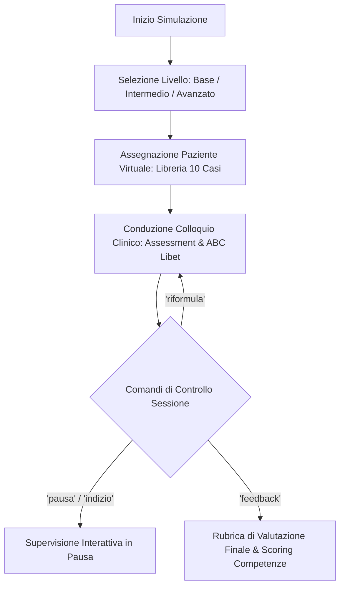

# Trainer Simulator

**Summary**: Simulatore conversazionale basato su LLM (Interview Trainer) per l'addestramento pratico di psicoterapeuti in formazione, dotato di una libreria di pazienti virtuali su tre livelli di difficoltà, comandi di controllo del setting e rubrica di valutazione analitica delle competenze.
**Sources**: 07-10 Riunione_ Test e Valutazione di “Libet Prime” (Tutor AI per Libet_CBT), Trainer Simulator e Piano Operativo.txt
**Last updated**: 2026-08-27
---

## Definizione e Obiettivi Operativi

Il **Trainer Simulator** (o *Interview Trainer*, v0.2) è un agente conversazionale specializzato sviluppato per le scuole di psicoterapia cognitivo-comportamentale (*Studi Cognitivi* / SC Formazione).

A differenza di [[libet-prime|Libet Prime]] — il cui scopo è il tutoraggio teorico e l'analisi maieutica di vignette cliniche —, il Trainer Simulator è concepito come **ambiente esperienziale protetto** in cui l'allievo specializzando conduce simulazioni interattive di colloqui clinici direttamente con pazienti sintetici.

---

## Architettura e Funzionalità Principali

### 1. Libreria di Pazienti Virtuali
- Dotazione di un catalogo iniziale di **10 profili di pazienti simulati** che coprono quadri psicopatologici diversificati (ansia, depressione, disturbi di personalità, evitamento, schemi rigidi).
- Personalizzazione dei pattern verbali, dello stile relazionale e delle modalità di risposta per evitare stereotipi e prevedibilità.

### 2. Gradualità del Livello di Difficoltà
La simulazione si articola su tre livelli di complessità crescente:
- **Livello Base**: Paziente collaborativo, eloquio lineare e chiaro, difese cognitive minime, facilità nell'individuazione degli attivatori e delle credenze di base.
- **Livello Intermedio**: Presenza di vaghezza espressiva, resistenze moderate, difficoltà a riconoscere il legame emotivo-cognitivo, oscillazione nell'alleanza.
- **Livello Avanzato**: Eloquio ambiguo e depistante, difese e reazioni di opposizione/chiusura, schemi di protezione rigidi, complessità nella ricostruzione della sequenza ABC e del modello LIBET.

### 3. Comandi di Controllo Sessione
L'interazione con l'agente è governata da comandi operativi dedicati che permettono allo studente di gestire l'esperienza didattica:
- `inizia`: Avvia la sessione con la scelta o l'assegnazione randomizzata del caso.
- `pausa`: Sospende temporaneamente il ruolo del paziente ed entra in modalità "supervisione", permettendo di riflettere sul processo.
- `indizio`: Fornisce un suggerimento o un orientamento metacognitivo sul prossimo passo clinico da esplorare.
- `riformula`: Consente di ripetere l'ultimo intervento terapeutico correggendo l'impostazione comunicativa.
- `feedback`: Conclude la simulazione e genera il report valutativo finale.

### 4. Valutazione e Rubrica delle Competenze
Al termine dell'esercitazione, il sistema genera un'analisi multidimensionale strutturata che valuta:
- Aderenza metodologica al protocollo (fasi dell'assessment, ricostruzione dell'episodio critico, indagine dei costrutti LIBET).
- Micro-abilità comunicative e validazione emotiva.
- Rilevazione di criticità, deviazioni teoriche e suggerimenti mirati di potenziamento.

---

## Integrazione nel Curriculum Formativo

Il Trainer Simulator risponde all'esigenza formativa di offrire agli allievi dei primi anni uno spazio di pratica deliberata (*deliberate practice*):
- **Esercitazione preliminare**: Consente di fare pratica su dinamiche di colloquio complesse prima dell'incontro con pazienti reali.
- **Supporto all'autonomia clinica**: Offre un'alternativa strutturata e continuativa per quegli allievi che hanno minore accesso a casi clinici precoci o che necessitano di maggiore familiarità con la conduzione del colloquio.
- **Integrazione con la supervisione umana**: La simulazione non sostituisce i supervisori clinici, ma produce trascrizioni e sintesi di performance utili per discutere punti di forza e aree di miglioramento nei gruppi di supervisione.

---

## Related pages
- [[libet-prime]]
- [[07-10_Riunione_Test_Libet_Prime]]
- [[simulazione-pazienti-ai]]
- [[clinical-ai-simulation]]
- [[human-in-the-reasoning]]
- [[clinical-fidelity-assessment]]
- [[ai-assisted-psychotherapy]]
