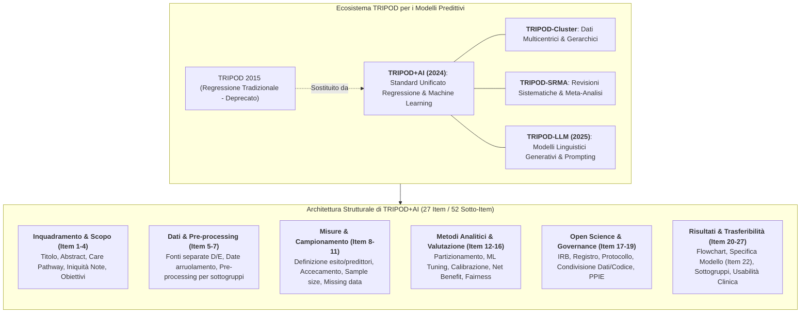
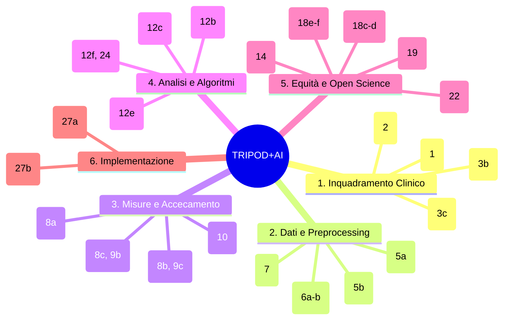
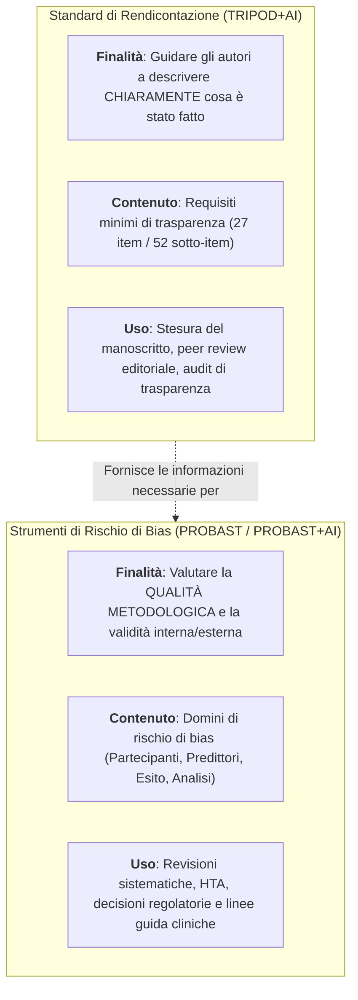

# TRIPOD+AI Reporting Guideline (Transparent Reporting of a Multivariable Prediction Model for Individual Prognosis or Diagnosis - AI)

## Definizione Operativa
- La **TRIPOD+AI Reporting Guideline** (*Transparent Reporting of a multivariable prediction model for Individual Prognosis Or Diagnosis - Artificial Intelligence*) è lo standard metodologico internazionale registrato presso l'**EQUATOR Network** progettato per guidare e standardizzare la rendicontazione scientifica degli studi che sviluppano o valutano modelli di predizione clinica, sia basati su modelli di regressione statistica tradizionale (logistica, Cox), sia su tecniche di Machine Learning ([[machine-learning|ML]]) e Intelligenza Artificiale ([[artificial-intelligence|AI]], come deep learning, random forests, boosting e support vector machines).
- **Consenso Internazionale e Sostituzione di TRIPOD 2015:** Pubblicata su *The BMJ* (Collins et al., 2024; 385:e078378; doi: 10.1136/bmj-2023-078378), la linea guida **sostituisce integralmente lo standard TRIPOD 2015**, armonizzando la terminologia tra statistica ed epidemiologia e data science/machine learning.
- **Struttura a Matrice Funzionale:** Si compone di una **checklist di 27 item principali articolati in 52 sotto-item**, una **checklist dedicata per l'abstract (13 item)** e una matrice di attribuzione che specifica l'applicabilità di ciascuna voce per studi di solo sviluppo (**D** - *Development*), di sola valutazione esterna (**E** - *Evaluation*), o combinati (**D;E**).

---

## Architettura dei Domini Metodologici della Checklist TRIPOD+AI

### 1. Inquadramento Clinico e Percorso di Cura (Item 1–4)
- **Titolo e Abstract (Item 1, 2):** Esplicitazione immediata dell'obiettivo predittivo, della popolazione target e dell'esito da stimare; redazione dell'abstract secondo la specifica checklist a 13 item (*TRIPOD+AI for Abstracts*).
- **Collocazione nel Care Pathway (Item 3b):** Descrivere dove si inserisce il modello all'interno del flusso di lavoro clinico (triage, indicazione a biopsia, avvio terapia intensiva, dimissione protetta) e specificare gli utenti finali (medici specialisti, infermieri, medici di medicina generale, pazienti).
- **Consapevolezza delle Disuguaglianze Sanitarie (Item 3c):** Identificare a priori le disuguaglianze di salute note tra gruppi demografici e socioeconomici nella popolazione di riferimento.

### 2. Rigore nel Trattamento dei Dati e Pre-processing (Item 5–7)
- **Separazione Rigorosa delle Fonti Dati (Item 5a-b):** Descrivere distintamente l'origine dei dataset per lo sviluppo (*development*) e per la valutazione esterna (*evaluation*), documentando le finestre temporali di arruolamento per consentire il monitoraggio del *temporal drift*.
- **Pre-processing Trasparente e Non Discriminatorio (Item 7):** Riportare tutte le pipeline di pulizia, imputazione, trasformazione delle feature e normalizzazione, verificando che tali operazioni non abbiano introdotto distorsioni sistematiche a carico di specifici sottogruppi demografici.

### 3. Accecamento, Dimensione Campionaria e Dati Mancanti (Item 8–11)
- **Definizione dell'Esito e Accecamento (Item 8a-c):** Definizione non ambigua dell'esito diagnostico o prognostico (con relativo orizzonte temporale), accompagnata dalla descrizione dell'accecamento (*blinding*) dei valutatori rispetto ai predittori e alle qualifiche professionali dei giudici.
- **Giustificazione del Campione (Item 10):** Superamento delle regole empiriche approssimative (come i classici "10 eventi per variabile"); obbligo di presentare calcoli formali di dimensione campionaria sia per la fase di addestramento che per la coorte di test (Riley et al., 2020; van Smeden et al., 2019).
- **Gestione dei Missing Data (Item 11):** Documentare il pattern di dati mancanti e le strategie statistiche impiegate (es. imputazione multipla, Full Information Maximum Likelihood), evitando l'esclusione semplicistica (*complete-case analysis*) che genera gravi bias di selezione.

### 4. Modellazione, Calibrazione e Utilità Clinica (Item 12–16)
- **Specifiche degli Algoritmi ML (Item 12a-c):** Dettagliare il partizionamento dei dati (evitando qualsiasi leakage informativo tra training e internal validation), le forme funzionali delle variabili continue (spline, trasformazioni non lineari) e le strategie di ottimizzazione degli iperparametri (*grid search*, *random search*, *bayesian optimization*).
- **Valutazione Tripartita della Performance (Item 12e, 23a):** Obbligo di rendicontare contemporaneamente:
  1. **Discriminazione:** $c$-statistic / AUROC con intervalli di confidenza al 95%;
  2. **Calibrazione:** Valutata graficamente mediante curve di calibrazione continue e stima di pendenza (*slope*) e intercetta (*calibration-in-the-large*);
  3. **Utilità Clinica:** Curve di beneficio netto (*Decision Curve Analysis - DCA*) per quantificare il vantaggio clinico netto rispetto alle strategie di default ("tratta tutti" / "non trattare nessuno").
- **Model Updating e Ricalibrazione (Item 12f, 24):** Rendicontare gli adattamenti dei parametri (es. ricalibrazione dell'intercetta per correggere differenze di prevalenza locale) quando il modello viene applicato a una nuova coorte.

### 5. Equità Algoritmica, Scienza Aperta e PPIE (Item 14, 18, 19, 22)
- **Fairness Operativa (Item 14, 23a, 25):** Valutazione formale delle prestazioni disaggregate per sottogruppi sociodemografici protetti (etnia, genere, fasce di età vulnerabili), superando la mera rappresentazione quantitativa per prevenire la discriminazione algoritmica.
- **Open Science e Replicabilità (Item 18a-f):** Indicazione obbligatoria del protocollo di studio, del registro pubblico (es. OSF, ClinicalTrials.gov), delle condizioni di accesso ai dati grezzi e del codice sorgente di analisi.
- **Specificazione Completa del Modello (Item 22):** Fornitura del modello in formato direttamente eseguibile (formula analitica chiusa, codice, pesi serializzati o endpoint API) per consentire audit terzi e implementazione clinica indipendente.
- **Patient and Public Involvement and Engagement (Item 19):** Rendicontazione dettagliata del coinvolgimento di pazienti e cittadini lungo l'intero ciclo di ricerca.

---

## Matrice Comparativa: TRIPOD 2015 vs TRIPOD+AI 2024

| Dimensione Metodologica | TRIPOD 2015 (Deprecato) | TRIPOD+AI 2024 (Standard Attuale) |
| :--- | :--- | :--- |
| **Ambito di Modellazione** | Principalmente modelli di regressione statistica lineare/logistica/Cox. | **Universale:** regressione statistica e tutti i metodi di Machine Learning (Deep Learning, Random Forest, Boosting). |
| **Nomenclatura** | Lessico statistico tradizionale (*predittori, esiti, sviluppo, validazione*). | **Armonizzata:** integra terminologia ML (*features, labels/targets, training, evaluation data*). |
| **Concetto di Validazione** | Approccio tradizionale di "validazione esterna" come traguardo conclusivo. | **Epistemologia dell'Evaluation Continua:** rifiuto del dogma del "modello validato", monitoraggio dinamico delle prestazioni. |
| **Equità e Fairness** | Non esplicitate o marginali. | **Pervasive:** integrate in 10 diversi item dalla fase di pre-processing alla discussione e nei sottogruppi. |
| **Coinvolgimento Pazienti (PPIE)** | Assente. | **Item Dedicato (Item 19):** rendicontazione formale della partecipazione attiva di pazienti e pubblico. |
| **Pratiche di Open Science** | Limitate alla dichiarazione di finanziamenti e conflitti. | **Sezione Dedicata (Item 18a-f & 22):** protocolli pre-registrati, condivisione dati, codice analitico e oggetti modello. |
| **Dimensionamento Campionario** | Regole empiriche tollerate (es. 10 EPV). | **Calcolo Formale Obbligatorio (Item 10):** sample size justification rigorosa per sviluppo e test. |
| **Metriche di Valutazione** | Spesso limitate ad AUROC / $c$-index. | **Obbligo Tripartito:** Discriminazione + Curve di Calibrazione Continue + Decision Curve Analysis (Net Benefit). |

---

## Distinzione di Ruolo: Reporting Guideline vs Risk of Bias Tool

È fondamentale non confondere lo scopo degli standard di reporting con gli strumenti di valutazione critica della qualità metodologica:

- **TRIPOD+AI** non assegna un punteggio di qualità clinica né stabilisce se un modello sia privo di bias; garantisce unicamente che tutti i dettagli metodologici siano esplicitati in modo tale che revisori e lettori possano valutarne la solidità.
- **PROBAST** (*Prediction model Risk Of Bias Assessment Tool*) e il nascente **PROBAST+AI** costituiscono lo standard complementare per la valutazione critica del rischio di bias e dell'applicabilità clinica dei modelli predittivi.

---

## Concetti Correlati e Connessioni Wiki
- [[TRIPOD_AI2024|Sintesi Paper TRIPOD+AI 2024 (Collins et al., BMJ)]] - Scheda bibliografica e sintesi estesa del paper BMJ
- [[clinical-prediction-model-evaluation|Valutazione dei Modelli Predittivi Clinici]] - Quadro concettuale: calibrazione continua, discriminazione, utilità clinica e ricalibrazione
- [[tripod-llm-reporting-guideline|TRIPOD-LLM Reporting Guideline]] - Linea guida per modelli generativi e prompt engineering
- [[chart-reporting-guideline|CHART Reporting Guideline]] - Standard di reporting per studi di consulenza sanitaria con Chatbot/LLM
- [[refine-reporting-checklist|REFINE Reporting Checklist]] - Checklist internazionale per Foundation Models e LLM in sanità
- [[elevate-genai-framework|ELEVATE-GenAI Framework]] - Reporting per GenAI in economia sanitaria e outcomes research
- [[cross-cultural-bias-and-fairness-audits-ai|Audit di Fairness e Bias nei Sistemi di IA Sanitaria]] - Principi di equità algoritmica e mitigazione delle disparità
- [[software-as-a-medical-device-salute-mentale|Software as a Medical Device (SaMD)]] - Standard regolatori e certificazione dei software predittivi
