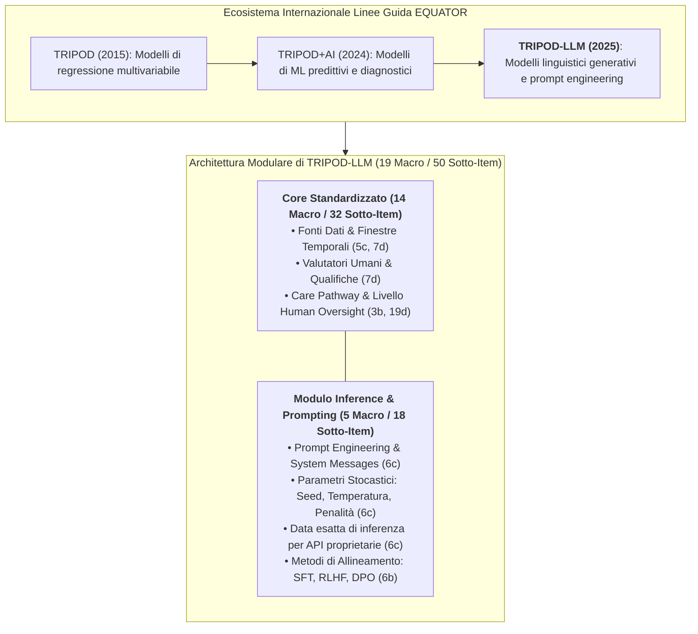
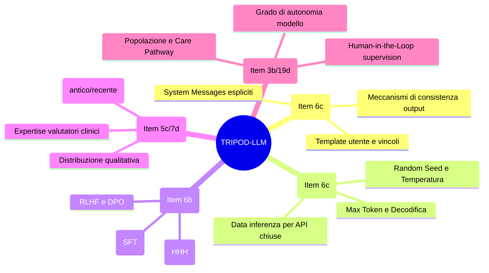

# TRIPOD-LLM Reporting Guideline

## Definizione Operativa
- Il **TRIPOD-LLM** (*Transparent Reporting of a multivariable model for individual prognosis or diagnosis - Large Language Models*) è lo standard metodologico internazionale di rendicontazione scientifica formalizzato all'inizio del 2025 (Gallifant et al.) come estensione dedicata della dichiarazione **TRIPOD+AI** per gli studi biomedici e clinici che impiegano modelli linguistici generativi e tecniche di prompt engineering.
- **Superamento dei Limiti Storici:** Mentre TRIPOD+AI era primariamente calibrato sui modelli statistico-predittivi tradizionali e sui classificatori di machine learning supervisionato, TRIPOD-LLM risponde alle sfide uniche introdotte dalla **natura generativa, autoregressiva e stocastica** dei Large Language Models ([[large-language-models|LLM]]).
- **Struttura a Matrice Modulare:** Il framework è strutturato su **19 macro-item e 50 sotto-item complessivi**:
  1. **Core Standardizzato Trasversale (14 macro-item / 32 sotto-item):** Regola gli aspetti comuni a ogni disegno sperimentale in sanità (trasparenza delle fonti dati, distribuzioni temporali, contesto d'uso, allocazione dell'autonomia e governance etica);
  2. **Modulo Specialistico Inference & Prompting (5 macro-item / 18 sotto-item):** Definisce requisiti stringenti per la replicabilità del prompt engineering, la documentazione dei parametri di generazione stocastica e la trasparenza delle strategie di allineamento post-pretraining.

---

## I Requisiti Chiave della Checklist TRIPOD-LLM

### 1. Ingegneria del Prompt e Template di Sistema (Item 6c)
- **Trasparenza Integrale dei Prompt:** Gli autori sono tenuti a pubblicare integralmente i testi di tutti i prompt utilizzati, distinguendo chiaramente tra istruzioni di sistema (*system prompt / system message*), istruzioni contestuali fornite all'utente (*user prompt*) ed eventuali vincoli sintattici di ritorno (es. schemi JSON, formattazione tabellare).
- **Controllo della Consistenza:** Documentazione delle strategie applicate per mitigare la varianza generativa e prevenire la deriva semantica tra turni conversazionali consecutivi.

### 2. Parametri di Generazione Stocastica e Tracciamento API (Item 6c)
- **Parametri di Decodifica:** Obbligo di esplicitare tutti i parametri che governano il campionamento autoregressivo:
  - *Random seed* impostato per garantire la riproducibilità tecnica;
  - *Temperatura* e parametri *Top-p / Top-k*;
  - *Max token length* e limiti contestuali;
  - *Frequency and presence penalties*;
  - Metodo di decodifica (*greedy search*, *beam search*, *nucleus sampling*).
- **Tracciamento Temporale delle API Proprietarie:** Per modelli chiusi accessibili esclusivamente via API commerciali (es. OpenAI, Anthropic, Google), è obbligatorio registrare la **data e l'ora esatta di ciascuna inferenza**, consentendo alla comunità scientifica di monitorare retroattivamente l'impatto di aggiornamenti silenti del modello (*silent model drift*).

### 3. Allineamento Post-Pretraining e Ottimizzazione (Item 6b)
- **Dichiarazione delle Pipeline di Tuning:** Specificare se il modello impiegato è *base* (*foundation*), sottoposto a *Supervised Fine-Tuning* (SFT) o allineato tramite algoritmi basati sulle preferenze, quali *Reinforcement Learning from Human Feedback* (RLHF) o *Direct Preference Optimization* (DPO).
- **Targeting Etico-Comportamentale:** Descrizione degli obiettivi di allineamento perseguiti (es. massimizzazione dell'utilità, dell'onestà, dell'innocuità nosografica e della riduzione delle [[sycophantic-mirroring|adulazioni compiacenti]]).

### 4. Dati di Validazione e Qualifiche dei Valutatori (Item 5c e 7d)
- **Finestra Temporale del Dataset:** Esplicitazione delle date esatte del reperto clinico più antico e di quello più recente inclusi nel dataset di test, prevenendo fenomeni di contaminazione anacronistica (*data contamination* o anacronismo diagnostico).
- **Profilo dei Valutatori Umani:** Quando la valutazione qualitativa dell'output si basa su giudizio esperto, lo studio deve riportare il livello di specializzazione medica/psicoterapeutica, gli anni di esperienza clinica, il protocollo di calibrazione tra valutatori e gli indici di accordo inter-osservatore (es. Cohen's Kappa).

### 5. Collocazione Clinica e Supervisione Umana (Item 3b e 19d)
- **Integrazione nel Care Pathway:** Descrivere in quale snodo decisionale si inserisce l'interfaccia (es. triage iniziale, redazione note cliniche, supporto alla diagnosi differenziale, tra-sessione psicoterapica).
- **Livello di Autonomia e Human Oversight:** Definire in modo non ambiguo se il sistema opera in modalità assistiva con supervisione obbligatoria (*Human-in-the-Loop* - HITL) o se dispone di gradi parziali di autonomia, delineando le procedure di override manuale in caso di allucinazione o allarme per la sicurezza del paziente.

---

## Il Rifiuto delle Metriche Lessicali Tradizionali (BLEU / ROUGE)

Uno dei contributi fondativi di TRIPOD-LLM è la formale dichiarazione di inadeguatezza delle metriche NLP tradizionali nel dominio medico:
- **Cecità Semantica di BLEU/ROUGE:** Le metriche basate sulla sovrapposizione superficiale di n-grammi non correlano con l'accuratezza diagnostica o la sicurezza farmacologica. Una risposta che inverta un dosaggio o ometta una controindicazione critica può ottenere un elevato score BLEU pur essendo letale per il paziente.
- **Adozione di Metriche Clinico-Funzionali:** TRIPOD-LLM promuove l'adozione di metriche basate su fedeltà nosografica, checklist diagnostiche oggettive, scale di aderenza clinica (come la *Cognitive Therapy Rating Scale* - CTRS in salute mentale) e framework di audit avversariale.

---

## Quadro Comparativo delle Linee Guida di Reporting in Sanità Digitale

| Standard | Target Primario | Focus Metodologico Distintivo |
| :--- | :--- | :--- |
| **TRIPOD-LLM (2025)** | Modelli Linguistici di Grandi Dimensioni (LLM) in medicina e salute mentale | 19 macro-item / 50 sotto-item; parametri di inferenza, prompt engineering, allineamento SFT/RLHF, qualifiche valutatori. |
| **[[chart-reporting-guideline\|CHART (2025)]]** | Chatbot per consigli sanitari (*Chatbot Health Advice*) | 12 domini / 39 sub-item; accecamento valutatori, sessioni multi-turno, sicurezza delle raccomandazioni. |
| **[[elevate-genai-framework\|ELEVATE-GenAI (2025)]]** | Ricerca economico-sanitaria ed esiti (HEOR) | 10 domini con scoring a 30 punti; modellizzazione economica, de-identificazione PHI, living guideline. |
| **REFINE (2026)** | Modelli di fondazione biomedici | Trasparenza architetturale, dati di pre-addestramento, footprint computazionale. |
| **FLAIR (2026)** | Applicazioni LLM e multimodali in Radiologia | 32 item su 6 categorie; integrazione PACS, refertazione strutturata, mitigazione rischi radiologici. |

---

## Riferimenti Bibliografici
- Gallifant, J., et al. (2025). The TRIPOD-LLM reporting guideline for studies using large language models. *Oxford Research Archive* / *medRxiv*, doi:10.1101/2024.07.24.24310930.
- TRIPOD-LLM Working Group. (2025). The TRIPOD-LLM Reporting Guideline for Studies Using Large Language Models. *DigitalCommons@TMC*.
- Collins, G. S., et al. (2024). TRIPOD+AI statement: updated guidance for reporting clinical prediction models that use regression or machine learning methods. *BMJ*, 385:e078378.
- RSNA Delphi Panel. (2026). Guidelines for Reporting Studies on Large Language Models in Radiology (FLAIR). *Radiology*, doi:10.1148/radiol.250913.
- REFINE Consortium. (2026). Reporting checklist for foundation and large language models in medical research (REFINE). *Diagnostic and Interventional Radiology*, doi:10.5152/dir.2026.263812.

---

## Relazioni
- Scheda di sintesi collegata: [[Ricerca_Prompting_LLM_Clinico_Sanitario]]
- Standard di reporting correlati: [[chart-reporting-guideline]], [[elevate-genai-framework]], [[gamer-reporting-guideline]], [[living-guidelines-in-health-ai]]
- Concetti collegati: [[clinical-chain-of-thought-paradox]], [[coast-framework-clinical-prompting]], [[accuratezza-vs-fattualita-in-genai]], [[prompt-experiment-gap-in-clinical-ai]], [[human-oversight-and-liability-in-clinical-ai]]
