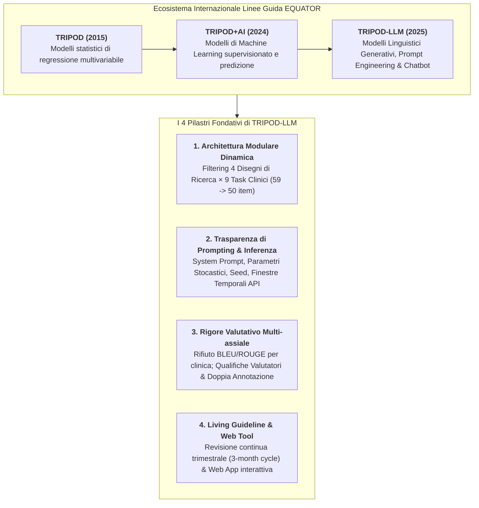
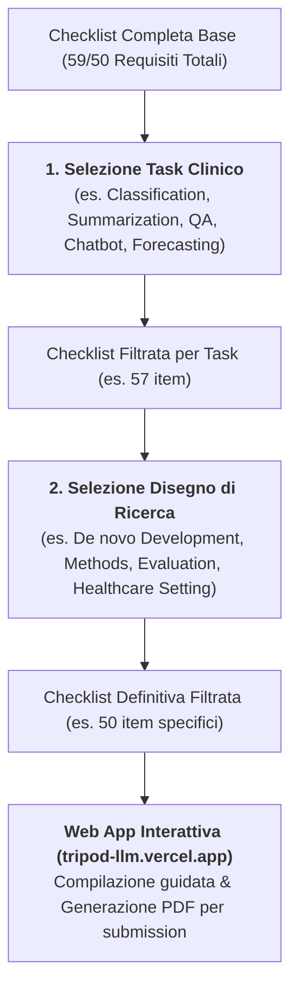
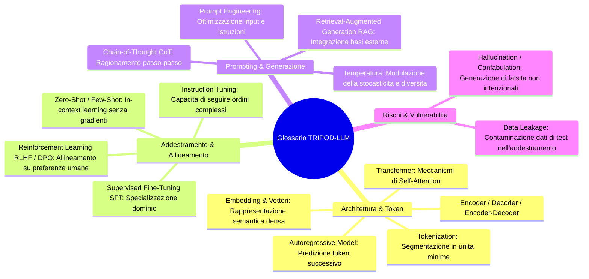

# The TRIPOD-LLM Reporting Guideline for Studies Using Large Language Models (Gallifant et al., Nature Medicine 2025)

## Definizione Operativa
- Il **TRIPOD-LLM Statement** (*Transparent Reporting of a multivariable model for Individual Prognosis Or Diagnosis - Large Language Models*) è lo standard metodologico internazionale di riferimento per la rendicontazione trasparente, rigorosa e riproducibile degli studi biomedici e clinici che sviluppano, ottimizzano (*fine-tuning* / *prompting*) o valutano Large Language Models ([[large-language-models|LLM]]) e sistemi conversazionali basati su intelligenza artificiale generativa in sanità.
- **Pubblicazione e Consorzio Internazionale:** Pubblicato su *Nature Medicine* (Volume 31, Gennaio 2025, pp. 60–69; doi: [10.1038/s41591-024-03425-5](https://doi.org/10.1038/s41591-024-03425-5)), lo standard è stato elaborato da uno Steering Group guidato da Danielle S. Bitterman (Harvard Medical School / Dana-Farber / Mass General Brigham), Jack Gallifant (MIT / Guy's and St Thomas' NHS), Leo Anthony Celi (MIT / Harvard), Gary S. Collins (University of Oxford / UK EQUATOR Centre) e Karel G. M. Moons (UMC Utrecht), affiancati da un panel multidisciplinare di 20 esperti internazionali in NLP, clinica medica, biostatistica, etica e informatica sanitaria.
- **Evoluzione da TRIPOD+AI:** Rappresenta l'estensione formale di [[tripod-ai2024|TRIPOD+AI]] (Collins et al., 2024), concepita specificamente per colmare i limiti dei modelli di classificazione tradizionali di fronte alla natura autoregressiva, stocastica e generalista dei modelli linguistici generativi, ampliando il perimetro oltre la pura predizione multivariabile verso compiti complessi come sintesi documentale, generazione di note cliniche, consultazione conversazionale e reasoning diagnostico.
- **Architettura del Framework:**
  1. **Checklist Modulare Principale:** Strutturata in **19 macro-item suddivisi in 50 sotto-item** distribuiti tra Titolo, Abstract, Introduzione, Metodi (Dati, Metodi Analitici, Output LLM, Annotazione, Prompting, Sintesi, Allineamento, Compute, Etica, Open Science, PPIE), Risultati (Partecipanti, Performance, Updating) e Discussione (Interpretazione, Limiti, Usabilità Clinica).
  2. **Matrice Modulare Bidimensionale:** Comprende **14 macro-item e 32 sotto-item trasversali** (*Core* applicabile a tutti gli studi) e **5 macro-item e 18 sotto-item specialistici**, filtrati dinamicamente in base a **4 Disegni di Ricerca** (*Research Designs*) e **9 Categorie di Task LLM** (*LLM Tasks*).
  3. **Checklist per Abstract (TRIPOD-LLM for Abstracts):** Versione condensata in **12 item strutturati (Item 2a–2l)** dedicata ad abstract congressuali e sintesi di riviste.
  4. **Paradigma Living Guideline:** Aggiornamento trimestrale permanente gestito da un panel esperto, integrato con piattaforma interattiva web open-access ([tripod-llm.vercel.app](https://tripod-llm.vercel.app/)) e repository GitHub per versionamento continuo e generazione dinamica del PDF conforme.

---

## Evidenze dalla Letteratura

### 1. Inquadramento del Problema: La Rivoluzione dei Modelli Generativi in Sanità
- **Adozione Esponenziale e Pressione Traslazionale:** I Large Language Models vengono rapidamente integrati nei flussi operativi sanitari per un ampio spettro di applicazioni: redazione automatica di risposte a messaggi nei portali pazienti (Chen et al., 2024; Tai-Seale et al., 2024), scribi digitali ambientali per la documentazione clinica (Tierney et al., 2024), sintesi di lettere di dimissione in linguaggio comprensibile (Zaretsky et al., 2024), consultazione conversazionale (*health advisories*), estrazione di determinanti sociali della salute (Guevara et al., 2024) e previsione di outcome prognostici da note cliniche (Yoon et al., 2024).
- **Inadeguatezza degli Standard di Reporting Preesistenti:** Le linee guida per classificatori supervisionati (TRIPOD 2015, TRIPOD+AI 2024, MI-CLAIM) non intercettano le specificità metodologiche dei modelli generativi autoregressivi:
  - Scelte di iperparametri nell'[[supervised-fine-tuning|addestramento e fine-tuning]];
  - Metodi e complessità del **prompt engineering**;
  - Variabilità stocastica dell'output dovuta a temperatura, top-p e random seed;
  - Rischi specifici di **allucinazioni**, confabulazioni, omissioni e propagazione a valle di bias sistemici e linguaggi stigmatizzanti (Zack et al., 2024; Omiye et al., 2024);
  - Mancanza di standard per la valutazione di testo non strutturato in medicina, dove spesso coesistono incertezze aleatorie ed epistemiche e non esiste un'unica risposta corretta (*no single correct answer*).
- **Rischio di "Research Waste" e Mancata Replicabilità:** La pubblicazione accelerata di preprint privi di parametri di generazione e versioni esatte delle API impedisce la riproducibilità, compromette l'audit indipendente e rischia di introdurre nei percorsi di cura strumenti privi di verificabilità clinica.

```mermaid
graph LR
    subgraph VulnerabilitaMetodologiche ["Deficit Tipici della Ricerca LLM Pre-TRIPOD-LLM"]
        V1["Omissione Testo Prompt & System Messages"]
        V2["Assenza Parametri Stocastici (Temp, Seed, Top-p)"]
        V3["Uso Improprio di Metriche Lessicali (BLEU / ROUGE)"]
        V4["Mancata Dichiarazione Versioni/Date API Chiuse"]
        V5["Assenza Qualifiche Valutatori Umani & Kappa"]
    end

    subgraph RischiClinici ["Impatti Diretti sull'Assistenza Sanitaria"]
        R1["Irriproducibilità Scientifica dei Risultati"]
        R2["Allucinazioni Cliniche Non Rilevate"]
        R3["Silent Model Drift Non Riconosciuto"]
        R4["Disparità Sanitarie e Bias Demografici Nascosti"]
        R5["Allocazione Errata di Responsabilità e Autonomia"]
    end

    VulnerabilitaMetodologiche --> RischiClinici
```

---

### 2. Metodologia di Sviluppo dello Standard TRIPOD-LLM

Lo sviluppo dello standard ha seguito una metodologia rigorosa conforme alle direttive dell'**EQUATOR Network**:
1. **Steering Group e Registrazione:** Istituito a inizio 2024 e registrato presso l'EQUATOR Network il 2 maggio 2024. Approvazione etica waivata dal *MIT COUHES IRB* il 26 marzo 2024 (Exempt ID: E-5705).
2. **Generazione degli Item Candidati:** Partendo da TRIPOD-2015, TRIPOD+AI, DECIDE-AI, MI-CLAIM e CHART, lo Steering Group ha redatto una lista iniziale di **64 item candidati**.
3. **Indagine Delphi a Round Accelerato:**
   - Condotta tra il 1° marzo e il 23 aprile 2024;
   - Link inviato a 56 esperti internazionali di 9 nazioni (Nord America, Europa, Asia, Sud America, Australasia);
   - **26 esperti multidisciplinari** (77% specialisti in AI/ML/NLP/informatica medica, 54% clinici) hanno completato l'indagine anonima su Google Forms valutando ogni voce con scala a 4 livelli (*can be omitted*, *possibly include*, *desirable for inclusion*, *essential for inclusion*) e fornendo commenti qualitativi liberi.
4. **Consensus Meeting Sincrono:** Riunione online svoltasi il 22 e 24 aprile 2024 su Zoom, presieduta da Danielle S. Bitterman e Jack Gallifant. Gli item con consenso `< 50%` come "essential" sono stati discussi e armonizzati fino al raggiungimento del pieno consenso unanime.
5. **Formalizzazione della Struttura Modulare:** Durante il meeting è stato approvato l'approccio modulare basato sulla combinazione di *Research Designs* e *LLM Tasks*, consentendo la riduzione mirata degli item compilabili da 59/50 totali.

---

### 3. Tassonomia Modulare: Disegni di Studio e Categorie di Task LLM

TRIPOD-LLM definisce formalmente una matrice a due dimensioni per adattare la checklist alle specificità di ciascun disegno sperimentale (Tabella 1 del paper):

#### 3.1. I 4 Disegni di Ricerca (*Research Designs*)
| Disegno di Ricerca | Sigla | Definizione Operativa Standard TRIPOD-LLM | Esempio Applicativo |
| :--- | :---: | :--- | :--- |
| **De novo LLM development** | **D** | Costruzione di un nuovo modello linguistico da zero (*pre-training*) o sostanziale riaddestramento/fine-tuning di modelli base per sviluppare nuove funzionalità sanitarie. | Pre-training di un modello clinico su larga scala sui dati sanitari di un intero ospedale (es. GatorTron, MEDITRON-70B). |
| **LLM methods** | **M** | Indagini quantitative o teoriche focalizzate su nuove architetture, metodi computazionali per comprendere gli LLM, nuovi metodi di valutazione o tecniche avanzate di prompting/RAG. | Sviluppo di un nuovo framework RAG (*Retrieval-Augmented Generation*) per la medicina (es. Almanac, GeneGPT). |
| **LLM evaluation** | **E** | Valutazione o test delle prestazioni (*efficacy, accuracy, suitability*) di un LLM esistente per uno specifico task sanitario, inclusa la quantificazione di rischi, bias e allucinazioni. | Studio empirico sui bias di ragionamento diagnostico razziale o di genere incorporati in GPT-4 (Zack et al., 2024). |
| **LLM evaluation in healthcare settings** | **H** | Valutazione di un LLM integrato all'interno di un flusso di lavoro clinico reale, misurandone l'impatto su esiti clinici, amministrativi o di carico di lavoro per gli operatori. | Studio sull'impiego in tempo reale di un LLM integrato nell'EHR per predire complicanze e mortalità in pazienti ospedalizzati (Jiang et al., 2023). |

#### 3.2. Le 9 Categorie di Task LLM (*LLM Tasks*)
| Categoria di Task | Sigla | Definizione | Esempio Clinico |
| :--- | :---: | :--- | :--- |
| **Text processing** | — | Elaborazione e manipolazione di basso livello del testo clinico (tokenizzazione, parsing sintattico, Named Entity Recognition - NER). | Riconoscimento di entità nosografiche o farmacologiche in referti non strutturati (Keloth et al., 2024). |
| **Classification** | **C** | Assegnazione di etichette predefinite a porzioni di testo clinico (include anche i task di question answering a risposta multipla). | Identificazione di determinanti sociali della salute (SDOH) o diagnosi nosografica da note cliniche (Guevara et al., 2024). |
| **Long-form question answering** | **QA** | Risposte articolate e dettagliate a quesiti complessi che richiedono sintesi e ragionamento su molteplici documenti o evidenze. | Risposta automatica generativa a messaggi asincroni di pazienti nei portali clinici (Chen et al., 2024). |
| **Information retrieval** | **IR** | Estrazione e reperimento di informazioni rilevanti da grandi moli di dati testuali basata su query specifiche. | Reperimento guidato da transformer di pubblicazioni biomediche per la risposta a quesiti clinici rari (Jin et al., 2024). |
| **Conversational agent (chatbot)** | — | Interazione e dialogo dinamico con gli utenti per consulenza sanitaria, triage, supporto psicologico o assistenza clinica virtuale. | Valutazione dell'impatto di un chatbot interattivo sul ragionamento diagnostico del medico (Goh et al., 2024). |
| **Documentation generation** | **DG** | Generazione automatica di documentazione medica formale a partire da registrazioni audio ambientali, dettati o appunti. | Valutazione della fedeltà delle note cliniche prodotte da scribi AI ambientali durante visite ambulatoriali (Tierney et al., 2024). |
| **Summarization and simplification** | **SS** | Sintesi di documenti lunghi o semplificazione del linguaggio medico per facilitare la comprensione del paziente o produrre sintesi per i medici. | Trasformazione automatica di lettere di dimissione ospedaliera in linguaggio chiaro accessibile al paziente (Zaretsky et al., 2024). |
| **Machine translation** | **MT** | Traduzione automatica di testi medici tra idiomi differenti. | Confronto tra LLM specializzati e generalisti nella traduzione di cartelle cliniche tra spagnolo e inglese (Han et al., 2022). |
| **Outcome forecasting** | **OF** | Predizione di esiti clinici futuri basata sui dati storici e longitudinali (stima della prognosi o dell'efficacia terapeutica). | Predizione della mortalità intra-ospedaliera o a 30 giorni da note di terapia intensiva (Yoon et al., 2024). |

---

### 4. Il Flusso Operativo TRIPOD-LLM (Workflow Modulare)

---

### 5. La Checklist TRIPOD-LLM: I 19 Macro-Item e 50 Sotto-Item

La Tabella 2 del paper definisce in dettaglio tutti i requisiti di rendicontazione, con la relativa matrice di applicabilità:

| Sezione | N° Item | Voce della Checklist TRIPOD-LLM | Applicabilità Disegno | Applicabilità Task | Dettaglio Operativo e Razionale Metodologico |
| :--- | :---: | :--- | :---: | :---: | :--- |
| **Titolo** | **1** | *Titolo dello Studio* | All | All | Identificare lo studio come sviluppo, fine-tuning e/o valutazione delle prestazioni di un LLM, specificando task, popolazione target ed esito predetto. |
| **Abstract** | **2** | *Abstract Strutturato* | All | All | Utilizzare la checklist specifica *TRIPOD-LLM for Abstracts* (Item 2a–2l). |
| **Introduzione** | **3a** | *Contesto Sanitario e Razionale* | All | All | Spiegare il contesto clinico/d'uso (amministrativo, diagnostico, terapeutico, flusso di lavoro) e il razionale, citando modelli ed approcci preesistenti. |
| | **3b** | *Popolazione Target e Care Pathway* | E, H | All | Descrivere la popolazione target e l'uso previsto nel contesto del percorso di cura (*care pathway*), inclusi gli utenti previsti e le pratiche gold standard correnti. |
| | **4** | *Obiettivi dello Studio* | All | All | Specificare gli obiettivi, indicando chiaramente se lo studio descrive sviluppo iniziale, fine-tuning o validazione (o stadi multipli). |
| **Metodi: Dati** | **5a** | *Fonti Dati Distinte* | All | All | Descrivere separatamente le fonti per dataset di addestramento, tuning e valutazione e il razionale di scelta (web corpora, trial clinici, EHR, non noto). |
| | **5b** | *Descrizione e Distribuzione Dati* | All | All | Fornire una descrizione quantitativa e qualitativa della distribuzione dei dati e altri descrittori rilevanti (fonte, lingue, paesi di origine). |
| | **5c** | *Date Estreme dei Dati Testuali* | All | All | Dichiarare specificamente le **date dell'elemento testuale più antico e di quello più recente** impiegati nello sviluppo (training, tuning, reward) e nella valutazione. |
| | **5d** | *Preprocessing e Controllo Qualità* | All | All | Descrivere preprocessing e verifica qualità, indicando se tali processi sono stati uniformi tra corpora testuali, istituzioni e gruppi sociodemografici. |
| | **5e** | *Dati Mancanti e Sbilanciamento* | All | All | Descrivere la gestione di dati mancanti e sbilanciati e fornire le motivazioni per eventuali esclusioni o omissioni di dati. |
| **Metodi: Analisi** | **6a** | *Identificatori e Versione LLM* | All | All | Riportare nome esatto del modello, codice versione e data di ultimo addestramento (*cutoff date*). |
| | **6b** | *Pipeline di Sviluppo e Allineamento* | M, D | All | Riportare architettura, procedure di training/fine-tuning, strategie di allineamento (RLHF, DPO) e obiettivi di allineamento (*helpfulness, honesty, harmlessness*). |
| | **6c** | *Parametri di Generazione e Prompting* | M, D, E | All | Dettagliare come il testo è stato generato: **prompt engineering**, consistenza output e **parametri di inferenza** (seed, temperatura, max token, frequency/presence penalties). |
| | **6d** | *Output Iniziale e Post-processato* | All | All | Specificare l'output iniziale e post-processato dell'LLM (es. probabilità, classi discrete, testo libero non strutturato). |
| | **6e** | *Soglie e Probabilità di Classificazione* | All | C, OF | Dettagliare il razionale per ogni classificazione, come sono state stimate le probabilità e identificate le relative soglie decisionali. |
| **Metodi: Output** | **7a** | *Metriche di Qualità Generativa* | All | QA, IR, DG, SS, MT | Includere metriche che catturino la qualità generativa: consistenza, rilevanza, accuratezza fattuale, presenza e tipologia di errori/allucinazioni rispetto a gold standard. |
| | **7b** | *Rilevanza Metriche per il Task a Valle* | E, H | All | Riportare la rilevanza delle metriche rispetto al task a valle al momento dell'implementazione e la loro correlazione con la valutazione umana del testo. |
| | **7c** | *Definizione Outcome e Calcolo Predizioni* | E, H | All | Definire chiaramente l'esito, come sono state calcolate le predizioni (formule, codice, API) e la **data esatta di inferenza per modelli commerciali closed-source**. |
| | **7d** | *Qualifiche dei Valutatori Soggettivi* | All | All | Se la valutazione richiede interpretazione soggettiva: descrivere **qualifiche professionali dei valutatori**, istruzioni fornite, demografia e accordo inter-valutatore (Kappa). |
| | **7e** | *Confronto con Benchmark e Umani* | All | All | Specificare come le prestazioni sono state confrontate rispetto ad altri LLM, clinici umani e benchmark standardizzati. |
| **Metodi: Annotazione** | **8a** | *Linee Guida di Etichettatura* | All | All | Se è stata eseguita annotazione: riportare le linee guida fornite agli annotatori corredate da esempi concreti. |
| | **8b** | *Numero Annotatori e Accordo Inter-rater* | All | All | Riportare il numero di annotatori, la quota di dataset sottoposta a **doppia annotazione indipendente** e l'indice di accordo (*inter-annotator agreement*). |
| | **8c** | *Background Annotatori o Modelli di Labeling* | All | All | Riportare esperienza e background degli annotatori umani o le caratteristiche degli algoritmi impiegati per l'etichettatura automatica (*LLM-as-a-judge*). |
| **Metodi: Prompting** | **9a** | *Processo di Design dei Prompt* | All | All | Se lo studio impiega prompting: descrivere i processi di progettazione, iterazione, selezione e curatela dei prompt (*chain-of-thought, few-shot, system prompts*). |
| | **9b** | *Dati Utilizzati per i Prompt* | All | All | Riportare quali dati e fonti sono stati utilizzati per derivare o validare i template di prompt. |
| **Metodi: Altro** | **10** | *Preprocessing per Sintesi* | All | SS | Descrivere qualsiasi operazione di pulizia o pre-trattamento del testo prima della sintesi documentale. |
| | **11** | *Istruzioni e Interfacce di Tuning* | M, D | All | In caso di instruction tuning/alignment: descrivere istruzioni, dati, interfacce impiegate e caratteristiche demografiche delle popolazioni coinvolte nella valutazione. |
| | **12** | *Risorse Computazionali (Compute)* | M, D, E | All | Riportare le risorse computazionali o proxy (tempo macchina, numero GPU/TPU, costi sostenuti, latenza di inferenza, FLOPs). |
| | **13** | *Approvazione Etica e Consenso* | All | All | Indicare il nome dell'IRB/Comitato Etico approvante e dettagli sul consenso informato o waiver etico. |
| **Open Science** | **14a** | *Finanziamenti e Ruolo dei Funder* | All | All | Dichiarare fonti di finanziamento e il ruolo dei finanziatori nello studio. |
| | **14b** | *Conflitti di Interesse* | All | All | Dichiarare tutti i conflitti di interesse e disclosure finanziarie degli autori. |
| | **14c** | *Accessibilità del Protocollo* | H | All | Indicare dove reperire il protocollo di studio (o dichiarare se non redatto). |
| | **14d** | *Registrazione dello Studio* | H | All | Riportare nome e numero del registro pubblico di sperimentazione (o dichiarare la mancata registrazione). |
| | **14e** | *Disponibilità dei Dati* | All | All | Fornire la dichiarazione formale di disponibilità dei dati di studio (*Data Availability Statement*). |
| | **14f** | *Disponibilità del Codice* | All | All | Fornire la dichiarazione di disponibilità del codice per riprodurre i risultati (*Code Availability Statement*). |
| **PPIE** | **15** | *Coinvolgimento Pazienti e Cittadini* | H | All | Dettagliare il coinvolgimento di pazienti e cittadini nel design, conduzione, interpretazione o diffusione (o dichiararne l'assenza). |
| **Risultati: Coorte** | **16a** | *Flusso dei Dati / Pazienti* | E, H | All | Descrivere il flusso di testo/EHR/pazienti nello studio (documenti, quesiti, etichette e tempi di follow-up). |
| | **16b** | *Caratteristiche della Coorte e Split* | E, H | All | Riportare caratteristiche demografiche e cliniche per split (sviluppo, tuning, valutazione) con date chiave e dimensioni campionarie. |
| | **16c** | *Confronto Variabili Cliniche Train vs Eval* | E, H | All | Mostrare il confronto della distribuzione delle variabili cliniche rilevanti tra dati di sviluppo e di valutazione. |
| | **16d** | *Eventi e Numerosità per Analisi* | E, H | All | Specificare numero esatto di partecipanti ed eventi per ciascuna fase analitica. |
| **Risultati: Output** | **17** | *Prestazioni dell'LLM e Valutazione Umana* | All | All | Riportare le prestazioni secondo le metriche prefissate (Item 7a) e la valutazione qualitativa umana (Item 7d). |
| | **18** | *Risultati dell'Aggiornamento del Modello* | All | All | Riportare gli esiti di qualsiasi procedura di aggiornamento (*LLM updating*) e le relative prestazioni conseguenti. |
| **Discussione** | **19a** | *Interpretazione dei Risultati e Fairness* | All | All | Fornire l'interpretazione globale dei risultati, inclusi i risvolti di equità algoritmica, rispetto agli obiettivi e alla letteratura. |
| | **19b** | *Limiti Metodologici e Incertezza* | All | All | Discutere criticamente limiti, bias, incertezza statistica e generalizzabilità. |
| | **19c** | *Sfide dei Dati Clinici nel Dominio* | E, H | All | Descrivere sfide relative a rappresentatività, missingness, armonizzazione e bias dei dati nel contesto specifico. |
| | **19d** | *Uso Previsto, Input e Livello di Autonomia* | E, H | All | Definire l'uso previsto, gli input attesi, l'utente finale e il **livello di autonomia/supervisione umana assegnato all'LLM**. |
| | **19e** | *Gestione Input Deteriorati o Non Disponibili* | E, H | All | Descrivere come gestire dati di bassa qualità o mancanti nell'uso clinico reale (*usability in context*). |
| | **19f** | *Interazione e Competenze Richieste agli Utenti* | E, H | All | Specificare il livello di esperienza clinica o tecnica richiesto agli operatori sanitari per interagire con l'LLM. |
| | **19g** | *Prospettive Future e Applicabilità* | All | All | Discutere i successivi sviluppi di ricerca con focus su applicabilità clinica e generalizzabilità. |

---

### 6. La Checklist TRIPOD-LLM for Abstracts (Item 2a–2l)

La Tabella 3 standardizza la sintesi negli abstract scientifici e congressuali:

| Sezione | N° Item | Requisito di Rendicontazione per l'Abstract | Design | Task |
| :--- | :---: | :--- | :---: | :---: |
| **Title** | **2a** | Identificare lo studio come sviluppo, fine-tuning e/o valutazione di un LLM, specificando task, popolazione target ed esito. | All | All |
| **Background** | **2b** | Breve spiegazione del contesto sanitario, caso d'uso e razionale dello studio. | E, H | All |
| **Objectives** | **2c** | Obiettivi specifici (sviluppo iniziale, tuning o validazione). | All | All |
| **Methods** | **2d** | Descrizione degli elementi chiave del setting di studio. | All | All |
| | **2e** | Dati utilizzati, partizioni di split (train/test) ed eventuale uso selettivo. | M, D, E | All |
| | **2f** | Nome esatto e versione degli LLM utilizzati. | All | All |
| | **2g** | Fasi di costruzione del modello (fine-tuning, reward modeling, RLHF). | M, D | All |
| | **2h** | Task specifici eseguiti dall'LLM (QA, sintesi, estrazione), specificando input e output chiave. | All | All |
| | **2i** | Dataset/popolazioni di valutazione, endpoint, garanzia di isolamento (*held-out*) e metriche impiegate. | All | All |
| **Results** | **2j** | Risultati quantitativi principali e relativa interpretazione. | All | All |
| **Discussion** | **2k** | Implicazioni cliniche ampie o criticità/preoccupazioni emerse dai risultati. | All | All |
| **Other** | **2l** | Nome e numero di registrazione nel registro pubblico (se applicabile). | H | All |

---

### 7. I Grandi Concetti Metodologici e Glossario Formale (Box 2)

#### Definizioni Chiave del Lessico TRIPOD-LLM:
- **Autoregressive Model:** Modello basato su architettura transformer addestrato a predire il componente successivo (token/parola) in una sequenza sulla base delle parole precedenti.
- **Attention Mechanism:** Componente delle reti neurali che consente al modello di pesare dinamicamente l'importanza di diverse porzioni dell'input durante la generazione dell'output, essenziale per gestire dipendenze a lungo raggio.
- **Chain-of-Thought (CoT) Prompting:** Tecnica di prompting che induce l'LLM a scomporre problemi complessi in passaggi sequenziali di ragionamento intermedio prima di produrre la risposta finale.
- **Hallucination / Confabulation:** Fenomeno in cui il modello linguistico genera testo non correlato, infondato o in contrasto con i dati di input o con la realtà oggettiva, manifestandosi come fabbricazione plausibile ma errata di evidenze cliniche.
- **Data Leakage:** Inclusione non intenzionale di dati di valutazione o test all'interno del corpus di pre-training, fine-tuning o reward modeling, che determina una sovrastima artificiosa delle prestazioni su dati non visti.
- **In-Context Learning:** Capacità del modello di apprendere un nuovo task esclusivamente a partire dagli esempi (*exemplars*) forniti nel prompt al momento dell'inferenza, senza aggiornamento dei pesi sinaptici.
- **Instruction Tuning:** Approccio di fine-tuning in cui i modelli vengono addestrati su dataset composti da istruzioni in linguaggio naturale e relative risposte ideali, migliorando la capacità di eseguire compiti eterogenei.
- **Reinforcement Learning from Human Feedback (RLHF):** Tecnica di ottimizzazione post-training che allinea il comportamento del modello alle preferenze umane tramite una funzione di ricompensa (*reward model*).
- **Retrieval-Augmented Generation (RAG):** Metodologia che combina il recupero di documenti da una base di conoscenza esterna verificata con la generazione neurale del testo, riducendo le allucinazioni e incorporando conoscenze specialistiche aggiornate.
- **Temperature:** Iperparametro di decodifica che scala i logits prima dell'applicazione della funzione softmax, modulando l'entropia e la casualità delle predizioni generatrici.

---

### 8. Governance Dinamica: Il Framework Living Guideline

TRIPOD-LLM adotta ufficialmente il modello metodologico delle **Living Guidelines** per superare la rapida obsolescenza degli standard cartacei tradizionali:
- **Ciclo di Revisione Trimestrale (3-Month Cycle):** Un panel permanente di esperti si riunisce ogni 3 mesi per esaminare la letteratura emergente, analizzare i commenti pubblici e aggiornare la checklist.
- **Canali di Feedback Continuo:** Raccolta strutturata di osservazioni della comunità scientifica tramite repository GitHub dedicato, portale [tripod-llm.vercel.app](https://tripod-llm.vercel.app/) e sito ufficiale EQUATOR/TRIPOD.
- **Le 5 Azioni Formali di Modifica:**
  1. *No modification:* Mantenimento dello status quo per assenza di evidenze contrastanti.
  2. *Modification of substantive content:* Modifica sostanziale del contenuto di un item (distinta da mere correzioni editoriali o chiarimenti sintattici).
  3. *Merging:* Fusione di due o più componenti omogenei (es. accorpamento di item di prompting o categorie di task).
  4. *Splitting:* Scomposizione di un componente in due o più item/task distinti per maggiore specificità.
  5. *Retiring:* Ritiro e dismissione formale di un item o task reso obsoleto dall'evoluzione tecnologica.

```mermaid
flowchart LR
    subgraph FeedbackChannels ["Canali di Input Continuo"]
        F1["GitHub Issue & Pull Requests"]
        F2["Web Portal (tripod-llm.vercel.app)"]
        F3["Letteratura Scientifica Trimestrale"]
    end

    subgraph PanelGovernance ["Governance Trimestrale"]
        P1["Revisione Scoping della Letteratura"]
        P2["Consensus Meeting Trimestrale Esperti"]
    end

    subgraph Modifiche ["5 Azioni di Versionamento"]
        A1["1. Nessuna Modifica"]
        A2["2. Modifica Sostanziale"]
        A3["3. Fusione (Merging)"]
        A4["4. Scomposizione (Splitting)"]
        A5["5. Ritiro (Retiring)"]
    end

    FeedbackChannels --> PanelGovernance --> Modifiche
```

---

### 9. Quadro Comparativo tra Standard di Reporting in Sanità Digitale

| Standard | Target Primario | Architettura Checklist | Focus Metodologico Distintivo |
| :--- | :--- | :--- | :--- |
| **TRIPOD-LLM (2025)** | Modelli Linguistici Generativi in Sanità | **19 macro / 50 sotto-item** (Filtraggio modulare 4 design × 9 task) | Parametri di inferenza stocastica, system prompt, date estreme dei dati testuali, qualifiche valutatori, living guideline trimestrale. |
| **[[TRIPOD_AI2024\|TRIPOD+AI (2024)]]** | Modelli Predittivi di Regressione e ML Classico | **27 macro / 52 sotto-item** (Matrice D, E, D;E) | Calibrazione continua, utilità clinica (Decision Curve Analysis), fairness pervasiva, non-esistenza del modello validato una volta per tutte. |
| **[[chart-reporting-guideline\|CHART (2025)]]** | Chatbot per Consigli Sanitari (*Chatbot Health Advice*) | **12 macro / 39 sotto-item** | Sessioni di chat multi-turno, sicurezza delle raccomandazioni cliniche, accecamento valutatori, diagramma di flusso query. |
| **[[elevate-genai-framework\|ELEVATE-GenAI (2025)]]** | Ricerca Economico-Sanitaria ed Esiti (HEOR) | **10 domini / Scoring a 30 punti** | Modelli markoviani, de-identificazione PHI, living guideline con livelli di maturità metrologica. |
| **CANGARU (2023)** | Uso di GenAI nella Scrittura Accademica | Checklist trasversale | Trasparenza sull'uso di LLM per redazione manoscritti, traduzione e correzione bozze. |
| **FLAIR (2026)** | LLM e Vision-Language Models in Radiologia | **32 item su 6 categorie** | Integrazione PACS, refertazione strutturata multimodale, audit di accuratezza anatomica. |
| **REFINE (2026)** | Modelli di Fondazione Biomedici | Checklist a 5 dimensioni | Trasparenza pre-training, pesi aperti, footprint computazionale e audit di contaminazione. |

---

## Riferimenti Bibliografici
- Gallifant, J., Afshar, M., Ameen, S., Aphinyanaphongs, Y., Chen, S., Cacciamani, G., Demner-Fushman, D., Dligach, D., Daneshjou, R., Fernandes, C., Hansen, L. H., Landman, A., Lehmann, L., McCoy, L. G., Miller, T., Moreno, A., Munch, N., Restrepo, D., Savova, G., Umeton, R., Gichoya, J. W., Collins, G. S., Moons, K. G. M., Celi, L. A., & Bitterman, D. S. (2025). The TRIPOD-LLM reporting guideline for studies using large language models. *Nature Medicine*, 31(1), 60–69. https://doi.org/10.1038/s41591-024-03425-5
- Collins, G. S., Moons, K. G. M., Dhiman, P., Riley, R. D., Beam, A. L., Van Calster, B., Ghassemi, M., Liu, X., Reitsma, J. B., van Smeden, M., et al. (2024). TRIPOD+AI statement: updated guidance for reporting clinical prediction models that use regression or machine learning methods. *BMJ*, 385, e078378. https://doi.org/10.1136/bmj-2023-078378
- Huo, B., et al. (2025). Reporting standards for the use of large language model-linked chatbots for health advice (CHART). *JAMA Network Open*, 8(1), e2530220.
- Fleurence, R. L., et al. (2025). ELEVATE-GenAI: A reporting guideline for generative artificial intelligence in health economics and outcomes research. *Value in Health*, 28(2), 150–162.

---

## Relazioni e Concetti Collegati
- Standard di Reporting Correlati: [[tripod-ai2024]], [[chart-reporting-guideline]], [[elevate-genai-framework]], [[gamer-reporting-guideline]], [[living-guidelines-in-health-ai]]
- Nuove Pagine Concettuali Dedicate: [[modular-reporting-framework-llm]], [[task-specific-generative-evaluation-healthcare]]
- Concetti Metodologici e Clinici: [[tripod-llm-reporting-guideline]], [[dataset-integrity-and-contamination-in-medical-ai]], [[clinical-chain-of-thought-paradox]], [[human-oversight-and-liability-in-clinical-ai]], [[accuratezza-vs-fattualita-in-genai]], [[prompt-experiment-gap-in-clinical-ai]], [[stochasticity-management-in-clinical-llms]]
