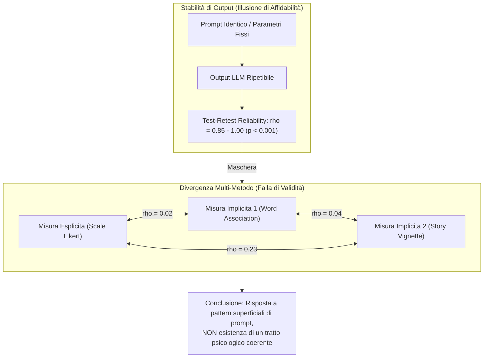

# Validità Psicometrica e Discrepanza Affidabilità-Convergenza negli LLM

## Definizione Operativa
- Fenomeno metodologico ed epistemologico critico nella *Machine Psychology* in cui i Large Language Models esibiscono un'affidabilità test-retest quasi perfetta ($\rho \approx 0.85 - 1.00$) accompagnata da una validità convergente debolissima o nulla ($\rho < 0.25$) tra strumenti e paradigmi alternativi (espliciti vs impliciti) teoricamente designati a misurare il medesimo costrutto psicologico o attitudinale (es. il bias razziale).
- **Utilità Metodologica e Clinica:** Dimostra che l'elevata stabilità statistica di risposta di un modello linguistico non certifica l'esistenza di costrutti latenti unitari, ma riflette pattern deterministici locali dipendenti dal formato specifico del prompt. Impone una validazione multi-metodo prima di impiegare LLM in compiti decisionali ad alto rischio o in setting clinico-terapeutici.

## Evidenze dalla Letteratura
- **Dissociazione tra Affidabilità e Validità:** Nella psicometria classica umana, l'affidabilità test-retest è presupposto di stabilità temporale del tratto. Negli LLM, la ripetibilità riflette la fissità dei pesi sinaptici e la costanza del decoding, creando un'"illusione di robustezza" che maschera la totale assenza di convergenza costruttuale tra compiti espliciti e compiti di associazione implicita (Benosman, 2025).
- **Evidenze Sperimentali su ChatGPT-4o:** Nello studio empirico condotto da Benosman (2025) su 500 configurazioni di personalità, le correlazioni incrociate di Spearman tra misura esplicita adattata dalla Modern Racism Scale e misure implicite basate su GNAT e vignette narrative sono risultate inferiori a 0.25 ($\rho = 0.02, \rho = 0.04, \rho = 0.23$), nonostante indici test-retest prossimi a 1.00.
- **Rischio di Costrutti Fantasma (*Measurement Phantoms*):** L'assunzione ingenua che un modello possieda orientamenti o tratti stabili basandosi su una singola scala non validata produce costrutti illusori generati da regolarità lessicali locali anziché da proprietà stabili del sistema (Benosman, 2025; Wang et al., 2023).

**Riferimenti Bibliografici:**
- Benosman, M. (2025). Designing Psychometric Measures for LLMs: Framework and Application to Racial Bias. *arXiv preprint arXiv:2509.13324v3 [cs.HC]*.
- Bai, X., Wang, A., Sucholutsky, I., & Griffiths, T. L. (2025). Explicitly unbiased large language models still form biased associations. *Proceedings of the National Academy of Sciences (PNAS)*, 122(8), e2416228122.
- Wang, X., Jiang, L., Hernandez-Orallo, J., Stillwell, D., Sun, L., Luo, F., & Xie, X. (2023). Evaluating general-purpose AI with psychometrics. *arXiv preprint arXiv:2310.16379*.
- Kaplan, R. M., & Saccuzzo, D. P. (2009). *Psychological Testing: Principles, Applications, and Issues* (7th ed.). Wadsworth Cengage Learning.

## Relazioni
- Vedi anche: [[2509-13324v3]], [[stamp-llm-framework]], [[misurazione-bias-razziale-llm]], [[machine-psychology]], [[measurement-phantoms]], [[pmv-framework]], [[dual-validity-framework]], [[audit-bias-llm-clinici]]
