---
tags: [computer-vision, vdot, video-observed-therapy, medication-adherence, 3d-resnet, i3d, aicure, directly-observed-therapy, deep-learning, telemedicine]
source_papers: ["AI-PoweredReal-TimeAdherenceMonitoringforRemotePatientCareinTelemedicine.pdf"]
---

# Video-Observed Therapy (VDOT) and Computer Vision for Ingestion Confirmation

## Definizione Operativa
- L'impiego di algoritmi di Computer Vision e reti neurali convoluzionali (CNN) per analizzare flussi video registrati o in tempo reale (acquisiti tramite fotocamera dello smartphone o dispositivi dedicati), al fine di verificare oggettivamente l'identità del paziente, il riconoscimento del farmaco specifico e l'avvenuta deglutizione (*swallowing confirmation*), automatizzando ed estendendo la classica *Directly Observed Therapy* (DOT) in ambito telemedico (Joshua & Peterson, 2025; Labovitz et al., 2020).
- **Utilità Clinica e Telemedica:** Supera radicalmente i limiti delle misure indirette (self-report, conteggio pillole, smart bottle sensibili a false aperture ed eventi di "curiosity opening"), fornendo una prova visiva e oggettiva dell'ingestione in regimi terapeutici critici ad alto impatto (es. anticoagulanti orali post-ictus, tubercolosi, disturbi psichiatrici maggiori).

```mermaid
flowchart TD
    A["Flusso Video Smartphone / Web (Self-Recorded o Live)"] --> B["Filtro Qualità & Annotazione (Controllo Luce, Visibilità Volto)"]
    B --> C["Estrazione Frame via FFmpeg (~160 Key-Frames)"]
    C --> D["Down-sampling Standardizzato (224x224 pixel)"]
    D --> E{"Classificatore Deep Learning Spazio-Temporale"}
    
    E --> |Convoluzioni 3D Spazio-Temporali| F["3D ResNet (90.1% Precision, 95.8% Sensibilità)"]
    E --> |Grouped Convolutions Efficienza| G["3D ResNeXt"]
    E --> |Human Action Recognition| H["Inflated 3D (I3D)"]
    E --> |Baseline Statica 2D| I["Inception-v4"]
    
    F --> L["Verifica Identità Paziente, Pillola & Deglutizione"]
    G --> L
    H --> L
    L --> M["Logging Certificato in Cartella Clinica Elettronica (EHR)"]
```

---

## Evidenze dalla Letteratura

### 1. Architettura della Pipeline di Preprocessing e Visione Artificiale
- **Campionamento e Normalizzazione:** I video registrati dai pazienti vengono processati mediante framework video come `FFmpeg` per estrarre una sequenza costante di circa 160 frame chiave, successivamente scalati a una risoluzione standardizzata di $224 \times 224$ pixel per alimentare le reti neurali profonde (Joshua & Peterson, 2025).
- **Filtraggio degli Artefatti:** Protocolli di pre-annotazione automatica scartano sequenze video caratterizzate da scarsa illuminazione ambientale, parziale occlusione del volto o movimenti bruschi della fotocamera.
- **Modelli Deep Learning Comparati:**
  1. **3D ResNet:** Architettura d'elezione per l'estrazione congiunta di pattern visivi spaziali (riconoscimento morfologico della pillola e della bocca) e dinamiche temporali (traiettoria della mano verso la bocca, movimento di deglutizione cervicale). Nei benchmark clinici, 3D ResNet ha dimostrato il miglior equilibrio tra elevate prestazioni (**90.1% di precisione**, **95.8% di sensibilità**) e velocità di inferenza, rendendolo ideale per l'impiego su larga scala.
  2. **3D ResNeXt:** Variante che sfrutta convoluzioni raggruppate (*grouped convolutions*) per incrementare la capacità rappresentativa riducendo i parametri addestrabili.
  3. **Inflated 3D (I3D):** Modello basato sull'espansione temporale di filtri convoluzionali 2D pre-addestrati su ImageNet, ottimizzato per l'interpretazione di sequenze di azione umana complessa.
  4. **Inception-v4:** Modello bidimensionale utilizzato primariamente come baseline statica comparativa.

---

### 2. Validazione Clinica ed Evidenze Sperimentali
- **Trial Anticoagulanti Post-Ictus (Piattaforma AiCure):** In studi clinici randomizzati su pazienti reduci da ictus in terapia anticoagulante orale, l'impiego di VDOT automatizzato tramite smartphone ha garantito un tasso di aderenza del **100%**, contro il solo **50%** rilevato nel gruppo di controllo sottoposto a cure standard non monitorate (Labovitz et al., 2020).
- **Trattamento della Tubercolosi (TB):** Nei protocolli di cura per la tubercolosi (dove la mancata compliance genera ceppi multi-resistenti MDR-TB), i sistemi VDOT basati su deep learning hanno raggiunto una sensibilità del **95.8%** nell'identificare correttamente l'ingestione (Sekandi et al., 2023; Joshua & Peterson, 2025).
- **Popolazioni Psichiatriche e Deficit Cognitivi:** In un trial di 24 settimane condotto su pazienti affetti da schizofrenia e compromissione cognitiva, la VDOT basata su riconoscimento facciale e rilevamento pillola ha prodotto un incremento dell'aderenza del **+17.9%** rispetto alla directly observed therapy modificata (Joshua & Peterson, 2025).

---

### 3. Trade-off Operativi e Sfide di Implementazione

| Vantaggi Clinici | Criticità Tecnico-Operative |
| :--- | :--- |
| **Conferma Oggettiva**: Verifica l'atto reale di deglutizione, eliminando le assunzioni fittizie (*pocket dosing*). | **Specificità Moderata in Contesti Casalinghi**: Specificità variabile tra 43.5% e 55.4% in presenza di illuminazione domestica irregolare (rischio di falsi negativi). |
| **Ingaggio Attivo**: Favorisce la responsabilizzazione del paziente e la routine quotidiana (*positive reinforcement*). | **Carico Comportamentale (*User Burden*)**: Richiede al paziente di posizionare lo smartphone e registrarsi ad ogni dose, inducendo potenziale affaticamento a lungo termine. |
| **Integrazione Telemedica**: Consente al personale sanitario di verificare asincronicamente i casi dubbi contrassegnati dall'IA. | **Privacy e Larghezza di Banda**: Trasmissione di dati biometrici e video ad alta risoluzione, richiedente connettività stabile e conformità rigorosa a GDPR/HIPAA. |

---

**Riferimenti Bibliografici:**
- Joshua, C., & Peterson, W. (2025). AI-Powered Real-Time Adherence Monitoring for Remote Patient Care in Telemedicine. *Research Article*, June 2025.
- Labovitz, D. L., et al. (2020). Using Artificial Intelligence to Measure Adherence to Anticoagulants in Stroke Patients. *Stroke and Cerebrovascular Diseases*, 29(10), 105048.
- Sekandi, J. N., et al. (2023). Application of AI to the Monitoring of Medication Adherence for TB Treatment in Africa. *JMIR AI*, 2(1), e40167.

---

## Relazioni
- [[AI-PoweredReal-TimeAdherenceMonitoringforRemotePatientCareinTelemedicine]]
- [[wearable-sensor-fusion-adherence]]
- [[proactive-surveillance-alert-fatigue]]
- [[privacy-preserving-rpm-frameworks]]
- [[chronic-disease-monitoring-adherence]]
- [[software-as-a-medical-device-salute-mentale]]