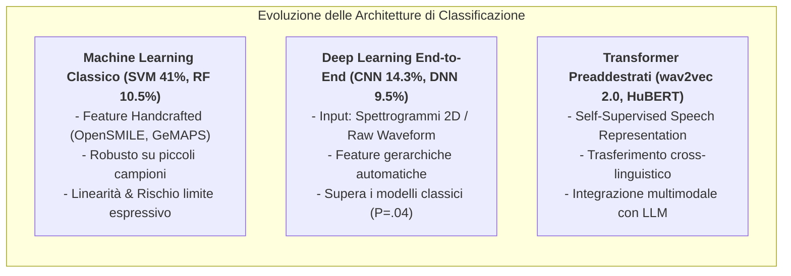
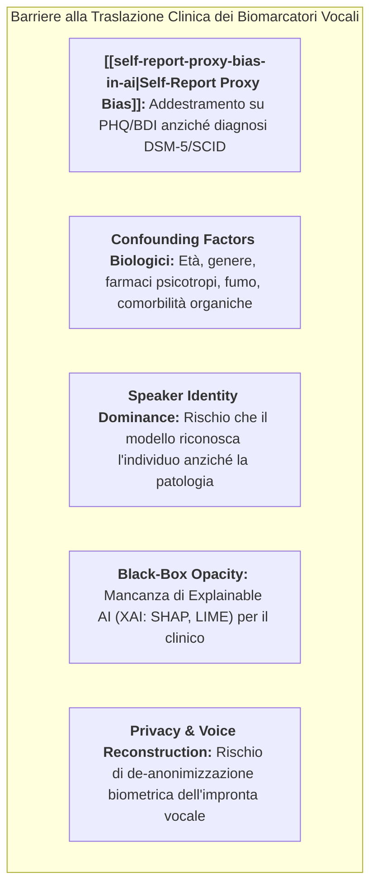

# Vocal Biomarkers in Depression (Biomarcatori Vocali nella Depressione)

## Definizione Operativa
- I **Biomarcatori Vocali** (*Vocal Biomarkers*) nella psichiatria computazionale e nella psicologia clinica digitale identificano pattern quantitativi, oggettivi e riproducibili estratti dal segnale acustico ed articolatorio del parlato attraverso algoritmi di **Automatic Speech Analysis (ASA)**, capaci di discriminare la presenza, la severità e le traiettorie longitudinali degli stati depressivi (Maran et al., 2025; *JMIR Mental Health*, doi: [10.2196/67802](https://doi.org/10.2196/67802); Cummins et al., 2015).
- **Fondamento Fisiopatologico e Neuromotorio:**
  - La produzione della voce richiede la fine coordinazione tra oltre 100 muscoli laringei, respiratori e fono-articolatori, controllati da circuiti cortico-sottocorticali sensibili ai neurotrasmettitori dopaminergici e serotoninergici.
  - Nel Disturbo Depressivo Maggiore (MDD), il **rallentamento psicomotorio**, la disregolazione del tono autonomico e l'iperattività dell'asse ipotalamo-ipofisi-surrene (HPA) provocano:
    1. *Alterazione della tensione delle corde vocali:* Rigidità o ipotonia laringea che riduce la variabilità dinamica della frequenza fondamentale ($F_0$);
    2. *Diminuzione della pressione subglottica:* Calo dell'intensità sonora ed emissione di flussi d'aria deboli o instabili;
    3. *Deficit di coordinazione fono-respiratoria:* Pause prolungate, riduzione della velocità di eloquio e comparsa di attriti/turbolenze non lineari nel tratto vocale;
    4. *Compressione dello spazio vocalico (*Vowel Space Area* - VSA):* Ridotta escursione articolatoria della lingua e della mandibola con convergenza delle formanti ($F_1, F_2$).
- **Vantaggi Clinico-Applicativi:** Rispetto ai questionari autosomministrati (PHQ-9, BDI-II), i biomarcatori vocali offrono una misurazione passiva o semi-passiva, non invasiva, a costo marginale zero (tramite microfoni integrati in smartphone), ecologicamente valida e resistente al mascheramento intenzionale dei sintomi (Low et al., 2020).

```mermaid
flowchart TD
    subgraph Pathophysiology ["Base Neuromotoria & Fisiopatologica della Depressione"]
        P1["Rallentamento Psicomotorio & Disregolazione Neurotrasmettitoriale"]
        P2["Ipotonia / Ipertonia della Muscolatura Laringea & Corde Vocali"]
        P3["Alterazione della Pressione Subglottica & Coordinazione Respiratoria"]
        P4["Ridotta Escursione Articolatoria Mandibolo-Linguale"]
    end

    subgraph AcousticDomains ["Domini delle Feature Acustiche (ASA)"]
        D1["<b>Feature Prosodiche:</b><br/>Pitch / F0 flattening, Jitter, Shimmer, Pause"]
        D2["<b>Feature Spettrali:</b><br/>MFCC, Spettrogrammi, Spectral Roll-off / Centroid"]
        D3["<b>Feature di Sorgente:</b><br/>Glottal waveform, HNR, NNE"]
        D4["<b>Feature Formantiche:</b><br/>F1-F3, Compressione Spazio Vocalico (VSA)"]
        D5["<b>Teager Energy Operator (TEO):</b><br/>Flussi d'aria vorticosi & dinamiche non lineari"]
    end

    subgraph ProcessingPipelines ["Modellizzazione Computazionale & AI"]
        M1["<b>Machine Learning Classico:</b><br/>SVM, Random Forest, GMM, Logistic Regression"]
        M2["<b>Deep Learning & XAI:</b><br/>CNN su Spettrogrammi 2D, DNN, LSTM, SHAP/LIME"]
        M3["<b>Transformer Multimodali:</b><br/>wav2vec 2.0, Speechformer + BERT (Audio + Testo)"]
    end

    subgraph ClinicalUtility ["Applicazioni nella Psichiatria Stratificata"]
        U1["Triage & Screening Remoto in Primary Care"]
        U2["Monitoraggio Ecologico Inter-Seduta & Traiettorie di Ricaduta"]
        U3["Valutazione Oggettiva della Risposta al Trattamento Farmaco/Psicoterapico"]
        U4["Allerta Suicidaria Just-in-Time per Servizi di Telemedicina"]
    end

    Pathophysiology --> AcousticDomains
    AcousticDomains --> ProcessingPipelines
    ProcessingPipelines --> ClinicalUtility
```



---

## Tassonomia delle Feature Vocali e Dinamiche Non Lineari

Dalla meta-analisi di Maran et al. (2025) emerge una dettagliata scomposizione dei parametri bio-acustici analizzati nella letteratura clinico-ingegneristica:

```mermaid
mindmap
  root((Biomarcatori Vocali))
    Feature Spettrali (86.7%)
      MFCC (Mel-Frequency Cepstral Coefficients)
      Log-Mel Filterbanks
      Spectral Flux, Centroid, Roll-off
      Spettrogrammi 2D
    Feature Prosodiche (55.2%)
      Frequenza Fondamentale (F0 / Pitch)
      Monotonia Prosodica (Pitch Flattening)
      Micro-fluttuazioni: Jitter (frequenza) & Shimmer (ampiezza)
      Parametri Temporali (durata pause, speech rate)
    Feature di Sorgente Glottale (50.5%)
      Forma d'onda del flusso glottico
      Harmonics-to-Noise Ratio (HNR)
      Normalized Noise Energy (NNE)
    Feature Formantiche (37.1%)
      Posizione formanti F1, F2, F3
      Vowel Space Area (VSA)
      Dispersione formante
    Teager Energy Operator - TEO (7.6%)
      Flussi d'aria vorticosi non lineari
      Profili energetici istantanei
      Massima accuratezza diagnostica (P=.04)
    Feature Lessicali e Semantiche (14.3%)
      Embeddings linguistici (BERT, RoBERTa)
      Frequenza pronomi 1ª persona singolare
      Sentiment e polarità affettiva
```

### 1. Feature Spettrali e Spettro-Temporali (86.7% degli studi)
- **Mel-Frequency Cepstral Coefficients (MFCC):** Rappresentano la forma del tratto vocale mappando lo spettro di potenza su una scala non lineare (scala Mel) che simula la percezione uditiva umana. Nei soggetti depressi, i coefficienti MFCC registrano uno spostamento energetico verso frequenze più basse e una minore variabilità tra i frame temporali.
- **Spettrogrammi e Log-Mel Filterbanks:** Rappresentazioni tempo-frequenza bidimensionali utilizzate come input per reti neurali convoluzionali (CNN), capaci di catturare pattern transitori di decadimento spettrale.

### 2. Feature Prosodiche e Dinamiche Temporali (55.2% degli studi)
- **Frequenza Fondamentale ($F_0$ / Pitch):** Misura la velocità di vibrazione delle corde vocali. La depressione è caratterizzata da una marcata **monotonia prosodica (*pitch flattening*)**, con riduzione della deviazione standard di $F_0$ e range tonale ristretto.
- **Jitter e Shimmer:** Indicano rispettivamente la micro-instabilità periodo-a-periodo nella frequenza e nell'ampiezza dell'onda vocale. Alterazioni del tono muscolare laringeo aumentano la variabilità caotica a brevissimo termine.
- **Struttura delle Pause e Latenza di Risposta:** I pazienti depressi mostrano un aumento statisticamente significativo della percentuale di tempo speso in silenzio, pause inter-frasali più lunghe e maggiore latenza prima di iniziare la risposta verbale (*speech latency*), riflettendo direttamente il rallentamento dei processi esecutivi centrali.

### 3. Feature di Sorgente Glottale e Formanti (50.5% e 37.1%)
- **Dinamica Glottale:** L'estrazione inversa della forma d'onda del flusso glottale calcola parametri quali l'*Open Quotient* e la velocità di chiusura delle corde vocali; valori anomali segnalano una chiusura glottale incompleta (*breathy voice*) con decadimento del rapporto armoniche-rumore (*Harmonics-to-Noise Ratio* - HNR).
- **Compressione dello Spazio Vocalico (*Vowel Space Area* - VSA):** Le formanti ($F_1, F_2$) tracciano le frequenze di risonanza del tratto vocale modellate da lingua, labbra e velo palatino. La rigidità neuromotoria riduce l'escursione articolatoria dei fonemi vocalici (es. /a/, /i/, /u/), causando una compressione volumetrica del VSA (*hypoarticulation*).

### 4. Teager Energy Operator (TEO) e Dinamiche Non Lineari (7.6%)
- **Fondamento Fisico:** I modelli classici di acustica vocale (modello *Source-Filter* di Fant) assumono che l'aria fluisca linearmente lungo il tratto vocale. Teager & Teager (1990) hanno dimostrato che il flusso d'aria reale è dominato da dinamiche non lineari con formazione di **vortici laminari e turbolenze viscoelastiche** contro le pareti faringo-laringee.
- **Formulazione Matematica:** L'operatore energetico di Teager per un segnale discreto $x[n]$ è definito come:
  $$\Psi[x[n]] = x^2[n] - x[n-1] \cdot x[n+1]$$
  calcolando istantaneamente l'energia meccanica spesa dal sistema per generare il segnale (prodotto di frequenza quadratica e ampiezza quadratica).
- **Evidenza Meta-Analitica di Superiorità:** Nella meta-analisi di Maran et al. (2025), le feature derivate dal TEO hanno ottenuto prestazioni aggregate statisticamente superiori rispetto a tutti gli altri set di feature ($P = .04$ per accuratezza, $P = .05$ per sensibilità, $P = .004$ per specificità). La modulazione non lineare dell'energia risulta straordinariamente sensibile alle minime variazioni di rigidità neuromuscolare indotte dallo stress depressivo.

---

## Paradigmi di Elicitazione del Parlato (*Speech Tasks*)

L'efficacia diagnostica dei biomarcatori vocali dipende fortemente dal protocollo di elicitazione impiegato:

| Paradigma Vocale | Frequenza nella Letteratura | Vantaggi Clinico-Metodologici | Limiti e Fattori di Disturbo |
| :--- | :--- | :--- | :--- |
| **Free Speech / Intervista Spontanea** | **72.4%** (76/105) | Massima validità ecologica; stimola processi di recupero mnestico, carico emotivo e modulazione prosodica naturale; cattura pause spontanee. | Elevata variabilità inter-individuale nel contenuto; rumore di fondo; difficoltà di standardizzazione sintattica. |
| **Compiti di Lettura Standardizzata** | **36.2%** (38/105) | Perfetta comparabilità fonetica tra partecipanti (es. *The Rainbow Passage*, *The North Wind and the Sun*); isolamento dei soli parametri acustici a contenuto costante. | Bassa risonanza emotiva spontanea; influenza del livello di scolarità e di eventuali disturbi di lettura/dislessia. |
| **Conteggio Numerico** | **2.9%** (3/105) | Task cognitivo a basso carico linguistico; utile in popolazioni anziane o con deficit linguistici. | Informazione acustico-prosodica limitata; assenza di risonanza affettiva. |
| **Vocali Sostenute (/a/, /e/, /i/, /o/, /u/)** | **1.9%** (2/105) | Isolamento puro della stabilità dell'oscillatore glottale (Jitter, Shimmer, HNR); zero interferenza semantica. | Incapacità di valutare la pianificazione temporale, la sintassi e la prosodia sovra-segmentale. |

---

## Architetture Computazionali e Benchmark di Performance



### 1. Benchmark Quantitativo (Meta-Analisi Maran et al., 2025)
- **Accuratezza Pooled:** Range **0.66** (minimi pooled, 95% CI 0.63–0.69) – **0.81** (massimi pooled, 95% CI 0.79–0.83; $I^2 = 96.74\%$).
- **Sensibilità Pooled:** Range **0.63** (95% CI 0.58–0.68) – **0.84** (95% CI 0.81–0.86; $I^2 = 99.93\%$).
- **Specificità Pooled:** Range **0.60** (95% CI 0.55–0.66) – **0.83** (95% CI 0.79–0.86; $I^2 = 99.81\%$).
- **Precisione Pooled:** Range **0.64** (95% CI 0.58–0.70) – **0.81** (95% CI 0.77–0.84; $I^2 = 99.81\%$).

### 2. Machine Learning Classico vs Deep Learning
- I **Support Vector Machines (SVM)** rappresentano il modello più utilizzato (41.0%) per la loro stabilità matematica con set di feature acustiche tabulari ad alta dimensionalità estratte tramite toolkit standard come *OpenSMILE* (set *eGeMAPS*).
- Le **Reti Neurali Convoluzionali (CNN)** e le **Deep Neural Networks (DNN)** hanno dimostrato un'accuratezza diagnostica di punta statisticamente superiore rispetto agli algoritmi lineari ($P=.04$), grazie alla capacità di estrarre rappresentazioni tempo-frequenza complesse non lineari direttamente dalle matrici spettrali.

---

## Criticità Epistemologiche, Bias e Sfide di Implementazione Clinica



1. **Il [[self-report-proxy-bias-in-ai|Proxy Bias da Questionari Self-Report]]:** Oltre il 70% della letteratura addestra i modelli vocali su etichette binarie ricavate dai punteggi di scale come PHQ-8/PHQ-9 o BDI-II. Gli algoritmi rischiano di apprendere correlazioni spurie tra la cadenza vocale e le risposte al questionario, anziché catturare l'effettiva entità nosografica del Disturbo Depressivo Maggiore.
2. **Fattori di Confondimento Biologici ed Ecologici:** L'acustica vocale è fortemente modulata da variabili extra-depressive:
   - Terapie farmacologiche (antidepressivi triciclici o antipsicotici inducono xerostomia e sedazione muscolare laringea);
   - Stato ormonale, età biologica e genere;
   - Condizioni respiratorie transitorie (infezioni delle vie aeree superiori, asma, fumo);
   - Comorbilità psichiatriche (ansia generalizzata e disturbi dello spettro psicotico condividono alterazioni prosodiche).
3. **Dominanza dell'Identità del Parlatore (*Speaker Identity Overfitting*):** Modelli complessi possono memorizzare le caratteristiche biometriche individuali (*speaker embeddings* come i-vectors/x-vectors) dei soggetti nei set di addestramento anziché generalizzare sui pattern depressivi (Zuo & Mak, 2023; Dumpala et al., 2023).
4. **Interpretabilità Clinica e XAI (LIME & SHAP):** L'opacità delle reti neurali impedisce al medico di comprendere quale parametro acustico stia guidando la classificazione. L'adozione sistematica di tecniche di Explainable AI (Verde et al., 2024; Lin et al., 2022) è indispensabile per consentire l'audit clinico delle decisioni algoritmiche.
5. **Privacy Biometrica e Sicurezza dei Dati (GDPR & HIPAA):** La voce costituisce un dato biometrico identificativo ad alto rischio. L'implementazione etica richiede l'adozione di:
   - **Feature Extraction Irreversibile:** Estrazione locale di coefficienti spettrali dai quali sia matematicamente impossibile ricostruire il segnale audio originale (Vázquez-Romero & Gallardo-Antolín, 2020);
   - **Federated Learning ed Edge Computing:** Addestramento decentralizzato su dispositivi mobili senza trasmissione di dati vocali grezzi verso server cloud centralizzati (Bn & Abdullah, 2022).

---

## Integrazione nella Psichiatria Stratificata e Modello Centauro

I biomarcatori vocali **non costituiscono un sostituto autonomo del colloquio psichiatrico o psicoterapeutico**, ma trovano la loro collocazione ideale come componenti di un ecosistema diagnostico aumentato:
- **Triage e Telemedicina:** Pre-screening automatizzato in medicina generale o piattaforme di telepsichiatria per identificare precocemente soggetti a rischio subclinico;
- **Monitoraggio Longitudinale Passivo:** Rilevazione continua di micro-variazioni acustiche durante chiamate o interazioni vocali con assistenti terapeutici per intercettare precocemente segnali di ricaduta (*relapse forecasting*);
- **Fusione Multimodale:** Integrazione dei vettori vocali con dati fisiologici da sensori indossabili ([[wearable-sensor-fusion-adherence]]), tracciamento digitale del sonno, analisi lessicale ([[lexical-psychological-features]]) e cartella clinica elettronica nel quadro del [[modello-centauro-clinico]].

---

## Riferimenti Bibliografici
- Maran, P. L., Braquehais, M. D., Vlaic, A., Alonzo-Castillo, M. T., Vendrell-Serres, J., Ramos-Quiroga, J. A., & Rodríguez-Urrutia, A. (2025). Performance of Automatic Speech Analysis in Detecting Depression: Systematic Review and Meta-Analysis. *JMIR Mental Health*, 12, e67802. https://doi.org/10.2196/67802
- Bn, S., & Abdullah, S. (2022). Privacy sensitive speech analysis using federated learning to assess depression. *ICASSP 2022*, 9746827. https://doi.org/10.1109/icassp43922.2022.9746827
- Cummins, N., Scherer, S., Krajewski, J., Schnieder, S., Epps, J., & Quatieri, T. (2015). A review of depression and suicide risk assessment using speech analysis. *Speech Communication*, 71, 10–49. https://doi.org/10.1016/j.specom.2015.03.004
- Dumpala, S. H., Dikaios, K., Rodriguez, S., et al. (2023). Manifestation of depression in speech overlaps with characteristics used to represent and recognize speaker identity. *Scientific Reports*, 13(1), 11155. https://doi.org/10.1038/s41598-023-35184-7
- Lin, Y., Liyanage, B. N., Sun, Y., et al. (2022). A deep learning-based model for detecting depression in senior population. *Frontiers in Psychiatry*, 13, 1016676. https://doi.org/10.3389/fpsyt.2022.1016676
- Low, D. M., Bentley, K. H., & Ghosh, S. S. (2020). Automated assessment of psychiatric disorders using speech: a systematic review. *Laryngoscope Investigative Otolaryngology*, 5(1), 96–116. https://doi.org/10.1002/lio2.354
- Teager, H., & Teager, S. (1990). Evidence for nonlinear sound production mechanisms in the vocal tract. In *Speech Production and Speech Modelling* (pp. 241–261). Springer.
- Vázquez-Romero, A., & Gallardo-Antolín, A. (2020). Automatic detection of depression in speech using ensemble convolutional neural networks. *Entropy*, 22(6), 688. https://doi.org/10.3390/e22060688
- Verde, L., Marulli, F., De Fazio, R., Campanile, L., & Marrone, S. (2024). HEAR set: a lightweight acoustic parameters set to assess mental health from voice analysis. *Computers in Biology and Medicine*, 182, 109021. https://doi.org/10.1016/j.compbiomed.2024.109021
- Zuo, L., & Mak, M. (2023). Avoiding dominance of speaker features in speech-based depression detection. *Pattern Recognition Letters*, 173, 50–56. https://doi.org/10.1016/j.patrec.2023.07.016

---

## Relazioni
- [[mental-v12i1e67802]]: Systematic review e meta-analisi a 3 livelli di Maran et al. (2025) sulle performance dell'ASA nella depressione.
- [[self-report-proxy-bias-in-ai]]: Il problema epistemologico dell'addestramento su scale self-report vs diagnosi psichiatrica strutturata.
- [[cpp-33-e70242-1]]: Rassegna di Orrù & Mannarini (2026) su elaborazione del linguaggio naturale e bio-acustica nei setting clinici.
- [[wearable-sensor-fusion-adherence]]: Integrazione multimodale di biomarcatori vocali e sensori biometrici indossabili.
- [[multimodal-anxiety-detection-ai]]: Rilevazione dell'arousal e degli stati d'ansia mediante parametri fisiologici e acustici.
- [[bpd-multimodal-behavioral-markers]]: Marcatori multimodali della dinamica vocale e affettiva nei disturbi di personalità.
- [[lexical-psychological-features]]: Analisi computazionale del contenuto semantico e linguistico (*what is said*).
- [[explainable-mental-health-diagnosis]]: Metodi di interpretabilità (SHAP, LIME) per l'audit clinico dei modelli predittivi.
- [[modello-centauro-clinico]]: Cooperazione human-in-the-loop per l'integrazione dei biomarcatori vocali nella pratica psicoterapeutica.
